# 📘 MÔ TẢ LUỒNG NGHIỆP VỤ E2E - HỆ THỐNG WEBSHOP

## 📋 Mục lục
- [Tổng quan hệ thống](#tổng-quan-hệ-thống)
- [Kiến trúc hệ thống](#kiến-trúc-hệ-thống)
- [Các module chính của chương trình](#các-module-chính-của-chương-trình)
- [Luồng nghiệp vụ chính](#luồng-nghiệp-vụ-chính)
  - [1. Luồng Đăng ký & Đăng nhập](#1-luồng-đăng-ký--đăng-nhập)
  - [2. Luồng Xem & Tìm kiếm sản phẩm](#2-luồng-xem--tìm-kiếm-sản-phẩm)
  - [3. Luồng Giỏ hàng](#3-luồng-giỏ-hàng)
  - [4. Luồng Thanh toán](#4-luồng-thanh-toán)
  - [5. Luồng Quản lý đơn hàng](#5-luồng-quản-lý-đơn-hàng)
  - [6. Luồng Chat & Hỗ trợ](#6-luồng-chat--hỗ-trợ)
  - [7. Luồng Quản trị (Admin)](#7-luồng-quản-trị-admin)
- [Sơ đồ tổng quan](#sơ-đồ-tổng-quan)
- [Chi tiết kỹ thuật](#chi-tiết-kỹ-thuật)

---

## 🎯 Tổng quan hệ thống

Hệ thống Webshop là một nền tảng thương mại điện tử đầy đủ chức năng, được xây dựng trên Laravel Framework, hỗ trợ cả giao diện Web truyền thống và API RESTful cho ứng dụng di động/SPA.

### Các thành phần chính:
- **Frontend Web**: Giao diện người dùng (Blade Templates)
- **API Backend**: RESTful API với Laravel Sanctum authentication
- **Database**: MySQL với quan hệ phức tạp
- **Payment Gateway**: Tích hợp VNPay
- **Real-time Chat**: Laravel Broadcasting với Reverb/Pusher
- **File Storage**: Local/S3 cho hình ảnh sản phẩm

### Vai trò người dùng:
- **Guest**: Khách vãng lai (xem sản phẩm)
- **Customer**: Khách hàng đã đăng ký (mua hàng)
- **Manager**: Quản lý kho, đơn hàng
- **Admin**: Quản trị viên toàn quyền

---

## 🏗️ Kiến trúc hệ thống

```
┌─────────────────────────────────────────────────────────────────┐
│                        USER INTERFACE                            │
│  ┌────────────────┐              ┌──────────────────┐           │
│  │  Web Browser   │              │  Mobile App/SPA  │           │
│  │  (Blade Views) │              │   (React/Vue)    │           │
│  └────────┬───────┘              └────────┬─────────┘           │
└───────────┼──────────────────────────────┼──────────────────────┘
            │                              │
            ▼                              ▼
┌─────────────────────────────────────────────────────────────────┐
│                     LARAVEL APPLICATION                          │
│  ┌──────────────────────┐        ┌──────────────────────┐      │
│  │   Web Routes         │        │    API Routes        │      │
│  │   (Session Auth)     │        │  (Sanctum Tokens)    │      │
│  └──────────┬───────────┘        └──────────┬───────────┘      │
│             │                               │                   │
│             ▼                               ▼                   │
│  ┌──────────────────────────────────────────────────────────┐  │
│  │                    CONTROLLERS                            │  │
│  │  (AuthController, ProductController, OrderController...)  │  │
│  └──────────────────────┬───────────────────────────────────┘  │
│                         │                                       │
│                         ▼                                       │
│  ┌──────────────────────────────────────────────────────────┐  │
│  │                     SERVICES LAYER                        │  │
│  │  ┌────────────┐  ┌──────────┐  ┌─────────────┐          │  │
│  │  │CartService │  │OrderServ.│  │PaymentServ. │  ...     │  │
│  │  └────────────┘  └──────────┘  └─────────────┘          │  │
│  └──────────────────────┬───────────────────────────────────┘  │
│                         │                                       │
│                         ▼                                       │
│  ┌──────────────────────────────────────────────────────────┐  │
│  │                   MODELS (Eloquent ORM)                   │  │
│  │  User, Product, Order, Cart, Payment, Category...        │  │
│  └──────────────────────┬───────────────────────────────────┘  │
└─────────────────────────┼──────────────────────────────────────┘
                          │
                          ▼
┌─────────────────────────────────────────────────────────────────┐
│                      DATABASE (MySQL)                            │
│  users, products, orders, order_items, carts, cart_items,       │
│  categories, inventory, coupons, ratings, chat_messages...      │
└─────────────────────────────────────────────────────────────────┘

┌─────────────────────────────────────────────────────────────────┐
│                    EXTERNAL SERVICES                             │
│  ┌──────────────┐  ┌──────────────┐  ┌──────────────┐          │
│  │    VNPay     │  │   Pusher/    │  │    Email     │          │
│  │  (Payment)   │  │   Reverb     │  │   Service    │          │
│  └──────────────┘  └──────────────┘  └──────────────┘          │
└─────────────────────────────────────────────────────────────────┘
```

---

## 🧩 Các module chính của chương trình

Hệ thống được chia thành 10 module chính, mỗi module có input/output và ràng buộc riêng.

---

### Module 1: Authentication & Authorization (Xác thực & Phân quyền)

**Chức năng chính**: Quản lý đăng ký, đăng nhập, phân quyền người dùng

#### 1.1. Đăng ký (Register)

**Input:**
| Tên trường | Kiểu dữ liệu | Độ dài | Bắt buộc | Default | Ràng buộc |
|------------|--------------|--------|----------|---------|-----------|
| `name` | string | max: 255 | ✅ Yes | - | Không chứa ký tự đặc biệt |
| `email` | string | max: 255 | ✅ Yes | - | Email hợp lệ, unique |
| `password` | string | min: 8 | ✅ Yes | - | Chứa chữ hoa, số |
| `phone` | string | 10-11 ký tự | ❌ No | null | Số điện thoại Việt Nam |
| `address` | text | max: 500 | ❌ No | null | - |

**Ràng buộc:**
- Email chưa tồn tại trong hệ thống
- Password phải có ít nhất 8 ký tự, bao gồm chữ hoa và số
- Tự động tạo Cart cho user mới
- Tự động gán role "customer"

**Output:**
- **Thành công**: User ID, thông báo "Đăng ký thành công", redirect đến login
- **Thất bại**: Danh sách lỗi validation
- **Database**: Tạo record trong `users`, `carts`, `user_roles`

**Xử lý:**
```
Input → Validate → Hash password → 
Create User → Create Cart → Assign Role → 
Send Welcome Email → Return Success
```

---

#### 1.2. Đăng nhập (Login)

**Input:**
| Tên trường | Kiểu dữ liệu | Độ dài | Bắt buộc | Default | Ràng buộc |
|------------|--------------|--------|----------|---------|-----------|
| `email` | string | max: 255 | ✅ Yes | - | Email hợp lệ |
| `password` | string | - | ✅ Yes | - | - |
| `remember` | boolean | - | ❌ No | false | - |

**Ràng buộc:**
- Email phải tồn tại trong hệ thống
- Password phải khớp với hash trong database
- Rate limiting: 5 lần/phút
- Block sau 5 lần thất bại liên tiếp

**Output:**
- **Web**: Session cookie, redirect đến dashboard/home
- **API**: Access token (Laravel Sanctum), token expiry time
- **Database**: Log login activity

**Xử lý:**
```
Input → Find User by Email → Verify Password → 
Create Session/Token → Log Activity → Return Token/Redirect
```

---

#### 1.3. Đăng nhập OAuth (Social Login)

**Input:**
| Tên trường | Kiểu dữ liệu | Bắt buộc | Nguồn |
|------------|--------------|----------|-------|
| `provider` | string | ✅ Yes | URL parameter (google/facebook) |
| `provider_id` | string | ✅ Yes | From OAuth provider |
| `provider_token` | string | ✅ Yes | From OAuth provider |
| `email` | string | ✅ Yes | From OAuth provider |
| `name` | string | ✅ Yes | From OAuth provider |
| `avatar` | string | ❌ No | From OAuth provider |

**Ràng buộc:**
- Provider phải là 'google' hoặc 'facebook'
- Provider_id + provider phải unique
- Nếu user chưa tồn tại → tự động tạo

**Output:**
- Tương tự Login thông thường
- Thêm avatar URL (nếu có)

**Xử lý:**
```
OAuth Redirect → Callback → Get User Info → 
Find or Create User → Create Session/Token → Return
```

---

### Module 2: Product Management (Quản lý sản phẩm)

**Chức năng chính**: CRUD sản phẩm, tìm kiếm, lọc, đánh giá

#### 2.1. Xem danh sách sản phẩm (List Products)

**Input:**
| Tên trường | Kiểu dữ liệu | Bắt buộc | Default | Ràng buộc |
|------------|--------------|----------|---------|-----------|
| `category_id` | integer | ❌ No | null | Phải tồn tại trong categories |
| `search` | string | ❌ No | null | max: 255 |
| `min_price` | decimal | ❌ No | 0 | >= 0 |
| `max_price` | decimal | ❌ No | null | >= min_price |
| `sort` | string | ❌ No | 'newest' | enum: newest, price_asc, price_desc |
| `per_page` | integer | ❌ No | 20 | min: 1, max: 100 |
| `page` | integer | ❌ No | 1 | >= 1 |

**Ràng buộc:**
- Guest có thể xem (không cần authentication)
- max_price phải lớn hơn min_price
- per_page không vượt quá 100

**Output:**
```json
{
  "data": [
    {
      "product_id": integer,
      "name": string,
      "price": decimal,
      "original_price": decimal,
      "discount_percentage": integer,
      "image_url": string,
      "category": {
        "category_id": integer,
        "name": string
      },
      "stock_quantity": integer,
      "average_rating": decimal,
      "total_ratings": integer
    }
  ],
  "meta": {
    "current_page": integer,
    "total": integer,
    "per_page": integer,
    "last_page": integer
  }
}
```

**Xử lý:**
```
Input → Apply Filters → Join Category & Inventory → 
Calculate Discount → Paginate → Format Response → Return
```

---

#### 2.2. Tạo sản phẩm mới (Create Product) - Admin only

**Input:**
| Tên trường | Kiểu dữ liệu | Độ dài | Bắt buộc | Default | Ràng buộc |
|------------|--------------|--------|----------|---------|-----------|
| `name` | string | max: 255 | ✅ Yes | - | Unique |
| `description` | text | - | ✅ Yes | - | - |
| `price` | decimal(10,2) | - | ✅ Yes | - | > 0 |
| `original_price` | decimal(10,2) | - | ❌ No | null | >= price |
| `category_id` | integer | - | ✅ Yes | - | Phải tồn tại |
| `image` | file | max: 5MB | ✅ Yes | - | jpg, png, webp |
| `stock_quantity` | integer | - | ✅ Yes | - | >= 0 |
| `detailed_description` | text | - | ❌ No | null | - |
| `specifications` | json | - | ❌ No | null | Valid JSON |

**Ràng buộc:**
- Chỉ Admin mới có quyền tạo
- Tên sản phẩm unique
- Category phải tồn tại
- Upload ảnh < 5MB, định dạng jpg/png/webp
- Tự động tạo record trong bảng `inventory`

**Output:**
- **Thành công**: Product ID, URL ảnh đã upload, thông báo thành công
- **Thất bại**: Danh sách lỗi validation
- **Database**: Insert vào `products`, `product_details`, `inventory`

**Xử lý:**
```
Input → Validate → Upload Image → 
Create Product → Create ProductDetail → Create Inventory → 
Return Product Data
```

---

#### 2.3. Đánh giá sản phẩm (Rate Product)

**Input:**
| Tên trường | Kiểu dữ liệu | Bắt buộc | Default | Ràng buộc |
|------------|--------------|----------|---------|-----------|
| `product_id` | integer | ✅ Yes | - | Phải tồn tại |
| `rating` | integer | ✅ Yes | - | 1-5 |
| `comment` | text | ❌ No | null | max: 1000 |

**Ràng buộc:**
- User phải đăng nhập
- User phải đã mua sản phẩm này (order status = delivered)
- Một user chỉ đánh giá 1 lần/sản phẩm (có thể update)
- Rating từ 1-5 sao

**Output:**
- Rating ID
- Cập nhật average_rating của product
- **Database**: Insert/Update vào `ratings`

**Xử lý:**
```
Input → Check Authentication → Check Purchase History → 
Validate Rating → Save Rating → Recalculate Average Rating → 
Update Product → Return Success
```

---

### Module 3: Cart Management (Quản lý giỏ hàng)

**Chức năng chính**: Thêm/Sửa/Xóa sản phẩm trong giỏ hàng

#### 3.1. Thêm vào giỏ hàng (Add to Cart)

**Input:**
| Tên trường | Kiểu dữ liệu | Bắt buộc | Default | Ràng buộc |
|------------|--------------|----------|---------|-----------|
| `product_id` | integer | ✅ Yes | - | Phải tồn tại |
| `quantity` | integer | ✅ Yes | 1 | min: 1, max: stock |

**Ràng buộc:**
- User phải đăng nhập
- Product phải tồn tại và available
- Quantity không vượt quá tồn kho
- Nếu sản phẩm đã có trong giỏ → cộng dồn quantity
- Tổng quantity không vượt quá stock

**Output:**
```json
{
  "success": true,
  "message": "Đã thêm sản phẩm vào giỏ hàng",
  "cart": {
    "cart_id": integer,
    "items_count": integer,
    "total_price": decimal,
    "items": [...]
  }
}
```

**Database**: Insert/Update vào `cart_items`

**Xử lý:**
```
Input → Authenticate User → Validate Product → Check Stock → 
Check Existing CartItem → Add/Update Quantity → 
Recalculate Cart Total → Return Cart Data
```

---

#### 3.2. Cập nhật số lượng (Update Cart Item)

**Input:**
| Tên trường | Kiểu dữ liệu | Bắt buộc | Ràng buộc |
|------------|--------------|----------|-----------|
| `cart_item_id` | integer | ✅ Yes | Phải thuộc về user hiện tại |
| `quantity` | integer | ✅ Yes | min: 1, max: stock |

**Ràng buộc:**
- User chỉ cập nhật được cart item của mình
- Quantity mới không vượt quá tồn kho
- Quantity = 0 → xóa cart item

**Output:**
- Cart data cập nhật
- Total price mới

**Database**: Update `cart_items.quantity`

**Xử lý:**
```
Input → Verify Ownership → Check Stock → 
Update Quantity → Recalculate Total → Return Cart
```

---

#### 3.3. Áp dụng mã giảm giá (Apply Coupon)

**Input:**
| Tên trường | Kiểu dữ liệu | Bắt buộc | Ràng buộc |
|------------|--------------|----------|-----------|
| `coupon_code` | string | ✅ Yes | max: 50 |

**Ràng buộc:**
- Coupon phải tồn tại và active
- Trong thời gian hiệu lực (valid_from → valid_to)
- Chưa hết lượt sử dụng (current_usage < usage_limit)
- Giá trị đơn hàng >= min_order_value
- Một đơn hàng chỉ dùng 1 coupon

**Output:**
```json
{
  "success": true,
  "discount_amount": decimal,
  "final_total": decimal,
  "coupon": {
    "code": string,
    "discount_type": "percentage|fixed",
    "discount_value": decimal
  }
}
```

**Xử lý:**
```
Input → Validate Coupon → Check Validity → 
Check Usage Limit → Check Min Order Value → 
Calculate Discount → Apply Max Discount Cap → Return Discount
```

---

### Module 4: Order Management (Quản lý đơn hàng)

**Chức năng chính**: Tạo đơn, theo dõi, cập nhật trạng thái đơn hàng

#### 4.1. Checkout (Tạo đơn hàng)

**Input:**
| Tên trường | Kiểu dữ liệu | Độ dài | Bắt buộc | Default | Ràng buộc |
|------------|--------------|--------|----------|---------|-----------|
| `shipping_name` | string | max: 255 | ✅ Yes | - | - |
| `shipping_phone` | string | 10-11 | ✅ Yes | - | Số điện thoại hợp lệ |
| `shipping_address` | text | max: 500 | ✅ Yes | - | - |
| `note` | text | max: 500 | ❌ No | null | - |
| `payment_method` | string | - | ✅ Yes | 'cod' | enum: cod, vnpay |
| `coupon_code` | string | max: 50 | ❌ No | null | - |

**Ràng buộc:**
- User phải đăng nhập
- Cart phải có ít nhất 1 sản phẩm
- Tất cả sản phẩm phải còn đủ hàng
- Payment method hợp lệ
- Transaction: Đảm bảo tính toàn vẹn dữ liệu

**Output:**
```json
{
  "success": true,
  "order": {
    "order_id": string,
    "total_amount": decimal,
    "discount_amount": decimal,
    "final_amount": decimal,
    "payment_method": string,
    "status": "pending",
    "payment_status": "pending"
  },
  "redirect_url": string (nếu VNPay)
}
```

**Database Changes**:
- Insert vào `orders`
- Insert vào `order_items` (copy từ cart_items)
- Update `inventory.quantity` (trừ số lượng)
- Update `coupons.current_usage` (nếu có coupon)
- Delete `cart_items`

**Xử lý:**
```
BEGIN TRANSACTION
→ Validate Cart
→ Check Stock for All Items
→ Apply Coupon (if any)
→ Create Order
→ Create Order Items
→ Update Inventory (reserve stock)
→ Clear Cart
→ IF payment_method = vnpay THEN Generate Payment URL
COMMIT TRANSACTION
→ Send Order Confirmation Email
→ Return Order Data
```

---

#### 4.2. Cập nhật trạng thái đơn hàng (Update Order Status) - Admin

**Input:**
| Tên trường | Kiểu dữ liệu | Bắt buộc | Ràng buộc |
|------------|--------------|----------|-----------|
| `order_id` | string | ✅ Yes | Phải tồn tại |
| `new_status` | string | ✅ Yes | enum: pending, processing, shipped, delivered, cancelled |
| `note` | text | ❌ No | - |

**Ràng buộc:**
- Chỉ Admin/Manager có quyền
- Status transition phải hợp lệ theo quy tắc:
  - `pending` → `processing` hoặc `cancelled` ✅
  - `processing` → `shipped` hoặc `cancelled` ✅
  - `shipped` → `delivered` ✅
  - `delivered` → ❌ (không thể chuyển)
  - `cancelled` → ❌ (không thể chuyển)

**Output:**
- Order data với status mới
- Gửi email thông báo cho khách hàng

**Database**: Update `orders.status`, log vào `order_status_history`

**Xử lý:**
```
Input → Validate Admin Permission → Get Order → 
Validate Status Transition → Update Status → 
Log Status Change → Send Email Notification → Return Order
```

---

#### 4.3. Hủy đơn hàng (Cancel Order)

**Input:**
| Tên trường | Kiểu dữ liệu | Bắt buộc | Ràng buộc |
|------------|--------------|----------|-----------|
| `order_id` | string | ✅ Yes | Phải tồn tại |
| `reason` | text | ✅ Yes | max: 500 |

**Ràng buộc:**
- Customer chỉ hủy được đơn hàng của mình
- Chỉ hủy được khi status = `pending` hoặc `processing`
- Nếu đã thanh toán → yêu cầu hoàn tiền
- Hoàn lại số lượng vào inventory

**Output:**
- Order data với status = cancelled
- Inventory được cộng lại

**Database**:
- Update `orders.status` = 'cancelled'
- Update `inventory.quantity` (hoàn lại số lượng)
- Insert `refund_request` (nếu đã thanh toán)

**Xử lý:**
```
BEGIN TRANSACTION
→ Verify Ownership/Permission
→ Check Current Status (must be pending/processing)
→ Update Status to Cancelled
→ Restore Inventory
→ IF paid THEN Create Refund Request
COMMIT TRANSACTION
→ Send Cancellation Email
→ Return Order Data
```

---

### Module 5: Payment Processing (Xử lý thanh toán)

**Chức năng chính**: Tạo payment, xác thực callback từ VNPay

#### 5.1. Tạo thanh toán VNPay (Create VNPay Payment)

**Input:**
| Tên trường | Kiểu dữ liệu | Bắt buộc | Nguồn | Ràng buộc |
|------------|--------------|----------|--------|-----------|
| `order_id` | string | ✅ Yes | Request | Order phải tồn tại |
| `ip_address` | string | ✅ Yes | System | IP của user |
| `bank_code` | string | ❌ No | Request | Mã ngân hàng |

**Ràng buộc:**
- Order phải tồn tại và thuộc về user
- Order.payment_status = 'pending'
- Order.payment_method = 'vnpay'
- Amount > 0

**Output:**
```json
{
  "url": "https://sandbox.vnpayment.vn/paymentv2/vpcpay.html?...",
  "txn_ref": string,
  "order_id": string
}
```

**Xử lý:**
```
Input → Get Order → Validate Order → 
Build VNPay Parameters → Generate Secure Hash (HMAC-SHA512) → 
Build Payment URL → Log Transaction → Return Payment URL
```

**VNPay Parameters**:
- `vnp_TmnCode`: Mã website
- `vnp_Amount`: Số tiền * 100
- `vnp_Command`: 'pay'
- `vnp_CreateDate`: YmdHis
- `vnp_CurrCode`: 'VND'
- `vnp_IpAddr`: IP user
- `vnp_Locale`: 'vn'
- `vnp_OrderInfo`: Mô tả đơn hàng
- `vnp_ReturnUrl`: URL callback
- `vnp_TxnRef`: Mã giao dịch unique
- `vnp_SecureHash`: Chữ ký bảo mật

---

#### 5.2. Xử lý VNPay Return/IPN (VNPay Callback)

**Input (từ VNPay):**
| Tên trường | Kiểu dữ liệu | Bắt buộc | Ý nghĩa |
|------------|--------------|----------|---------|
| `vnp_TxnRef` | string | ✅ Yes | Mã giao dịch |
| `vnp_Amount` | integer | ✅ Yes | Số tiền * 100 |
| `vnp_ResponseCode` | string | ✅ Yes | 00 = success |
| `vnp_TransactionNo` | string | ✅ Yes | Mã GD của VNPay |
| `vnp_SecureHash` | string | ✅ Yes | Chữ ký xác thực |

**Ràng buộc:**
- Phải verify secure hash
- Response code = '00' → thành công
- Amount phải khớp với order
- TxnRef phải hợp lệ

**Output:**
- **Success**: Redirect đến `/payment/success`
- **Failure**: Redirect đến `/payment/failed`
- **IPN Response**: RspCode = '00' (cho VNPay)

**Database**:
- Update `orders.payment_status` = 'paid'
- Update `orders.transaction_id`
- Update `orders.paid_at` = now()

**Xử lý:**
```
Input → Verify Secure Hash → 
IF hash invalid THEN Return Error
→ Parse TxnRef to get Order ID
→ Get Order
→ Validate Amount
→ IF vnp_ResponseCode = '00' THEN
    → Update Order: payment_status = 'paid'
    → Update Order: transaction_id, paid_at
    → Send Payment Success Email
  ELSE
    → Update Order: payment_status = 'failed'
    → Restore Inventory (optional)
  END IF
→ Return Response
```

---

### Module 6: Inventory Management (Quản lý kho)

**Chức năng chính**: Theo dõi tồn kho, cập nhật số lượng, cảnh báo hết hàng

#### 6.1. Cập nhật tồn kho (Update Inventory) - Admin

**Input:**
| Tên trường | Kiểu dữ liệu | Bắt buộc | Ràng buộc |
|------------|--------------|----------|-----------|
| `product_id` | integer | ✅ Yes | Phải tồn tại |
| `quantity` | integer | ✅ Yes | >= 0 |
| `action` | string | ✅ Yes | enum: set, add, subtract |
| `reason` | text | ✅ Yes | max: 255 |

**Ràng buộc:**
- Chỉ Admin/Manager có quyền
- Action = 'set' → set số lượng cố định
- Action = 'add' → cộng thêm
- Action = 'subtract' → trừ đi (không âm)

**Output:**
- Inventory data mới
- Log thay đổi

**Database**:
- Update `inventory.quantity`
- Insert `inventory_logs`

**Xử lý:**
```
Input → Validate Permission → Get Current Inventory → 
CASE action
  WHEN 'set' THEN quantity = input.quantity
  WHEN 'add' THEN quantity = current + input.quantity
  WHEN 'subtract' THEN quantity = MAX(0, current - input.quantity)
END CASE
→ Update Inventory → Log Change → Return New Inventory
```

---

#### 6.2. Kiểm tra tồn kho (Check Stock)

**Input:**
| Tên trường | Kiểu dữ liệu | Bắt buộc |
|------------|--------------|----------|
| `product_id` | integer | ✅ Yes |
| `quantity` | integer | ✅ Yes |

**Output:**
```json
{
  "available": boolean,
  "current_stock": integer,
  "requested": integer
}
```

**Xử lý:**
```
Input → Get Inventory → 
Check: current_stock >= requested_quantity → 
Return Boolean
```

---

### Module 7: Chat & Customer Support (Chat & Hỗ trợ khách hàng)

**Chức năng chính**: Real-time chat giữa customer và admin

#### 7.1. Gửi tin nhắn (Send Message)

**Input:**
| Tên trường | Kiểu dữ liệu | Độ dài | Bắt buộc | Ràng buộc |
|------------|--------------|--------|----------|-----------|
| `to_user_id` | integer | - | ✅ Yes | User phải tồn tại |
| `message` | text | max: 1000 | ✅ Yes | Không empty |

**Ràng buộc:**
- User phải đăng nhập
- Message không rỗng
- Rate limiting: 30 tin nhắn/phút

**Output:**
```json
{
  "id": integer,
  "from_user_id": integer,
  "to_user_id": integer,
  "message": string,
  "is_read": false,
  "created_at": datetime
}
```

**Real-time Broadcasting**: 
- Dispatch `NewChatMessage` event
- Push qua WebSocket đến recipient

**Database**: Insert vào `chat_messages`

**Xử lý:**
```
Input → Validate Users → Save Message → 
Broadcast Event (WebSocket) → Return Message Data
```

---

#### 7.2. Lấy lịch sử chat (Get Chat History)

**Input:**
| Tên trường | Kiểu dữ liệu | Bắt buộc | Default |
|------------|--------------|----------|---------|
| `user_id` | integer | ✅ Yes | - |
| `limit` | integer | ❌ No | 50 |
| `before_id` | integer | ❌ No | null |

**Ràng buộc:**
- User chỉ xem được chat của mình
- Admin xem được tất cả
- Limit max: 100

**Output:**
```json
{
  "messages": [
    {
      "id": integer,
      "from_user": {...},
      "to_user": {...},
      "message": string,
      "is_read": boolean,
      "created_at": datetime
    }
  ],
  "has_more": boolean
}
```

**Xử lý:**
```
Input → Validate Permission → Query Messages → 
Order by created_at DESC → Limit Results → Return
```

---

### Module 8: Coupon Management (Quản lý mã giảm giá)

**Chức năng chính**: Tạo, quản lý, áp dụng coupon

#### 8.1. Tạo coupon (Create Coupon) - Admin

**Input:**
| Tên trường | Kiểu dữ liệu | Độ dài | Bắt buộc | Default | Ràng buộc |
|------------|--------------|--------|----------|---------|-----------|
| `code` | string | max: 50 | ✅ Yes | - | Unique, uppercase |
| `discount_type` | string | - | ✅ Yes | - | enum: percentage, fixed |
| `discount_value` | decimal | - | ✅ Yes | - | > 0 |
| `min_order_value` | decimal | - | ❌ No | 0 | >= 0 |
| `max_discount` | decimal | - | ❌ No | null | >= 0 (cho percentage) |
| `valid_from` | datetime | - | ✅ Yes | - | - |
| `valid_to` | datetime | - | ✅ Yes | - | > valid_from |
| `usage_limit` | integer | - | ❌ No | null | > 0 hoặc null (unlimited) |

**Ràng buộc:**
- Chỉ Admin có quyền
- Code unique, tự động uppercase
- discount_type = 'percentage' → discount_value <= 100
- discount_type = 'fixed' → max_discount không áp dụng
- valid_to > valid_from

**Output:**
- Coupon data
- Thông báo thành công

**Database**: Insert vào `coupons`

**Xử lý:**
```
Input → Validate Input → Check Code Uniqueness → 
Uppercase Code → Validate Date Range → 
Create Coupon → Return Coupon Data
```

---

### Module 9: Report & Analytics (Báo cáo & Phân tích)

**Chức năng chính**: Thống kê doanh thu, đơn hàng, sản phẩm bán chạy

#### 9.1. Báo cáo doanh thu (Revenue Report) - Admin

**Input:**
| Tên trường | Kiểu dữ liệu | Bắt buộc | Default | Ràng buộc |
|------------|--------------|----------|---------|-----------|
| `from_date` | date | ✅ Yes | - | Format: Y-m-d |
| `to_date` | date | ✅ Yes | - | >= from_date |
| `group_by` | string | ❌ No | 'day' | enum: day, month, year |

**Ràng buộc:**
- Chỉ Admin/Manager có quyền
- to_date >= from_date
- Range không quá 1 năm

**Output:**
```json
{
  "total_revenue": decimal,
  "total_orders": integer,
  "average_order_value": decimal,
  "data": [
    {
      "date": string,
      "revenue": decimal,
      "orders_count": integer
    }
  ]
}
```

**Xử lý:**
```
Input → Validate Date Range → 
Query Orders (where status = delivered AND paid) → 
Group by Date → Calculate Totals → Return Data
```

---

#### 9.2. Top sản phẩm bán chạy (Best Selling Products)

**Input:**
| Tên trường | Kiểu dữ liệu | Bắt buộc | Default |
|------------|--------------|----------|---------|
| `limit` | integer | ❌ No | 10 |
| `from_date` | date | ❌ No | 30 days ago |
| `to_date` | date | ❌ No | today |

**Output:**
```json
{
  "products": [
    {
      "product_id": integer,
      "name": string,
      "total_sold": integer,
      "total_revenue": decimal,
      "image_url": string
    }
  ]
}
```

**Xử lý:**
```
Input → Query OrderItems → 
Join with Products → Filter by Date Range → 
Group by Product → SUM(quantity) as total_sold → 
Order by total_sold DESC → Limit → Return
```

---

### Module 10: User Management (Quản lý người dùng) - Admin

**Chức năng chính**: Quản lý users, phân quyền

#### 10.1. Danh sách người dùng (List Users) - Admin

**Input:**
| Tên trường | Kiểu dữ liệu | Bắt buộc | Default |
|------------|--------------|----------|---------|
| `search` | string | ❌ No | null |
| `role` | string | ❌ No | null |
| `per_page` | integer | ❌ No | 15 |

**Output:**
- Paginated list of users
- Includes: id, name, email, roles, created_at

---

#### 10.2. Cập nhật role (Update User Role) - Admin

**Input:**
| Tên trường | Kiểu dữ liệu | Bắt buộc | Ràng buộc |
|------------|--------------|----------|-----------|
| `user_id` | integer | ✅ Yes | Phải tồn tại |
| `role_id` | integer | ✅ Yes | enum: 1(admin), 2(manager), 3(customer) |

**Ràng buộc:**
- Chỉ Admin có quyền
- Không thể tự thay đổi role của chính mình
- Role phải hợp lệ

**Output:**
- User data với role mới

**Database**: Update `user_roles.role_id`

---

## 📊 Tổng kết Module

| Module | Input chính | Output chính | Ràng buộc quan trọng |
|--------|-------------|--------------|----------------------|
| **Authentication** | email, password | token/session | Rate limiting, unique email |
| **Product** | name, price, category | Product data | Stock > 0, Admin only create |
| **Cart** | product_id, quantity | Cart data | Stock check, user ownership |
| **Order** | shipping info, payment method | Order data | Transaction, stock reservation |
| **Payment** | order_id | Payment URL/Status | Signature verification |
| **Inventory** | product_id, quantity | Inventory data | Không âm, log changes |
| **Chat** | message, to_user | Message data | Real-time broadcast |
| **Coupon** | code, discount | Coupon data | Unique code, validity check |
| **Report** | date range | Statistics | Date validation, permission |
| **User Management** | user_id, role | User data | Admin only, not self-modify |

---

## 🔄 Luồng nghiệp vụ chính

### 1. Luồng Đăng ký & Đăng nhập

#### 1.1. Đăng ký tài khoản mới

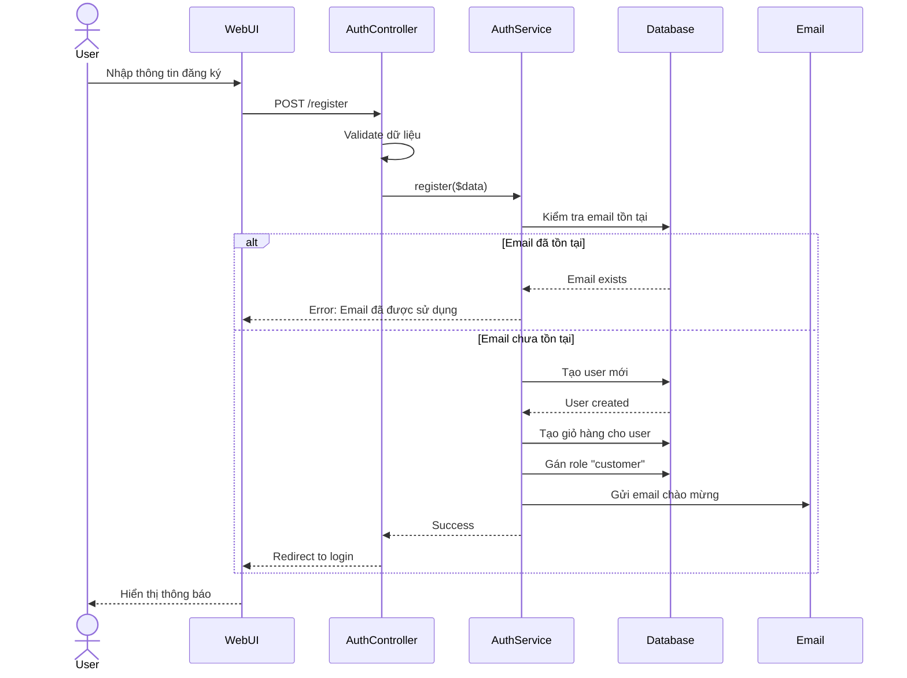

**Chi tiết các bước:**

1. **User nhập thông tin**: name, email, password, phone, address
2. **Validation**: 
   - Email hợp lệ và chưa tồn tại
   - Password tối thiểu 8 ký tự
   - Phone số hợp lệ
3. **Xử lý trong AuthService**:
   - Hash password bằng bcrypt
   - Tạo record trong bảng `users`
   - Tạo Cart tự động cho user mới
   - Gán role "customer" trong bảng `user_roles`
4. **Response**: 
   - Thành công: Redirect đến trang login
   - Lỗi: Hiển thị lỗi validation

#### 1.2. Đăng nhập

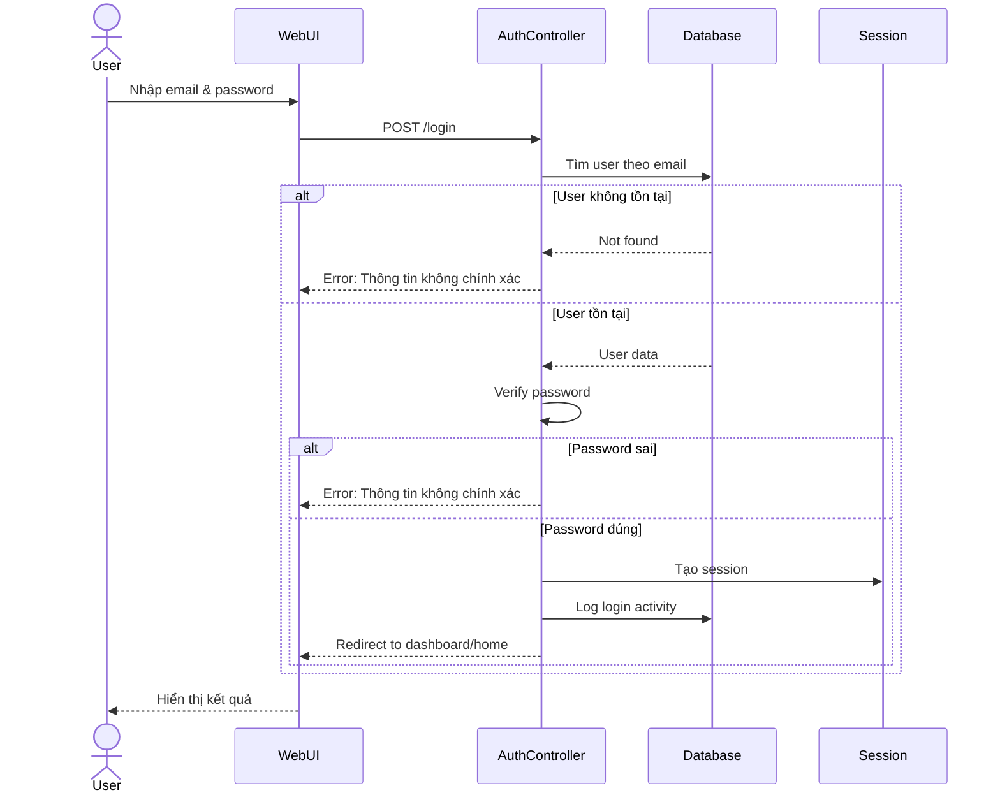

**Hai loại authentication:**

**Web (Session-based):**
- Sử dụng Laravel Session
- Cookie `laravel_session`
- Redirect sau khi login thành công

**API (Token-based):**
- Sử dụng Laravel Sanctum
- Trả về `access_token`
- Client gửi token trong header: `Authorization: Bearer {token}`

#### 1.3. Đăng nhập qua mạng xã hội (OAuth)

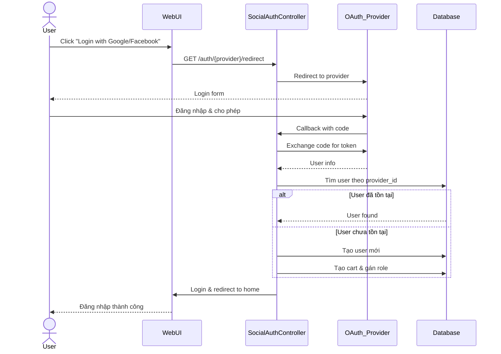

---

### 2. Luồng Xem & Tìm kiếm sản phẩm

#### 2.1. Xem danh sách sản phẩm (Guest có thể xem)

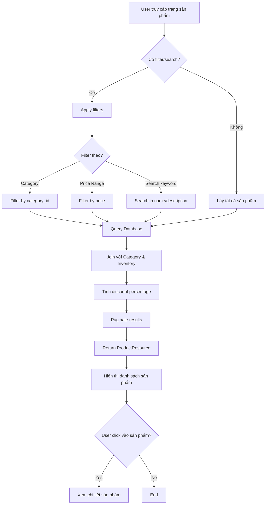

**API Endpoint**: `GET /api/products`

**Query Parameters**:
- `category_id`: Lọc theo danh mục
- `min_price`, `max_price`: Lọc theo giá
- `search`: Tìm kiếm theo tên/mô tả
- `sort`: Sắp xếp (price_asc, price_desc, newest)
- `per_page`: Số sản phẩm mỗi trang

**Response**:
```json
{
  "data": [
    {
      "product_id": 1,
      "name": "iPhone 15 Pro",
      "price": 29990000,
      "original_price": 32990000,
      "discount_percentage": 9,
      "image_url": "/storage/products/iphone15.jpg",
      "category": {
        "category_id": 1,
        "name": "Điện thoại"
      },
      "stock_quantity": 50,
      "average_rating": 4.5,
      "total_ratings": 120
    }
  ],
  "meta": {
    "current_page": 1,
    "total": 150,
    "per_page": 20
  }
}
```

#### 2.2. Xem chi tiết sản phẩm

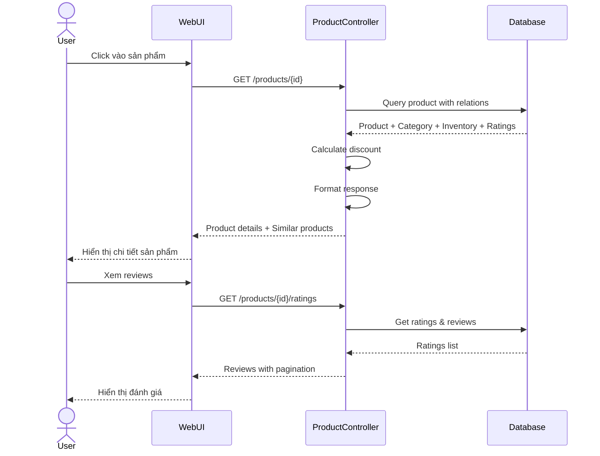

**Thông tin chi tiết bao gồm:**
- Thông tin sản phẩm đầy đủ
- Hình ảnh chi tiết
- Mô tả chi tiết (ProductDetail)
- Tình trạng kho hàng (Inventory)
- Đánh giá & Reviews
- Sản phẩm tương tự (cùng category)

---

### 3. Luồng Giỏ hàng

#### 3.1. Thêm sản phẩm vào giỏ hàng

```mermaid
flowchart TD
    A[User click "Thêm vào giỏ"] --> B{User đã login?}
    B -->|No| C[Redirect to login]
    B -->|Yes| D[POST /cart/add/{productId}]
    
    D --> E[CartController.add]
    E --> F[CartService.addItem]
    F --> G{Kiểm tra tồn kho}
    
    G -->|Hết hàng| H[Error: Sản phẩm hết hàng]
    G -->|Còn hàng| I{Sản phẩm đã có trong giỏ?}
    
    I -->|Yes| J[Cập nhật quantity]
    I -->|No| K[Tạo CartItem mới]
    
    J --> L{Quantity > Stock?}
    K --> L
    
    L -->|Yes| M[Error: Vượt quá tồn kho]
    L -->|No| N[Lưu vào Database]
    
    N --> O[Tính lại tổng giá trị Cart]
    O --> P[Return success]
    P --> Q[Cập nhật UI - Cart badge]
    Q --> R[Show notification]
```

**API Request**:
```json
POST /api/cart/add/{productId}
{
  "quantity": 2
}
```

**Response**:
```json
{
  "success": true,
  "message": "Đã thêm sản phẩm vào giỏ hàng",
  "cart": {
    "cart_id": 1,
    "user_id": 10,
    "items_count": 3,
    "total_price": 59990000,
    "items": [
      {
        "cart_item_id": 5,
        "product": {
          "product_id": 1,
          "name": "iPhone 15 Pro",
          "price": 29990000,
          "image_url": "..."
        },
        "quantity": 2,
        "subtotal": 59980000
      }
    ]
  }
}
```

#### 3.2. Xem & Quản lý giỏ hàng

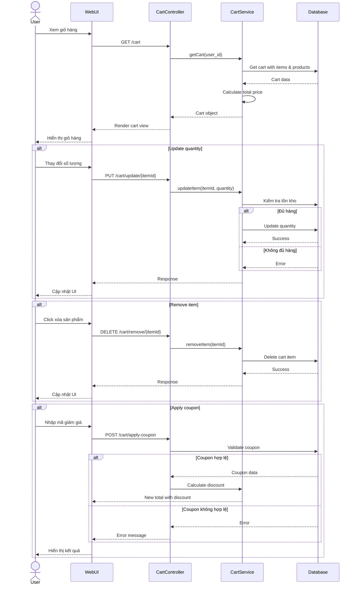

---

### 4. Luồng Thanh toán

Đây là luồng quan trọng nhất và phức tạp nhất của hệ thống.

#### 4.1. Checkout - Tạo đơn hàng

```mermaid
flowchart TD
    A[User click "Thanh toán"] --> B[GET /cart/checkout]
    B --> C{Giỏ hàng có sản phẩm?}
    C -->|No| D[Error: Giỏ hàng trống]
    C -->|Yes| E[Hiển thị form checkout]
    
    E --> F[User nhập thông tin]
    F --> G[shipping_name, phone, address<br/>payment_method, coupon_code]
    
    G --> H[POST /cart/checkout]
    H --> I[CartService.processCheckout]
    
    I --> J[BEGIN TRANSACTION]
    J --> K[Validate stock cho tất cả items]
    
    K --> L{Đủ hàng?}
    L -->|No| M[ROLLBACK<br/>Error: Sản phẩm hết hàng]
    L -->|Yes| N[Tính tổng tiền]
    
    N --> O{Có mã giảm giá?}
    O -->|Yes| P[Validate & Apply coupon]
    O -->|No| Q[discount = 0]
    
    P --> Q
    Q --> R[Tạo Order record]
    R --> S[Tạo OrderItems từ CartItems]
    S --> T[Trừ Inventory cho mỗi sản phẩm]
    T --> U[Xóa Cart Items]
    U --> V{Payment method?}
    
    V -->|COD| W[payment_status = pending<br/>COMMIT]
    V -->|VNPay| X[payment_status = pending<br/>COMMIT]
    
    W --> Y[Order created successfully]
    X --> Z[Redirect to payment gateway]
    
    Y --> AA[Show order confirmation]
    Z --> AB[VNPay payment flow]
```

**Checkout Request**:
```json
POST /api/cart/checkout
{
  "shipping_name": "Nguyễn Văn A",
  "shipping_phone": "0901234567",
  "shipping_address": "123 Nguyễn Huệ, Q1, TP.HCM",
  "note": "Giao hàng giờ hành chính",
  "payment_method": "vnpay",
  "coupon_code": "SUMMER2024"
}
```

**Response**:
```json
{
  "success": true,
  "message": "Đơn hàng đã được tạo thành công",
  "order": {
    "order_id": "ORD202411140001",
    "total_amount": 59990000,
    "discount_amount": 2000000,
    "final_amount": 57990000,
    "payment_method": "vnpay",
    "status": "pending",
    "payment_status": "pending"
  },
  "redirect_url": "https://sandbox.vnpayment.vn/paymentv2/vpcpay.html?..."
}
```

#### 4.2. Thanh toán qua VNPay

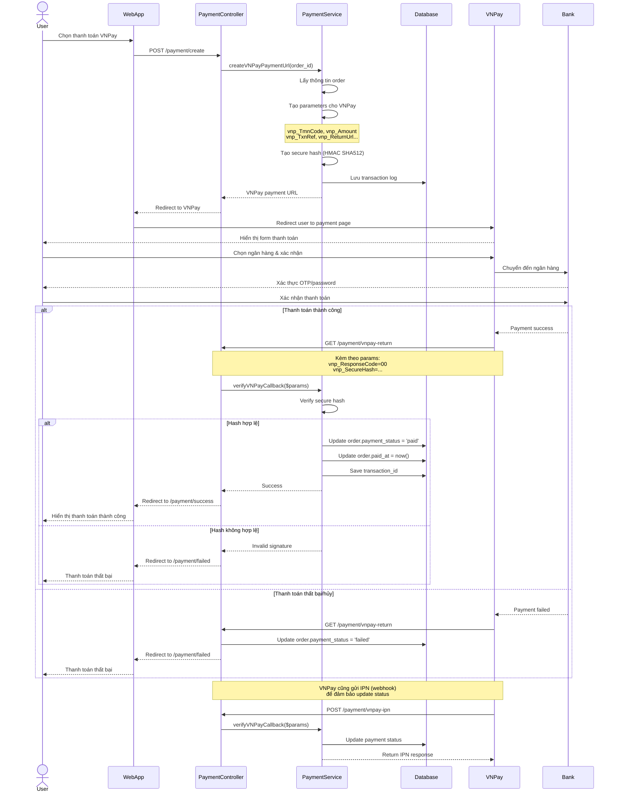

**VNPay Return Parameters**:
- `vnp_ResponseCode`: Mã phản hồi (00 = thành công)
- `vnp_TxnRef`: Mã giao dịch
- `vnp_Amount`: Số tiền
- `vnp_SecureHash`: Chữ ký bảo mật

**Payment Status Flow**:
```
pending → processing → paid (success)
                    → failed (failure)
                    → cancelled (user cancel)
```

#### 4.3. Thanh toán COD (Cash on Delivery)

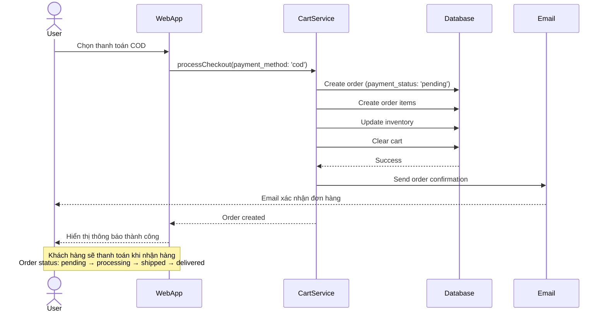

---

### 5. Luồng Quản lý đơn hàng

#### 5.1. Xem đơn hàng (Customer)

```mermaid
flowchart TD
    A[User vào trang "Đơn hàng của tôi"] --> B[GET /profile/orders]
    B --> C[OrderController.index]
    C --> D[OrderService.getOrdersForUser]
    D --> E[Query orders với user_id]
    E --> F[Include order items & products]
    F --> G{Filter theo status?}
    G -->|Yes| H[Filter by status]
    G -->|No| I[Get all orders]
    H --> J[Order by order_date DESC]
    I --> J
    J --> K[Paginate results]
    K --> L[Return to view]
    L --> M[Hiển thị danh sách đơn hàng]
    
    M --> N{User click chi tiết?}
    N -->|Yes| O[GET /orders/order_id]
    O --> P[Hiển thị chi tiết đơn hàng]
    P --> Q{Status = delivered?}
    Q -->|Yes| R[Cho phép đánh giá sản phẩm]
    Q -->|No| S[Không cho đánh giá]
```

#### 5.2. Quản lý đơn hàng (Admin/Manager)

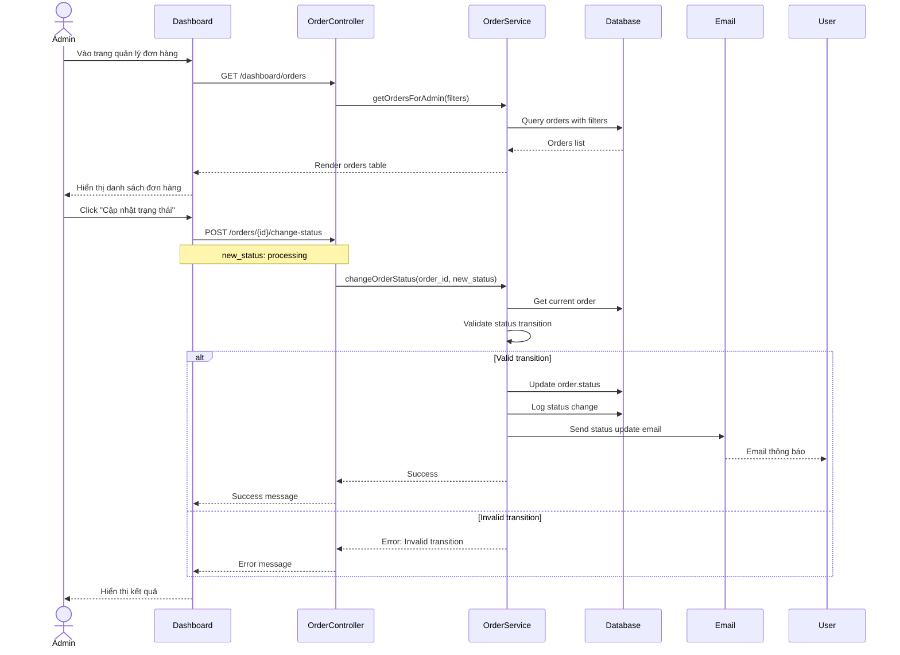

**Status Transitions (Chuyển đổi trạng thái hợp lệ)**:
```
pending → processing → shipped → delivered ✅
pending → cancelled ✅
processing → cancelled ✅
shipped → delivered ✅
delivered ❌ (không thể chuyển sang trạng thái khác)
cancelled ❌ (không thể chuyển sang trạng thái khác)
```

---

### 6. Luồng Chat & Hỗ trợ

#### 6.1. Chat giữa Customer và Admin

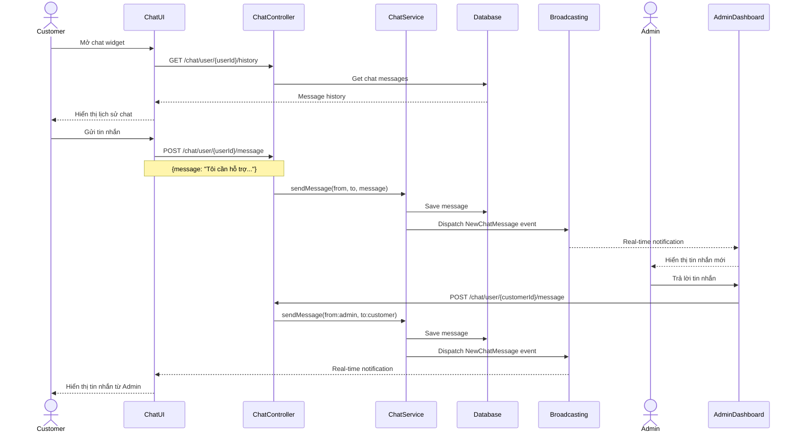

**WebSocket Configuration** (Laravel Reverb/Pusher):
- Channel: `private-chat.{userId}`
- Event: `NewChatMessage`
- Authentication: Sanctum token

**Message Structure**:
```json
{
  "id": 123,
  "from_user_id": 1,
  "to_user_id": 2,
  "message": "Xin chào, tôi cần hỗ trợ",
  "is_read": false,
  "created_at": "2024-11-14T10:30:00Z"
}
```

---

### 7. Luồng Quản trị (Admin)

#### 7.1. Quản lý sản phẩm

```mermaid
flowchart TD
    A[Admin vào Dashboard] --> B[Chọn "Quản lý sản phẩm"]
    B --> C{Action?}
    
    C -->|Thêm mới| D[GET /dashboard/products/create]
    D --> E[Hiển thị form thêm sản phẩm]
    E --> F[Admin nhập thông tin & upload ảnh]
    F --> G[POST /dashboard/products]
    G --> H[Validate input]
    H --> I{Valid?}
    I -->|No| J[Show errors]
    I -->|Yes| K[Upload image to storage]
    K --> L[Create product record]
    L --> M[Create inventory record]
    M --> N[Redirect to product list]
    
    C -->|Sửa| O[GET /dashboard/products/id/edit]
    O --> P[Hiển thị form edit]
    P --> Q[Admin cập nhật thông tin]
    Q --> R[PUT /dashboard/products/id]
    R --> S[Update product & inventory]
    S --> N
    
    C -->|Xóa| T[DELETE /dashboard/products/id]
    T --> U{Có đơn hàng liên quan?}
    U -->|Yes| V[Error: Không thể xóa]
    U -->|No| W[Soft delete product]
    W --> N
```

#### 7.2. Quản lý Coupon

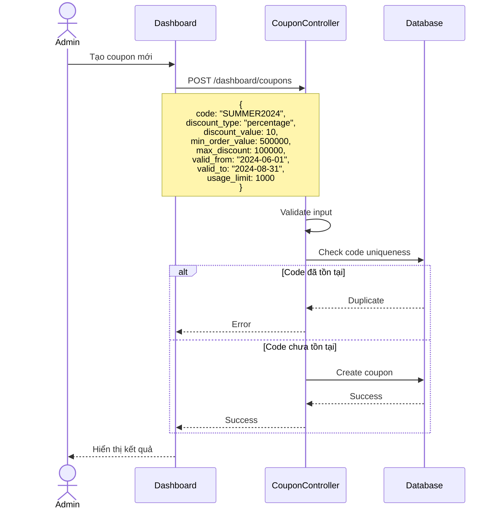

**Coupon Types**:
- **percentage**: Giảm theo phần trăm (VD: 10%)
- **fixed**: Giảm số tiền cố định (VD: 50,000 VNĐ)

**Coupon Validation**:
- Kiểm tra mã tồn tại
- Kiểm tra thời gian hiệu lực
- Kiểm tra số lần sử dụng
- Kiểm tra giá trị đơn hàng tối thiểu

#### 7.3. Báo cáo & Thống kê

```mermaid
flowchart TD
    A[Admin vào Dashboard] --> B[Chọn "Báo cáo & Thống kê"]
    B --> C[ReportController.index]
    C --> D[Lấy dữ liệu thống kê]
    
    D --> E[Doanh thu theo ngày/tháng/năm]
    D --> F[Số đơn hàng theo trạng thái]
    D --> G[Top sản phẩm bán chạy]
    D --> H[Khách hàng mới]
    D --> I[Tồn kho sắp hết]
    
    E --> J[Query revenue_reports table]
    F --> K[Count orders by status]
    G --> L[Query order_items with aggregation]
    H --> M[Count users created recently]
    I --> N[Query inventory where quantity < threshold]
    
    J --> O[Render dashboard charts]
    K --> O
    L --> O
    M --> O
    N --> O
    
    O --> P[Hiển thị biểu đồ & số liệu]
    P --> Q{Export báo cáo?}
    Q -->|Yes| R[Export to Excel/PDF]
    Q -->|No| S[End]
```

---

## 📊 Sơ đồ tổng quan luồng mua hàng E2E

```mermaid
graph TB
    subgraph Guest["👤 GUEST USER"]
        A1[Truy cập trang chủ] --> A2[Xem sản phẩm]
        A2 --> A3[Tìm kiếm/Lọc sản phẩm]
        A3 --> A4[Xem chi tiết sản phẩm]
        A4 --> A5{Muốn mua?}
    end
    
    subgraph Auth["🔐 AUTHENTICATION"]
        A5 -->|Yes| B1[Đăng nhập/Đăng ký]
        B1 --> B2{Method?}
        B2 -->|Email/Password| B3[Form login]
        B2 -->|OAuth| B4[Google/Facebook]
        B3 --> B5[Verified]
        B4 --> B5
    end
    
    subgraph Shopping["🛒 SHOPPING CART"]
        B5 --> C1[Thêm vào giỏ hàng]
        C1 --> C2[Kiểm tra tồn kho]
        C2 --> C3{Đủ hàng?}
        C3 -->|No| C4[Thông báo hết hàng]
        C3 -->|Yes| C5[Thêm vào Cart]
        C5 --> C6[Xem giỏ hàng]
        C6 --> C7{Tiếp tục mua?}
        C7 -->|Yes| A3
        C7 -->|No| C8[Checkout]
    end
    
    subgraph Checkout["💳 CHECKOUT & PAYMENT"]
        C8 --> D1[Nhập thông tin giao hàng]
        D1 --> D2[Áp dụng mã giảm giá]
        D2 --> D3[Chọn phương thức thanh toán]
        D3 --> D4{Payment method?}
        D4 -->|COD| D5[Tạo đơn hàng]
        D4 -->|VNPay| D6[Redirect to VNPay]
        D6 --> D7[Thanh toán qua ngân hàng]
        D7 --> D8{Success?}
        D8 -->|Yes| D9[Cập nhật payment_status]
        D8 -->|No| D10[Payment failed]
        D5 --> D11[Order created]
        D9 --> D11
    end
    
    subgraph OrderProcessing["📦 ORDER PROCESSING"]
        D11 --> E1[Trừ inventory]
        E1 --> E2[Gửi email xác nhận]
        E2 --> E3[Admin xử lý đơn]
        E3 --> E4[pending → processing]
        E4 --> E5[Đóng gói & vận chuyển]
        E5 --> E6[processing → shipped]
        E6 --> E7[Giao hàng]
        E7 --> E8[shipped → delivered]
    end
    
    subgraph AfterSale["⭐ AFTER SALE"]
        E8 --> F1{COD?}
        F1 -->|Yes| F2[Thu tiền & xác nhận]
        F1 -->|No| F3[Đã thanh toán]
        F2 --> F4[Hoàn tất đơn hàng]
        F3 --> F4
        F4 --> F5[Khách hàng đánh giá]
        F5 --> F6[Viết review & rating]
        F6 --> F7[Cập nhật product rating]
    end
    
    subgraph Support["💬 CUSTOMER SUPPORT"]
        G1[Khách hàng chat] --> G2[Real-time chat]
        G2 --> G3[Admin trả lời]
        G3 --> G4[Giải quyết vấn đề]
    end
    
    A4 -.Chat support.-> G1
    C6 -.Chat support.-> G1
    E8 -.Chat support.-> G1
    
    style A1 fill:#e1f5ff
    style B5 fill:#c8e6c9
    style D11 fill:#fff9c4
    style E8 fill:#ffccbc
    style F7 fill:#f8bbd0
```

---

## 🔧 Chi tiết kỹ thuật

### Database Schema (Quan hệ chính)

```
┌─────────────────┐         ┌─────────────────┐
│     users       │────────<│   user_roles    │
│  - id           │         │  - user_id      │
│  - email        │         │  - role_id      │
│  - password     │         └─────────────────┘
│  - name         │         
│  - phone        │         ┌─────────────────┐
│  - address      │────────<│     carts       │
└─────────────────┘         │  - cart_id      │
         │                  │  - user_id      │
         │                  └─────────────────┘
         │                           │
         │                           │
         │                           ▼
         │                  ┌─────────────────┐
         │                  │   cart_items    │
         │                  │  - cart_id      │
         │                  │  - product_id   │
         │                  │  - quantity     │
         │                  └─────────────────┘
         │                           │
         │                           │
         ▼                           ▼
┌─────────────────┐         ┌─────────────────┐
│     orders      │         │    products     │
│  - order_id     │         │  - product_id   │
│  - user_id      │         │  - name         │
│  - total_amount │         │  - price        │
│  - status       │         │  - category_id  │
│  - payment_...  │         │  - image_url    │
└─────────────────┘         └─────────────────┘
         │                           │
         │                           │
         ▼                           ▼
┌─────────────────┐         ┌─────────────────┐
│  order_items    │────────>│   inventory     │
│  - order_id     │         │  - product_id   │
│  - product_id   │         │  - quantity     │
│  - quantity     │         │  - reserved     │
│  - price        │         └─────────────────┘
└─────────────────┘
```

### Middleware & Security

**Middleware Stack**:
1. `throttle`: Rate limiting
   - `auth`: 5 requests/min
   - `sensitive`: 3 requests/min
   - `api-authenticated`: 60 requests/min
2. `auth:sanctum`: API authentication
3. `token.expiration`: Check token expiration
4. `role:admin|manager|customer`: Role-based access

**Security Features**:
- Password hashing (bcrypt)
- CSRF protection
- SQL injection prevention (Eloquent ORM)
- XSS protection (Blade escaping)
- Rate limiting
- Token expiration
- Secure payment hash (HMAC SHA512)

### Xử lý lỗi (Exception Handling)

**Custom Exceptions**:
- `CartNotFoundException`
- `EmptyCartException`
- `InsufficientStockException`
- `InvalidOrderStatusTransitionException`
- `PaymentFailedException`
- `UnauthorizedAccessException`

**Error Response Format**:
```json
{
  "success": false,
  "message": "Sản phẩm không đủ hàng",
  "errors": {
    "product_id": 123,
    "requested": 5,
    "available": 2
  },
  "code": "INSUFFICIENT_STOCK"
}
```

### Performance Optimization

1. **Database Indexing**:
   - Indexes on foreign keys
   - Indexes on frequently queried columns (email, order_id)

2. **Eager Loading**:
   ```php
   $orders = Order::with(['user', 'items.product'])->get();
   ```

3. **Caching**:
   - Product list caching
   - Category caching
   - Redis for session storage

4. **Pagination**:
   - Default 15 items per page
   - Configurable per_page parameter

### API Rate Limiting

```php
// Config trong routes/api.php
'throttle:auth' => 5 requests/min (login/register)
'throttle:sensitive' => 3 requests/min (password reset)
'throttle:api-authenticated' => 60 requests/min (authenticated APIs)
'throttle:60,1' => 60 requests/min (public APIs)
```

---

## 📝 Tóm tắt các bước quan trọng

### Quy trình mua hàng tổng thể:

1. **Guest Browse** (Không cần đăng nhập)
   - Xem sản phẩm
   - Tìm kiếm/Lọc
   - Xem chi tiết

2. **Authentication** (Bắt buộc để mua)
   - Đăng ký/Đăng nhập
   - OAuth (optional)

3. **Add to Cart** (Người dùng đã đăng nhập)
   - Kiểm tra tồn kho
   - Thêm vào CartItem
   - Cập nhật Cart

4. **Checkout** (Transaction)
   - Validate giỏ hàng
   - Kiểm tra tồn kho lần cuối
   - Áp dụng coupon
   - Tạo Order + OrderItems
   - Trừ Inventory
   - Xóa Cart

5. **Payment**
   - **COD**: Order status = pending
   - **VNPay**: Redirect → Bank → Callback → Update status

6. **Order Processing** (Admin)
   - pending → processing → shipped → delivered
   - Gửi email thông báo mỗi lần chuyển trạng thái

7. **After Sale**
   - Customer rating & review
   - Support qua chat
   - Theo dõi đơn hàng

---

## 🎯 Kết luận

Hệ thống Webshop được thiết kế với:
- ✅ **Kiến trúc MVC** rõ ràng (Model-View-Controller)
- ✅ **Service Layer** cho business logic phức tạp
- ✅ **RESTful API** cho tích hợp di động/SPA
- ✅ **Transaction handling** đảm bảo data integrity
- ✅ **Security best practices** (authentication, authorization, encryption)
- ✅ **Real-time features** (chat, notifications)
- ✅ **Payment gateway integration** (VNPay)
- ✅ **Role-based access control** (Admin/Manager/Customer)
- ✅ **Error handling & logging** đầy đủ
- ✅ **Performance optimization** (caching, pagination, eager loading)

**Tech Stack**:
- **Backend**: Laravel 11.x (PHP 8.2+)
- **Database**: MySQL 8.0
- **Authentication**: Laravel Sanctum
- **Real-time**: Laravel Reverb / Pusher
- **Payment**: VNPay API
- **Frontend**: Blade Templates / Vue.js (optional)
- **Cache**: Redis
- **Queue**: Laravel Queue (for emails, notifications)

---

**Tài liệu này mô tả đầy đủ luồng nghiệp vụ E2E của hệ thống Webshop từ góc nhìn người dùng và kỹ thuật.**

📅 Cập nhật lần cuối: 14/11/2024
👨‍💻 Phiên bản: 1.0
