# 📖 Use Cases - Hệ thống WebShop E-commerce

## 📋 Tổng quan

Tài liệu này mô tả **TẤT CẢ CÁC USE CASES** (trường hợp sử dụng) của hệ thống WebShop, bao gồm các chức năng cho từng loại người dùng và luồng xử lý nghiệp vụ.

---

## 👥 Phân loại Người dùng (Actors)

### 1. **Guest (Khách vãng lai)**
- Chưa đăng nhập
- Có thể xem sản phẩm, tìm kiếm
- Không thể mua hàng hoặc quản lý giỏ hàng

### 2. **Customer (Khách hàng)**
- Đã đăng ký và đăng nhập
- Có thể mua hàng, quản lý giỏ hàng
- Xem lịch sử đơn hàng của mình

### 3. **Manager (Quản lý)**
- Nhân viên quản lý
- Xem và quản lý: sản phẩm, đơn hàng, danh mục, tồn kho
- Không thể xóa hoặc tạo mới (chỉ xem và sửa)

### 4. **Admin (Quản trị viên)**
- Quyền cao nhất
- Toàn quyền: CRUD sản phẩm, đơn hàng, danh mục, người dùng
- Quản lý phân quyền

---

## 🎯 USE CASES THEO CHỨC NĂNG

---

## � SƠ ĐỒ TỔNG QUAN USE CASES

### Sơ đồ Use Case - Toàn hệ thống

```mermaid
graph TB
    subgraph Actors
        Guest[👤 Guest]
        Customer[👤 Customer]
        Manager[👤 Manager]
        Admin[👤 Admin]
    end
    
    subgraph "Product Management"
        P01[UC-P01: Xem danh sách SP]
        P02[UC-P02: Xem chi tiết SP]
        P03[UC-P03: Tìm kiếm SP]
        P04[UC-P04: Lọc theo danh mục]
        P05[UC-P05: Quản lý SP Dashboard]
        P06[UC-P06: Tạo SP mới]
        P07[UC-P07: Cập nhật SP]
        P08[UC-P08: Xóa SP]
    end
    
    subgraph "Cart Management"
        C01[UC-C01: Xem giỏ hàng]
        C02[UC-C02: Thêm vào giỏ]
        C03[UC-C03: Cập nhật số lượng]
        C04[UC-C04: Checkout ⚠️]
        C05[UC-C05: Xóa SP khỏi giỏ]
        C06[UC-C06: Xóa toàn bộ giỏ]
    end
    
    subgraph "Order Management"
        O01[UC-O01: Xem danh sách đơn]
        O02[UC-O02: Xem chi tiết đơn]
        O03[UC-O03: Cập nhật trạng thái]
        O04[UC-O04: Xóa đơn hàng]
    end
    
    subgraph "Category Management"
        CAT01[UC-CAT01: Xem danh mục]
        CAT02[UC-CAT02: Tạo danh mục]
        CAT03[UC-CAT03: Cập nhật danh mục]
        CAT04[UC-CAT04: Xóa danh mục]
    end
    
    subgraph "Inventory Management"
        INV01[UC-INV01: Xem tồn kho]
        INV02[UC-INV02: Chi tiết tồn kho]
        INV03[UC-INV03: Điều chỉnh tồn kho]
    end
    
    subgraph "User Management"
        USER01[UC-USER01: Xem danh sách user]
        USER02[UC-USER02: Chi tiết user]
        USER03[UC-USER03: Gán role]
        USER04[UC-USER04: Xóa user]
        USER05[UC-USER05: Xem quyền]
    end
    
    subgraph "Authentication"
        AUTH01[UC-AUTH01: Đăng ký]
        AUTH02[UC-AUTH02: Đăng nhập]
        AUTH03[UC-AUTH03: Đăng xuất]
    end
    
    %% Guest connections
    Guest --> P01
    Guest --> P02
    Guest --> P03
    Guest --> P04
    Guest --> AUTH01
    Guest --> AUTH02
    
    %% Customer connections
    Customer --> C01
    Customer --> C02
    Customer --> C03
    Customer --> C04
    Customer --> C05
    Customer --> C06
    Customer --> AUTH03
    
    %% Manager connections
    Manager --> P05
    Manager --> O01
    Manager --> O02
    Manager --> O03
    Manager --> CAT01
    Manager --> INV01
    Manager --> INV02
    Manager --> INV03
    Manager --> USER05
    
    %% Admin connections
    Admin --> P06
    Admin --> P07
    Admin --> P08
    Admin --> O04
    Admin --> CAT02
    Admin --> CAT03
    Admin --> CAT04
    Admin --> USER01
    Admin --> USER02
    Admin --> USER03
    Admin --> USER04
    
    style C04 fill:#ff6b6b,stroke:#c92a2a,color:#fff
    style P06 fill:#51cf66,stroke:#2f9e44,color:#fff
    style O03 fill:#ffd43b,stroke:#fab005,color:#000
```

### Sơ đồ Use Case - Theo Actor

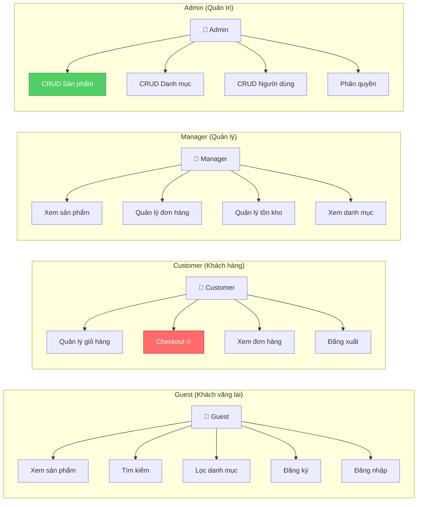

---

## �📦 1. QUẢN LÝ SẢN PHẨM (Product Management)

### Sơ đồ Use Case - Product Management

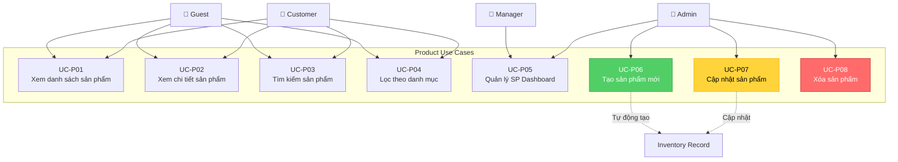

### UC-P01: Xem danh sách sản phẩm (Customer View)

**Actor**: Guest, Customer  
**Mô tả**: Người dùng xem danh sách sản phẩm trên trang chủ

**Tiền điều kiện**: Không yêu cầu

**Luồng chính**:
```
1. User truy cập trang chủ hoặc /products
2. Hệ thống hiển thị:
   - Danh sách sản phẩm (có phân trang)
   - Tên sản phẩm
   - Giá
   - Hình ảnh
   - Số lượng còn hàng
   - Nút "Xem chi tiết"
3. User có thể:
   - Lọc theo danh mục
   - Tìm kiếm theo tên
   - Sắp xếp theo giá
```

**Luồng phụ**:
- 2a. Không có sản phẩm nào → Hiển thị "Chưa có sản phẩm"
- 3a. User click "Xem chi tiết" → Chuyển sang UC-P02

**Controller**: `CustomerProductController@index`  
**Route**: `GET /products`  
**View**: `resources/views/products/index.blade.php`

---

### UC-P02: Xem chi tiết sản phẩm

**Actor**: Guest, Customer

**Mô tả**: Người dùng xem thông tin chi tiết của 1 sản phẩm

**Tiền điều kiện**: Sản phẩm tồn tại trong hệ thống

**Luồng chính**:
```
1. User click vào sản phẩm từ danh sách
2. Hệ thống hiển thị:
   - Tên sản phẩm
   - Giá
   - Mô tả chi tiết
   - Hình ảnh lớn
   - Số lượng còn hàng
   - Danh mục
   - Nút "Thêm vào giỏ hàng"
3. User có thể:
   - Chọn số lượng muốn mua
   - Thêm vào giỏ hàng (nếu đã đăng nhập)
```

**Luồng phụ**:
- 1a. Sản phẩm không tồn tại → Hiển thị lỗi 404
- 3a. User chưa đăng nhập → Chuyển hướng đến trang login
- 3b. Hết hàng → Disable nút "Thêm vào giỏ"

**Controller**: `CustomerProductController@show`  
**Route**: `GET /product/{id}`  
**View**: `resources/views/products/show.blade.php`

---

### UC-P03: Tìm kiếm sản phẩm

**Actor**: Guest, Customer

**Mô tả**: Người dùng tìm kiếm sản phẩm theo tên

**Luồng chính**:
```
1. User nhập từ khóa vào ô tìm kiếm
2. User nhấn nút "Tìm kiếm" hoặc Enter
3. Hệ thống:
   - Tìm trong bảng products (tìm theo name)
   - Hiển thị kết quả khớp
4. User xem danh sách kết quả
```

**Luồng phụ**:
- 3a. Không tìm thấy → Hiển thị "Không tìm thấy sản phẩm"
- 4a. User click vào sản phẩm → UC-P02

**Controller**: `CustomerProductController@search`  
**Route**: `GET /products/search?q={keyword}`

---

### UC-P04: Lọc sản phẩm theo danh mục

**Actor**: Guest, Customer

**Mô tả**: Người dùng xem sản phẩm thuộc 1 danh mục cụ thể

**Luồng chính**:
```
1. User click vào danh mục
2. Hệ thống hiển thị:
   - Tên danh mục
   - Danh sách sản phẩm thuộc danh mục đó
3. User xem và chọn sản phẩm
```

**Controller**: `CustomerProductController@category`  
**Route**: `GET /category/{id}`

---

### UC-P05: Quản lý sản phẩm (Admin View)

**Actor**: Admin, Manager

**Mô tả**: Admin/Manager xem và quản lý sản phẩm trong dashboard

**Tiền điều kiện**: User đã đăng nhập với role admin hoặc manager

**Luồng chính**:
```
1. Admin/Manager vào Dashboard → Products
2. Hệ thống hiển thị bảng sản phẩm:
   - ID
   - Tên
   - Danh mục
   - Giá
   - Tồn kho
   - Hành động (Xem/Sửa/Xóa)
3. Admin/Manager có thể:
   - Tìm kiếm sản phẩm
   - Lọc theo danh mục
   - Sắp xếp theo các cột
```

**Luồng phụ**:
- 3a. Click "Tạo mới" → UC-P06 (chỉ Admin)
- 3b. Click "Sửa" → UC-P07 (chỉ Admin)
- 3c. Click "Xóa" → UC-P08 (chỉ Admin)
- 3d. Click "Xem" → Xem chi tiết sản phẩm

**Controller**: `ProductController@index`  
**Route**: `GET /dashboard/products`  
**Middleware**: `auth`, `role:manager`  
**View**: `resources/views/dashboard/products/index.blade.php`

---

### UC-P06: Tạo sản phẩm mới

**Actor**: Admin

**Mô tả**: Admin tạo sản phẩm mới

**Tiền điều kiện**: 
- User đã đăng nhập với role admin
- Có ít nhất 1 danh mục

**Luồng chính**:
```
1. Admin click "Tạo sản phẩm mới"
2. Hệ thống hiển thị form:
   - Tên sản phẩm (*)
   - Danh mục (*)
   - Giá (*)
   - Số lượng tồn kho (*)
   - Mô tả
   - Hình ảnh
3. Admin nhập thông tin
4. Admin nhấn "Lưu"
5. Hệ thống:
   - Validate dữ liệu
   - Lưu vào bảng products
   - Tự động tạo record trong inventory
6. Chuyển hướng về danh sách với thông báo thành công
```

**Luồng phụ**:
- 5a. Dữ liệu không hợp lệ → Hiển thị lỗi validation
- 5b. Upload hình ảnh thất bại → Hiển thị lỗi

**Business Rules**:
- Tên sản phẩm: bắt buộc, tối đa 255 ký tự
- Giá: bắt buộc, số dương
- Tồn kho: bắt buộc, số nguyên >= 0
- Khi tạo product, tự động tạo inventory với:
  - `stock_in = stock_quantity`
  - `stock_out = 0`
  - `current_stock = stock_quantity`

**Controller**: `ProductController@store`  
**Route**: `POST /dashboard/products`  
**Middleware**: `auth`, `role:admin`

---

### UC-P07: Cập nhật sản phẩm

**Actor**: Admin

**Mô tả**: Admin chỉnh sửa thông tin sản phẩm

**Tiền điều kiện**: 
- User đã đăng nhập với role admin
- Sản phẩm tồn tại

**Luồng chính**:
```
1. Admin click "Sửa" trên sản phẩm
2. Hệ thống hiển thị form với thông tin hiện tại
3. Admin chỉnh sửa thông tin
4. Admin nhấn "Cập nhật"
5. Hệ thống:
   - Validate dữ liệu
   - Cập nhật bảng products
   - Cập nhật inventory (nếu stock_quantity thay đổi)
6. Chuyển hướng về danh sách với thông báo thành công
```

**Business Rules**:
- Nếu `stock_quantity` thay đổi:
  - Cập nhật `inventory.current_stock`
  - Cập nhật `inventory.stock_in`

**Controller**: `ProductController@update`  
**Route**: `PUT /dashboard/products/{id}`  
**Middleware**: `auth`, `role:admin`

---

### UC-P08: Xóa sản phẩm

**Actor**: Admin

**Mô tả**: Admin xóa sản phẩm khỏi hệ thống

**Tiền điều kiện**: 
- User đã đăng nhập với role admin
- Sản phẩm tồn tại

**Luồng chính**:
```
1. Admin click "Xóa" trên sản phẩm
2. Hệ thống hiển thị popup xác nhận
3. Admin xác nhận xóa
4. Hệ thống:
   - Kiểm tra sản phẩm có trong đơn hàng chưa
   - Xóa khỏi bảng products
   - Xóa inventory liên quan
5. Chuyển hướng về danh sách với thông báo thành công
```

**Luồng phụ**:
- 4a. Sản phẩm đang có trong đơn hàng → Không cho xóa, hiển thị lỗi

**Controller**: `ProductController@destroy`  
**Route**: `DELETE /dashboard/products/{id}`  
**Middleware**: `auth`, `role:admin`

---

## 🛒 2. QUẢN LÝ GIỎ HÀNG (Cart Management)

### Sơ đồ Use Case - Cart Management

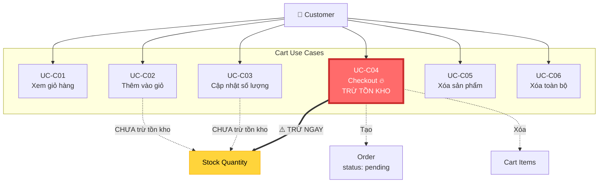

### Luồng Checkout chi tiết

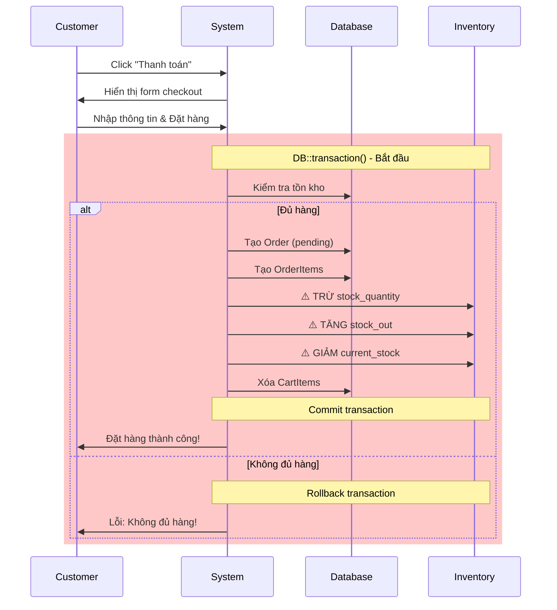


**Actor**: Customer

**Mô tả**: Customer xem các sản phẩm trong giỏ hàng

**Tiền điều kiện**: User đã đăng nhập

**Luồng chính**:
```
1. Customer click vào icon giỏ hàng
2. Hệ thống hiển thị:
   - Danh sách sản phẩm trong giỏ
   - Số lượng từng sản phẩm
   - Giá từng sản phẩm
   - Thành tiền
   - Tổng tiền tất cả
   - Nút "Thanh toán"
3. Customer có thể:
   - Tăng/giảm số lượng
   - Xóa sản phẩm
   - Xóa toàn bộ giỏ hàng
   - Tiếp tục mua hàng
   - Thanh toán
```

**Luồng phụ**:
- 2a. Giỏ hàng trống → Hiển thị "Giỏ hàng trống"
- 3a. Click "Thanh toán" → UC-C04

**Controller**: `CustomerCartController@index`  
**Route**: `GET /cart`  
**Middleware**: `auth`  
**View**: `resources/views/cart/index.blade.php`

---

### UC-C02: Thêm sản phẩm vào giỏ hàng

**Actor**: Customer

**Mô tả**: Customer thêm sản phẩm vào giỏ hàng

**Tiền điều kiện**: 
- User đã đăng nhập
- Sản phẩm còn hàng

**Luồng chính**:
```
1. Customer xem chi tiết sản phẩm
2. Customer chọn số lượng
3. Customer click "Thêm vào giỏ hàng"
4. Hệ thống:
   - Kiểm tra số lượng có đủ không
   - Tìm cart của user (hoặc tạo mới nếu chưa có)
   - Kiểm tra sản phẩm đã có trong cart chưa:
     + Nếu có: Cập nhật quantity
     + Nếu chưa: Tạo CartItem mới
5. Hiển thị thông báo "Đã thêm vào giỏ hàng"
6. Cập nhật badge số lượng giỏ hàng
```

**Luồng phụ**:
- 1a. User chưa đăng nhập → Chuyển hướng đến login
- 4a. Số lượng yêu cầu > stock → Báo lỗi "Không đủ hàng"
- 4b. Sản phẩm hết hàng → Báo lỗi "Sản phẩm đã hết hàng"

**Business Rules**:
- Mỗi user chỉ có 1 cart
- 1 sản phẩm chỉ xuất hiện 1 lần trong cart (cộng dồn quantity)
- **CHƯA TRỪ TỒN KHO** (chỉ trừ khi checkout)

**Controller**: `CustomerCartController@add`  
**Route**: `POST /cart/add/{productId}`  
**Middleware**: `auth`

---

### UC-C03: Cập nhật số lượng trong giỏ hàng

**Actor**: Customer

**Mô tả**: Customer thay đổi số lượng sản phẩm trong giỏ

**Luồng chính**:
```
1. Customer vào giỏ hàng
2. Customer click nút +/- để thay đổi số lượng
3. Hệ thống:
   - Kiểm tra số lượng mới có hợp lệ không
   - Kiểm tra tồn kho
   - Cập nhật quantity trong CartItem
4. Tự động cập nhật tổng tiền
```

**Luồng phụ**:
- 3a. Số lượng <= 0 → Xóa CartItem
- 3b. Số lượng > stock → Báo lỗi

**Controller**: `CustomerCartController@update`  
**Route**: `PUT /cart/update/{cartItemId}`  
**Middleware**: `auth`

---

### UC-C04: Thanh toán (Checkout)

**Actor**: Customer

**Mô tả**: Customer đặt hàng và thanh toán COD

**Tiền điều kiện**: 
- User đã đăng nhập
- Giỏ hàng có ít nhất 1 sản phẩm

**Luồng chính**:
```
1. Customer click "Thanh toán" từ giỏ hàng
2. Hệ thống hiển thị form:
   - Họ tên (*)
   - Số điện thoại (*)
   - Địa chỉ giao hàng (*)
   - Ghi chú
   - Phương thức thanh toán: COD (mặc định)
   - Tóm tắt đơn hàng
   - Tổng tiền
3. Customer nhập thông tin
4. Customer nhấn "Đặt hàng"
5. Hệ thống thực hiện trong DB::transaction:
   a. Kiểm tra tồn kho từng sản phẩm
   b. Tạo Order (status = 'pending')
   c. Tạo OrderItems
   d. ⚠️ TRỪ TỒN KHO NGAY:
      - products.stock_quantity -= quantity
      - inventory.stock_out += quantity
      - inventory.current_stock -= quantity
   e. Xóa CartItems
6. Hiển thị trang "Đặt hàng thành công" với mã đơn hàng
```

**Luồng phụ**:
- 3a. Thông tin không hợp lệ → Hiển thị lỗi validation
- 5a. Sản phẩm không đủ hàng → Rollback, báo lỗi chi tiết
- 5b. Lỗi bất kỳ → Rollback toàn bộ transaction

**Business Rules**:
- **Tồn kho bị trừ NGAY khi checkout** (không phải khi giao hàng)
- Mã đơn hàng: `ORD-YYYYMMDD-XXXXXX` (unique)
- Phương thức thanh toán mặc định: COD
- Trạng thái ban đầu: `pending`

**Controller**: `CustomerCartController@checkout`  
**Route**: `POST /cart/checkout`  
**Middleware**: `auth`  
**View**: `resources/views/cart/checkout.blade.php`

---

### UC-C05: Xóa sản phẩm khỏi giỏ hàng

**Actor**: Customer

**Mô tả**: Customer xóa 1 sản phẩm khỏi giỏ hàng

**Luồng chính**:
```
1. Customer vào giỏ hàng
2. Customer click nút "Xóa" trên sản phẩm
3. Hệ thống:
   - Xóa CartItem
   - Cập nhật tổng tiền
   - Cập nhật badge giỏ hàng
4. Hiển thị thông báo "Đã xóa sản phẩm"
```

**Controller**: `CustomerCartController@remove`  
**Route**: `DELETE /cart/remove/{cartItemId}`  
**Middleware**: `auth`

---

### UC-C06: Xóa toàn bộ giỏ hàng

**Actor**: Customer

**Mô tả**: Customer xóa tất cả sản phẩm trong giỏ

**Luồng chính**:
```
1. Customer vào giỏ hàng
2. Customer click "Xóa tất cả"
3. Hệ thống hiển thị popup xác nhận
4. Customer xác nhận
5. Hệ thống xóa tất cả CartItems
6. Hiển thị "Giỏ hàng trống"
```

**Controller**: `CustomerCartController@clear`  
**Route**: `DELETE /cart/clear`  
**Middleware**: `auth`

---

## 📋 3. QUẢN LÝ ĐƠN HÀNG (Order Management)

### Sơ đồ Use Case - Order Management

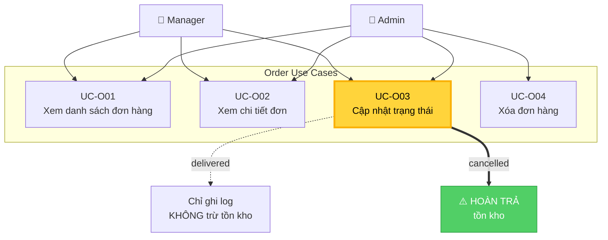

### Luồng cập nhật trạng thái đơn hàng

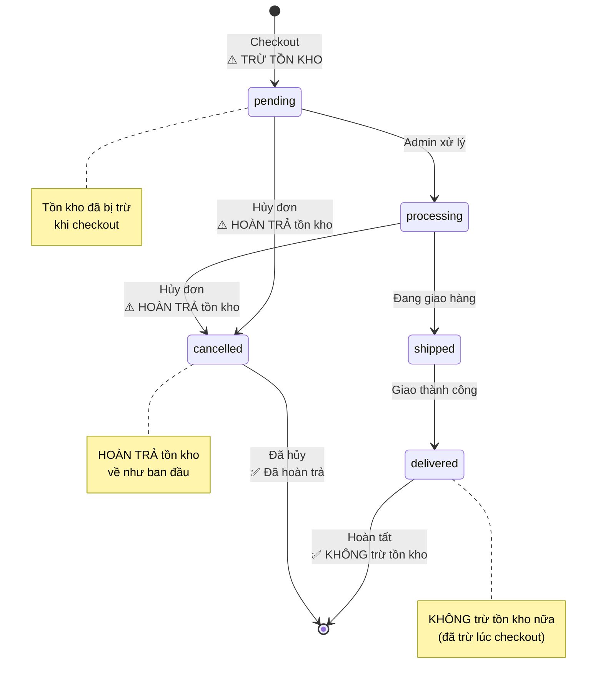

### Sequence Diagram - Cập nhật trạng thái

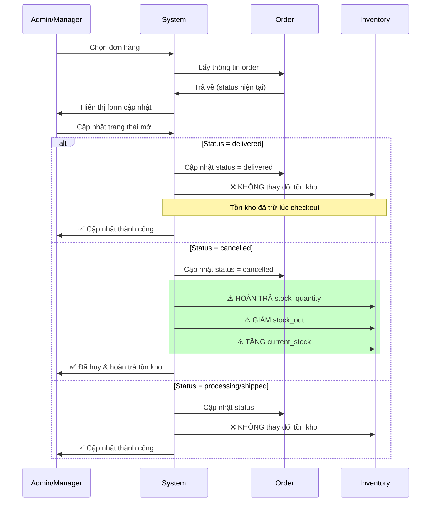


**Actor**: Admin, Manager

**Mô tả**: Admin/Manager xem tất cả đơn hàng

**Tiền điều kiện**: User đã đăng nhập với role admin hoặc manager

**Luồng chính**:
```
1. Admin/Manager vào Dashboard → Orders
2. Hệ thống hiển thị bảng đơn hàng:
   - Mã đơn hàng
   - Khách hàng
   - Tổng tiền
   - Trạng thái
   - Ngày đặt
   - Hành động
3. Admin/Manager có thể:
   - Lọc theo trạng thái
   - Tìm kiếm theo mã đơn
   - Sắp xếp theo ngày
```

**Luồng phụ**:
- 3a. Click "Xem" → UC-O02
- 3b. Click "Sửa" → UC-O03
- 3c. Click "Xóa" → UC-O04 (chỉ Admin)

**Controller**: `OrderController@index`  
**Route**: `GET /dashboard/orders`  
**Middleware**: `auth`, `role:manager`

---

### UC-O02: Xem chi tiết đơn hàng

**Actor**: Admin, Manager

**Mô tả**: Xem thông tin chi tiết của 1 đơn hàng

**Luồng chính**:
```
1. Admin/Manager click "Xem" trên đơn hàng
2. Hệ thống hiển thị:
   - Mã đơn hàng
   - Thông tin khách hàng (tên, SĐT, địa chỉ)
   - Trạng thái hiện tại
   - Phương thức thanh toán
   - Danh sách sản phẩm:
     + Tên
     + Số lượng
     + Đơn giá
     + Thành tiền
   - Tổng tiền
   - Ngày tạo
   - Lịch sử thay đổi trạng thái
```

**Controller**: `OrderController@show`  
**Route**: `GET /dashboard/orders/{id}`  
**Middleware**: `auth`, `role:manager`

---

### UC-O03: Cập nhật trạng thái đơn hàng

**Actor**: Admin, Manager

**Mô tả**: Thay đổi trạng thái đơn hàng

**Tiền điều kiện**: 
- User đã đăng nhập với role admin hoặc manager
- Đơn hàng tồn tại

**Luồng chính**:
```
1. Admin/Manager click "Sửa" trên đơn hàng
2. Hệ thống hiển thị form với trạng thái hiện tại
3. Admin/Manager chọn trạng thái mới từ dropdown:
   - pending (Chờ xử lý)
   - processing (Đang xử lý)
   - shipped (Đang giao hàng)
   - delivered (Đã giao hàng)
   - cancelled (Đã hủy)
4. Admin/Manager nhấn "Cập nhật"
5. Hệ thống:
   - Cập nhật status trong bảng orders
   - Nếu status = 'cancelled' → Hoàn trả tồn kho
   - Nếu status = 'delivered' → Chỉ log (không trừ tồn kho)
6. Hiển thị thông báo thành công
```

**Luồng phụ**:
- 5a. Chuyển sang 'cancelled':
  - Hoàn trả stock_quantity
  - Giảm stock_out
  - Tăng current_stock
- 5b. Chuyển sang 'delivered':
  - KHÔNG thay đổi tồn kho (đã trừ lúc checkout)
  - Chỉ ghi log

**Business Rules**:
- **Tồn kho đã bị trừ khi checkout**
- Khi delivered: KHÔNG trừ nữa
- Khi cancelled: HOÀN TRẢ tồn kho
- Các trạng thái khác: KHÔNG ảnh hưởng tồn kho

**Controller**: `OrderController@update`  
**Route**: `PUT /dashboard/orders/{id}`  
**Middleware**: `auth`, `role:manager`

---

### UC-O04: Xóa đơn hàng

**Actor**: Admin

**Mô tả**: Admin xóa đơn hàng khỏi hệ thống

**Tiền điều kiện**: 
- User đã đăng nhập với role admin
- Đơn hàng tồn tại

**Luồng chính**:
```
1. Admin click "Xóa" trên đơn hàng
2. Hệ thống hiển thị popup xác nhận
3. Admin xác nhận xóa
4. Hệ thống:
   - Nếu status != 'cancelled' → Hoàn trả tồn kho
   - Xóa OrderItems
   - Xóa Order
5. Hiển thị thông báo thành công
```

**Business Rules**:
- Nếu xóa đơn hàng chưa hủy → Phải hoàn trả tồn kho

**Controller**: `OrderController@destroy`  
**Route**: `DELETE /dashboard/orders/{id}`  
**Middleware**: `auth`, `role:admin`

---

## 📂 4. QUẢN LÝ DANH MỤC (Category Management)

### Sơ đồ Use Case - Category Management

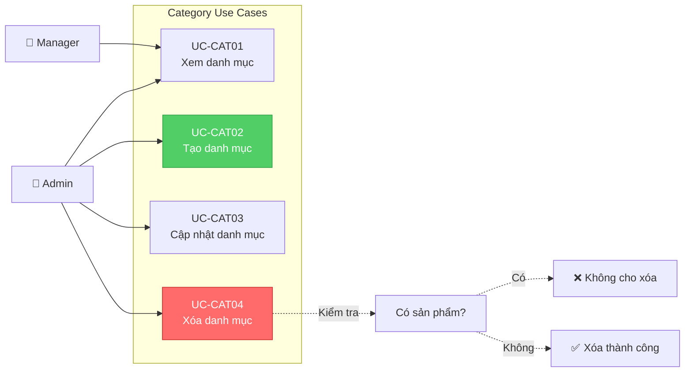

---

## 📊 5. QUẢN LÝ TỒN KHO (Inventory Management)

### Sơ đồ Use Case - Inventory Management

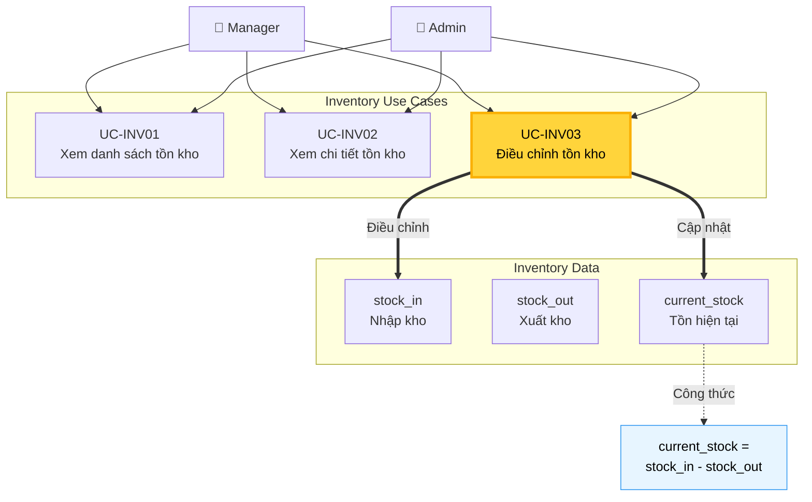

### Luồng tồn kho qua các giai đoạn

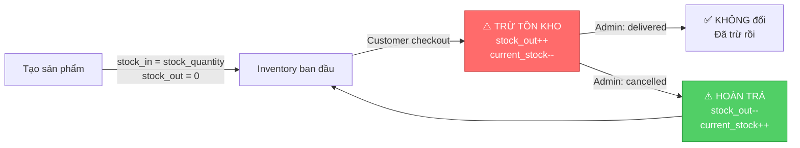

---

## 👤 6. QUẢN LÝ NGƯỜI DÙNG & PHÂN QUYỀN

### Sơ đồ Use Case - User Management

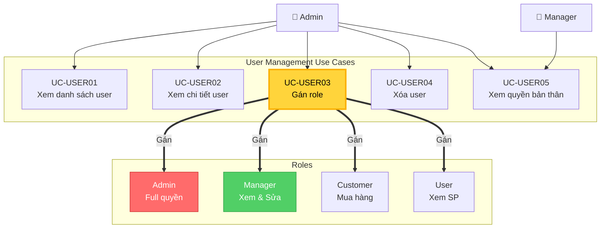

### Phân quyền theo Role

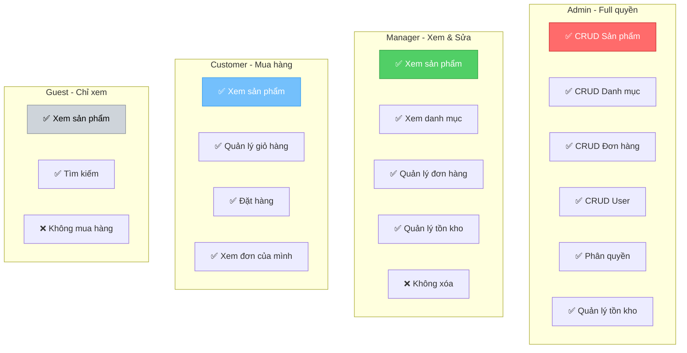


**Actor**: Admin, Manager

**Luồng chính**:
```
1. Admin/Manager vào Dashboard → Categories
2. Hệ thống hiển thị bảng danh mục:
   - ID
   - Tên danh mục
   - Số sản phẩm
   - Hành động
```

**Controller**: `CategoryController@index`  
**Route**: `GET /dashboard/categories`  
**Middleware**: `auth`, `role:manager`

---

### UC-CAT02: Tạo danh mục mới

**Actor**: Admin

**Luồng chính**:
```
1. Admin click "Tạo danh mục mới"
2. Hệ thống hiển thị form:
   - Tên danh mục (*)
   - Mô tả
3. Admin nhập thông tin và nhấn "Lưu"
4. Hệ thống lưu vào bảng categories
5. Hiển thị thông báo thành công
```

**Controller**: `CategoryController@store`  
**Route**: `POST /dashboard/categories`  
**Middleware**: `auth`, `role:admin`

---

### UC-CAT03: Cập nhật danh mục

**Actor**: Admin

**Luồng chính**:
```
1. Admin click "Sửa" trên danh mục
2. Hệ thống hiển thị form với thông tin hiện tại
3. Admin chỉnh sửa và nhấn "Cập nhật"
4. Hệ thống cập nhật bảng categories
5. Hiển thị thông báo thành công
```

**Controller**: `CategoryController@update`  
**Route**: `PUT /dashboard/categories/{id}`  
**Middleware**: `auth`, `role:admin`

---

### UC-CAT04: Xóa danh mục

**Actor**: Admin

**Luồng chính**:
```
1. Admin click "Xóa" trên danh mục
2. Hệ thống:
   - Kiểm tra danh mục có sản phẩm không
   - Nếu có → Báo lỗi "Không thể xóa, còn sản phẩm"
   - Nếu không → Xóa danh mục
3. Hiển thị thông báo
```

**Controller**: `CategoryController@destroy`  
**Route**: `DELETE /dashboard/categories/{id}`  
**Middleware**: `auth`, `role:admin`

---

## 📊 5. QUẢN LÝ TỒN KHO (Inventory Management)

### UC-INV01: Xem danh sách tồn kho

**Actor**: Admin, Manager

**Luồng chính**:
```
1. Admin/Manager vào Dashboard → Inventory
2. Hệ thống hiển thị bảng:
   - Sản phẩm
   - Nhập kho (stock_in)
   - Xuất kho (stock_out)
   - Tồn hiện tại (current_stock)
   - Cảnh báo (nếu < 10)
3. Admin/Manager có thể:
   - Tìm kiếm sản phẩm
   - Lọc theo tồn kho thấp
```

**Controller**: `InventoryController@index`  
**Route**: `GET /dashboard/inventory`  
**Middleware**: `auth`, `role:manager`

---

### UC-INV02: Xem chi tiết tồn kho

**Actor**: Admin, Manager

**Luồng chính**:
```
1. Admin/Manager click "Xem" trên sản phẩm
2. Hệ thống hiển thị:
   - Thông tin sản phẩm
   - stock_in, stock_out, current_stock
   - Lịch sử nhập/xuất (nếu có)
```

**Controller**: `InventoryController@show`  
**Route**: `GET /dashboard/inventory/{id}`  
**Middleware**: `auth`, `role:manager`

---

### UC-INV03: Điều chỉnh tồn kho

**Actor**: Admin, Manager

**Mô tả**: Điều chỉnh số lượng tồn kho (nhập thêm hoặc điều chỉnh)

**Luồng chính**:
```
1. Admin/Manager vào chi tiết tồn kho
2. Admin/Manager click "Điều chỉnh"
3. Hệ thống hiển thị form:
   - Loại điều chỉnh (nhập thêm / điều chỉnh)
   - Số lượng
   - Lý do
4. Admin/Manager nhập và nhấn "Xác nhận"
5. Hệ thống:
   - Cập nhật stock_in hoặc current_stock
   - Cập nhật stock_quantity trong products
   - Ghi log (nếu có)
6. Hiển thị thông báo thành công
```

**Business Rules**:
- Công thức: `current_stock = stock_in - stock_out`
- Luôn đồng bộ giữa `products.stock_quantity` và `inventory.current_stock`

**Controller**: `InventoryController@adjustStock`  
**Route**: `POST /dashboard/inventory/{id}/adjust`  
**Middleware**: `auth`, `role:manager`

---

## 👤 6. QUẢN LÝ NGƯỜI DÙNG & PHÂN QUYỀN

### UC-USER01: Xem danh sách người dùng

**Actor**: Admin

**Luồng chính**:
```
1. Admin vào Dashboard → Users
2. Hệ thống hiển thị bảng:
   - ID
   - Tên
   - Email
   - Roles
   - Ngày tạo
   - Hành động
3. Admin có thể:
   - Tìm kiếm theo tên/email
   - Lọc theo role
```

**Controller**: `UserManagementController@index`  
**Route**: `GET /dashboard/users`  
**Middleware**: `auth`, `role:admin`

---

### UC-USER02: Xem chi tiết người dùng

**Actor**: Admin

**Luồng chính**:
```
1. Admin click "Xem" trên user
2. Hệ thống hiển thị:
   - Thông tin cá nhân
   - Roles hiện tại
   - Quyền (permissions)
   - Thống kê:
     + Số đơn hàng
     + Tổng tiền đã chi
```

**Controller**: `UserManagementController@show`  
**Route**: `GET /dashboard/users/{user}`  
**Middleware**: `auth`, `role:admin`

---

### UC-USER03: Gán role cho người dùng

**Actor**: Admin

**Luồng chính**:
```
1. Admin vào chi tiết user hoặc trang edit
2. Admin chọn roles từ checkbox:
   - Admin
   - Manager
   - Customer
   - User
3. Admin nhấn "Cập nhật"
4. Hệ thống:
   - Xóa tất cả UserRole cũ
   - Tạo UserRole mới
5. Hiển thị thông báo thành công
```

**Business Rules**:
- 1 user có thể có nhiều roles
- Admin tự động có tất cả quyền
- Manager có quyền xem/sửa (không xóa)
- Customer chỉ xem và mua hàng

**Controller**: `UserManagementController@update`  
**Route**: `PUT /dashboard/users/{user}`  
**Middleware**: `auth`, `role:admin`

---

### UC-USER04: Xóa người dùng

**Actor**: Admin

**Luồng chính**:
```
1. Admin click "Xóa" trên user
2. Hệ thống hiển thị popup xác nhận
3. Admin xác nhận
4. Hệ thống:
   - Kiểm tra user có đơn hàng không
   - Xóa UserRoles
   - Xóa Cart (nếu có)
   - Xóa User
5. Hiển thị thông báo thành công
```

**Luồng phụ**:
- 4a. User có đơn hàng → Không cho xóa, chỉ vô hiệu hóa

**Controller**: `UserManagementController@destroy`  
**Route**: `DELETE /dashboard/users/{user}`  
**Middleware**: `auth`, `role:admin`

---

### UC-USER05: Xem quyền của bản thân

**Actor**: Admin, Manager

**Luồng chính**:
```
1. Admin/Manager vào Dashboard → Permissions
2. Hệ thống hiển thị:
   - Roles của user hiện tại
   - Danh sách quyền (permissions)
   - Thống kê user theo role
```

**Controller**: `UserManagementController@permissions`  
**Route**: `GET /dashboard/permissions`  
**Middleware**: `auth`, `role:manager`

---

## 🔐 7. XÁC THỰC (Authentication)

### Sơ đồ Use Case - Authentication

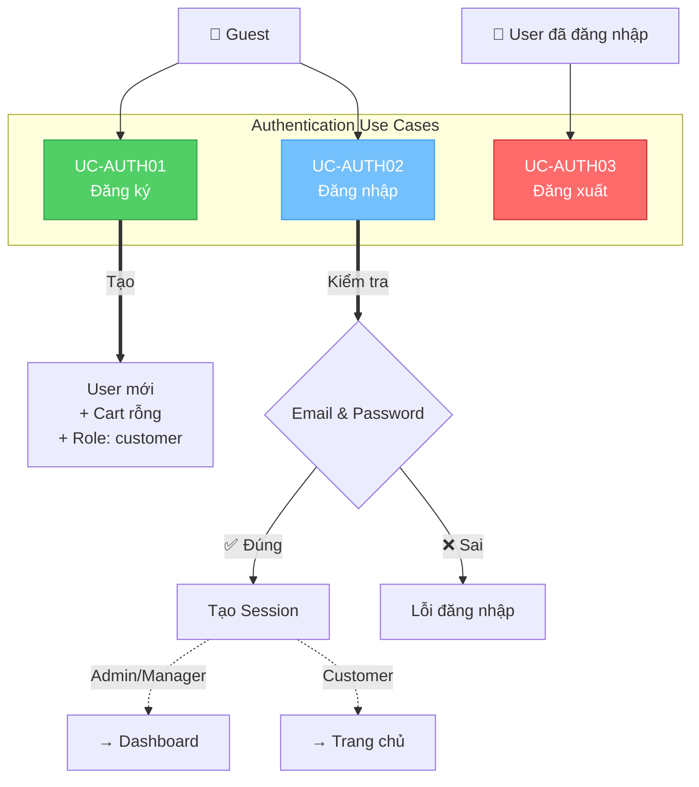

### Luồng đăng ký tài khoản

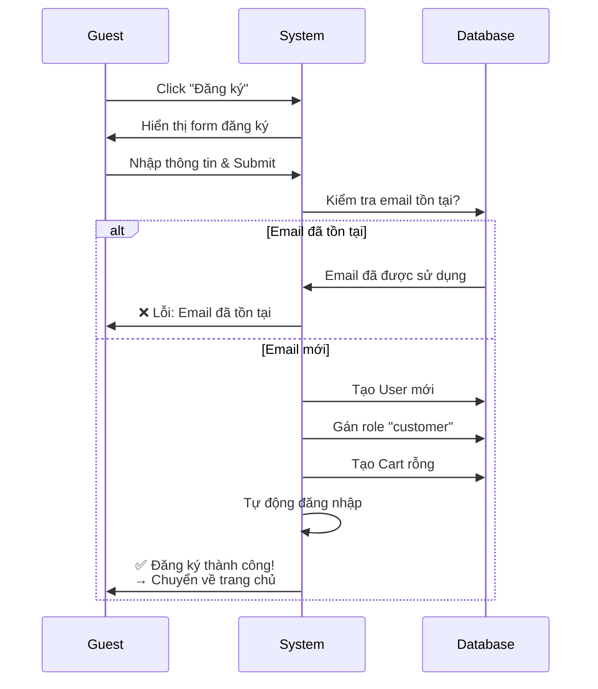

### Luồng đăng nhập

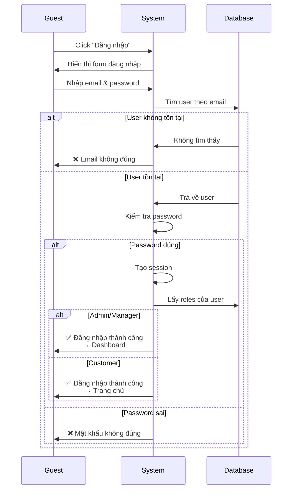

---

## 📊 8. DASHBOARD & TRANG CHỦ

### Sơ đồ Use Case - Dashboard & Home

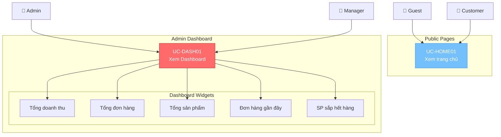


**Actor**: Guest

**Luồng chính**:
```
1. Guest click "Đăng ký"
2. Hệ thống hiển thị form:
   - Họ tên (*)
   - Email (*) (unique)
   - Mật khẩu (*) (min 8 ký tự)
   - Xác nhận mật khẩu (*)
   - Số điện thoại
   - Địa chỉ
3. Guest nhập thông tin và nhấn "Đăng ký"
4. Hệ thống:
   - Validate dữ liệu
   - Mã hóa password (bcrypt)
   - Tạo User
   - Tự động gán role "customer"
   - Tạo Cart rỗng
5. Tự động đăng nhập
6. Chuyển hướng về trang chủ
```

**Luồng phụ**:
- 4a. Email đã tồn tại → Báo lỗi
- 4b. Password không khớp → Báo lỗi

**Controller**: `AuthController@register`  
**Route**: `POST /register`

---

### UC-AUTH02: Đăng nhập

**Actor**: Guest

**Luồng chính**:
```
1. Guest click "Đăng nhập"
2. Hệ thống hiển thị form:
   - Email (*)
   - Password (*)
   - Ghi nhớ đăng nhập (checkbox)
3. Guest nhập thông tin và nhấn "Đăng nhập"
4. Hệ thống:
   - Tìm user theo email
   - Kiểm tra password
   - Tạo session
5. Chuyển hướng:
   - Nếu có role admin/manager → Dashboard
   - Nếu customer → Trang chủ
```

**Luồng phụ**:
- 4a. Email không tồn tại → Báo lỗi
- 4b. Password sai → Báo lỗi
- 4c. User bị vô hiệu hóa → Báo lỗi

**Controller**: `AuthController@login`  
**Route**: `POST /login`

---

### UC-AUTH03: Đăng xuất

**Actor**: Customer, Admin, Manager

**Luồng chính**:
```
1. User click "Đăng xuất"
2. Hệ thống:
   - Xóa session
   - Xóa token (nếu có)
3. Chuyển hướng về trang đăng nhập
```

**Controller**: `AuthController@logout`  
**Route**: `POST /logout`

---

## 📊 8. DASHBOARD & TRANG CHỦ

### UC-DASH01: Xem Dashboard

**Actor**: Admin, Manager

**Luồng chính**:
```
1. Admin/Manager đăng nhập
2. Hệ thống hiển thị Dashboard:
   - Thống kê tổng quan:
     + Tổng doanh thu
     + Tổng đơn hàng
     + Tổng sản phẩm
     + Tổng khách hàng
   - Biểu đồ doanh thu theo tháng
   - Đơn hàng gần đây
   - Sản phẩm sắp hết hàng
3. Admin/Manager có thể click vào các menu:
   - Products
   - Orders
   - Categories
   - Inventory
   - Users (chỉ Admin)
```

**Controller**: `AuthController@dashboard`  
**Route**: `GET /dashboard`  
**Middleware**: `auth`, `role:dashboard`

---

### UC-HOME01: Xem trang chủ

**Actor**: Guest, Customer

**Luồng chính**:
```
1. User truy cập trang chủ
2. Hệ thống hiển thị:
   - Banner/Slider
   - Danh mục nổi bật
   - Sản phẩm mới nhất
   - Sản phẩm bán chạy (nếu có)
   - Footer
3. User có thể:
   - Tìm kiếm sản phẩm
   - Click vào danh mục
   - Click vào sản phẩm
   - Đăng nhập/Đăng ký
```

**Controller**: `HomeController@index`  
**Route**: `GET /`

---

## 📋 TỔNG KẾT USE CASES

### Phân loại theo Actor

| Actor | Use Cases | Số lượng |
|-------|-----------|----------|
| **Guest** | UC-P01, UC-P02, UC-P03, UC-P04, UC-AUTH01, UC-AUTH02, UC-HOME01 | 7 |
| **Customer** | UC-C01, UC-C02, UC-C03, UC-C04, UC-C05, UC-C06, UC-AUTH03 | 7 |
| **Manager** | UC-P05, UC-O01, UC-O02, UC-O03, UC-CAT01, UC-INV01, UC-INV02, UC-INV03, UC-USER05, UC-DASH01 | 10 |
| **Admin** | UC-P06, UC-P07, UC-P08, UC-O04, UC-CAT02, UC-CAT03, UC-CAT04, UC-USER01, UC-USER02, UC-USER03, UC-USER04 | 11 |

### Phân loại theo Module

| Module | Use Cases | Số lượng |
|--------|-----------|----------|
| **Product Management** | UC-P01 → UC-P08 | 8 |
| **Cart Management** | UC-C01 → UC-C06 | 6 |
| **Order Management** | UC-O01 → UC-O04 | 4 |
| **Category Management** | UC-CAT01 → UC-CAT04 | 4 |
| **Inventory Management** | UC-INV01 → UC-INV03 | 3 |
| **User Management** | UC-USER01 → UC-USER05 | 5 |
| **Authentication** | UC-AUTH01 → UC-AUTH03 | 3 |
| **Dashboard & Home** | UC-DASH01, UC-HOME01 | 2 |

**Tổng cộng**: **35 Use Cases**

---

## 🔗 LIÊN KẾT GIỮA CÁC USE CASES

### Luồng mua hàng hoàn chỉnh (Customer Journey)

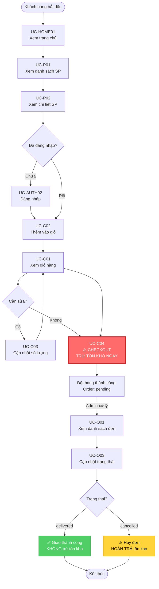

### Luồng quản lý sản phẩm (Admin Journey)

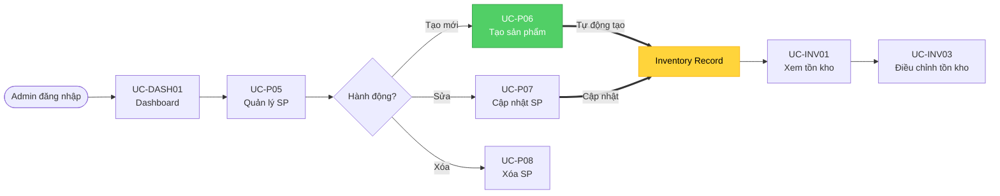

### Sơ đồ tổng quan luồng dữ liệu

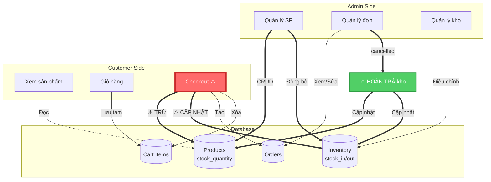

### Ma trận Use Case vs Actor

```mermaid
graph TB
    subgraph "Use Case Matrix"
        direction TB
        
        G[Guest 👤]
        C[Customer 👤]
        M[Manager 👤]
        A[Admin 👤]
        
        G -.->|7 UCs| G_UCs[P01, P02, P03, P04<br/>AUTH01, AUTH02, HOME01]
        C -.->|7 UCs| C_UCs[C01-C06<br/>AUTH03]
        M -.->|10 UCs| M_UCs[P05, O01-O03<br/>CAT01, INV01-INV03<br/>USER05, DASH01]
        A -.->|11 UCs| A_UCs[P06-P08, O04<br/>CAT02-CAT04<br/>USER01-USER04]
    end
    
    style G_UCs fill:#ced4da,stroke:#868e96
    style C_UCs fill:#74c0fc,stroke:#339af0
    style M_UCs fill:#51cf66,stroke:#2f9e44
    style A_UCs fill:#ff6b6b,stroke:#c92a2a
```


---

## ⚙️ BUSINESS RULES QUAN TRỌNG

### 1. Quản lý Tồn kho

- **Tồn kho bị trừ NGAY khi checkout (UC-C04)**
- **KHÔNG trừ khi delivered (UC-O03)**
- **Hoàn trả khi cancelled (UC-O03)**
- Công thức: `current_stock = stock_in - stock_out`
- Luôn đồng bộ: `products.stock_quantity = inventory.current_stock`

### 2. Phân quyền

- **Admin**: Toàn quyền (CRUD tất cả)
- **Manager**: Xem và sửa (không xóa)
- **Customer**: Chỉ mua hàng và xem đơn của mình
- **Guest**: Chỉ xem sản phẩm

### 3. Đơn hàng

- Trạng thái: `pending → processing → shipped → delivered`
- Hoặc: `pending → cancelled`
- Không cho sửa đơn hàng đã `delivered` hoặc `cancelled`

### 4. Giỏ hàng

- Mỗi user chỉ có 1 cart
- Sản phẩm trùng → Cộng dồn quantity
- **KHÔNG trừ tồn kho** khi thêm vào giỏ

---

## 📁 FILES LIÊN QUAN

### Controllers
- `CustomerProductController` - UC-P01, UC-P02, UC-P03, UC-P04
- `ProductController` - UC-P05, UC-P06, UC-P07, UC-P08
- `CustomerCartController` - UC-C01 → UC-C06
- `OrderController` - UC-O01 → UC-O04
- `CategoryController` - UC-CAT01 → UC-CAT04
- `InventoryController` - UC-INV01 → UC-INV03
- `UserManagementController` - UC-USER01 → UC-USER05
- `AuthController` - UC-AUTH01 → UC-AUTH03, UC-DASH01
- `HomeController` - UC-HOME01

### Routes
- `routes/web.php` - Định nghĩa tất cả routes và middleware

### Models
- `User`, `Role`, `UserRole` - Phân quyền
- `Product`, `Category`, `Inventory` - Sản phẩm
- `Cart`, `CartItem` - Giỏ hàng
- `Order`, `OrderItem` - Đơn hàng

---

## 📚 TÀI LIỆU LIÊN QUAN

- **ORDER_CHECKOUT_PROCESS.md** - Chi tiết quy trình đặt hàng và thanh toán
- **INVENTORY_MANAGEMENT_FLOW.md** - Chi tiết quản lý tồn kho
- **Api-Document.md** - Tài liệu API và phân quyền
- **TECH_STACK.md** - Tech stack và kiến trúc hệ thống

---

**Version**: 1.0.0  
**Last Updated**: 19/10/2025  
**Author**: Hoàng Quang Vinh  
**Project**: WebShop E-commerce Platform
