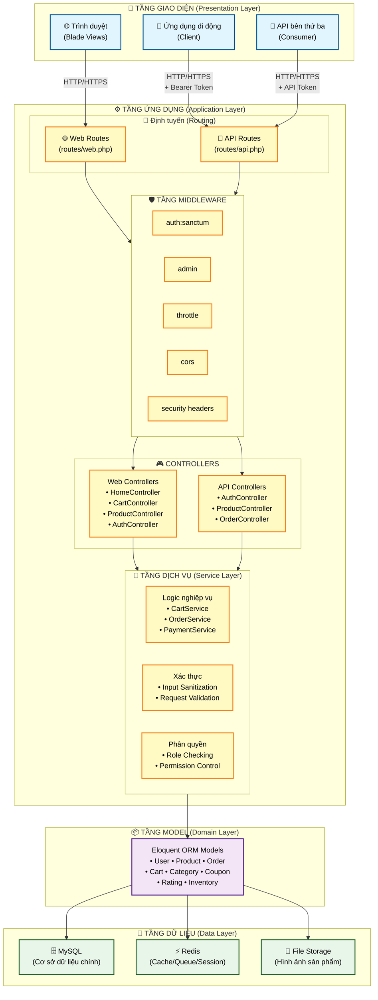

# 🏗️ Kiến trúc Hệ thống - System Architecture

> **Mục đích**: Mô tả kiến trúc tổng thể, luồng dữ liệu, và các mẫu thiết kế

## 📋 Mục lục
1. [Tổng quan kiến trúc](#tổng-quan-kiến-trúc)
2. [Kiến trúc phân lớp](#kiến-trúc-phân-lớp)
3. [Luồng xử lý yêu cầu](#luồng-xử-lý-yêu-cầu)
4. [Kiến trúc cơ sở dữ liệu](#kiến-trúc-cơ-sở-dữ-liệu)
5. [Kiến trúc xác thực](#kiến-trúc-xác-thực)
6. [Chiến lược Cache](#chiến-lược-cache)

---

## 🎯 Tổng quan kiến trúc

### Kiến trúc tổng thể



---

## 📚 Kiến trúc phân lớp

### 1. Tầng Giao diện (Client Layer)

**Thành phần**:
- **Trình duyệt Web**: Blade templates + Tailwind CSS + Blade Components
- **Ứng dụng di động**: API client (JSON)
- **Bên thứ ba**: External API consumers

**Trách nhiệm**:
- Hiển thị giao diện người dùng
- Gửi yêu cầu đến máy chủ
- Xử lý phản hồi và hiển thị kết quả
- Tái sử dụng UI components

**Blade Components Architecture**:
```php
// Component-based UI structure
resources/views/components/
├── rating-stars.blade.php    // Hiển thị sao đánh giá
├── product-price.blade.php   // Hiển thị giá có giảm giá
├── alerts.blade.php          // Hiển thị thông báo
└── sidebar.blade.php         // Sidebar dashboard

// Sử dụng component
@include('components.rating-stars', ['rating' => $product->averageRating()])
@include('components.product-price', ['product' => $product])
```

---

### 2. Tầng Ứng dụng (Application Layer)

#### 2.1 Định tuyến (Routes)

**Định tuyến Web** (`routes/web.php`):
```php
// Định tuyến công khai
Route::get('/', [HomeController::class, 'index'])->name('home');
Route::get('/products', [CustomerProductController::class, 'index'])->name('products.index');
Route::get('/product/{id}', [CustomerProductController::class, 'show'])->name('product.show');
Route::get('/category/{id}', [CustomerProductController::class, 'category'])->name('category.show');

// Trang tĩnh
Route::get('/about', [PageController::class, 'about'])->name('about');
Route::get('/contact', [PageController::class, 'contact'])->name('contact');
Route::post('/contact', [PageController::class, 'submitContact'])->name('contact.submit');

// Định tuyến xác thực
Route::get('/login', [AuthController::class, 'showLogin'])->name('login');
Route::post('/login', [AuthController::class, 'login']);
Route::get('/register', [AuthController::class, 'showRegister'])->name('register');
Route::post('/register', [AuthController::class, 'register']);
Route::post('/logout', [AuthController::class, 'logout'])->name('logout');

// Đặt lại mật khẩu
Route::get('/forgot-password', [PasswordResetController::class, 'showForgotForm'])->name('password.request');
Route::post('/forgot-password', [PasswordResetController::class, 'sendResetLink'])->name('password.email');
Route::get('/reset-password/{token}', [PasswordResetController::class, 'showResetForm'])->name('password.reset');
Route::post('/reset-password', [PasswordResetController::class, 'resetPassword'])->name('password.update');

// Đăng nhập mạng xã hội
Route::get('/auth/{provider}/redirect', [SocialAuthController::class, 'redirect'])->name('social.redirect');
Route::get('/auth/{provider}/callback', [SocialAuthController::class, 'callback'])->name('social.callback');

// Giỏ hàng (công khai và xác thực)
Route::get('/cart', [CustomerCartController::class, 'index'])->name('cart.index');
Route::post('/cart/add/{productId}', [CustomerCartController::class, 'add'])->name('cart.add');
Route::put('/cart/update/{cartItemId}', [CustomerCartController::class, 'update'])->name('cart.update');
Route::delete('/cart/remove/{cartItemId}', [CustomerCartController::class, 'remove'])->name('cart.remove');
Route::delete('/cart/clear', [CustomerCartController::class, 'clear'])->name('cart.clear');
Route::post('/cart/checkout', [CustomerCartController::class, 'checkout'])->name('cart.checkout');

// Thanh toán
Route::get('/payment/create', [PaymentController::class, 'createPayment'])->name('payment.create');
Route::get('/payment/vnpay-return', [PaymentController::class, 'vnpayReturn'])->name('payment.vnpay.return');
Route::post('/payment/vnpay-ipn', [PaymentController::class, 'vnpayIPN'])->name('payment.vnpay.ipn');
Route::get('/payment/success', [PaymentController::class, 'success'])->name('payment.success');
Route::get('/payment/failed', [PaymentController::class, 'failed'])->name('payment.failed');

// Định tuyến được bảo vệ
Route::middleware(['auth'])->group(function () {
    // Hồ sơ người dùng
    Route::get('/profile', [ProfileController::class, 'index'])->name('profile.index');
    Route::put('/profile', [ProfileController::class, 'updateProfile'])->name('profile.update');
    Route::put('/profile/password', [ProfileController::class, 'changePassword'])->name('profile.password');
    
    // Dashboard
    Route::get('/dashboard', [AuthController::class, 'dashboard'])->name('dashboard')
        ->middleware('role:dashboard');
});

// Định tuyến Admin/Manager
Route::middleware(['auth', 'role:admin'])->group(function () {
    Route::resource('dashboard/products', ProductController::class);
    Route::resource('dashboard/categories', CategoryController::class);
    Route::resource('dashboard/users', UserManagementController::class);
    Route::resource('dashboard/coupons', CouponController::class);
});

Route::middleware(['auth', 'role:manager'])->group(function () {
    Route::get('dashboard/inventory', [InventoryController::class, 'index'])->name('dashboard.inventory.index');
    Route::get('dashboard/reports', [ReportController::class, 'index'])->name('dashboard.reports.index');
});
```

**Định tuyến API** (`routes/api.php`):
```php
// API công khai
Route::post('/login', [AuthController::class, 'login']);
Route::get('/products', [ProductController::class, 'index']);

// API được bảo vệ
Route::middleware(['auth:sanctum'])->group(function () {
    Route::get('/user', fn(Request $r) => $r->user());
    Route::apiResource('orders', OrderController::class);
});

// API chỉ dành cho Admin
Route::middleware(['auth:sanctum', 'admin'])->group(function () {
    Route::apiResource('categories', CategoryController::class);
});
```

#### 2.2 Middleware (Bộ lọc Yêu cầu)

**Middleware có sẵn**:
- `auth:sanctum` - Xác thực bằng token API
- `auth` - Xác thực session web
- `throttle:60,1` - Giới hạn tốc độ (60 yêu cầu/phút)
- `cors` - Chia sẻ tài nguyên giữa các nguồn gốc

**Middleware tùy chỉnh**:
- `RolePermissionMiddleware` - Kiểm tra vai trò và quyền hạn
- `FirebaseAuth` - Xác thực Firebase cho Google OAuth

#### 2.3 Controllers (Điều khiển)

**Web Controllers**:
```
app/Http/Controllers/Web/
├── HomeController.php              # Trang chủ
├── PageController.php              # Trang tĩnh (Về chúng tôi, Liên hệ)
├── AuthController.php              # Đăng nhập/Đăng ký
├── CustomerProductController.php   # Xem sản phẩm (khách hàng)
├── CustomerCartController.php      # Giỏ hàng (khách hàng)
├── ProductController.php           # Quản lý sản phẩm (admin)
├── CategoryController.php          # Quản lý danh mục (admin)
├── OrderController.php             # Quản lý đơn hàng (admin)
├── InventoryController.php         # Quản lý tồn kho (manager)
├── ReportController.php            # Báo cáo thống kê (manager)
├── UserManagementController.php    # Quản lý người dùng (admin)
├── CouponController.php            # Quản lý coupon (admin)
├── PasswordResetController.php     # Đặt lại mật khẩu
├── PaymentController.php           # Xử lý thanh toán VNPay
├── ProfileController.php           # Quản lý hồ sơ người dùng
└── SocialAuthController.php        # Đăng nhập mạng xã hội (Google, Facebook)
```

**API Controllers**:
```
app/Http/Controllers/Api/
├── AuthController.php              # API Xác thực
├── ProductController.php           # API Sản phẩm
├── CategoryController.php          # API Danh mục
├── OrderController.php             # API Đơn hàng
├── CartController.php              # API Giỏ hàng
├── CartItemController.php          # API Mục giỏ hàng
├── OrderItemController.php         # API Mục đơn hàng
├── InventoryController.php         # API Tồn kho
└── ProductDetailController.php     # API Chi tiết sản phẩm
```

---

### 3. Tầng Dịch vụ (Service Layer)

**Chức năng**:
- Logic nghiệp vụ
- Xác thực dữ liệu
- Kiểm tra phân quyền
- Các thao tác phức tạp

**Ví dụ** (trong Controller):
```php
public function checkout(Request $request)
{
    // Xác thực dữ liệu
    $validated = $request->validate([...]);
    
    // Logic nghiệp vụ
    DB::transaction(function () use ($request) {
        // 1. Kiểm tra tồn kho
        // 2. Tạo đơn hàng
        // 3. Trừ kho
        // 4. Xóa giỏ hàng
    });
    
    // Phản hồi
    return redirect()->route('orders.success');
}
```

---

### 4. Tầng Model (Model Layer)

**Eloquent ORM Models**:
```
app/Models/
├── User.php           # HasApiTokens, quan hệ roles, carts, orders
├── Role.php           # Vai trò: admin, manager, customer
├── UserRole.php       # Bảng trung gian user-role
├── Product.php        # belongsTo Category, hasOne Inventory/ProductDetail
├── ProductDetail.php  # Chi tiết sản phẩm (màn hình, RAM, CPU, etc.)
├── Category.php       # hasMany Products
├── Inventory.php      # Quản lý tồn kho (stock_in, stock_out, current_stock)
├── Order.php          # belongsTo User, hasMany OrderItems
├── OrderItem.php      # belongsTo Order, Product
├── Cart.php           # belongsTo User, hasMany CartItems
├── CartItem.php       # belongsTo Cart, Product
├── Coupon.php         # Mã giảm giá với validation logic
├── Rating.php         # Đánh giá sản phẩm (1-5 sao)
└── RevenueReport.php  # Báo cáo doanh thu
```

**Quan hệ (Relationships)**:
```php
// User.php
public function roles() {
    return $this->belongsToMany(Role::class, 'user_roles');
}

public function cart() {
    return $this->hasOne(Cart::class);
}

public function orders() {
    return $this->hasMany(Order::class);
}

public function ratings() {
    return $this->hasMany(Rating::class);
}

// Product.php
public function category() {
    return $this->belongsTo(Category::class, 'category_id');
}

public function inventory() {
    return $this->hasOne(Inventory::class, 'product_id');
}

public function details() {
    return $this->hasOne(ProductDetail::class, 'product_id');
}

public function ratings() {
    return $this->hasMany(Rating::class, 'product_id');
}

public function cartItems() {
    return $this->hasMany(CartItem::class, 'product_id');
}

public function orderItems() {
    return $this->hasMany(OrderItem::class, 'product_id');
}

// Coupon.php - Các phương thức business logic
public function isValid($orderAmount = 0) {
    // Kiểm tra tính hợp lệ của coupon
}

public function calculateDiscount($orderAmount) {
    // Tính toán số tiền giảm giá
}
```

---

### 5. Tầng Dữ liệu (Data Layer)

#### 5.1 Cơ sở dữ liệu MySQL
- **Lưu trữ chính**: Dữ liệu quan hệ
- **Bảng**: users, products, orders, v.v.
- **Giao dịch**: Tuân thủ ACID

#### 5.2 Redis Cache
- **Phiên làm việc**: User sessions
- **Cache**: Kết quả truy vấn, cấu hình
- **Hàng đợi**: Background jobs

#### 5.3 Lưu trữ tệp tin
- **Công khai**: Hình ảnh sản phẩm
- **Riêng tư**: Tệp tin cá nhân

---

## 🔄 Luồng xử lý yêu cầu

### Luồng yêu cầu Web

```
1. Người dùng truy cập trình duyệt → http://localhost/products
   ↓
2. Định tuyến Web → CustomerProductController@index
   ↓
3. Controller:
   - Truy vấn sản phẩm từ cơ sở dữ liệu (eager load category)
   - Áp dụng bộ lọc, phân trang
   ↓
4. Blade template render HTML
   - Lặp qua các sản phẩm
   - Hiển thị với Tailwind CSS
   ↓
5. Phản hồi HTML → Trình duyệt
```

**Ví dụ mã**:
```php
// routes/web.php
Route::get('/products', [CustomerProductController::class, 'index']);

// Controller
public function index(Request $request) {
    $query = Product::with('category');
    
    if ($request->has('search')) {
        $query->where('name', 'LIKE', "%{$request->search}%");
    }
    
    $products = $query->paginate(12);
    
    return view('products.index', compact('products'));
}
```

---

### Luồng yêu cầu API

```
1. Client → POST /api/products
   Headers: Authorization: Bearer {token}
   Body: {"name": "iPhone 15", ...}
   ↓
2. Chuỗi Middleware:
   - throttle:60,1 (kiểm tra giới hạn tốc độ)
   - auth:sanctum (xác thực token)
   - admin (kiểm tra vai trò)
   ↓
3. ProductController@store:
   - Xác thực yêu cầu
   - Tạo sản phẩm
   - Tạo inventory
   ↓
4. Phản hồi JSON
   {
     "success": true,
     "data": {...}
   }
```

**Ví dụ mã**:
```php
// routes/api.php
Route::middleware(['auth:sanctum', 'admin'])
    ->apiResource('products', ProductController::class);

// Controller
public function store(Request $request) {
    $validated = $request->validate([...]);
    
    $product = Product::create($validated);
    
    Inventory::create([
        'product_id' => $product->id,
        'stock_in' => $validated['stock_quantity'],
        'current_stock' => $validated['stock_quantity'],
    ]);
    
    return response()->json([
        'success' => true,
        'data' => $product,
    ], 201);
}
```

---

## 🗄️ Kiến trúc cơ sở dữ liệu

### Sơ đồ quan hệ thực thể

```
users ────────┬──── user_roles ──── roles
              │
              ├──── carts ──── cart_items ──── products
              │
              ├──── orders ──── order_items ──── products
              │
              └──── ratings ──── products

categories ──── products ────┬──── product_details
                             │
                             ├──── inventory
                             │
                             ├──── cart_items
                             │
                             ├──── order_items
                             │
                             └──── ratings

coupons (độc lập, có validation logic)

revenue_reports (độc lập)

personal_access_tokens (Laravel Sanctum)
```

### Quan hệ chính

| Cha | Con | Loại | Mô tả |
|-----|-----|------|-------|
| users | roles | Nhiều-nhiều | User có nhiều vai trò |
| users | cart | Một-một | Mỗi user có 1 giỏ hàng |
| users | orders | Một-nhiều | User có nhiều đơn hàng |
| users | ratings | Một-nhiều | User có nhiều đánh giá |
| categories | products | Một-nhiều | Danh mục có nhiều sản phẩm |
| products | inventory | Một-một | Sản phẩm có 1 bản ghi tồn kho |
| products | product_details | Một-một | Sản phẩm có 1 bản ghi chi tiết |
| products | ratings | Một-nhiều | Sản phẩm có nhiều đánh giá |
| carts | cart_items | Một-nhiều | Giỏ hàng có nhiều mục |
| orders | order_items | Một-nhiều | Đơn hàng có nhiều mục |
| products | cart_items | Một-nhiều | Sản phẩm có trong nhiều giỏ hàng |
| products | order_items | Một-nhiều | Sản phẩm có trong nhiều đơn hàng |

---

## 🔐 Kiến trúc xác thực

### Luồng xác thực dựa trên Token

```
┌──────────────┐
│   Client     │
└──────┬───────┘
       │ 1. POST /api/login
       │    {email, password}
       ▼
┌──────────────────┐
│ AuthController   │
│  - Xác thực      │ 2. Kiểm tra thông tin đăng nhập
│  - Authenticate  │    với bảng users
└──────┬───────────┘
       │ 3. Tạo token
       ▼
┌──────────────────────────┐
│ personal_access_tokens   │ 4. Lưu token đã băm
│  - tokenable_id (user)   │
│  - token (hashed)        │
└──────┬───────────────────┘
       │ 5. Trả về token gốc
       ▼
┌──────────────┐
│   Client     │ 6. Lưu token cục bộ
│  localStorage│    Các yêu cầu tiếp theo:
└──────┬───────┘    Authorization: Bearer {token}
       │
       │ 7. Các yêu cầu tiếp theo
       ▼
┌──────────────────┐
│ auth:sanctum     │ 8. Xác minh token
│  Middleware      │    Tải user
└──────┬───────────┘
       │ 9. User đã được xác thực
       ▼
┌──────────────────┐
│   Controller     │ 10. Truy cập $request->user()
└──────────────────┘
```

### Kiểm soát truy cập dựa trên vai trò (RBAC)

```
┌─────────────┐
│    User     │
└──────┬──────┘
       │ belongsToMany
       ▼
┌──────────────┐
│  user_roles  │ (bảng trung gian)
└──────┬───────┘
       │
       ▼
┌──────────────┐
│    Roles     │
│  - admin     │ → Toàn quyền
│  - manager   │ → Xem + Sửa (không xóa)
│  - customer  │ → Chỉ mua hàng
└──────────────┘
```

**Ma trận phân quyền**:

| Tài nguyên | Admin | Manager | Customer |
|------------|-------|---------|----------|
| Sản phẩm | ✅ CRUD | ✅ RU | ✅ R |
| Danh mục | ✅ CRUD | ✅ RU | ✅ R |
| Đơn hàng | ✅ CRUD | ✅ RU | ✅ R (riêng) |
| Người dùng | ✅ CRUD | ❌ | ❌ |
| Tồn kho | ✅ CRUD | ✅ RU | ❌ |
| Coupon | ✅ CRUD | ✅ RU | ❌ |
| Báo cáo | ✅ R | ✅ R | ❌ |
| Đánh giá | ✅ RUD | ✅ RU | ✅ CRU (riêng) |

---

## 💾 Chiến lược Cache

### Cache đa cấp

```
Yêu cầu
   ↓
┌──────────────────┐
│  Cache trình     │ (Tài nguyên tĩnh)
│  duyệt           │
└────────┬─────────┘
         │ Miss
         ▼
┌──────────────────┐
│  Redis Cache     │ (Kết quả truy vấn, phiên)
└────────┬─────────┘
         │ Miss
         ▼
┌──────────────────┐
│  Cơ sở dữ liệu   │ (Nguồn chính thức)
│  MySQL           │
└──────────────────┘
```

### Khóa Cache

```php
// Cache danh sách sản phẩm
Cache::remember('products:all', 3600, function () {
    return Product::with(['category', 'inventory', 'details'])->get();
});

// Cache cây danh mục
Cache::remember('categories:tree', 3600, function () {
    return Category::with('products')->get();
});

// Cache giỏ hàng theo user
Cache::remember("cart:user:{$userId}", 600, function () use ($userId) {
    return Cart::with('items.product')
        ->where('user_id', $userId)
        ->first();
});

// Cache đánh giá sản phẩm
Cache::remember("product:ratings:{$productId}", 1800, function () use ($productId) {
    return Rating::where('product_id', $productId)
        ->with('user')
        ->latest()
        ->get();
});

// Cache coupon hợp lệ
Cache::remember('coupons:active', 900, function () {
    return Coupon::active()->valid()->available()->get();
});
```

### Xóa Cache

```php
// Khi tạo/sửa/xóa sản phẩm
Cache::forget('products:all');
Cache::forget("product:ratings:{$productId}");
Cache::tags(['products'])->flush();

// Khi tạo/sửa danh mục
Cache::forget('categories:tree');

// Khi tạo/sửa/xóa coupon
Cache::forget('coupons:active');

// Khi user thêm/xóa sản phẩm khỏi giỏ hàng
Cache::forget("cart:user:{$userId}");

// Khi có đánh giá mới
Cache::forget("product:ratings:{$productId}");
```

---

## 🔀 Luồng giao dịch

### Giao dịch thanh toán (Quan trọng)

```php
DB::transaction(function () use ($cart, $request) {
    // 1. Xác thực tồn kho
    foreach ($cart->items as $item) {
        if ($item->product->stock_quantity < $item->quantity) {
            throw new Exception('Không đủ tồn kho');
        }
    }
    
    // 2. Tạo đơn hàng
    $order = Order::create([...]);
    
    // 3. Tạo các mục đơn hàng
    foreach ($cart->items as $item) {
        OrderItem::create([...]);
    }
    
    // 4. ⚠️ Trừ tồn kho NGAY LẬP TỨC
    foreach ($cart->items as $item) {
        $item->product->decrement('stock_quantity', $item->quantity);
        
        // Cập nhật inventory
        $inventory = $item->product->inventory;
        $inventory->increment('stock_out', $item->quantity);
        $inventory->decrement('current_stock', $item->quantity);
    }
    
    // 5. Xóa giỏ hàng
    $cart->items()->delete();
    
    // Tất cả hoặc không gì - nếu bước nào thất bại, rollback tất cả
});
```

---

## 🎯 Mẫu thiết kế sử dụng

### 1. **Mẫu MVC**
- Model: Eloquent ORM
- View: Blade templates
- Controller: Xử lý yêu cầu

### 2. **Mẫu Repository** (qua Eloquent)
```php
// Eloquent như repository
class ProductRepository extends Product {
    public function findWithCategory($id) {
        return $this->with('category')->findOrFail($id);
    }
}
```

### 3. **Service Container (Dependency Injection)**
```php
class OrderController {
    public function __construct(
        private OrderService $orderService
    ) {}
}
```

### 4. **Mẫu Observer**
```php
// Product Observer
class ProductObserver {
    public function created(Product $product) {
        Cache::forget('products:all');
    }
}
```

### 5. **Mẫu Factory**
```php
// Database seeders
Product::factory()->count(50)->create();
```

---

## �️ Routing & API Architecture

### Web Routes Structure

```php
// Public routes
Route::get('/', [HomeController::class, 'index'])->name('home');
Route::get('/products', [CustomerProductController::class, 'index'])->name('products.index');
Route::get('/products/search', [CustomerProductController::class, 'search'])->name('products.search');
Route::get('/products/promotions', [CustomerProductController::class, 'promotions'])->name('products.promotions');
Route::get('/product/{id}', [CustomerProductController::class, 'show'])->name('product.show');
Route::get('/category/{id}', [CustomerProductController::class, 'category'])->name('category.show');

// Static Pages
Route::get('/about', [PageController::class, 'about'])->name('about');
Route::get('/contact', [PageController::class, 'contact'])->name('contact');
Route::post('/contact', [PageController::class, 'submitContact'])->name('contact.submit');

// Authentication
Route::get('/login', [AuthController::class, 'showLogin'])->name('login');
Route::post('/login', [AuthController::class, 'login']);
Route::get('/register', [AuthController::class, 'showRegister'])->name('register');
Route::post('/register', [AuthController::class, 'register']);
Route::post('/logout', [AuthController::class, 'logout'])->name('logout');

// Password Reset
Route::get('/forgot-password', [PasswordResetController::class, 'showForgotForm'])->name('password.request');
Route::post('/forgot-password', [PasswordResetController::class, 'sendResetLink'])->name('password.email');
Route::get('/reset-password/{token}', [PasswordResetController::class, 'showResetForm'])->name('password.reset');
Route::post('/reset-password', [PasswordResetController::class, 'resetPassword'])->name('password.update');

// Social Authentication
Route::get('/auth/{provider}/redirect', [SocialAuthController::class, 'redirect'])->name('social.redirect');
Route::get('/auth/{provider}/callback', [SocialAuthController::class, 'callback'])->name('social.callback');

// Cart (public + authenticated)
Route::get('/cart', [CustomerCartController::class, 'index'])->name('cart.index');
Route::post('/cart/add/{productId}', [CustomerCartController::class, 'add'])->name('cart.add');
Route::put('/cart/update/{cartItemId}', [CustomerCartController::class, 'update'])->name('cart.update');
Route::delete('/cart/remove/{cartItemId}', [CustomerCartController::class, 'remove'])->name('cart.remove');
Route::delete('/cart/clear', [CustomerCartController::class, 'clear'])->name('cart.clear');
Route::post('/cart/checkout', [CustomerCartController::class, 'checkout'])->name('cart.checkout');

// Payment
Route::get('/payment/create', [PaymentController::class, 'createPayment'])->name('payment.create');
Route::get('/payment/vnpay-return', [PaymentController::class, 'vnpayReturn'])->name('payment.vnpay.return');
Route::post('/payment/vnpay-ipn', [PaymentController::class, 'vnpayIPN'])->name('payment.vnpay.ipn');
Route::get('/payment/success', [PaymentController::class, 'success'])->name('payment.success');
Route::get('/payment/failed', [PaymentController::class, 'failed'])->name('payment.failed');

// Authenticated routes
Route::middleware(['auth'])->group(function () {
    // Dashboard
    Route::get('/dashboard', [AuthController::class, 'dashboard'])->name('dashboard')
        ->middleware('role:dashboard');
    
    // Profile Management
    Route::get('/profile', [ProfileController::class, 'index'])->name('profile.index');
    Route::put('/profile', [ProfileController::class, 'updateProfile'])->name('profile.update');
    Route::put('/profile/password', [ProfileController::class, 'changePassword'])->name('profile.password');
    
    // Admin/Manager routes
    Route::middleware(['role:admin'])->prefix('dashboard')->group(function () {
        // Products CRUD (admin only create/edit/delete)
        Route::get('products/create', [ProductController::class, 'create'])->name('dashboard.products.create');
        Route::post('products', [ProductController::class, 'store'])->name('dashboard.products.store');
        Route::get('products/{id}/edit', [ProductController::class, 'edit'])->name('dashboard.products.edit');
        Route::put('products/{id}', [ProductController::class, 'update'])->name('dashboard.products.update');
        Route::delete('products/{id}', [ProductController::class, 'destroy'])->name('dashboard.products.destroy');
        
        // Categories CRUD
        Route::resource('categories', CategoryController::class);
        
        // User Management
        Route::resource('users', UserManagementController::class);
        
        // Coupons
        Route::resource('coupons', CouponController::class);
    });
    
    // Manager+ routes
    Route::middleware(['role:manager'])->prefix('dashboard')->group(function () {
        Route::get('products', [ProductController::class, 'index'])->name('dashboard.products.index');
        Route::get('products/{id}', [ProductController::class, 'show'])->name('dashboard.products.show');
        Route::get('orders', [OrderController::class, 'index'])->name('dashboard.orders.index');
        Route::get('inventory', [InventoryController::class, 'index'])->name('dashboard.inventory.index');
        Route::get('reports', [ReportController::class, 'index'])->name('dashboard.reports.index');
    });
});
```

### API Routes Structure

```php
// API v1 routes
Route::prefix('api/v1')->middleware('api')->group(function () {
    // Authentication
    Route::post('/login', [Api\AuthController::class, 'login']);
    Route::post('/register', [Api\AuthController::class, 'register']);
    Route::post('/logout', [Api\AuthController::class, 'logout'])->middleware('auth:sanctum');
    
    // Public API
    Route::get('/products', [Api\ProductController::class, 'index']);
    Route::get('/products/{product}', [Api\ProductController::class, 'show']);
    Route::get('/categories', [Api\CategoryController::class, 'index']);
    
    // Protected API
    Route::middleware('auth:sanctum')->group(function () {
        // Cart management
        Route::apiResource('cart', Api\CartController::class);
        
        // Order management
        Route::apiResource('orders', Api\OrderController::class)->only(['index', 'show', 'store']);
        
        // User profile
        Route::get('/profile', [Api\UserController::class, 'profile']);
        Route::patch('/profile', [Api\UserController::class, 'updateProfile']);
        
        // Admin/Manager API
        Route::middleware('role:admin,manager')->group(function () {
            Route::apiResource('products', Api\ProductController::class)->except(['index', 'show']);
            Route::apiResource('categories', Api\CategoryController::class);
            Route::apiResource('coupons', Api\CouponController::class);
            Route::patch('orders/{order}/status', [Api\OrderController::class, 'updateStatus']);
        });
        
        // Admin only API
        Route::middleware('role:admin')->group(function () {
            Route::apiResource('users', Api\UserController::class);
            Route::get('/reports/revenue', [Api\ReportController::class, 'revenue']);
        });
    });
});
```

---

## �📊 Cân nhắc về hiệu suất

### Tối ưu hóa cơ sở dữ liệu
- ✅ Chỉ mục trên khóa ngoại
- ✅ Eager loading (`with()`) để tránh N+1
- ✅ Phân trang cho tập dữ liệu lớn
- ✅ Cache truy vấn với Redis

### Chiến lược Cache
- ✅ Redis cho phiên & cache
- ✅ Cache config/route/view trong production
- ✅ Opcache được bật cho PHP

### Tối ưu hóa tài nguyên
- ✅ Vite cho đóng gói & minification
- ✅ Tách mã
- ✅ Asset hashing (cache busting)

---

## 🎨 Frontend Architecture & Components

### Views Structure

```
resources/views/
├── layouts/
│   ├── app.blade.php           # Layout admin/auth
│   ├── customer.blade.php      # Layout khách hàng (navigation, footer)
│   └── dashboard.blade.php     # Layout dashboard
├── components/
│   ├── rating-stars.blade.php  # Component hiển thị sao đánh giá
│   ├── product-price.blade.php # Component hiển thị giá sản phẩm
│   ├── alerts.blade.php        # Component hiển thị thông báo
│   └── sidebar.blade.php       # Component sidebar admin
├── pages/
│   ├── about.blade.php         # Trang về chúng tôi
│   └── contact.blade.php       # Trang liên hệ
├── home.blade.php              # Trang chủ
├── products/                   # Views sản phẩm
├── cart/                       # Views giỏ hàng
├── payment/                    # Views thanh toán
├── auth/                       # Views đăng nhập/đăng ký
├── profile/                    # Views hồ sơ người dùng
└── dashboard/                  # Views quản trị
    ├── products/
    ├── categories/
    ├── orders/
    ├── users/
    ├── inventory/
    ├── coupons/
    └── reports/
```

### Blade Components System

**Cấu trúc components**:
```
resources/views/components/
├── rating-stars.blade.php      # Component hiển thị sao đánh giá
├── product-price.blade.php     # Component hiển thị giá sản phẩm
├── alerts.blade.php            # Component hiển thị thông báo
└── sidebar.blade.php           # Component sidebar admin
```

**Shared JavaScript**:
```
public/js/
└── cart.js                     # Logic giỏ hàng dùng chung
    ├── addToCart()             # Thêm sản phẩm vào giỏ
    └── Error handling          # Xử lý lỗi xác thực
```

**Component Usage Examples**:

```blade
{{-- Rating Stars Component --}}
@include('components.rating-stars', [
    'rating' => $product->averageRating()
])

{{-- Product Price Component --}}
@include('components.product-price', [
    'product' => $product,
    'priceClass' => 'text-danger' // Optional
])

{{-- Alerts Component --}}
@include('components.alerts')
```

**Lợi ích của Component System**:
- ✅ **DRY Principle**: Không lặp lại code
- ✅ **Maintainability**: Dễ bảo trì, cập nhật tập trung
- ✅ **Consistency**: UI nhất quán trên toàn hệ thống
- ✅ **Reusability**: Tái sử dụng linh hoạt
- ✅ **Testing**: Dễ test từng component riêng lẻ

### JavaScript Organization

**Shared Functions** (public/js/cart.js):
```javascript
// Được load trong layouts/customer.blade.php
// Tự động available cho tất cả trang customer

function addToCart(productId) {
    // Unified cart logic
    // - CSRF token handling
    // - 401 redirect to login
    // - Success/error messages
}
```

**Benefits**:
- ✅ Single source of truth
- ✅ Browser caching
- ✅ Reduced code duplication
- ✅ Easier debugging and updates

---

## 📚 Tài liệu liên quan

- **[TECH_STACK.md](./TECH_STACK.md)** - Danh sách công nghệ
- **[DATABASE.md](./DATABASE.md)** - Chi tiết schema
- **[AUTHENTICATION.md](./AUTHENTICATION.md)** - Hệ thống xác thực
- **[BUSINESS_LOGIC.md](./BUSINESS_LOGIC.md)** - Quy tắc nghiệp vụ
- **[CODING_CONVENTIONS.md](./CODING_CONVENTIONS.md)** - Quy tắc code và components

---

## 📄 Static Pages (Trang tĩnh)

### PageController

**File**: `app/Http/Controllers/Web/PageController.php`

**Chức năng**:
- Quản lý các trang tĩnh như "Về chúng tôi" và "Liên hệ"
- Xử lý form liên hệ với validation
- Có thể mở rộng cho các trang tĩnh khác

**Methods**:
```php
// Hiển thị trang Về chúng tôi
public function about()
{
    return view('pages.about');
}

// Hiển thị trang Liên hệ
public function contact()
{
    return view('pages.contact');
}

// Xử lý form liên hệ
public function submitContact(Request $request)
{
    $validated = $request->validate([
        'name' => 'required|string|max:255',
        'email' => 'required|email|max:255',
        'phone' => 'nullable|string|max:20',
        'subject' => 'required|string|max:255',
        'message' => 'required|string|max:2000',
    ]);
    
    // TODO: Send email or save to database
    
    return redirect()->route('contact')
        ->with('success', 'Cảm ơn bạn đã liên hệ!');
}
```

### Static Pages Views

**About Page** (`resources/views/pages/about.blade.php`):
- Câu chuyện công ty
- Giá trị cốt lõi (Uy tín, Tận tâm, Đổi mới)
- Thống kê (10,000+ khách hàng, 5,000+ sản phẩm)
- Lý do chọn WebShop
- CTA (Call to Action) mua sắm ngay

**Contact Page** (`resources/views/pages/contact.blade.php`):
- Thông tin liên hệ (địa chỉ, hotline, email, giờ làm việc)
- Form liên hệ với validation
- Google Maps tích hợp
- FAQ (Câu hỏi thường gặp)

**Navigation Integration**:
- Links trong `layouts/customer.blade.php`
- Menu chính: "Về chúng tôi" và "Liên hệ"
- Footer links: cập nhật với routes mới

---

**Cập nhật lần cuối**: 26/10/2025  
**Phiên bản**: 3.2  
**Tác giả**: Hoàng Quang Vinh  
**Thay đổi mới nhất**: 
- Thêm PageController cho trang tĩnh
- Thêm trang About (Về chúng tôi)
- Thêm trang Contact (Liên hệ) với form validation
- Cập nhật routes với static pages
- Cập nhật navigation và footer links
