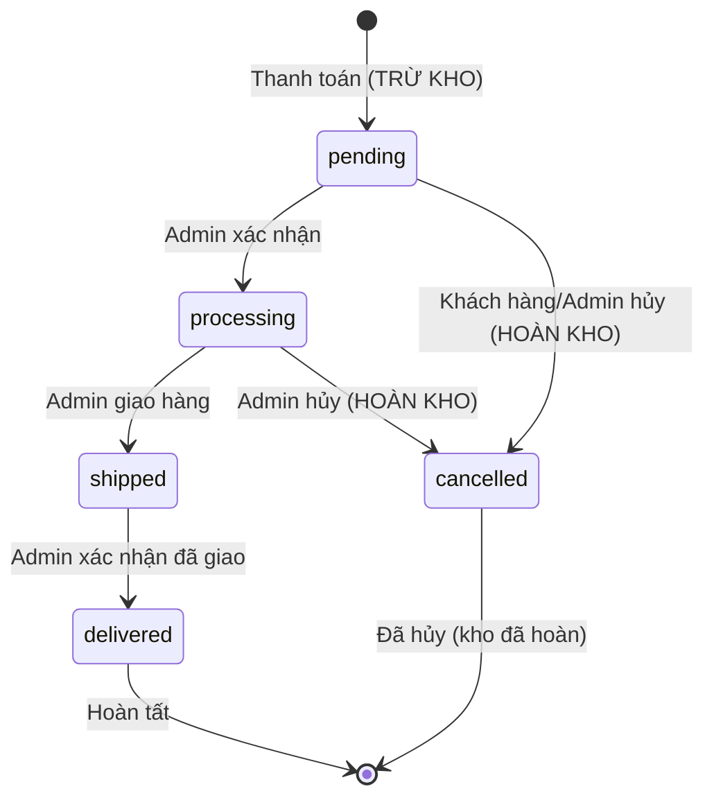

# 💼 Logic Nghiệp Vụ & Trường Hợp Sử Dụng

> **Mục đích**: Mô tả luồng nghiệp vụ, quy tắc kinh doanh, và use cases của hệ thống

## 📋 Mục lục
1. [Vai Trò Người Dùng](#vai-trò-người-dùng)
2. [Luồng Đặt Hàng Hoàn Chỉnh](#luồng-đặt-hàng-hoàn-chỉnh)
3. [Quy Tắc Nghiệp Vụ Quan Trọng](#quy-tắc-nghiệp-vụ-quan-trọng)
4. [Trường Hợp Sử Dụng Cốt Lõi](#trường-hợp-sử-dụng-cốt-lõi)
5. [Quản Lý Kho Hàng](#quản-lý-kho-hàng)
6. [Chuyển Đổi Trạng Thái](#chuyển-đổi-trạng-thái)

---

## 👥 Vai Trò Người Dùng

| Vai Trò | Quyền Hạn | Hạn Chế |
|---------|-----------|---------|
| **Khách** | Xem sản phẩm, tìm kiếm | Không thể mua hàng, không truy cập giỏ hàng |
| **Khách Hàng** | Xem sản phẩm, quản lý giỏ hàng, đặt hàng, xem đơn hàng của mình | Không truy cập tính năng admin |
| **Quản Lý** | Xem & chỉnh sửa sản phẩm/đơn hàng/kho, xem tất cả đơn hàng | Không thể xóa, không quản lý người dùng |
| **Admin** | Toàn quyền CRUD trên tất cả tài nguyên, quản lý người dùng, phân quyền | Không có |

---

## 🔄 Luồng Đặt Hàng Hoàn Chỉnh

### Sơ Đồ Tổng Quan

```
┌─────────────────────────────────────────────────────────────────┐
│  BƯỚC 1: Duyệt Sản Phẩm                                        │
│  - Xem danh sách sản phẩm                                      │
│  - Xem chi tiết sản phẩm                                       │
│  - Kiểm tra stock_quantity (CHƯA trừ kho)                      │
└────────────────────────────┬────────────────────────────────────┘
                             │
                             ▼
┌─────────────────────────────────────────────────────────────────┐
│  BƯỚC 2: Thêm Vào Giỏ Hàng                                     │
│  - Kiểm tra: Sản phẩm có tồn tại? Kho có đủ?                   │
│  - Tạo/Cập nhật CartItem                                       │
│  - ✅ KHÔNG trừ kho (chỉ lưu trong cart_items)                 │
└────────────────────────────┬────────────────────────────────────┘
                             │
                             ▼
┌─────────────────────────────────────────────────────────────────┐
│  BƯỚC 3: Xem & Chỉnh Sửa Giỏ Hàng                              │
│  - Xem sản phẩm trong giỏ với giá                              │
│  - Cập nhật số lượng                                           │
│  - Xóa sản phẩm                                                │
│  - ✅ Vẫn KHÔNG trừ kho                                        │
└────────────────────────────┬────────────────────────────────────┘
                             │
                             ▼
┌─────────────────────────────────────────────────────────────────┐
│  ⚠️ BƯỚC 4: THANH TOÁN (THỜI ĐIỂM QUAN TRỌNG) ⚠️                │
│                                                                  │
│  POST /cart/checkout (CustomerCartController@checkout)          │
│                                                                  │
│  ┌────────────────────────────────────────┐                     │
│  │ TRỪ KHO NGAY LẬP TỨC                   │                     │
│  │                                        │                     │
│  │ DB::transaction(function() {           │                     │
│  │   // Tạo đơn hàng với status=pending   │                     │
│  │   Order::create([...]);                │                     │
│  │                                        │                     │
│  │   foreach ($cartItems as $item) {      │                     │
│  │     // Tạo order items                 │                     │
│  │     OrderItem::create([...]);          │                     │
│  │                                        │                     │
│  │     // TRỪ KHO NGAY BÂY GIỜ            │                     │
│  │     $product->decrement('stock',       │                     │
│  │                        $item->qty);    │                     │
│  │                                        │                     │
│  │     // Cập nhật inventory              │                     │
│  │     Inventory::increment('stock_out')  │                     │
│  │     Inventory::decrement('current')    │                     │
│  │   }                                    │                     │
│  │                                        │                     │
│  │   // Xóa giỏ hàng                      │                     │
│  │   CartItem::where(...)->delete();      │                     │
│  │ });                                    │                     │
│  └────────────────────────────────────────┘                     │
│                                                                  │
│  ⚠️ Kho bị TRỪ ngay lập tức (ngay cả khi status=pending)        │
│  ✅ HOÀN KHO tự động khi hủy đơn!                               │
└────────────────────────────┬────────────────────────────────────┘
                             │
                             ▼
┌─────────────────────────────────────────────────────────────────┐
│  BƯỚC 4.1: XỬ LÝ THANH TOÁN (Nếu chọn VNPay)                   │
│                                                                  │
│  - Nếu payment_method = 'vnpay':                                │
│    └─> Lưu order_id vào session                                │
│        └─> Redirect đến PaymentController                       │
│            └─> Tạo URL thanh toán VNPay                         │
│                └─> Redirect khách hàng đến VNPay               │
│                    └─> Khách hàng thanh toán                   │
│                        └─> VNPay callback về /payment/return   │
│                            └─> Cập nhật payment_status         │
│                                                                  │
│  - Nếu payment_method = 'cod':                                  │
│    └─> Hoàn tất đơn hàng, chờ xác nhận                          │
└─────────────────────────────────────────────────────────────────┘
                             │
                             ▼
┌─────────────────────────────────────────────────────────────────┐
│  BƯỚC 5: Quản Lý Trạng Thái Đơn Hàng                           │
│                                                                  │
│  pending → processing → shipped → delivered                     │
│  pending/processing/shipped → cancelled (✅ TỰ ĐỘNG hoàn kho!)  │
│  delivered/cancelled → không thể chuyển (trạng thái cuối)      │
└─────────────────────────────────────────────────────────────────┘
```

---

### Luồng Code Chi Tiết Từng Bước

#### 1️⃣ Duyệt Sản Phẩm (Không Cần Xác Thực)

**Endpoint**: `GET /api/products`

**Controller**: `CustomerProductController@index`

```php
public function index(Request $request)
{
    $query = Product::query();
    
    // Lọc theo danh mục
    if ($request->category_id) {
        $query->where('category_id', $request->category_id);
    }
    
    // Khoảng giá
    if ($request->min_price) {
        $query->where('price', '>=', $request->min_price);
    }
    
    // Tìm kiếm
    if ($request->search) {
        $query->where('name', 'like', "%{$request->search}%");
    }
    
    return ProductResource::collection($query->paginate());
}
```

**Điểm Chính**:
- ✅ Bất kỳ ai cũng có thể xem sản phẩm
- ✅ `stock_quantity` hiển thị để giúp khách hàng quyết định
- ✅ KHÔNG trừ kho

---

#### 2️⃣ Thêm Vào Giỏ Hàng (Cần Xác Thực)

**Endpoint**: `POST /api/cart/items`

**Controller**: `CustomerCartController@add`

```php
public function add(Request $request)
{
    $validated = $request->validate([
        'product_id' => 'required|exists:products,id',
        'quantity' => 'required|integer|min:1',
    ]);
    
    // 1. Lấy sản phẩm
    $product = Product::findOrFail($validated['product_id']);
    
    // 2. Kiểm tra số lượng tồn kho
    if ($product->stock_quantity < $validated['quantity']) {
        return response()->json([
            'status' => false,
            'message' => 'Không đủ hàng trong kho. Còn lại: ' . $product->stock_quantity,
        ], 400);
    }
    
    // 3. Lấy hoặc tạo giỏ hàng
    $cart = Cart::firstOrCreate([
        'user_id' => $request->user()->id,
    ]);
    
    // 4. Kiểm tra sản phẩm đã có trong giỏ chưa
    $cartItem = CartItem::where([
        'cart_id' => $cart->id,
        'product_id' => $product->id,
    ])->first();
    
    if ($cartItem) {
        // Cập nhật số lượng
        $newQuantity = $cartItem->quantity + $validated['quantity'];
        
        if ($newQuantity > $product->stock_quantity) {
            return response()->json([
                'status' => false,
                'message' => 'Tổng số lượng vượt quá tồn kho',
            ], 400);
        }
        
        $cartItem->update(['quantity' => $newQuantity]);
    } else {
        // Tạo item giỏ hàng mới
        $cartItem = CartItem::create([
            'cart_id' => $cart->id,
            'product_id' => $product->id,
            'quantity' => $validated['quantity'],
        ]);
    }
    
    return response()->json([
        'status' => true,
        'message' => 'Đã thêm sản phẩm vào giỏ hàng',
        'cart' => new CartResource($cart->load('items.product')),
    ]);
}
```

**Điểm Chính**:
- ✅ Kiểm tra kho trước khi thêm
- ✅ Ngăn thêm quá số lượng có sẵn
- ✅ Nhưng vẫn KHÔNG thực sự trừ kho

---

#### 3️⃣ Xem Giỏ Hàng

**Endpoint**: `GET /api/cart`

```php
public function index(Request $request)
{
    $cart = Cart::with('items.product')
                ->where('user_id', $request->user()->id)
                ->first();
    
    if (!$cart) {
        return response()->json([
            'status' => true,
            'cart' => null,
            'items' => [],
            'total' => 0,
        ]);
    }
    
    return new CartResource($cart);
}
```

**Phản Hồi**:
```json
{
  "id": 1,
  "user_id": 1,
  "items": [
    {
      "id": 1,
      "product_id": 5,
      "product_name": "iPhone 15 Pro",
      "price": 29990000,
      "quantity": 2,
      "subtotal": 59980000
    }
  ],
  "total": 59980000
}
```

---

#### 4️⃣ **THANH TOÁN - THỜI ĐIỂM QUAN TRỌNG** ⚠️

**Endpoint**: `POST /cart/checkout`

**Controller**: `CustomerCartController@checkout`

```php
public function checkout(CheckoutRequest $request)
{
    // Validated data:
    // - shipping_name, shipping_phone, shipping_address
    // - payment_method: 'cod' hoặc 'vnpay'
    // - coupon_code (optional)
    // - note (optional)
    $validated = $request->validated();
    
    // Gọi CartService để xử lý checkout
    $result = $this->cartService->processCheckout($validated);
    
    // Trong CartService::processCheckout():
    DB::transaction(function () use ($cart, $data) {
        
        // 1. Validate stock
        foreach ($cart->items as $item) {
            if ($item->product->stock_quantity < $item->quantity) {
                throw new \Exception("Sản phẩm không đủ hàng");
            }
        }
        
        // 2. Tính tổng tiền
        $totalAmount = $cart->totalPrice();
        
        // 3. Áp dụng coupon (nếu có)
        $discountAmount = 0;
        $coupon = null;
        if (!empty($data['coupon_code'])) {
            $coupon = Coupon::where('code', $data['coupon_code'])->first();
            $validation = $coupon->isValid($totalAmount);
            if ($validation['valid']) {
                $discountAmount = $coupon->calculateDiscount($totalAmount);
                $totalAmount = $totalAmount - $discountAmount;
                $coupon->increment('used_count');
            }
        }
        
        // 4. Tạo đơn hàng
        $order = Order::create([
            'user_id' => Auth::id(),
            'total_amount' => $totalAmount,
            'status' => 'pending',
            'shipping_name' => $data['shipping_name'],
            'shipping_phone' => $data['shipping_phone'],
            'shipping_address' => $data['shipping_address'],
            'note' => $data['note'] ?? null,
            'payment_method' => $data['payment_method'],
            'payment_status' => 'pending',
            'order_date' => now(),
        ]);
        
        // 5. Tạo order items + TRỪ KHO + CẬP NHẬT INVENTORY
        foreach ($cart->items as $cartItem) {
            $product = $cartItem->product;
            
            // Tạo order item (lock giá)
            OrderItem::create([
                'order_id' => $order->order_id,
                'product_id' => $product->product_id,
                'quantity' => $cartItem->quantity,
                'price' => $product->price,
            ]);
            
            // ⚠️ TRỪ KHO trong products table
            $product->decrement('stock_quantity', $cartItem->quantity);
            
            // ⚠️ CẬP NHẬT INVENTORY table
            $inventory = Inventory::firstOrCreate(
                ['product_id' => $product->product_id],
                ['stock_in' => 0, 'stock_out' => 0, 'current_stock' => 0]
            );
            $inventory->increment('stock_out', $cartItem->quantity);
            $inventory->decrement('current_stock', $cartItem->quantity);
        }
        
        // 6. Xóa giỏ hàng
        $cart->items()->delete();
    });
    
    // 7. Xử lý theo phương thức thanh toán
    if ($result['payment_method'] === 'vnpay') {
        // Lưu order_id vào session và redirect đến trang thanh toán VNPay
        session(['pending_payment_order_id' => $result['order']->order_id]);
        return redirect()->route('payment.create.get');
    }
    
    // COD: Hoàn tất
    return redirect()->route('cart.index')
        ->with('success', 'Đặt hàng thành công!');
}
```

**⚠️ QUY TẮC NGHIỆP VỤ QUAN TRỌNG**:

1. **Kho được trừ NGAY LẬP TỨC** khi tạo đơn hàng (ngay cả khi `status=pending`)
2. **Cập nhật song song** - Cả `products.stock_quantity` VÀ `inventories.current_stock` đều được cập nhật
3. **Transaction đảm bảo tính nguyên tử** - hoặc tất cả thành công hoặc tất cả thất bại
4. **Bảo vệ race condition** - kiểm tra lại kho bên trong transaction
5. **Giỏ hàng được xóa** sau khi thanh toán thành công
6. **✅ TỰ ĐỘNG hoàn kho** khi đơn hàng bị hủy (thông qua OrderService::handleOrderCancelled)
7. **Coupon được áp dụng** trong quá trình checkout và tăng `used_count`

---

#### 5️⃣ Quản Lý Trạng Thái Đơn Hàng

**Endpoint**: `POST /dashboard/orders/{id}/update-status`

**Controller**: `OrderController@updateStatus` (Web Dashboard)

```php
public function updateStatus(Request $request, $id)
{
    // Sử dụng OrderService
    $order = $this->orderService->updateOrderStatus($id, $request->status);
    
    // Trong OrderService::updateOrderStatus():
    DB::transaction(function () use ($order, $newStatus, $oldStatus) {
        
        // Kiểm tra chuyển đổi hợp lệ
        if (!$order->canTransitionTo($newStatus)) {
            throw new \Exception("Không thể chuyển đổi trạng thái");
        }
        
        // Cập nhật trạng thái
        $order->update(['status' => $newStatus]);
        
        // ⚠️ XỬ LÝ KHI ĐƠN HÀNG BỊ HỦY
        if ($newStatus === Order::STATUS_CANCELLED && $oldStatus !== Order::STATUS_CANCELLED) {
            $this->handleOrderCancelled($order);
        }
        
        // Xử lý khi đơn hàng được giao
        if ($newStatus === Order::STATUS_DELIVERED && $oldStatus !== Order::STATUS_DELIVERED) {
            $this->handleOrderDelivered($order);
        }
    });
}

// ✅ HOÀN KHO TỰ ĐỘNG
protected function handleOrderCancelled(Order $order)
{
    foreach ($order->items as $item) {
        $product = $item->product;
        $quantity = $item->quantity;
        
        // Tăng lại stock_quantity trong products
        $product->increment('stock_quantity', $quantity);
        
        // Cập nhật inventory
        $inventory = Inventory::firstOrCreate(
            ['product_id' => $product->product_id],
            ['stock_in' => 0, 'stock_out' => 0, 'current_stock' => 0]
        );
        
        // Giảm stock_out (vì hàng không xuất nữa)
        if ($inventory->stock_out >= $quantity) {
            $inventory->decrement('stock_out', $quantity);
        }
        
        // Tăng current_stock (hàng quay lại kho)
        $inventory->increment('current_stock', $quantity);
    }
}
```

---

## ⚠️ Quy Tắc Nghiệp Vụ Quan Trọng

### 1. Chính Sách Trừ Kho

| Sự Kiện | Tác Động Kho | Ghi Chú |
|---------|--------------|---------|
| **Thêm vào giỏ** | ❌ KHÔNG trừ | Chỉ kiểm tra |
| **Cập nhật giỏ** | ❌ KHÔNG trừ | Chỉ kiểm tra |
| **Thanh toán** | ✅ **TRỪ NGAY LẬP TỨC** | Cập nhật cả `products.stock_quantity` & `inventories` |
| **Hủy đơn hàng** | ✅ **TỰ ĐỘNG hoàn kho** | Hệ thống tự động hoàn lại qua OrderService |
| **Xóa đơn hàng** | ❌ KHÔNG hoàn kho | Chỉ cho phép xóa đơn đã delivered hoặc cancelled |

**⚠️ THIẾT KẾ HIỆN TẠI:**
- ✅ **Hoàn kho tự động** khi hủy đơn hàng - tránh tình trạng kho bị "đóng băng"
- ✅ **Cập nhật đồng bộ** cả 2 bảng: `products.stock_quantity` và `inventories.current_stock`
- ✅ **Transaction-safe** - đảm bảo tính nhất quán dữ liệu
- ✅ **Ngăn chặn overselling** - kho được cam kết ngay khi đặt hàng
- ✅ **Theo dõi chính xác** - Inventory tracking với stock_in, stock_out, current_stock

---

### 2. Quy Tắc Sở Hữu Đơn Hàng

```php
// Khách hàng chỉ có thể xem đơn hàng của mình
if (!$user->isAdmin() && !$user->isManager()) {
    $query->where('user_id', $user->id);
}

// Khách hàng chỉ có thể hủy đơn hàng pending của mình
if ($order->user_id !== $user->id && !$user->isAdmin()) {
    abort(403);
}
```

---

### 3. Quy Tắc Chuyển Đổi Trạng Thái



**Chuyển Đổi Được Phép** (theo Order::STATUS_TRANSITIONS):
- `pending` → `processing`, `cancelled`
- `processing` → `shipped`, `cancelled`  
- `shipped` → `delivered` (⚠️ KHÔNG cho phép hủy từ shipped)
- `delivered` → (trạng thái cuối - không thể chuyển)
- `cancelled` → (trạng thái cuối - không thể chuyển)

**⚠️ LƯU Ý QUAN TRỌNG:**
- Khi chuyển sang `cancelled`: Hệ thống **TỰ ĐỘNG hoàn kho** qua `OrderService::handleOrderCancelled()`
- Đơn hàng `shipped` KHÔNG thể hủy (phải chờ giao hoặc xử lý đặc biệt)
- Đơn hàng `delivered` và `cancelled` là trạng thái cuối, không thể chuyển đổi

---

### 4. Khóa Giá

```php
// Order items lưu giá tại thời điểm thanh toán
OrderItem::create([
    'product_id' => $product->id,
    'price' => $product->price, // ✅ Giá được khóa
    'quantity' => $item->quantity,
]);
```

**Tại sao?**
- Bảo vệ khách hàng khỏi tăng giá sau khi đặt hàng
- Bảo vệ doanh nghiệp khỏi giảm giá sau khi đặt hàng
- Độ chính xác lịch sử cho báo cáo

---

## 💳 Luồng Thanh Toán VNPay

### Tổng Quan

Hệ thống hỗ trợ 2 phương thức thanh toán:
1. **COD (Cash On Delivery)** - Thanh toán khi nhận hàng
2. **VNPay** - Thanh toán trực tuyến qua cổng thanh toán VNPay

### Luồng Thanh Toán VNPay Chi Tiết

```
┌──────────────────────────────────────────────────────────────┐
│  1. KHÁCH HÀNG CHỌN THANH TOÁN VNPAY                         │
│                                                               │
│  POST /cart/checkout (payment_method = 'vnpay')              │
│  └─> CartService::processCheckout()                          │
│      ├─> Tạo Order (status=pending, payment_status=pending) │
│      ├─> Tạo OrderItems                                      │
│      ├─> TRỪ KHO ngay lập tức                                │
│      ├─> Xóa giỏ hàng                                        │
│      └─> Lưu order_id vào session                            │
└───────────────────────┬──────────────────────────────────────┘
                        │
                        ▼
┌──────────────────────────────────────────────────────────────┐
│  2. TẠO URL THANH TOÁN VNPAY                                 │
│                                                               │
│  GET /payment/create                                         │
│  └─> PaymentController::createPayment()                      │
│      └─> PaymentService::createVNPayPaymentUrl()             │
│          ├─> Lấy order từ session                            │
│          ├─> Tạo vnp_TxnRef = {order_id}_{timestamp}        │
│          ├─> Tạo chuỗi hash với vnp_HashSecret              │
│          ├─> Build URL VNPay với các tham số                 │
│          └─> Redirect khách hàng đến VNPay                   │
└───────────────────────┬──────────────────────────────────────┘
                        │
                        ▼
┌──────────────────────────────────────────────────────────────┐
│  3. KHÁCH HÀNG THANH TOÁN TRÊN VNPAY                         │
│                                                               │
│  - Khách hàng nhập thông tin thẻ/tài khoản                   │
│  - VNPay xử lý thanh toán                                    │
│  - VNPay trả kết quả về                                      │
└───────────────────────┬──────────────────────────────────────┘
                        │
                        ▼
┌──────────────────────────────────────────────────────────────┐
│  4. XỬ LÝ CALLBACK TỪ VNPAY                                  │
│                                                               │
│  GET /payment/vnpay/return                                   │
│  └─> PaymentController::vnpayReturn()                        │
│      ├─> PaymentService::validateVNPayCallback()             │
│      │   └─> Kiểm tra chữ ký vnp_SecureHash                  │
│      │                                                        │
│      └─> PaymentService::processVNPayReturn()                │
│          ├─> Parse vnp_TxnRef để lấy order_id               │
│          ├─> Kiểm tra vnp_ResponseCode                       │
│          │                                                    │
│          ├─> Nếu thành công (00):                            │
│          │   ├─> Cập nhật order.payment_status = 'paid'     │
│          │   ├─> Cập nhật order.transaction_id              │
│          │   ├─> Cập nhật order.paid_at = now()             │
│          │   └─> Redirect đến trang success                  │
│          │                                                    │
│          └─> Nếu thất bại:                                   │
│              ├─> Giữ nguyên payment_status = 'pending'       │
│              ├─> KHÔNG hoàn kho (đơn hàng vẫn tồn tại)      │
│              └─> Redirect đến trang failed                   │
└──────────────────────────────────────────────────────────────┘
```

### Các Trường Hợp Đặc Biệt

**1. Thanh toán thất bại:**
- Đơn hàng vẫn tồn tại với `payment_status=pending`
- Kho ĐÃ BỊ TRỪ (không hoàn lại)
- Khách hàng có thể:
  - Thanh toán lại (nếu có tính năng)
  - Liên hệ admin để chuyển sang COD
  - Hủy đơn (kho sẽ được hoàn lại)

**2. Khách hàng không quay lại sau khi thanh toán:**
- VNPay có IPN (Instant Payment Notification) callback
- IPN sẽ cập nhật trạng thái đơn hàng ngay cả khi khách không quay lại

**3. Payment Status vs Order Status:**
- `payment_status`: pending, paid, failed, refunded
- `order_status`: pending, processing, shipped, delivered, cancelled
- Một đơn hàng có thể có `payment_status=pending` và `order_status=cancelled`

### Code Mẫu - Xử Lý Callback

```php
// PaymentService::processVNPayReturn()
public function processVNPayReturn($inputData, $userId)
{
    $responseCode = $inputData['vnp_ResponseCode'];
    $txnRef = $inputData['vnp_TxnRef'];
    
    // Parse order_id từ txnRef (format: {order_id}_{timestamp})
    $orderId = explode('_', $txnRef)[0];
    $order = Order::where('order_id', $orderId)->first();
    
    if ($responseCode === '00') {
        // Thanh toán thành công
        DB::transaction(function() use ($order, $inputData) {
            $order->update([
                'payment_status' => 'paid',
                'transaction_id' => $inputData['vnp_TransactionNo'],
                'paid_at' => now(),
            ]);
        });
        
        return [
            'success' => true,
            'order_id' => $order->order_id,
            'message' => 'Thanh toán thành công!',
        ];
    } else {
        // Thanh toán thất bại
        return [
            'success' => false,
            'order_id' => $order->order_id,
            'message' => 'Thanh toán thất bại. Mã lỗi: ' . $responseCode,
        ];
    }
}
```

---

## 🎫 Hệ Thống Coupon & Giảm Giá

### Loại Coupon

**1. Coupon Phần Trăm**
- Giảm theo tỷ lệ phần trăm (VD: 15%, 20%)
- Có thể có giới hạn số tiền giảm tối đa
- Áp dụng: `(Tổng đơn hàng × % giảm) ≤ Giảm tối đa`

**2. Coupon Số Tiền Cố Định**
- Giảm số tiền cố định (VD: 50.000 VND, 100.000 VND)
- Trực tiếp trừ vào tổng đơn hàng

### Quy Tắc Áp Dụng Coupon

```php
// Kiểm tra tính hợp lệ
1. Coupon phải đang hoạt động (is_active = true)
2. Trong thời gian hiệu lực (start_date ≤ now ≤ end_date)
3. Chưa vượt quá lượt sử dụng (used_count < usage_limit)
4. Đơn hàng đạt giá trị tối thiểu (order_total ≥ min_order_amount)

// Tính toán giảm giá
if (type === 'percentage') {
    discount = (order_total * discount_value) / 100;
    if (max_discount_amount) {
        discount = min(discount, max_discount_amount);
    }
} else {
    discount = discount_value;
}

// Đảm bảo không giảm quá tổng đơn hàng
final_discount = min(discount, order_total);
```

### Workflow Áp Dụng Coupon

```
1. Khách hàng nhập mã coupon
2. Hệ thống validate coupon:
   ├── Kiểm tra mã có tồn tại không
   ├── Kiểm tra trạng thái hoạt động
   ├── Kiểm tra thời gian hiệu lực
   ├── Kiểm tra lượt sử dụng
   └── Kiểm tra giá trị đơn hàng tối thiểu
3. Tính toán số tiền giảm
4. Hiển thị preview cho khách hàng
5. Khi thanh toán thành công:
   ├── Tăng used_count của coupon
   └── Lưu thông tin coupon vào order
```

### Ví Dụ Thực Tế

**Coupon SUMMER2025:**
- Loại: Phần trăm (15%)
- Đơn tối thiểu: 500.000 VND
- Giảm tối đa: 100.000 VND
- Lượt sử dụng: 100 lần

**Tình huống 1:** Đơn hàng 800.000 VND
```
Giảm = 800.000 × 15% = 120.000 VND
Giảm thực tế = min(120.000, 100.000) = 100.000 VND
```

**Tình huống 2:** Đơn hàng 400.000 VND
```
Kết quả: Không áp dụng được (chưa đạt 500.000 VND)
```

---

## 📖 Trường Hợp Sử Dụng Cốt Lõi

### UC-01: Khách Duyệt Sản Phẩm

**Tác Nhân**: Khách (người dùng chưa xác thực)

**Điều Kiện Tiên Quyết**: Không có

**Luồng**:
1. Người dùng điều hướng đến `/products`
2. Hệ thống hiển thị danh sách sản phẩm với:
   - Tên, giá, hình ảnh
   - Trạng thái kho (Còn hàng / Hết hàng)
   - Danh mục
3. Người dùng có thể lọc theo danh mục, khoảng giá
4. Người dùng có thể tìm kiếm theo tên
5. Người dùng nhấp sản phẩm → xem chi tiết

**Hậu Điều Kiện**: 
- Người dùng thấy sản phẩm
- KHÔNG có dữ liệu thay đổi

---

### UC-02: Khách Hàng Thêm Vào Giỏ Hàng

**Tác Nhân**: Khách hàng (đã xác thực)

**Điều Kiện Tiên Quyết**: 
- Người dùng đã đăng nhập
- Sản phẩm có kho > 0

**Luồng**:
1. Khách hàng xem chi tiết sản phẩm
2. Khách hàng nhập số lượng
3. Khách hàng nhấp "Thêm Vào Giỏ"
4. Hệ thống kiểm tra:
   - Số lượng <= stock_quantity
   - Số lượng > 0
5. Hệ thống tạo/cập nhật CartItem
6. Hệ thống hiển thị thông báo thành công

**Hậu Điều Kiện**:
- CartItem được tạo/cập nhật
- KHÔNG trừ kho

**Luồng Thay Thế**:
- Nếu số lượng > kho → hiển thị lỗi
- Nếu sản phẩm đã có trong giỏ → cập nhật số lượng

---

### UC-03: Khách Hàng Thanh Toán

**Tác Nhân**: Khách hàng

**Điều Kiện Tiên Quyết**:
- Người dùng đã đăng nhập
- Giỏ hàng có sản phẩm
- Tất cả sản phẩm có đủ kho

**Luồng**:
1. Khách hàng xem giỏ hàng
2. Khách hàng nhấp "Thanh Toán"
3. Khách hàng nhập:
   - Địa chỉ giao hàng
   - Phương thức thanh toán
   - Mã coupon (tùy chọn)
   - Ghi chú (tùy chọn)
4. Hệ thống validate mã coupon (nếu có)
5. Hệ thống kiểm tra kho (kiểm tra lại)
6. Hệ thống tính toán:
   - Tổng tiền sản phẩm
   - Giảm giá từ coupon
   - Phí vận chuyển
   - Tổng cần thanh toán
7. **Hệ thống trừ kho ngay lập tức**
8. Hệ thống tạo Order (status=pending)
9. Nếu có coupon, tăng used_count
10. Hệ thống tạo OrderItems
11. Hệ thống xóa giỏ hàng
12. Hệ thống hiển thị xác nhận đơn hàng

**Hậu Điều Kiện**:
- Đơn hàng được tạo
- **Kho bị trừ**
- Coupon được sử dụng (nếu có)
- Giỏ hàng được xóa

**Luồng Thay Thế**:
- Nếu mã coupon không hợp lệ → hiển thị thông báo lỗi
- Nếu kho không đủ → rollback transaction, hiển thị lỗi
- Nếu validation thất bại → hiển thị lỗi, giỏ hàng không thay đổi

---

### UC-04: Quản Lý Cập Nhật Trạng Thái Đơn Hàng

**Tác Nhân**: Quản lý/Admin

**Điều Kiện Tiên Quyết**:
- Người dùng có vai trò manager/admin
- Đơn hàng tồn tại

**Luồng**:
1. Quản lý xem danh sách đơn hàng
2. Quản lý nhấp đơn hàng
3. Quản lý thay đổi trạng thái
4. Hệ thống kiểm tra chuyển đổi hợp lệ
5. Hệ thống cập nhật trạng thái đơn hàng

**Hậu Điều Kiện**:
- Trạng thái đơn hàng được cập nhật

**Luồng Thay Thế**:
- Nếu chuyển đổi không hợp lệ → hiển thị lỗi

---

### UC-05: Admin Điều Chỉnh Kho

**Tác Nhân**: Admin/Quản lý

**Điều Kiện Tiên Quyết**:
- Người dùng có vai trò admin/manager

**Luồng**:
1. Admin xem dashboard kho
2. Admin thấy cảnh báo kho thấp
3. Admin nhấp "Điều Chỉnh Kho"
4. Admin nhập:
   - Sản phẩm
   - Số lượng (dương/âm)
   - Loại (nhập kho/hư hỏng/điều chỉnh)
   - Ghi chú
5. Hệ thống tạo InventoryAdjustment
6. Hệ thống cập nhật stock_quantity của sản phẩm

**Hậu Điều Kiện**:
- Kho được điều chỉnh
- Điều chỉnh được ghi log

---

## 📊 Quản Lý Kho Hàng

### Hệ Thống Inventory Tracking

Hệ thống sử dụng **2 bảng song song** để quản lý kho:

1. **`products.stock_quantity`**: 
   - Số lượng tồn kho hiện tại của sản phẩm
   - Dùng để kiểm tra khi khách hàng đặt hàng
   - Được cập nhật trực tiếp khi checkout/cancel

2. **`inventories` table**:
   - Theo dõi chi tiết luồng nhập/xuất kho
   - Các trường quan trọng:
     - `stock_in`: Tổng số lượng nhập kho
     - `stock_out`: Tổng số lượng xuất kho (bán)
     - `current_stock`: Tồn kho hiện tại (= stock_in - stock_out)

### Đồng Bộ Dữ Liệu

```php
// Khi checkout (CartService::createOrderItems)
$product->decrement('stock_quantity', $quantity);

$inventory = Inventory::firstOrCreate(['product_id' => $product->product_id]);
$inventory->increment('stock_out', $quantity);
$inventory->decrement('current_stock', $quantity);

// Khi cancel (OrderService::handleOrderCancelled)
$product->increment('stock_quantity', $quantity);

$inventory->decrement('stock_out', $quantity);
$inventory->increment('current_stock', $quantity);
```

### Trạng Thái Kho

```php
// InventoryService
public function getLowStockInventories(int $threshold = 10)
{
    return Inventory::with('product')
        ->where('current_stock', '<', $threshold)
        ->where('current_stock', '>', 0)
        ->get();
}

public function getOutOfStockInventories()
{
    return Inventory::with('product')
        ->where('current_stock', '=', 0)
        ->get();
}
```

### Loại Điều Chỉnh Kho

| Loại | Code | Mô Tả | Tác Động |
|------|------|-------|----------|
| **Nhập kho** | `in` | Nhập hàng mới | `stock_in` ↑, `current_stock` ↑ |
| **Xuất kho** | `out` | Xuất hàng thủ công | `stock_out` ↑, `current_stock` ↓ |
| **Điều chỉnh** | `adjust` | Điều chỉnh số liệu | Cập nhật trực tiếp các giá trị |

### Endpoint Quản Lý Kho

**1. Xem danh sách inventory:**
```http
GET /dashboard/inventory
```

**2. Điều chỉnh tồn kho:**
```php
// InventoryService::adjustStock()
public function adjustStock($inventoryId, $adjustmentType, $quantity)
{
    $inventory = Inventory::findOrFail($inventoryId);
    
    if ($adjustmentType === 'in') {
        $inventory->stock_in += $quantity;
        $inventory->current_stock += $quantity;
    } else {
        if ($inventory->current_stock < $quantity) {
            throw new \Exception('Số lượng xuất kho vượt quá tồn kho!');
        }
        $inventory->stock_out += $quantity;
        $inventory->current_stock -= $quantity;
    }
    
    $inventory->save();
}
```

**3. Cảnh báo kho thấp:**
- Ngưỡng mặc định: `current_stock < 10`
- Dashboard hiển thị danh sách sản phẩm cần nhập thêm
- Có thể filter theo: low stock, out of stock, available

---

## 🔄 Chuyển Đổi Trạng Thái

### Luồng Trạng Thái Đơn Hàng

```php
// Trạng thái tiếp theo được phép
$transitions = [
    'pending' => ['processing', 'cancelled'],
    'processing' => ['shipped', 'cancelled'],
    'shipped' => ['delivered', 'cancelled'],
    'delivered' => [],
    'cancelled' => [],
];
```

### Ý Nghĩa Trạng Thái

| Trạng Thái | Mô Tả | Ai có thể đặt |
|------------|-------|---------------|
| **pending** | Đơn hàng đã đặt, chờ xác nhận | Hệ thống (khi thanh toán) |
| **processing** | Đơn hàng đã xác nhận, đang chuẩn bị | Admin/Quản lý |
| **shipped** | Đơn hàng đã giao cho khách | Admin/Quản lý |
| **delivered** | Đơn hàng đã nhận bởi khách | Admin/Quản lý |
| **cancelled** | Đơn hàng bị hủy | Khách hàng (nếu pending), Admin/Quản lý (bất kỳ lúc nào) |

---

## 📚 Tài liệu liên quan

- **[API_REFERENCE.md](./API_REFERENCE.md)** - API endpoints
- **[AUTHENTICATION.md](./AUTHENTICATION.md)** - Auth & authorization
- **[ARCHITECTURE.md](./ARCHITECTURE.md)** - System architecture
- **[DATABASE.md](./DATABASE.md)** - Database schema

---

## 📝 Changelog

### Version 4.0 - 26/10/2025
- ✅ Cập nhật chính sách **TỰ ĐỘNG hoàn kho** khi hủy đơn hàng
- ✅ Thêm luồng thanh toán **VNPay** chi tiết
- ✅ Bổ sung hệ thống **Inventory tracking** với 2 bảng song song
- ✅ Cập nhật luồng checkout với **Coupon integration**
- ✅ Sửa endpoint từ API sang Web routes (dashboard)
- ✅ Cập nhật sơ đồ trạng thái đơn hàng
- ✅ Làm rõ các trường payment_status vs order_status
- ✅ Thêm các trường hợp đặc biệt khi thanh toán VNPay thất bại

### Version 3.0 - 21/10/2025
- Phiên bản ban đầu với nghiệp vụ cơ bản

---

**Cập nhật lần cuối**: 26/10/2025  
**Version**: 4.0  
**Author**: Hoàng Quang Vinh
