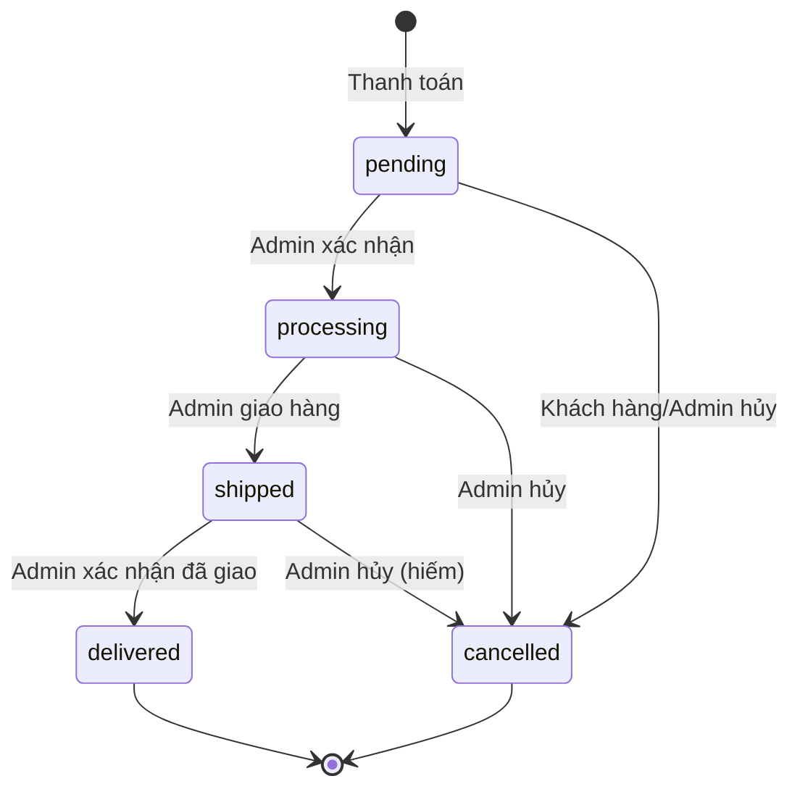

# 💼 Logic Nghiệp Vụ & Trường Hợp Sử Dụng

> **Mục đích**: Mô tả luồng nghiệp vụ, quy tắc kinh doanh, và use cases của hệ thống

## 📋 Mục lục
1. [Vai Trò Người Dùng](#vai-trò-người-dùng)
2. [Luồng Đặt Hàng Hoàn Chỉnh](#luồng-đặt-hàng-hoàn-chỉnh)
3. [Quy Tắc Nghiệp Vụ Quan Trọng](#quy-tắc-nghiệp-vụ-quan-trọng)
4. [Trường Hợp Sử Dụng Cốt Lõi](#trường-hợp-sử-dụng-cốt-lõi)
5. [Quản Lý Kho Hàng](#quản-lý-kho-hàng)
6. [Chuyển Đổi Trạng Thái](#chuyển-đổi-trạng-thái)

---

## 👥 Vai Trò Người Dùng

| Vai Trò | Quyền Hạn | Hạn Chế |
|---------|-----------|---------|
| **Khách** | Xem sản phẩm, tìm kiếm | Không thể mua hàng, không truy cập giỏ hàng |
| **Khách Hàng** | Xem sản phẩm, quản lý giỏ hàng, đặt hàng, xem đơn hàng của mình | Không truy cập tính năng admin |
| **Quản Lý** | Xem & chỉnh sửa sản phẩm/đơn hàng/kho, xem tất cả đơn hàng | Không thể xóa, không quản lý người dùng |
| **Admin** | Toàn quyền CRUD trên tất cả tài nguyên, quản lý người dùng, phân quyền | Không có |

---

## 🔄 Luồng Đặt Hàng Hoàn Chỉnh

### Sơ Đồ Tổng Quan

```
┌─────────────────────────────────────────────────────────────────┐
│  BƯỚC 1: Duyệt Sản Phẩm                                        │
│  - Xem danh sách sản phẩm                                      │
│  - Xem chi tiết sản phẩm                                       │
│  - Kiểm tra stock_quantity (CHƯA trừ kho)                      │
└────────────────────────────┬────────────────────────────────────┘
                             │
                             ▼
┌─────────────────────────────────────────────────────────────────┐
│  BƯỚC 2: Thêm Vào Giỏ Hàng                                     │
│  - Kiểm tra: Sản phẩm có tồn tại? Kho có đủ?                   │
│  - Tạo/Cập nhật CartItem                                       │
│  - ✅ KHÔNG trừ kho (chỉ lưu trong cart_items)                 │
└────────────────────────────┬────────────────────────────────────┘
                             │
                             ▼
┌─────────────────────────────────────────────────────────────────┐
│  BƯỚC 3: Xem & Chỉnh Sửa Giỏ Hàng                              │
│  - Xem sản phẩm trong giỏ với giá                              │
│  - Cập nhật số lượng                                           │
│  - Xóa sản phẩm                                                │
│  - ✅ Vẫn KHÔNG trừ kho                                        │
└────────────────────────────┬────────────────────────────────────┘
                             │
                             ▼
┌─────────────────────────────────────────────────────────────────┐
│  ⚠️ BƯỚC 4: THANH TOÁN (THỜI ĐIỂM QUAN TRỌNG) ⚠️                │
│                                                                  │
│  POST /api/orders (CustomerOrderController@checkout)            │
│                                                                  │
│  ┌────────────────────────────────────────┐                     │
│  │ TRỪ KHO NGAY LẬP TỨC                   │                     │
│  │                                        │                     │
│  │ DB::transaction(function() {           │                     │
│  │   foreach ($cartItems as $item) {      │                     │
│  │     // Trừ kho NGAY BÂY GIỜ            │                     │
│  │     $product->decrement('stock',       │                     │
│  │                        $item->qty);    │                     │
│  │                                        │                     │
│  │     // Tạo order items                 │                     │
│  │     OrderItem::create([...]);          │                     │
│  │   }                                    │                     │
│  │                                        │                     │
│  │   // Tạo đơn hàng với status=pending   │                     │
│  │   Order::create([...]);                │                     │
│  │                                        │                     │
│  │   // Xóa giỏ hàng                      │                     │
│  │   CartItem::where(...)->delete();      │                     │
│  │ });                                    │                     │
│  └────────────────────────────────────────┘                     │
│                                                                  │
│  ⚠️ Kho bị TRỪ ngay lập tức (ngay cả khi status=pending)        │
│  ⚠️ KHÔNG hoàn kho khi hủy đơn!                                 │
└────────────────────────────┬────────────────────────────────────┘
                             │
                             ▼
┌─────────────────────────────────────────────────────────────────┐
│  BƯỚC 5: Quản Lý Trạng Thái Đơn Hàng                           │
│                                                                  │
│  pending → processing → shipped → delivered                     │
│  Bất kỳ trạng thái → cancelled (⚠️ KHÔNG hoàn kho!)             │
└─────────────────────────────────────────────────────────────────┘
```

---

### Luồng Code Chi Tiết Từng Bước

#### 1️⃣ Duyệt Sản Phẩm (Không Cần Xác Thực)

**Endpoint**: `GET /api/products`

**Controller**: `CustomerProductController@index`

```php
public function index(Request $request)
{
    $query = Product::query();
    
    // Lọc theo danh mục
    if ($request->category_id) {
        $query->where('category_id', $request->category_id);
    }
    
    // Khoảng giá
    if ($request->min_price) {
        $query->where('price', '>=', $request->min_price);
    }
    
    // Tìm kiếm
    if ($request->search) {
        $query->where('name', 'like', "%{$request->search}%");
    }
    
    return ProductResource::collection($query->paginate());
}
```

**Điểm Chính**:
- ✅ Bất kỳ ai cũng có thể xem sản phẩm
- ✅ `stock_quantity` hiển thị để giúp khách hàng quyết định
- ✅ KHÔNG trừ kho

---

#### 2️⃣ Thêm Vào Giỏ Hàng (Cần Xác Thực)

**Endpoint**: `POST /api/cart/items`

**Controller**: `CustomerCartController@add`

```php
public function add(Request $request)
{
    $validated = $request->validate([
        'product_id' => 'required|exists:products,id',
        'quantity' => 'required|integer|min:1',
    ]);
    
    // 1. Lấy sản phẩm
    $product = Product::findOrFail($validated['product_id']);
    
    // 2. Kiểm tra số lượng tồn kho
    if ($product->stock_quantity < $validated['quantity']) {
        return response()->json([
            'status' => false,
            'message' => 'Không đủ hàng trong kho. Còn lại: ' . $product->stock_quantity,
        ], 400);
    }
    
    // 3. Lấy hoặc tạo giỏ hàng
    $cart = Cart::firstOrCreate([
        'user_id' => $request->user()->id,
    ]);
    
    // 4. Kiểm tra sản phẩm đã có trong giỏ chưa
    $cartItem = CartItem::where([
        'cart_id' => $cart->id,
        'product_id' => $product->id,
    ])->first();
    
    if ($cartItem) {
        // Cập nhật số lượng
        $newQuantity = $cartItem->quantity + $validated['quantity'];
        
        if ($newQuantity > $product->stock_quantity) {
            return response()->json([
                'status' => false,
                'message' => 'Tổng số lượng vượt quá tồn kho',
            ], 400);
        }
        
        $cartItem->update(['quantity' => $newQuantity]);
    } else {
        // Tạo item giỏ hàng mới
        $cartItem = CartItem::create([
            'cart_id' => $cart->id,
            'product_id' => $product->id,
            'quantity' => $validated['quantity'],
        ]);
    }
    
    return response()->json([
        'status' => true,
        'message' => 'Đã thêm sản phẩm vào giỏ hàng',
        'cart' => new CartResource($cart->load('items.product')),
    ]);
}
```

**Điểm Chính**:
- ✅ Kiểm tra kho trước khi thêm
- ✅ Ngăn thêm quá số lượng có sẵn
- ✅ Nhưng vẫn KHÔNG thực sự trừ kho

---

#### 3️⃣ Xem Giỏ Hàng

**Endpoint**: `GET /api/cart`

```php
public function index(Request $request)
{
    $cart = Cart::with('items.product')
                ->where('user_id', $request->user()->id)
                ->first();
    
    if (!$cart) {
        return response()->json([
            'status' => true,
            'cart' => null,
            'items' => [],
            'total' => 0,
        ]);
    }
    
    return new CartResource($cart);
}
```

**Phản Hồi**:
```json
{
  "id": 1,
  "user_id": 1,
  "items": [
    {
      "id": 1,
      "product_id": 5,
      "product_name": "iPhone 15 Pro",
      "price": 29990000,
      "quantity": 2,
      "subtotal": 59980000
    }
  ],
  "total": 59980000
}
```

---

#### 4️⃣ **THANH TOÁN - THỜI ĐIỂM QUAN TRỌNG** ⚠️

**Endpoint**: `POST /api/orders`

**Controller**: `CustomerOrderController@checkout`

```php
public function checkout(Request $request)
{
    $validated = $request->validate([
        'shipping_address' => 'required|string|max:500',
        'payment_method' => 'required|in:COD,Bank Transfer',
        'note' => 'nullable|string|max:1000',
    ]);
    
    // 1. Lấy giỏ hàng với items
    $cart = Cart::with('items.product')
                ->where('user_id', $request->user()->id)
                ->first();
    
    if (!$cart || $cart->items->isEmpty()) {
        return response()->json([
            'status' => false,
            'message' => 'Giỏ hàng trống',
        ], 400);
    }
    
    // 2. Tính tổng tiền
    $totalAmount = 0;
    foreach ($cart->items as $item) {
        $totalAmount += $item->product->price * $item->quantity;
    }
    
    // 3. GIAO DỊCH CƠ SỞ DỮ LIỆU - PHẦN QUAN TRỌNG
    DB::transaction(function () use ($cart, $validated, $totalAmount, $request) {
        
        // 3.1. Tạo đơn hàng
        $order = Order::create([
            'user_id' => $request->user()->id,
            'order_number' => 'ORD-' . date('Ymd') . '-' . str_pad(Order::count() + 1, 4, '0', STR_PAD_LEFT),
            'total_amount' => $totalAmount,
            'status' => 'pending', // Trạng thái ban đầu
            'shipping_address' => $validated['shipping_address'],
            'payment_method' => $validated['payment_method'],
            'note' => $validated['note'] ?? null,
        ]);
        
        // 3.2. Tạo order items + TRỪ KHO NGAY LẬP TỨC
        foreach ($cart->items as $cartItem) {
            $product = $cartItem->product;
            
            // ⚠️ QUAN TRỌNG: Kiểm tra kho lại lần nữa (bảo vệ race condition)
            if ($product->stock_quantity < $cartItem->quantity) {
                throw new \Exception("Sản phẩm {$product->name} đã hết hàng");
            }
            
            // ⚠️ TRỪ KHO NGAY BÂY GIỜ (ngay cả khi status=pending)
            $product->decrement('stock_quantity', $cartItem->quantity);
            
            // Tạo order item
            OrderItem::create([
                'order_id' => $order->id,
                'product_id' => $product->id,
                'quantity' => $cartItem->quantity,
                'price' => $product->price,
            ]);
        }
        
        // 3.3. Xóa giỏ hàng
        CartItem::where('cart_id', $cart->id)->delete();
    });
    
    return response()->json([
        'status' => true,
        'message' => 'Đặt hàng thành công',
        'order' => new OrderResource($order),
    ], 201);
}
```

**⚠️ QUY TẮC NGHIỆP VỤ QUAN TRỌNG**:

1. **Kho được trừ NGAY LẬP TỨC** khi tạo đơn hàng (ngay cả khi `status=pending`)
2. **Transaction đảm bảo tính nguyên tử** - hoặc tất cả thành công hoặc tất cả thất bại
3. **Bảo vệ race condition** - kiểm tra lại kho bên trong transaction
4. **Giỏ hàng được xóa** sau khi thanh toán thành công
5. **KHÔNG tự động hoàn kho** nếu đơn hàng bị hủy

---

#### 5️⃣ Quản Lý Trạng Thái Đơn Hàng

**Endpoint**: `PUT /api/orders/{id}/status`

**Controller**: `DashboardOrderController@updateStatus`

```php
public function updateStatus(Request $request, $id)
{
    $order = Order::findOrFail($id);
    
    $validated = $request->validate([
        'status' => 'required|in:pending,processing,shipped,delivered,cancelled',
    ]);
    
    // Kiểm tra chuyển đổi trạng thái hợp lệ
    $allowedTransitions = [
        'pending' => ['processing', 'cancelled'],
        'processing' => ['shipped', 'cancelled'],
        'shipped' => ['delivered', 'cancelled'],
        'delivered' => [],
        'cancelled' => [],
    ];
    
    $currentStatus = $order->status;
    $newStatus = $validated['status'];
    
    if (!in_array($newStatus, $allowedTransitions[$currentStatus])) {
        return response()->json([
            'status' => false,
            'message' => "Không thể chuyển từ {$currentStatus} sang {$newStatus}",
        ], 400);
    }
    
    // ⚠️ QUAN TRỌNG: KHÔNG hoàn kho khi hủy đơn
    if ($newStatus === 'cancelled') {
        // Kho đã bị trừ trong quá trình thanh toán
        // Admin phải điều chỉnh kho thủ công nếu cần
    }
    
    $order->update(['status' => $newStatus]);
    
    return response()->json([
        'status' => true,
        'message' => 'Cập nhật trạng thái đơn hàng thành công',
        'order' => new OrderResource($order),
    ]);
}
```

---

## ⚠️ Quy Tắc Nghiệp Vụ Quan Trọng

### 1. Chính Sách Trừ Kho

| Sự Kiện | Tác Động Kho | Ghi Chú |
|---------|--------------|---------|
| **Thêm vào giỏ** | ❌ KHÔNG trừ | Chỉ kiểm tra |
| **Cập nhật giỏ** | ❌ KHÔNG trừ | Chỉ kiểm tra |
| **Thanh toán** | ✅ **TRỪ NGAY LẬP TỨC** | Ngay cả khi status=pending |
| **Hủy đơn hàng** | ❌ KHÔNG hoàn kho | Admin phải điều chỉnh thủ công |
| **Xóa đơn hàng** | ❌ KHÔNG hoàn kho | Admin phải điều chỉnh thủ công |

**⚠️ TẠI SAO thiết kế như vậy?**
- Ngăn ngừa bán quá số lượng (kho được cam kết khi đặt hàng)
- Đơn giản hóa logic giao dịch
- Chấp nhận trade-off: Quản lý kho thủ công cho việc hủy đơn

---

### 2. Quy Tắc Sở Hữu Đơn Hàng

```php
// Khách hàng chỉ có thể xem đơn hàng của mình
if (!$user->isAdmin() && !$user->isManager()) {
    $query->where('user_id', $user->id);
}

// Khách hàng chỉ có thể hủy đơn hàng pending của mình
if ($order->user_id !== $user->id && !$user->isAdmin()) {
    abort(403);
}
```

---

### 3. Quy Tắc Chuyển Đổi Trạng Thái



**Chuyển Đổi Được Phép**:
- `pending` → `processing`, `cancelled`
- `processing` → `shipped`, `cancelled`
- `shipped` → `delivered`, `cancelled`
- `delivered` → (trạng thái cuối)
- `cancelled` → (trạng thái cuối)

---

### 4. Khóa Giá

```php
// Order items lưu giá tại thời điểm thanh toán
OrderItem::create([
    'product_id' => $product->id,
    'price' => $product->price, // ✅ Giá được khóa
    'quantity' => $item->quantity,
]);
```

**Tại sao?**
- Bảo vệ khách hàng khỏi tăng giá sau khi đặt hàng
- Bảo vệ doanh nghiệp khỏi giảm giá sau khi đặt hàng
- Độ chính xác lịch sử cho báo cáo

---

## 📖 Trường Hợp Sử Dụng Cốt Lõi

### UC-01: Khách Duyệt Sản Phẩm

**Tác Nhân**: Khách (người dùng chưa xác thực)

**Điều Kiện Tiên Quyết**: Không có

**Luồng**:
1. Người dùng điều hướng đến `/products`
2. Hệ thống hiển thị danh sách sản phẩm với:
   - Tên, giá, hình ảnh
   - Trạng thái kho (Còn hàng / Hết hàng)
   - Danh mục
3. Người dùng có thể lọc theo danh mục, khoảng giá
4. Người dùng có thể tìm kiếm theo tên
5. Người dùng nhấp sản phẩm → xem chi tiết

**Hậu Điều Kiện**: 
- Người dùng thấy sản phẩm
- KHÔNG có dữ liệu thay đổi

---

### UC-02: Khách Hàng Thêm Vào Giỏ Hàng

**Tác Nhân**: Khách hàng (đã xác thực)

**Điều Kiện Tiên Quyết**: 
- Người dùng đã đăng nhập
- Sản phẩm có kho > 0

**Luồng**:
1. Khách hàng xem chi tiết sản phẩm
2. Khách hàng nhập số lượng
3. Khách hàng nhấp "Thêm Vào Giỏ"
4. Hệ thống kiểm tra:
   - Số lượng <= stock_quantity
   - Số lượng > 0
5. Hệ thống tạo/cập nhật CartItem
6. Hệ thống hiển thị thông báo thành công

**Hậu Điều Kiện**:
- CartItem được tạo/cập nhật
- KHÔNG trừ kho

**Luồng Thay Thế**:
- Nếu số lượng > kho → hiển thị lỗi
- Nếu sản phẩm đã có trong giỏ → cập nhật số lượng

---

### UC-03: Khách Hàng Thanh Toán

**Tác Nhân**: Khách hàng

**Điều Kiện Tiên Quyết**:
- Người dùng đã đăng nhập
- Giỏ hàng có sản phẩm
- Tất cả sản phẩm có đủ kho

**Luồng**:
1. Khách hàng xem giỏ hàng
2. Khách hàng nhấp "Thanh Toán"
3. Khách hàng nhập:
   - Địa chỉ giao hàng
   - Phương thức thanh toán
   - Ghi chú (tùy chọn)
4. Hệ thống kiểm tra kho (kiểm tra lại)
5. **Hệ thống trừ kho ngay lập tức**
6. Hệ thống tạo Order (status=pending)
7. Hệ thống tạo OrderItems
8. Hệ thống xóa giỏ hàng
9. Hệ thống hiển thị xác nhận đơn hàng

**Hậu Điều Kiện**:
- Đơn hàng được tạo
- **Kho bị trừ**
- Giỏ hàng được xóa

**Luồng Thay Thế**:
- Nếu kho không đủ → rollback transaction, hiển thị lỗi
- Nếu validation thất bại → hiển thị lỗi, giỏ hàng không thay đổi

---

### UC-04: Quản Lý Cập Nhật Trạng Thái Đơn Hàng

**Tác Nhân**: Quản lý/Admin

**Điều Kiện Tiên Quyết**:
- Người dùng có vai trò manager/admin
- Đơn hàng tồn tại

**Luồng**:
1. Quản lý xem danh sách đơn hàng
2. Quản lý nhấp đơn hàng
3. Quản lý thay đổi trạng thái
4. Hệ thống kiểm tra chuyển đổi hợp lệ
5. Hệ thống cập nhật trạng thái đơn hàng

**Hậu Điều Kiện**:
- Trạng thái đơn hàng được cập nhật

**Luồng Thay Thế**:
- Nếu chuyển đổi không hợp lệ → hiển thị lỗi

---

### UC-05: Admin Điều Chỉnh Kho

**Tác Nhân**: Admin/Quản lý

**Điều Kiện Tiên Quyết**:
- Người dùng có vai trò admin/manager

**Luồng**:
1. Admin xem dashboard kho
2. Admin thấy cảnh báo kho thấp
3. Admin nhấp "Điều Chỉnh Kho"
4. Admin nhập:
   - Sản phẩm
   - Số lượng (dương/âm)
   - Loại (nhập kho/hư hỏng/điều chỉnh)
   - Ghi chú
5. Hệ thống tạo InventoryAdjustment
6. Hệ thống cập nhật stock_quantity của sản phẩm

**Hậu Điều Kiện**:
- Kho được điều chỉnh
- Điều chỉnh được ghi log

---

## 📊 Quản Lý Kho Hàng

### Trạng Thái Kho

```php
// Product Model
class Product extends Model
{
    // Có sẵn để mua
    public function isInStock(): bool
    {
        return $this->stock_quantity > 0;
    }
    
    // Cảnh báo kho thấp
    public function isLowStock(int $threshold = 10): bool
    {
        return $this->stock_quantity <= $threshold;
    }
}
```

### Loại Điều Chỉnh Kho

| Loại | Mô Tả | Ví Dụ |
|------|-------|-------|
| **restock** | Thêm kho mới | Nhận hàng: +100 |
| **damage** | Loại bỏ hàng hư | Hàng bị hỏng: -5 |
| **adjustment** | Điều chỉnh thủ công | Kiểm kê phát hiện sai sót: +10 |
| **return** | Khách hàng trả hàng | Trả về kho: +2 |

### Endpoint Điều Chỉnh

```http
POST /api/inventory/adjust
Authorization: Bearer {admin/manager-token}

{
  "product_id": 5,
  "quantity": 100,
  "type": "restock",
  "note": "Lô hàng mới từ nhà cung cấp"
}
```

---

## 🔄 Chuyển Đổi Trạng Thái

### Luồng Trạng Thái Đơn Hàng

```php
// Trạng thái tiếp theo được phép
$transitions = [
    'pending' => ['processing', 'cancelled'],
    'processing' => ['shipped', 'cancelled'],
    'shipped' => ['delivered', 'cancelled'],
    'delivered' => [],
    'cancelled' => [],
];
```

### Ý Nghĩa Trạng Thái

| Trạng Thái | Mô Tả | Ai có thể đặt |
|------------|-------|---------------|
| **pending** | Đơn hàng đã đặt, chờ xác nhận | Hệ thống (khi thanh toán) |
| **processing** | Đơn hàng đã xác nhận, đang chuẩn bị | Admin/Quản lý |
| **shipped** | Đơn hàng đã giao cho khách | Admin/Quản lý |
| **delivered** | Đơn hàng đã nhận bởi khách | Admin/Quản lý |
| **cancelled** | Đơn hàng bị hủy | Khách hàng (nếu pending), Admin/Quản lý (bất kỳ lúc nào) |

---

## 📚 Tài liệu liên quan

- **[API_REFERENCE.md](./API_REFERENCE.md)** - API endpoints
- **[AUTHENTICATION.md](./AUTHENTICATION.md)** - Auth & authorization
- **[ARCHITECTURE.md](./ARCHITECTURE.md)** - System architecture
- **[DATABASE.md](./DATABASE.md)** - Database schema

---

**Cập nhật lần cuối**: 19/10/2025  
**Version**: 2.0  
**Author**: Hoàng Quang Vinh
