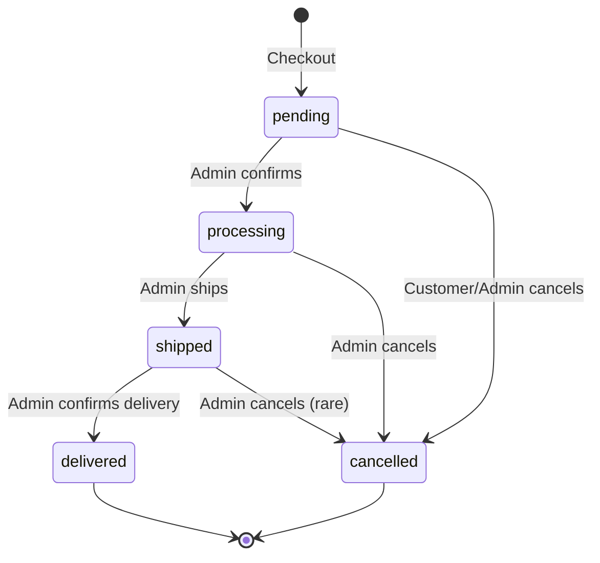

# 💼 Business Logic & Use Cases

> **Mục đích**: Mô tả luồng nghiệp vụ, quy tắc kinh doanh, và use cases của hệ thống

## 📋 Mục lục
1. [User Roles](#user-roles)
2. [Complete Order Flow](#complete-order-flow)
3. [Critical Business Rules](#critical-business-rules)
4. [Core Use Cases](#core-use-cases)
5. [Inventory Management](#inventory-management)
6. [Status Transitions](#status-transitions)

---

## 👥 User Roles

| Role | Permissions | Restrictions |
|------|-------------|--------------|
| **Guest** | View products, search | Cannot buy, no cart access |
| **Customer** | View products, manage cart, place orders, view own orders | Cannot access admin features |
| **Manager** | View & edit products/orders/inventory, view all orders | Cannot delete, cannot manage users |
| **Admin** | Full CRUD on all resources, user management, role assignment | None |

---

## 🔄 Complete Order Flow

### Overview Diagram

```
┌─────────────────────────────────────────────────────────────────┐
│  STEP 1: Browse Products                                        │
│  - View product list                                            │
│  - View product details                                         │
│  - Check stock_quantity (NO stock deduction yet)                │
└────────────────────────────┬────────────────────────────────────┘
                             │
                             ▼
┌─────────────────────────────────────────────────────────────────┐
│  STEP 2: Add to Cart                                            │
│  - Validate: Product exists? Stock available?                   │
│  - Create/Update CartItem                                       │
│  - ✅ NO stock deduction (just saved in cart_items)             │
└────────────────────────────┬────────────────────────────────────┘
                             │
                             ▼
┌─────────────────────────────────────────────────────────────────┐
│  STEP 3: View & Modify Cart                                     │
│  - View cart items with prices                                  │
│  - Update quantities                                            │
│  - Remove items                                                 │
│  - ✅ Still NO stock deduction                                  │
└────────────────────────────┬────────────────────────────────────┘
                             │
                             ▼
┌─────────────────────────────────────────────────────────────────┐
│  ⚠️ STEP 4: CHECKOUT (CRITICAL MOMENT) ⚠️                       │
│                                                                  │
│  POST /api/orders (CustomerOrderController@checkout)            │
│                                                                  │
│  ┌────────────────────────────────────────┐                     │
│  │ IMMEDIATE STOCK DEDUCTION               │                     │
│  │                                        │                     │
│  │ DB::transaction(function() {           │                     │
│  │   foreach ($cartItems as $item) {      │                     │
│  │     // Deduct stock RIGHT NOW          │                     │
│  │     $product->decrement('stock',       │                     │
│  │                        $item->qty);    │                     │
│  │                                        │                     │
│  │     // Create order items              │                     │
│  │     OrderItem::create([...]);          │                     │
│  │   }                                    │                     │
│  │                                        │                     │
│  │   // Create order with status=pending  │                     │
│  │   Order::create([...]);                │                     │
│  │                                        │                     │
│  │   // Clear cart                        │                     │
│  │   CartItem::where(...)->delete();      │                     │
│  │ });                                    │                     │
│  └────────────────────────────────────────┘                     │
│                                                                  │
│  ⚠️ Stock is GONE immediately (even when status=pending)        │
│  ⚠️ NO rollback on cancellation!                                │
└────────────────────────────┬────────────────────────────────────┘
                             │
                             ▼
┌─────────────────────────────────────────────────────────────────┐
│  STEP 5: Order Status Management                                │
│                                                                  │
│  pending → processing → shipped → delivered                     │
│  Any status → cancelled (⚠️ NO stock restoration!)              │
└─────────────────────────────────────────────────────────────────┘
```

---

### Step-by-Step Code Flow

#### 1️⃣ Browse Products (No Auth Required)

**Endpoint**: `GET /api/products`

**Controller**: `CustomerProductController@index`

```php
public function index(Request $request)
{
    $query = Product::query();
    
    // Filter by category
    if ($request->category_id) {
        $query->where('category_id', $request->category_id);
    }
    
    // Price range
    if ($request->min_price) {
        $query->where('price', '>=', $request->min_price);
    }
    
    // Search
    if ($request->search) {
        $query->where('name', 'like', "%{$request->search}%");
    }
    
    return ProductResource::collection($query->paginate());
}
```

**Key Points**:
- ✅ Anyone can view products
- ✅ `stock_quantity` visible to help customer decide
- ✅ NO stock deduction

---

#### 2️⃣ Add to Cart (Auth Required)

**Endpoint**: `POST /api/cart/items`

**Controller**: `CustomerCartController@add`

```php
public function add(Request $request)
{
    $validated = $request->validate([
        'product_id' => 'required|exists:products,id',
        'quantity' => 'required|integer|min:1',
    ]);
    
    // 1. Get product
    $product = Product::findOrFail($validated['product_id']);
    
    // 2. Check stock availability
    if ($product->stock_quantity < $validated['quantity']) {
        return response()->json([
            'status' => false,
            'message' => 'Insufficient stock. Available: ' . $product->stock_quantity,
        ], 400);
    }
    
    // 3. Get or create cart
    $cart = Cart::firstOrCreate([
        'user_id' => $request->user()->id,
    ]);
    
    // 4. Check if product already in cart
    $cartItem = CartItem::where([
        'cart_id' => $cart->id,
        'product_id' => $product->id,
    ])->first();
    
    if ($cartItem) {
        // Update quantity
        $newQuantity = $cartItem->quantity + $validated['quantity'];
        
        if ($newQuantity > $product->stock_quantity) {
            return response()->json([
                'status' => false,
                'message' => 'Total quantity exceeds stock',
            ], 400);
        }
        
        $cartItem->update(['quantity' => $newQuantity]);
    } else {
        // Create new cart item
        $cartItem = CartItem::create([
            'cart_id' => $cart->id,
            'product_id' => $product->id,
            'quantity' => $validated['quantity'],
        ]);
    }
    
    return response()->json([
        'status' => true,
        'message' => 'Product added to cart',
        'cart' => new CartResource($cart->load('items.product')),
    ]);
}
```

**Key Points**:
- ✅ Validates stock before adding
- ✅ Prevents adding more than available
- ✅ But still NO actual stock deduction

---

#### 3️⃣ View Cart

**Endpoint**: `GET /api/cart`

```php
public function index(Request $request)
{
    $cart = Cart::with('items.product')
                ->where('user_id', $request->user()->id)
                ->first();
    
    if (!$cart) {
        return response()->json([
            'status' => true,
            'cart' => null,
            'items' => [],
            'total' => 0,
        ]);
    }
    
    return new CartResource($cart);
}
```

**Response**:
```json
{
  "id": 1,
  "user_id": 1,
  "items": [
    {
      "id": 1,
      "product_id": 5,
      "product_name": "iPhone 15 Pro",
      "price": 29990000,
      "quantity": 2,
      "subtotal": 59980000
    }
  ],
  "total": 59980000
}
```

---

#### 4️⃣ **CHECKOUT - CRITICAL MOMENT** ⚠️

**Endpoint**: `POST /api/orders`

**Controller**: `CustomerOrderController@checkout`

```php
public function checkout(Request $request)
{
    $validated = $request->validate([
        'shipping_address' => 'required|string|max:500',
        'payment_method' => 'required|in:COD,Bank Transfer',
        'note' => 'nullable|string|max:1000',
    ]);
    
    // 1. Get cart with items
    $cart = Cart::with('items.product')
                ->where('user_id', $request->user()->id)
                ->first();
    
    if (!$cart || $cart->items->isEmpty()) {
        return response()->json([
            'status' => false,
            'message' => 'Cart is empty',
        ], 400);
    }
    
    // 2. Calculate total
    $totalAmount = 0;
    foreach ($cart->items as $item) {
        $totalAmount += $item->product->price * $item->quantity;
    }
    
    // 3. DATABASE TRANSACTION - CRITICAL SECTION
    DB::transaction(function () use ($cart, $validated, $totalAmount, $request) {
        
        // 3.1. Create order
        $order = Order::create([
            'user_id' => $request->user()->id,
            'order_number' => 'ORD-' . date('Ymd') . '-' . str_pad(Order::count() + 1, 4, '0', STR_PAD_LEFT),
            'total_amount' => $totalAmount,
            'status' => 'pending', // Initial status
            'shipping_address' => $validated['shipping_address'],
            'payment_method' => $validated['payment_method'],
            'note' => $validated['note'] ?? null,
        ]);
        
        // 3.2. Create order items + DEDUCT STOCK IMMEDIATELY
        foreach ($cart->items as $cartItem) {
            $product = $cartItem->product;
            
            // ⚠️ CRITICAL: Check stock again (race condition protection)
            if ($product->stock_quantity < $cartItem->quantity) {
                throw new \Exception("Product {$product->name} is out of stock");
            }
            
            // ⚠️ DEDUCT STOCK RIGHT NOW (even when status=pending)
            $product->decrement('stock_quantity', $cartItem->quantity);
            
            // Create order item
            OrderItem::create([
                'order_id' => $order->id,
                'product_id' => $product->id,
                'quantity' => $cartItem->quantity,
                'price' => $product->price,
            ]);
        }
        
        // 3.3. Clear cart
        CartItem::where('cart_id', $cart->id)->delete();
    });
    
    return response()->json([
        'status' => true,
        'message' => 'Order placed successfully',
        'order' => new OrderResource($order),
    ], 201);
}
```

**⚠️ CRITICAL BUSINESS RULES**:

1. **Stock deducted IMMEDIATELY** when order is created (even if `status=pending`)
2. **Transaction ensures atomicity** - either all items succeed or all fail
3. **Race condition protection** - re-check stock inside transaction
4. **Cart cleared** after successful checkout
5. **NO automatic stock restoration** if order is cancelled

---

#### 5️⃣ Order Status Management

**Endpoint**: `PUT /api/orders/{id}/status`

**Controller**: `DashboardOrderController@updateStatus`

```php
public function updateStatus(Request $request, $id)
{
    $order = Order::findOrFail($id);
    
    $validated = $request->validate([
        'status' => 'required|in:pending,processing,shipped,delivered,cancelled',
    ]);
    
    // Validate status transitions
    $allowedTransitions = [
        'pending' => ['processing', 'cancelled'],
        'processing' => ['shipped', 'cancelled'],
        'shipped' => ['delivered', 'cancelled'],
        'delivered' => [],
        'cancelled' => [],
    ];
    
    $currentStatus = $order->status;
    $newStatus = $validated['status'];
    
    if (!in_array($newStatus, $allowedTransitions[$currentStatus])) {
        return response()->json([
            'status' => false,
            'message' => "Cannot transition from {$currentStatus} to {$newStatus}",
        ], 400);
    }
    
    // ⚠️ IMPORTANT: NO stock restoration on cancellation
    if ($newStatus === 'cancelled') {
        // Stock was already deducted during checkout
        // Admin must manually adjust inventory if needed
    }
    
    $order->update(['status' => $newStatus]);
    
    return response()->json([
        'status' => true,
        'message' => 'Order status updated',
        'order' => new OrderResource($order),
    ]);
}
```

---

## ⚠️ Critical Business Rules

### 1. Stock Deduction Policy

| Event | Stock Impact | Notes |
|-------|--------------|-------|
| **Add to cart** | ❌ NO deduction | Only validation |
| **Update cart** | ❌ NO deduction | Only validation |
| **Checkout** | ✅ **IMMEDIATE deduction** | Even if status=pending |
| **Cancel order** | ❌ NO restoration | Admin must manually adjust |
| **Delete order** | ❌ NO restoration | Admin must manually adjust |

**⚠️ WHY this design?**
- Prevents overselling (stock is committed when order is placed)
- Simplifies transaction logic
- Accepts trade-off: Manual inventory management for cancellations

---

### 2. Order Ownership Rules

```php
// Customer can only view their own orders
if (!$user->isAdmin() && !$user->isManager()) {
    $query->where('user_id', $user->id);
}

// Customer can only cancel their own pending orders
if ($order->user_id !== $user->id && !$user->isAdmin()) {
    abort(403);
}
```

---

### 3. Status Transition Rules



**Allowed Transitions**:
- `pending` → `processing`, `cancelled`
- `processing` → `shipped`, `cancelled`
- `shipped` → `delivered`, `cancelled`
- `delivered` → (final state)
- `cancelled` → (final state)

---

### 4. Price Locking

```php
// Order items store price at checkout time
OrderItem::create([
    'product_id' => $product->id,
    'price' => $product->price, // ✅ Locked price
    'quantity' => $item->quantity,
]);
```

**Why?**
- Protects customer from price increases after order
- Protects business from price decreases after order
- Historical accuracy for reporting

---

## 📖 Core Use Cases

### UC-01: Guest Browse Products

**Actor**: Guest (unauthenticated user)

**Preconditions**: None

**Flow**:
1. User navigates to `/products`
2. System displays product list with:
   - Name, price, image
   - Stock status (In Stock / Out of Stock)
   - Category
3. User can filter by category, price range
4. User can search by name
5. User clicks product → view details

**Postconditions**: 
- User sees products
- NO data changed

---

### UC-02: Customer Add to Cart

**Actor**: Customer (authenticated)

**Preconditions**: 
- User logged in
- Product has stock > 0

**Flow**:
1. Customer views product details
2. Customer enters quantity
3. Customer clicks "Add to Cart"
4. System validates:
   - Quantity <= stock_quantity
   - Quantity > 0
5. System creates/updates CartItem
6. System displays success message

**Postconditions**:
- CartItem created/updated
- NO stock deduction

**Alternative Flow**:
- If quantity > stock → show error
- If product already in cart → update quantity

---

### UC-03: Customer Checkout

**Actor**: Customer

**Preconditions**:
- User logged in
- Cart has items
- All items have sufficient stock

**Flow**:
1. Customer views cart
2. Customer clicks "Checkout"
3. Customer enters:
   - Shipping address
   - Payment method
   - Note (optional)
4. System validates stock (double-check)
5. **System immediately deducts stock**
6. System creates Order (status=pending)
7. System creates OrderItems
8. System clears cart
9. System displays order confirmation

**Postconditions**:
- Order created
- **Stock deducted**
- Cart cleared

**Alternative Flow**:
- If stock insufficient → rollback transaction, show error
- If validation fails → show error, cart unchanged

---

### UC-04: Manager Update Order Status

**Actor**: Manager/Admin

**Preconditions**:
- User has manager/admin role
- Order exists

**Flow**:
1. Manager views order list
2. Manager clicks order
3. Manager changes status
4. System validates transition
5. System updates order status

**Postconditions**:
- Order status updated

**Alternative Flow**:
- If invalid transition → show error

---

### UC-05: Admin Adjust Inventory

**Actor**: Admin/Manager

**Preconditions**:
- User has admin/manager role

**Flow**:
1. Admin views inventory dashboard
2. Admin sees low stock warning
3. Admin clicks "Adjust Inventory"
4. Admin enters:
   - Product
   - Quantity (positive/negative)
   - Type (restock/damage/adjustment)
   - Note
5. System creates InventoryAdjustment
6. System updates product stock_quantity

**Postconditions**:
- Stock adjusted
- Adjustment logged

---

## 📊 Inventory Management

### Stock States

```php
// Product Model
class Product extends Model
{
    // Available for purchase
    public function isInStock(): bool
    {
        return $this->stock_quantity > 0;
    }
    
    // Low stock warning
    public function isLowStock(int $threshold = 10): bool
    {
        return $this->stock_quantity <= $threshold;
    }
}
```

### Inventory Adjustment Types

| Type | Description | Example |
|------|-------------|---------|
| **restock** | Add new stock | Received shipment: +100 |
| **damage** | Remove damaged items | Broken items: -5 |
| **adjustment** | Manual correction | Stock audit found error: +10 |
| **return** | Customer return | Return to stock: +2 |

### Adjustment Endpoint

```http
POST /api/inventory/adjust
Authorization: Bearer {admin/manager-token}

{
  "product_id": 5,
  "quantity": 100,
  "type": "restock",
  "note": "New shipment from supplier"
}
```

---

## 🔄 Status Transitions

### Order Status Workflow

```php
// Allowed next states
$transitions = [
    'pending' => ['processing', 'cancelled'],
    'processing' => ['shipped', 'cancelled'],
    'shipped' => ['delivered', 'cancelled'],
    'delivered' => [],
    'cancelled' => [],
];
```

### Status Meanings

| Status | Description | Who can set |
|--------|-------------|-------------|
| **pending** | Order placed, awaiting confirmation | System (on checkout) |
| **processing** | Order confirmed, being prepared | Admin/Manager |
| **shipped** | Order shipped to customer | Admin/Manager |
| **delivered** | Order received by customer | Admin/Manager |
| **cancelled** | Order cancelled | Customer (if pending), Admin/Manager (any time) |

---

## 📚 Tài liệu liên quan

- **[API_REFERENCE.md](./API_REFERENCE.md)** - API endpoints
- **[AUTHENTICATION.md](./AUTHENTICATION.md)** - Auth & authorization
- **[ARCHITECTURE.md](./ARCHITECTURE.md)** - System architecture
- **[DATABASE.md](./DATABASE.md)** - Database schema

---

**Cập nhật lần cuối**: 19/10/2025  
**Version**: 2.0  
**Author**: Hoàng Quang Vinh
