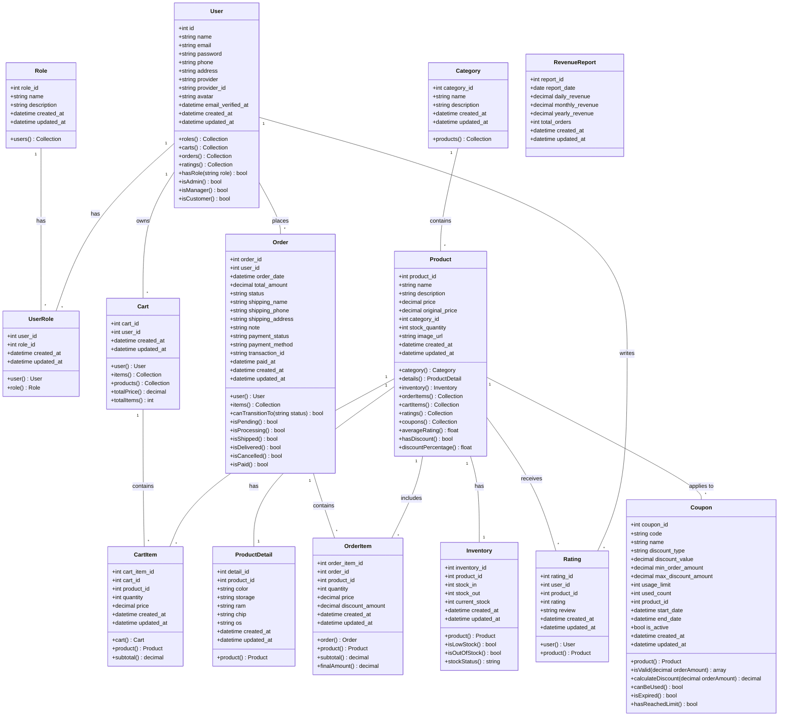

# BIỂU ĐỒ LỚP (CLASS DIAGRAM) - WEBSHOP PROJECT

## Mục lục
1. [Tổng quan](#tổng-quan)
2. [Biểu đồ lớp chính](#biểu-đồ-lớp-chính)
3. [Mô tả chi tiết các lớp](#mô-tả-chi-tiết-các-lớp)
4. [Quan hệ giữa các lớp](#quan-hệ-giữa-các-lớp)
5. [Biểu đồ Controllers](#biểu-đồ-controllers)
6. [Biểu đồ Services](#biểu-đồ-services)

---

## Tổng quan

Hệ thống webshop được thiết kế theo kiến trúc MVC (Model-View-Controller) kết hợp với Service Layer Pattern. Dưới đây là biểu đồ lớp chi tiết của toàn bộ hệ thống.

### Các layer chính:
- **Models**: Đại diện cho cấu trúc dữ liệu và business logic
- **Controllers**: Xử lý HTTP requests và responses
- **Services**: Chứa business logic phức tạp
- **Resources**: Format dữ liệu trả về cho API

---

## Biểu đồ lớp chính

### 1. Model Layer



---

## Mô tả chi tiết các lớp

### 1. User (Người dùng)

**Mô tả**: Đại diện cho người dùng trong hệ thống

**Thuộc tính**:
- `id`: ID duy nhất của người dùng
- `name`: Tên người dùng
- `email`: Email (unique)
- `password`: Mật khẩu đã mã hóa
- `phone`: Số điện thoại
- `address`: Địa chỉ
- `provider`: Nhà cung cấp OAuth (google, facebook, github)
- `provider_id`: ID từ provider
- `avatar`: URL ảnh đại diện

**Phương thức chính**:
- `hasRole(string $role)`: Kiểm tra người dùng có vai trò cụ thể
- `isAdmin()`: Kiểm tra có phải admin
- `isManager()`: Kiểm tra có phải manager
- `isCustomer()`: Kiểm tra có phải customer

**Quan hệ**:
- Has Many: `carts`, `orders`, `ratings`
- Many-to-Many: `roles` (qua `user_roles`)

---

### 2. Product (Sản phẩm)

**Mô tả**: Đại diện cho sản phẩm trong cửa hàng

**Thuộc tính**:
- `product_id`: ID sản phẩm (Primary Key)
- `name`: Tên sản phẩm
- `description`: Mô tả chi tiết
- `price`: Giá hiện tại
- `original_price`: Giá gốc
- `category_id`: ID danh mục
- `stock_quantity`: Số lượng tồn kho
- `image_url`: URL hình ảnh

**Phương thức chính**:
- `hasDiscount()`: Kiểm tra có giảm giá
- `discountPercentage()`: Tính % giảm giá
- `averageRating()`: Tính điểm đánh giá trung bình

**Quan hệ**:
- Belongs To: `category`
- Has One: `details`, `inventory`
- Has Many: `orderItems`, `cartItems`, `ratings`, `coupons`

---

### 3. Order (Đơn hàng)

**Mô tả**: Đại diện cho đơn hàng của khách hàng

**Thuộc tính**:
- `order_id`: ID đơn hàng
- `user_id`: ID người đặt
- `total_amount`: Tổng tiền
- `status`: Trạng thái (pending, processing, shipped, delivered, cancelled)
- `payment_status`: Trạng thái thanh toán
- `payment_method`: Phương thức thanh toán
- `transaction_id`: Mã giao dịch

**Trạng thái hợp lệ**:
```
pending → processing → shipped → delivered
   ↓           ↓
cancelled  cancelled
```

**Phương thức chính**:
- `canTransitionTo(string $status)`: Kiểm tra có thể chuyển trạng thái
- `isPending()`, `isProcessing()`, etc.: Kiểm tra trạng thái
- `isPaid()`: Kiểm tra đã thanh toán

**Quan hệ**:
- Belongs To: `user`
- Has Many: `items` (OrderItem)

---

### 4. Cart (Giỏ hàng)

**Mô tả**: Giỏ hàng của người dùng

**Thuộc tính**:
- `cart_id`: ID giỏ hàng
- `user_id`: ID người dùng

**Phương thức chính**:
- `totalPrice()`: Tính tổng giá trị giỏ hàng
- `totalItems()`: Đếm tổng số sản phẩm

**Quan hệ**:
- Belongs To: `user`
- Has Many: `items` (CartItem)
- Many-to-Many: `products` (qua `cart_items`)

---

### 5. Coupon (Mã giảm giá)

**Mô tả**: Mã giảm giá áp dụng cho đơn hàng

**Thuộc tính**:
- `code`: Mã giảm giá (unique)
- `discount_type`: Loại giảm giá (percentage, fixed)
- `discount_value`: Giá trị giảm
- `min_order_amount`: Giá trị đơn hàng tối thiểu
- `max_discount_amount`: Giảm tối đa
- `usage_limit`: Giới hạn sử dụng
- `used_count`: Số lần đã dùng
- `start_date`, `end_date`: Thời gian hiệu lực
- `is_active`: Trạng thái hoạt động

**Phương thức chính**:
- `isValid(decimal $orderAmount)`: Kiểm tra mã có hợp lệ
- `calculateDiscount(decimal $orderAmount)`: Tính số tiền giảm
- `canBeUsed()`: Kiểm tra có thể sử dụng
- `isExpired()`: Kiểm tra hết hạn
- `hasReachedLimit()`: Kiểm tra đạt giới hạn

---

## Biểu đồ Controllers

### Controller Layer Architecture

```mermaid
classDiagram
    class Controller {
        <<abstract>>
    }

    class AuthController {
        -AuthService authService
        
        +login(LoginRequest) JsonResponse
        +register(RegisterRequest) JsonResponse
        +logout(Request) JsonResponse
        +profile(Request) JsonResponse
        +dashboard(Request) JsonResponse
        +checkAuth(Request) JsonResponse
    }

    class ProductController {
        -ProductService productService
        
        +index(Request) JsonResponse
        +store(ProductRequest) JsonResponse
        +show(id) JsonResponse
        +update(ProductRequest, id) JsonResponse
        +destroy(id) JsonResponse
        +getRatings(id) JsonResponse
        +addRating(RatingRequest, id) JsonResponse
        +stats(Request) JsonResponse
    }

    class OrderController {
        -OrderService orderService
        
        +index(Request) JsonResponse
        +store(OrderRequest) JsonResponse
        +show(Request, id) JsonResponse
        +update(OrderRequest, id) JsonResponse
        +destroy(Request, id) JsonResponse
        +changeStatus(Request, id) JsonResponse
        +getStatuses(Request) JsonResponse
        +stats(Request) JsonResponse
    }

    class CartController {
        -CartService cartService
        
        +index(CartRequest) JsonResponse
        +store(CartRequest) JsonResponse
        +show(CartRequest, id) JsonResponse
        +update(CartRequest, id) JsonResponse
        +destroy(CartRequest, id) JsonResponse
        +current(Request) JsonResponse
        +addProduct(Request, productId) JsonResponse
        +updateItem(Request, cartItemId) JsonResponse
        +removeItem(Request, cartItemId) JsonResponse
        +clear(Request) JsonResponse
        +validateCoupon(Request) JsonResponse
        +checkout(CheckoutRequest) JsonResponse
    }

    class PaymentController {
        -PaymentService paymentService
        -OrderService orderService
        
        +createPayment(Request) JsonResponse
        +vnpayReturn(Request) JsonResponse
        +vnpayIPN(Request) JsonResponse
        +getPaymentStatus(orderId) JsonResponse
        +getPaymentSuccess(orderId) JsonResponse
        +getPaymentFailed(orderId) JsonResponse
    }

    class CategoryController {
        -CategoryService categoryService
        
        +index(Request) JsonResponse
        +store(CategoryRequest) JsonResponse
        +show(Request, id) JsonResponse
        +update(CategoryRequest, id) JsonResponse
        +destroy(id) JsonResponse
    }

    class CouponController {
        -CouponService couponService
        
        +index(Request) JsonResponse
        +store(CouponRequest) JsonResponse
        +show(id) JsonResponse
        +update(CouponRequest, id) JsonResponse
        +destroy(id) JsonResponse
        +toggleStatus(id) JsonResponse
        +validate(Request) JsonResponse
    }

    class InventoryController {
        -InventoryService inventoryService
        
        +index(Request) JsonResponse
        +store(InventoryRequest) JsonResponse
        +show(id) JsonResponse
        +update(InventoryRequest, id) JsonResponse
        +destroy(id) JsonResponse
        +updateStock(InventoryAdjustmentRequest, id) JsonResponse
        +lowStock(Request) JsonResponse
        +outOfStock(Request) JsonResponse
        +stats(Request) JsonResponse
    }

    class ProfileController {
        -ProfileService profileService
        
        +show(Request) JsonResponse
        +update(ProfileUpdateRequest) JsonResponse
        +changePassword(ChangePasswordRequest) JsonResponse
        +deleteAvatar(Request) JsonResponse
    }

    class SocialAuthController {
        -SocialAuthService socialAuthService
        -AuthService authService
        
        +redirect(provider) JsonResponse
        +callback(provider) JsonResponse
        +loginWithToken(Request) JsonResponse
    }

    class PasswordResetController {
        -PasswordResetService passwordResetService
        
        +forgotPassword(PasswordResetLinkRequest) JsonResponse
        +resetPassword(PasswordResetRequest) JsonResponse
        +validateToken(PasswordResetRequest) JsonResponse
    }

    Controller <|-- AuthController
    Controller <|-- ProductController
    Controller <|-- OrderController
    Controller <|-- CartController
    Controller <|-- PaymentController
    Controller <|-- CategoryController
    Controller <|-- CouponController
    Controller <|-- InventoryController
    Controller <|-- ProfileController
    Controller <|-- SocialAuthController
    Controller <|-- PasswordResetController
```



---

## Biểu đồ Services

### Service Layer Architecture

```mermaid
classDiagram
    class AuthService {
        +authenticate(email, password) User|null
        +register(data, assignCustomerRole) User
        +createApiToken(user) string
        +revokeCurrentToken(user) void
        +canAccessDashboard(user) bool
        +getDashboardData() array
        +isAuthenticated(user) bool
    }

    class ProductService {
        +getProducts(filters, perPage) Collection
        +createProductFull(data) Product
        +findProduct(id, withRelations) Product|null
        +updateProductFull(id, data) Product|null
        +deleteProductById(id) bool
        +createRating(data, productId) Rating
        +getProductStats() array
    }

    class OrderService {
        +getOrders(userId, isAdmin, filters, perPage) Collection
        +createOrder(data) Order
        +findOrder(id, withRelations) Order|null
        +updateOrder(id, data, order) Order
        +deleteOrderById(id) bool
        +canTransitionToStatus(order, newStatus) bool
        +updateOrderStatus(id, status) Order
        +getAllStatuses() array
        +getOrderStats(userId, isAdmin) array
        +getOrderForPayment(orderId, userId) Order
    }

    class CartService {
        +getCarts(userId, isAdmin, filters) Collection
        +getOrCreateCart() Cart
        +findOrCreateCartForUser(cartId, userId) Cart
        +addItemsToCart(cart, items) Cart
        +updateCartItems(cart, items) Cart
        +deleteCart(cart) void
        +addToCart(productId, quantity) void
        +updateCartItem(cartItemId, quantity) void
        +removeFromCart(cartItemId) void
        +clearCart() void
        +processCheckout(data) array
        +userOwnsCart(cart, userId) bool
    }

    class PaymentService {
        +createVNPayPaymentUrl(orderId, ipAddress) array
        +validateVNPayCallback(inputData) bool
        +processVNPayReturn(inputData, userId) array
        +processVNPayIPN(inputData) array
    }

    class CategoryService {
        +getCategories(filters) Collection
        +createCategoryWithFresh(data) Category
        +findCategoryOrFail(id, withProducts) Category
        +updateCategoryWithFresh(id, data) Category
        +deleteCategoryWithValidation(id) void
    }

    class CouponService {
        +getCoupons(filters, perPage) Collection
        +createCouponFull(data) Coupon
        +findCoupon(id, withRelations) Coupon|null
        +updateCouponFull(id, data) Coupon
        +deleteCoupon(id) void
        +toggleCouponStatus(id) Coupon
    }

    class InventoryService {
        +getInventories(filters, perPage) Collection
        +storeInventory(data) array
        +findInventory(id, withRelations) Inventory|null
        +updateInventoryById(id, data, inventory) Inventory
        +deleteInventory(id) void
        +updateStockByType(id, data) Inventory
        +getLowStockInventories(threshold) Collection
        +getOutOfStockInventories() Collection
        +getInventoryStats() array
    }

    class ProfileService {
        +updateProfile(user, data, avatarFile) User
        +changePassword(user, currentPassword, newPassword) void
        +deleteAvatar(user) User
    }

    class SocialAuthService {
        +isValidProvider(provider) bool
        +findOrCreateUser(socialUser, provider) User
    }

    class PasswordResetService {
        +sendResetLink(email, resetUrl) void
        +resetPassword(email, token, password) void
        +validateToken(email, token) bool
    }

    class HomeService {
        +getFeaturedProducts() Collection
        +getNewProducts() Collection
        +getDiscountedProducts() Collection
    }

    class ReportService {
        +getDailyRevenue(date) array
        +getMonthlyRevenue(month, year) array
        +getYearlyRevenue(year) array
        +getTopProducts(limit) Collection
        +getRevenueByDateRange(startDate, endDate) array
    }

    class UserManagementService {
        +getUsers(filters, perPage) Collection
        +createUser(data) User
        +updateUser(id, data) User
        +deleteUser(id) bool
        +assignRole(userId, roleId) void
        +removeRole(userId, roleId) void
    }
```



---

## Quan hệ giữa các lớp

### 1. Quan hệ One-to-One (1-1)

| Model A | Quan hệ | Model B | Mô tả |
|---------|---------|---------|-------|
| Product | Has One | ProductDetail | Mỗi sản phẩm có một chi tiết |
| Product | Has One | Inventory | Mỗi sản phẩm có một bản ghi tồn kho |

### 2. Quan hệ One-to-Many (1-N)

| Model Parent | Quan hệ | Model Child | Mô tả |
|--------------|---------|-------------|-------|
| User | Has Many | Cart | Người dùng có nhiều giỏ hàng |
| User | Has Many | Order | Người dùng có nhiều đơn hàng |
| User | Has Many | Rating | Người dùng có nhiều đánh giá |
| Category | Has Many | Product | Danh mục có nhiều sản phẩm |
| Product | Has Many | CartItem | Sản phẩm trong nhiều giỏ hàng |
| Product | Has Many | OrderItem | Sản phẩm trong nhiều đơn hàng |
| Product | Has Many | Rating | Sản phẩm có nhiều đánh giá |
| Cart | Has Many | CartItem | Giỏ hàng có nhiều items |
| Order | Has Many | OrderItem | Đơn hàng có nhiều items |

### 3. Quan hệ Many-to-Many (N-N)

| Model A | Bảng trung gian | Model B | Mô tả |
|---------|----------------|---------|-------|
| User | user_roles | Role | Người dùng có nhiều vai trò |
| Cart | cart_items | Product | Giỏ hàng chứa nhiều sản phẩm |

---

## Luồng hoạt động chính

### 1. Luồng đăng ký và đăng nhập

```
User Request → AuthController
    ↓
AuthService.register() / authenticate()
    ↓
User Model → Database
    ↓
Token Generation (Laravel Sanctum)
    ↓
UserResource → JSON Response
```

### 2. Luồng thêm sản phẩm vào giỏ hàng

```
User Request → CartController.addProduct()
    ↓
CartService.addToCart()
    ↓
Cart Model + CartItem Model
    ↓
Product Inventory Check
    ↓
CartResource → JSON Response
```

### 3. Luồng đặt hàng

```
User Request → CartController.checkout()
    ↓
CartService.processCheckout()
    ↓
┌─────────────────────────────┐
│ 1. Validate Cart            │
│ 2. Check Inventory          │
│ 3. Apply Coupon (nếu có)    │
│ 4. Create Order             │
│ 5. Create OrderItems        │
│ 6. Update Inventory         │
│ 7. Clear Cart               │
└─────────────────────────────┘
    ↓
Order Model → Database
    ↓
If VNPAY: PaymentService.createVNPayPaymentUrl()
    ↓
OrderResource → JSON Response
```

### 4. Luồng thanh toán VNPay

```
User → PaymentController.createPayment()
    ↓
PaymentService.createVNPayPaymentUrl()
    ↓
Redirect to VNPAY
    ↓
User pays on VNPAY
    ↓
VNPAY Callback → PaymentController.vnpayReturn()
    ↓
PaymentService.processVNPayReturn()
    ↓
Update Order (payment_status, transaction_id)
    ↓
PaymentResource → JSON Response
```

---

## Dependency Injection

### Controllers phụ thuộc vào Services

```
AuthController → AuthService
ProductController → ProductService
OrderController → OrderService
CartController → CartService
PaymentController → PaymentService + OrderService
CategoryController → CategoryService
CouponController → CouponService
InventoryController → InventoryService
ProfileController → ProfileService
SocialAuthController → SocialAuthService + AuthService
PasswordResetController → PasswordResetService
```

### Services phụ thuộc vào Models

```
AuthService → User, Role, UserRole
ProductService → Product, Category, ProductDetail, Rating
OrderService → Order, OrderItem, Inventory
CartService → Cart, CartItem, Product, Inventory
CategoryService → Category
CouponService → Coupon
InventoryService → Inventory, Product
```

---

## Design Patterns được sử dụng

### 1. **Repository Pattern** (thông qua Eloquent ORM)
- Tất cả Models kế thừa từ `Illuminate\Database\Eloquent\Model`
- Cung cấp interface thống nhất để truy xuất dữ liệu

### 2. **Service Layer Pattern**
- Business logic được tách ra khỏi Controllers
- Tăng khả năng tái sử dụng và testing

### 3. **Dependency Injection**
- Controllers nhận Services qua constructor
- Laravel Service Container tự động resolve dependencies

### 4. **Resource Pattern**
- Transform data trước khi trả về API
- Đảm bảo format nhất quán

### 5. **Factory Pattern**
- Sử dụng `HasFactory` trait trong Models
- Tạo test data dễ dàng

### 6. **Observer Pattern** (Laravel Events)
- Lắng nghe các sự kiện trong lifecycle của Model
- Tự động xử lý khi Model thay đổi

---

## Validation Flow

```
HTTP Request
    ↓
FormRequest (Laravel Validation)
    ├─ LoginRequest
    ├─ RegisterRequest
    ├─ ProductRequest
    ├─ OrderRequest
    ├─ CartRequest
    ├─ CheckoutRequest
    └─ ...etc
    ↓
Controller Method
    ↓
Service Layer
    ↓
Model & Database
```

---

## Tổng kết

### Số lượng thống kê:

- **Models**: 13 (User, Role, UserRole, Product, Category, ProductDetail, Inventory, Cart, CartItem, Order, OrderItem, Coupon, Rating, RevenueReport)
- **Controllers**: 14 (Auth, Product, Order, Cart, Payment, Category, Coupon, Inventory, Profile, SocialAuth, PasswordReset, CartItem, OrderItem, ProductDetail)
- **Services**: 13 (Auth, Product, Order, Cart, Payment, Category, Coupon, Inventory, Profile, SocialAuth, PasswordReset, Home, Report, UserManagement)

### Đặc điểm kiến trúc:

1. **Separation of Concerns**: Tách biệt rõ ràng giữa Models, Controllers, Services
2. **Single Responsibility**: Mỗi class chỉ đảm nhiệm một nhiệm vụ cụ thể
3. **Dependency Injection**: Giảm coupling, tăng testability
4. **RESTful API**: Tuân thủ chuẩn REST trong thiết kế API
5. **Eloquent ORM**: Sử dụng Active Record pattern của Laravel

---

## Sơ đồ tổng quan hệ thống

```
┌─────────────────────────────────────────────────────────────┐
│                      HTTP Requests (API)                     │
└──────────────────────────┬──────────────────────────────────┘
                           │
┌──────────────────────────▼──────────────────────────────────┐
│                    Middleware Layer                          │
│  (Authentication, Authorization, Rate Limiting, CORS)        │
└──────────────────────────┬──────────────────────────────────┘
                           │
┌──────────────────────────▼──────────────────────────────────┐
│                   Controller Layer                           │
│  (AuthController, ProductController, OrderController, etc.)  │
└──────────────────────────┬──────────────────────────────────┘
                           │
┌──────────────────────────▼──────────────────────────────────┐
│                    Service Layer                             │
│  (Business Logic, Validation, Complex Operations)            │
└──────────────────────────┬──────────────────────────────────┘
                           │
┌──────────────────────────▼──────────────────────────────────┐
│                     Model Layer                              │
│  (Eloquent ORM, Relationships, Scopes, Accessors)           │
└──────────────────────────┬──────────────────────────────────┘
                           │
┌──────────────────────────▼──────────────────────────────────┐
│                      Database                                │
│                   (MySQL/MariaDB)                            │
└──────────────────────────────────────────────────────────────┘
```

---

**Tài liệu này cung cấp cái nhìn tổng quan về cấu trúc lớp và quan hệ giữa các thành phần trong hệ thống WebShop. Để hiểu rõ hơn về từng phần, vui lòng tham khảo các tài liệu khác trong thư mục `docs/`.**
