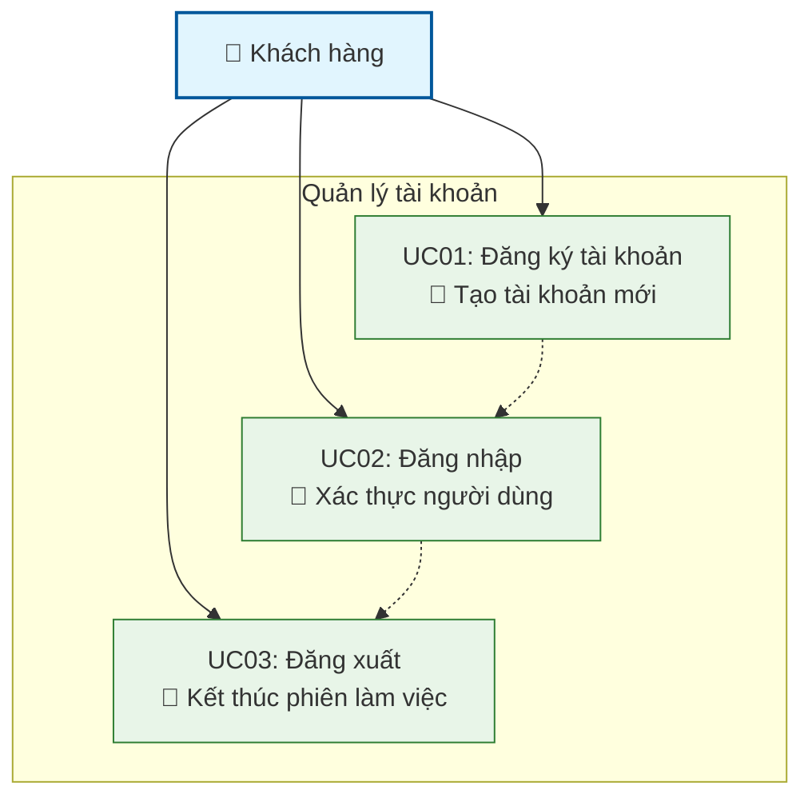
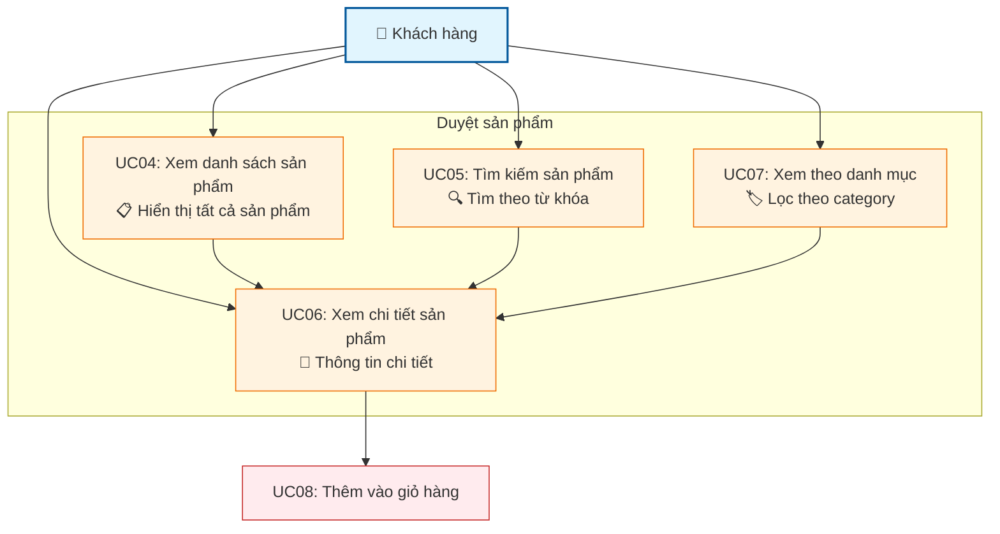
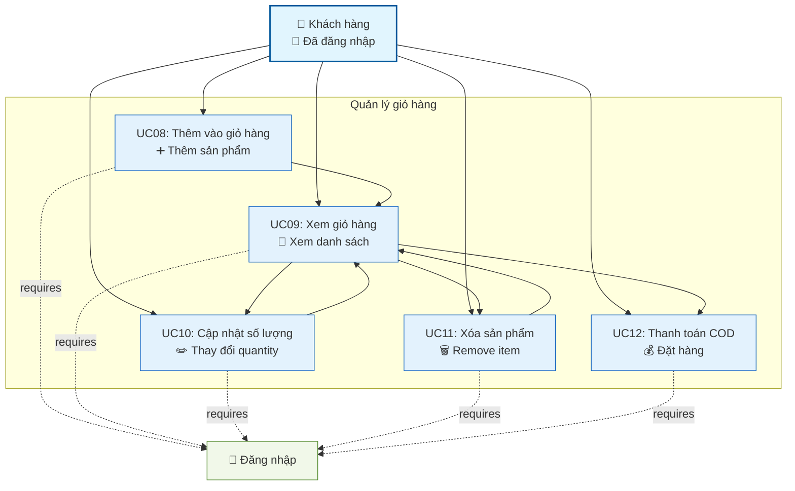
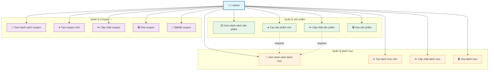
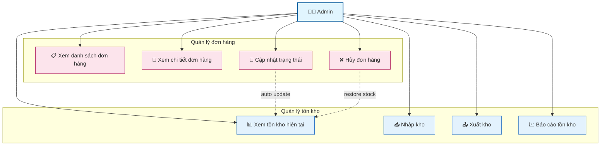
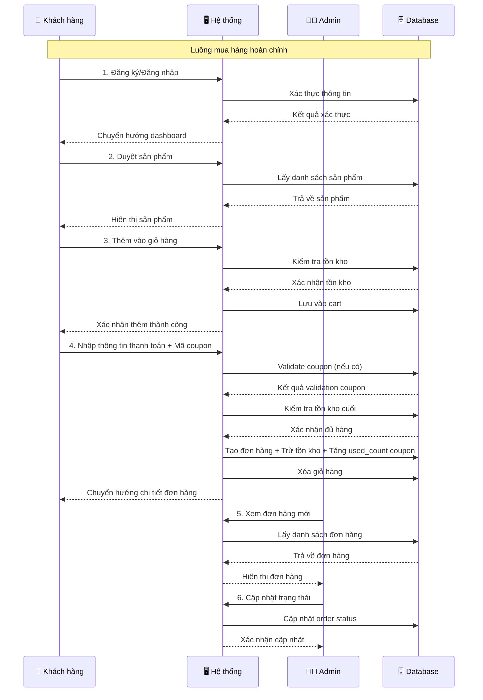
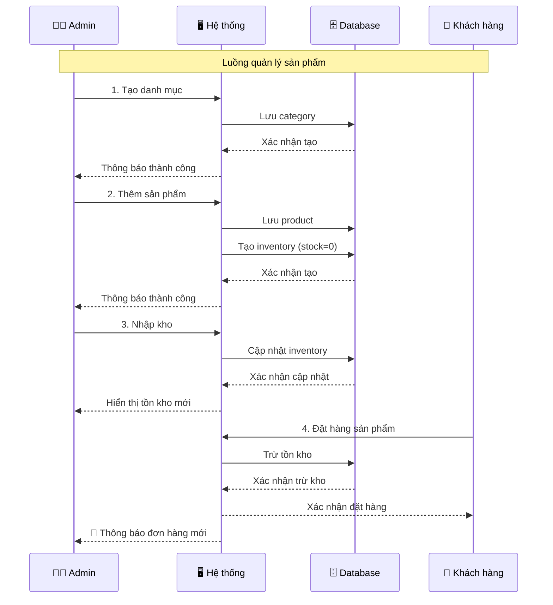
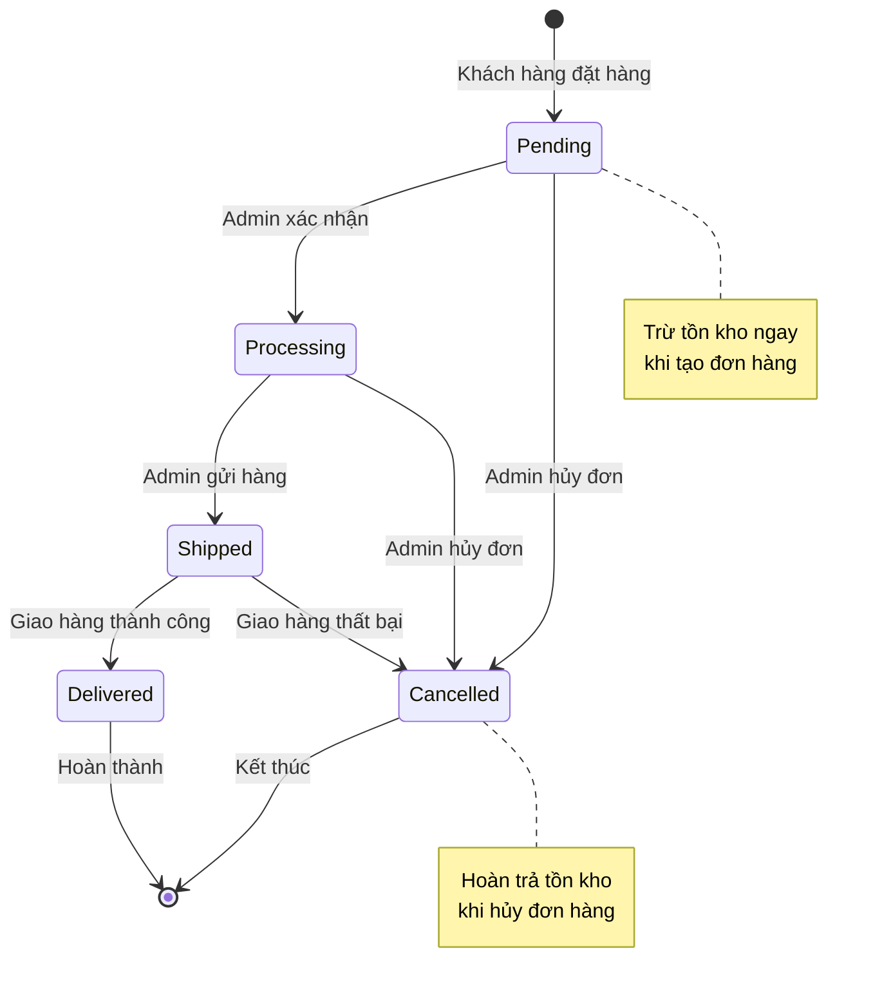
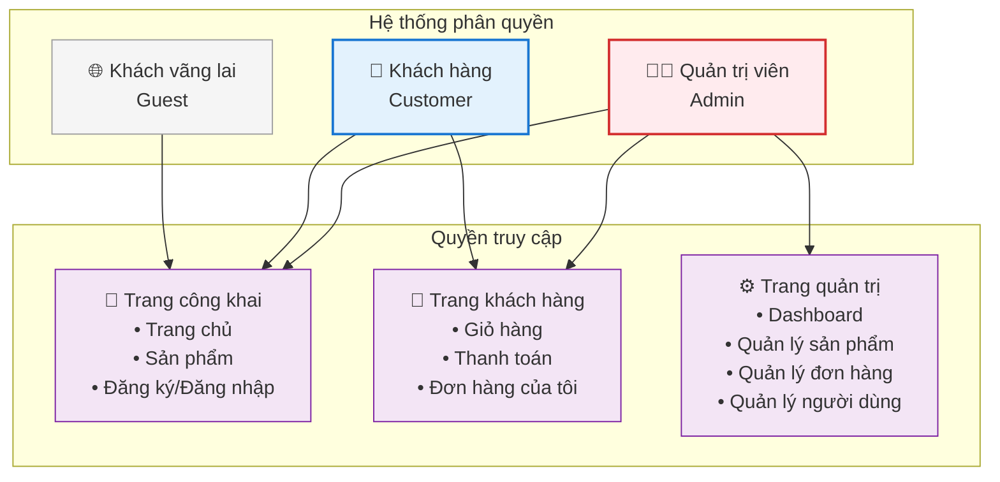
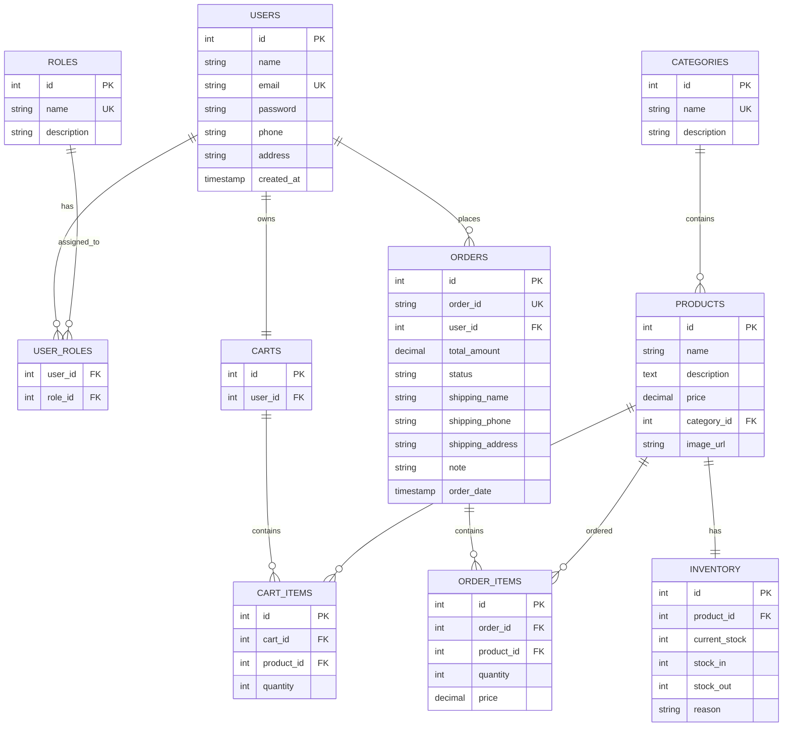

# Use Cases và Biểu đồ - Hệ thống Webshop

## Mục lục
1. [Tổng quan](#tổng-quan)
2. [Biểu đồ Use Case tổng quan](#1-biểu-đồ-use-case-tổng-quan)
3. [Use Cases cho Khách hàng](#2-use-cases-cho-khách-hàng-customer)
4. [Use Cases cho Admin](#3-use-cases-cho-quản-trị-viên-admin)
5. [Luồng nghiệp vụ chính](#4-luồng-nghiệp-vụ-chính)
6. [Quy tắc nghiệp vụ](#5-quy-tắc-nghiệp-vụ)
7. [Biểu đồ trạng thái và phân quyền](#6-biểu-đồ-trạng-thái-và-phân-quyền)
8. [Mô hình dữ liệu quan hệ](#7-mô-hình-dữ-liệu-quan-hệ)

---

## Tổng quan
Tài liệu này mô tả đầy đủ các use case và biểu đồ của hệ thống webshop, bao gồm chức năng dành cho khách hàng (Customer) và quản trị viên (Admin), kèm theo các biểu đồ minh họa trực quan.

---

## 1. Biểu đồ Use Case tổng quan

```mermaid
graph TB
    %% Actors
    Customer[👤 Khách hàng<br/>Customer]
    Admin[👨‍💼 Quản trị viên<br/>Admin]
    
    %% System boundary
    subgraph "Hệ thống Webshop"
        %% Customer Use Cases
        UC01[UC01: Đăng ký tài khoản]
        UC02[UC02: Đăng nhập]
        UC03[UC03: Đăng xuất]
        UC04[UC04: Xem danh sách sản phẩm]
        UC05[UC05: Tìm kiếm sản phẩm]
        UC06[UC06: Xem chi tiết sản phẩm]
        UC07[UC07: Xem sản phẩm theo danh mục]
        UC08[UC08: Thêm vào giỏ hàng]
        UC09[UC09: Xem giỏ hàng]
        UC10[UC10: Cập nhật giỏ hàng]
        UC11[UC11: Xóa khỏi giỏ hàng]
        UC12[UC12: Thanh toán COD]
        UC13[UC13: Áp dụng mã giảm giá]
        
        %% Admin Use Cases
        UC14[UC14: Quản lý sản phẩm]
        UC15[UC15: Quản lý danh mục]
        UC16[UC16: Quản lý coupon] ✨
        UC17[UC17: Quản lý tồn kho]
        UC18[UC18: Quản lý đơn hàng]
        UC19[UC19: Quản lý người dùng]
    end
    
    %% Customer connections
    Customer --> UC01
    Customer --> UC02
    Customer --> UC03
    Customer --> UC04
    Customer --> UC05
    Customer --> UC06
    Customer --> UC07
    Customer --> UC08
    Customer --> UC09
    Customer --> UC10
    Customer --> UC11
    Customer --> UC12
    
    %% Admin connections
    Admin --> UC02
    Admin --> UC03
    Admin --> UC13
    Admin --> UC14
    Admin --> UC15
    Admin --> UC16
    Admin --> UC17
    
    %% Styling
    classDef actor fill:#e1f5fe,stroke:#01579b,stroke-width:2px
    classDef usecase fill:#f3e5f5,stroke:#4a148c,stroke-width:1px
    
    class Customer,Admin actor
    class UC01,UC02,UC03,UC04,UC05,UC06,UC07,UC08,UC09,UC10,UC11,UC12,UC13,UC14,UC15,UC16,UC17 usecase
```

---

## 2. Use Cases cho Khách hàng (Customer)

### 2.1 Quản lý tài khoản và xác thực



#### UC01: Đăng ký tài khoản
- **Actor**: Khách hàng mới
- **Mô tả**: Khách hàng tạo tài khoản mới trên hệ thống
- **Precondition**: Khách hàng chưa có tài khoản
- **Main Flow**:
  1. Khách hàng truy cập trang đăng ký
  2. Nhập thông tin: tên, email, mật khẩu, số điện thoại, địa chỉ
  3. Hệ thống validate thông tin
  4. Hệ thống tạo tài khoản và gán role "customer"
  5. Chuyển hướng đến trang dashboard
- **Alternative Flow**: 
  - Email đã tồn tại → Hiển thị lỗi
  - Thông tin không hợp lệ → Hiển thị thông báo lỗi
- **Controller**: `AuthController@register`

#### UC02: Đăng nhập
- **Actor**: Khách hàng đã có tài khoản
- **Mô tả**: Khách hàng đăng nhập vào hệ thống
- **Precondition**: Khách hàng đã có tài khoản
- **Main Flow**:
  1. Khách hàng truy cập trang đăng nhập
  2. Nhập email và mật khẩu
  3. Hệ thống xác thực thông tin
  4. Chuyển hướng đến trang dashboard/home
- **Alternative Flow**: 
  - Thông tin sai → Hiển thị lỗi đăng nhập
- **Controller**: `AuthController@login`

#### UC03: Đăng xuất
- **Actor**: Khách hàng đã đăng nhập
- **Mô tả**: Khách hàng đăng xuất khỏi hệ thống
- **Main Flow**:
  1. Khách hàng click nút đăng xuất
  2. Hệ thống xóa session
  3. Chuyển hướng về trang chủ
- **Controller**: `AuthController@logout`

### 2.2 Duyệt và tìm kiếm sản phẩm



#### UC04: Xem danh sách sản phẩm
- **Actor**: Khách hàng
- **Mô tả**: Khách hàng xem tất cả sản phẩm có sẵn
- **Main Flow**:
  1. Khách hàng truy cập trang sản phẩm
  2. Hệ thống hiển thị danh sách sản phẩm (12 sản phẩm/trang)
  3. Khách hàng có thể phân trang để xem thêm
- **Controller**: `CustomerProductController@index`

#### UC05: Tìm kiếm sản phẩm
- **Actor**: Khách hàng
- **Mô tả**: Khách hàng tìm kiếm sản phẩm theo từ khóa
- **Main Flow**:
  1. Khách hàng nhập từ khóa tìm kiếm
  2. Hệ thống tìm kiếm theo tên và mô tả sản phẩm
  3. Hiển thị kết quả tìm kiếm
- **Controller**: `CustomerProductController@search`

#### UC06: Xem chi tiết sản phẩm
- **Actor**: Khách hàng
- **Mô tả**: Khách hàng xem thông tin chi tiết của một sản phẩm
- **Main Flow**:
  1. Khách hàng click vào sản phẩm
  2. Hệ thống hiển thị chi tiết sản phẩm: tên, mô tả, giá, hình ảnh, tồn kho
  3. Khách hàng có thể thêm vào giỏ hàng
- **Controller**: `CustomerProductController@show`

#### UC07: Xem sản phẩm theo danh mục
- **Actor**: Khách hàng
- **Mô tả**: Khách hàng xem sản phẩm thuộc một danh mục cụ thể
- **Main Flow**:
  1. Khách hàng chọn danh mục
  2. Hệ thống hiển thị tất cả sản phẩm trong danh mục đó
- **Controller**: `CustomerProductController@category`

### 2.3 Quản lý giỏ hàng và thanh toán



#### UC08: Thêm sản phẩm vào giỏ hàng
- **Actor**: Khách hàng đã đăng nhập
- **Mô tả**: Khách hàng thêm sản phẩm vào giỏ hàng
- **Precondition**: Khách hàng đã đăng nhập
- **Main Flow**:
  1. Khách hàng chọn sản phẩm và số lượng
  2. Click "Thêm vào giỏ hàng"
  3. Hệ thống kiểm tra tồn kho
  4. Thêm vào giỏ hàng hoặc cập nhật số lượng nếu đã có
- **Alternative Flow**: 
  - Không đủ tồn kho → Hiển thị lỗi
  - Chưa đăng nhập → Chuyển hướng đến trang đăng nhập
- **Controller**: `CustomerCartController@add`

#### UC09: Xem giỏ hàng
- **Actor**: Khách hàng đã đăng nhập
- **Mô tả**: Khách hàng xem các sản phẩm trong giỏ hàng
- **Main Flow**:
  1. Khách hàng truy cập trang giỏ hàng
  2. Hệ thống hiển thị danh sách sản phẩm với số lượng và tổng tiền
- **Controller**: `CustomerCartController@index`

#### UC10: Cập nhật số lượng sản phẩm trong giỏ hàng
- **Actor**: Khách hàng đã đăng nhập
- **Mô tả**: Khách hàng thay đổi số lượng sản phẩm trong giỏ hàng
- **Main Flow**:
  1. Khách hàng thay đổi số lượng
  2. Hệ thống kiểm tra tồn kho
  3. Cập nhật số lượng và tổng tiền
- **Alternative Flow**: 
  - Không đủ tồn kho → Giữ nguyên số lượng cũ, hiển thị lỗi
- **Controller**: `CustomerCartController@updateQuantity`

#### UC11: Xóa sản phẩm khỏi giỏ hàng
- **Actor**: Khách hàng đã đăng nhập
- **Mô tả**: Khách hàng xóa sản phẩm khỏi giỏ hàng
- **Main Flow**:
  1. Khách hàng click nút xóa
  2. Hệ thống xóa sản phẩm khỏi giỏ hàng
  3. Cập nhật tổng tiền
- **Controller**: `CustomerCartController@remove`

#### UC12: Thanh toán đơn hàng (COD)
- **Actor**: Khách hàng đã đăng nhập
- **Mô tả**: Khách hàng đặt hàng và thanh toán COD
- **Precondition**: Giỏ hàng có sản phẩm
- **Main Flow**:
  1. Khách hàng nhập thông tin giao hàng (tên, SĐT, địa chỉ, ghi chú)
  2. Khách hàng nhập mã coupon (tùy chọn)
  3. Hệ thống validate thông tin và coupon
  4. Kiểm tra tồn kho tất cả sản phẩm
  5. Tính toán tổng tiền bao gồm giảm giá
  6. Tạo đơn hàng với trạng thái "pending"
  7. Trừ tồn kho ngay (giữ hàng)
  8. Tăng used_count của coupon (nếu có)
  9. Xóa giỏ hàng
  10. Chuyển hướng đến trang chi tiết đơn hàng
- **Alternative Flow**: 
  - Mã coupon không hợp lệ → Hiển thị lỗi, không áp dụng giảm giá
  - Không đủ tồn kho → Rollback, hiển thị lỗi
  - Thông tin giao hàng không hợp lệ → Hiển thị lỗi
- **Controller**: `CustomerCartController@checkout`

#### UC13: Áp dụng mã giảm giá ✨ *Mới*
- **Actor**: Khách hàng đã đăng nhập
- **Mô tả**: Khách hàng nhập và áp dụng mã coupon khi thanh toán
- **Precondition**: Khách hàng đang ở trang checkout
- **Main Flow**:
  1. Khách hàng nhập mã coupon
  2. Hệ thống validate mã coupon (còn hạn, còn lượt, đơn hàng đủ điều kiện)
  3. Tính toán số tiền giảm giá
  4. Hiển thị preview tổng tiền sau giảm giá
  5. Khách hàng xác nhận áp dụng
- **Alternative Flow**: 
  - Mã không tồn tại → "Mã giảm giá không hợp lệ"
  - Mã đã hết hạn → "Mã giảm giá đã hết hạn"
  - Mã đã hết lượt sử dụng → "Mã giảm giá đã hết lượt sử dụng"
  - Đơn hàng chưa đủ điều kiện → "Đơn hàng chưa đạt giá trị tối thiểu"
- **Controller**: `CustomerCartController@applyCoupon`

---

## 3. Use Cases cho Quản trị viên (Admin)

### 3.1 Quản lý sản phẩm và danh mục



#### UC14: Quản lý sản phẩm
- **UC14A: Xem danh sách sản phẩm (Admin)**
  - **Actor**: Admin
  - **Mô tả**: Admin xem và quản lý tất cả sản phẩm
  - **Main Flow**:
    1. Admin truy cập trang quản lý sản phẩm
    2. Hệ thống hiển thị danh sách sản phẩm với phân trang (12 sản phẩm/trang)
    3. Admin có thể tìm kiếm theo tên hoặc mô tả
  - **Controller**: `ProductController@index`

- **UC13B: Tạo sản phẩm mới**
  - **Actor**: Admin
  - **Mô tả**: Admin thêm sản phẩm mới vào hệ thống
  - **Main Flow**:
    1. Admin click "Thêm sản phẩm"
    2. Nhập thông tin: tên, mô tả, giá, danh mục, hình ảnh
    3. Hệ thống validate và lưu sản phẩm
    4. Tự động tạo bản ghi inventory với stock = 0
  - **Controller**: `ProductController@store`

- **UC13C: Cập nhật thông tin sản phẩm**
  - **Actor**: Admin
  - **Mô tả**: Admin chỉnh sửa thông tin sản phẩm
  - **Main Flow**:
    1. Admin chọn sản phẩm cần sửa
    2. Cập nhật thông tin
    3. Hệ thống validate và lưu thay đổi
  - **Controller**: `ProductController@update`

- **UC13D: Xóa sản phẩm**
  - **Actor**: Admin
  - **Mô tả**: Admin xóa sản phẩm khỏi hệ thống
  - **Main Flow**:
    1. Admin chọn sản phẩm cần xóa
    2. Xác nhận xóa
    3. Hệ thống xóa sản phẩm và các dữ liệu liên quan
  - **Controller**: `ProductController@destroy`

#### UC14: Quản lý danh mục sản phẩm
- **Actor**: Admin
- **Mô tả**: Admin quản lý các danh mục sản phẩm
- **Main Flow**:
  1. Admin có thể xem/thêm/sửa/xóa danh mục
  2. Mỗi danh mục có tên và mô tả
- **Controller**: `CategoryController`

#### UC16: Quản lý Coupon ✨ *Mới*
- **UC16A: Xem danh sách coupon**
  - **Actor**: Admin/Manager
  - **Mô tả**: Xem tất cả mã giảm giá trong hệ thống
  - **Main Flow**:
    1. Admin truy cập trang quản lý coupon
    2. Xem danh sách với thông tin: mã, tên, loại, giá trị, trạng thái, số lần dùng
    3. Có thể tìm kiếm và lọc theo trạng thái
  - **Controller**: `CouponController@index`

- **UC16B: Tạo coupon mới**
  - **Actor**: Admin/Manager
  - **Mô tả**: Tạo mã giảm giá mới
  - **Main Flow**:
    1. Admin nhấn "Tạo coupon mới"
    2. Nhập thông tin: mã, tên, loại (percentage/fixed), giá trị
    3. Cấu hình: đơn tối thiểu, giảm tối đa, giới hạn sử dụng, thời gian
    4. Hệ thống validate và lưu coupon
  - **Alternative Flow**: 
    - Mã đã tồn tại → Hiển thị lỗi
    - Thông tin không hợp lệ → Hiển thị lỗi validation
  - **Controller**: `CouponController@store`

- **UC16C: Cập nhật coupon**
  - **Actor**: Admin/Manager
  - **Mô tả**: Chỉnh sửa thông tin coupon
  - **Main Flow**:
    1. Admin chọn coupon cần sửa
    2. Cập nhật thông tin (không được sửa mã)
    3. Hệ thống validate và lưu thay đổi
  - **Business Rule**: Không sửa được coupon đã được sử dụng (used_count > 0)
  - **Controller**: `CouponController@update`

- **UC16D: Xóa coupon**
  - **Actor**: Admin
  - **Mô tả**: Xóa mã giảm giá khỏi hệ thống
  - **Main Flow**:
    1. Admin chọn coupon cần xóa
    2. Xác nhận xóa
    3. Hệ thống xóa coupon
  - **Business Rule**: Chỉ xóa được coupon chưa sử dụng (used_count = 0)
  - **Controller**: `CouponController@destroy`

- **UC16E: Bật/tắt coupon**
  - **Actor**: Admin/Manager
  - **Mô tả**: Kích hoạt hoặc vô hiệu hóa coupon
  - **Main Flow**:
    1. Admin click toggle trạng thái
    2. Hệ thống cập nhật is_active
  - **Controller**: `CouponController@toggleStatus`

### 3.2 Quản lý tồn kho và đơn hàng



#### UC17: Quản lý tồn kho
- **UC17A: Xem tồn kho**
  - **Actor**: Admin
  - **Mô tả**: Admin xem tình trạng tồn kho của tất cả sản phẩm
  - **Main Flow**:
    1. Admin truy cập trang quản lý tồn kho
    2. Xem thông tin: sản phẩm, tồn kho hiện tại, số lượng nhập, xuất
  - **Controller**: `InventoryController@index`

- **UC15B: Cập nhật tồn kho**
  - **Actor**: Admin
  - **Mô tả**: Admin nhập/xuất kho để cập nhật tồn kho
  - **Main Flow**:
    1. Admin chọn sản phẩm cần cập nhật
    2. Nhập số lượng nhập/xuất và lý do
    3. Hệ thống cập nhật current_stock và ghi log
  - **Controller**: `InventoryController@update`

#### UC16: Quản lý đơn hàng
- **UC16A: Xem danh sách đơn hàng**
  - **Actor**: Admin
  - **Mô tả**: Admin xem và quản lý tất cả đơn hàng
  - **Main Flow**:
    1. Admin truy cập trang quản lý đơn hàng
    2. Xem danh sách với phân trang (15 đơn hàng/trang)
    3. Có thể tìm kiếm theo mã đơn hàng hoặc thông tin khách hàng
    4. Có thể lọc theo trạng thái đơn hàng
  - **Controller**: `OrderController@index`

- **UC16B: Xem chi tiết đơn hàng**
  - **Actor**: Admin
  - **Mô tả**: Admin xem thông tin chi tiết của một đơn hàng
  - **Main Flow**:
    1. Admin click vào đơn hàng
    2. Xem thông tin: khách hàng, sản phẩm, số lượng, tổng tiền, trạng thái
  - **Controller**: `OrderController@show`

- **UC16C: Cập nhật trạng thái đơn hàng**
  - **Actor**: Admin
  - **Mô tả**: Admin thay đổi trạng thái đơn hàng
  - **Main Flow**:
    1. Admin chọn trạng thái mới (pending → processing → shipped → delivered)
    2. Hệ thống cập nhật trạng thái và thời gian
  - **Alternative Flow**: 
    - Hủy đơn hàng → Hoàn trả tồn kho
  - **Controller**: `OrderController@updateStatus`

#### UC17: Quản lý người dùng
- **UC17A: Xem danh sách người dùng**
  - **Actor**: Admin
  - **Mô tả**: Admin xem và quản lý tài khoản người dùng
  - **Main Flow**:
    1. Admin xem danh sách người dùng
    2. Có thể tìm kiếm theo tên hoặc email
  - **Controller**: `UserManagementController@index`

- **UC17B: Cập nhật thông tin người dùng**
  - **Actor**: Admin
  - **Mô tả**: Admin chỉnh sửa thông tin người dùng
  - **Main Flow**:
    1. Admin chọn người dùng cần sửa
    2. Cập nhật thông tin hoặc phân quyền
  - **Controller**: `UserManagementController@update`

---

## 4. Luồng nghiệp vụ chính

### 4.1 Luồng mua hàng hoàn chỉnh



**Mô tả chi tiết luồng mua hàng:**
1. **Khách hàng đăng ký/đăng nhập** (UC01/UC02)
2. **Duyệt sản phẩm** (UC04/UC05/UC06/UC07)
3. **Thêm vào giỏ hàng** (UC08)
4. **Quản lý giỏ hàng** (UC09/UC10/UC11)
5. **Thanh toán COD** (UC12)
6. **Admin xử lý đơn hàng** (UC16A/UC16B/UC16C)

### 4.2 Luồng quản lý sản phẩm



**Mô tả chi tiết luồng quản lý sản phẩm:**
1. **Admin tạo danh mục** (UC14)
2. **Admin thêm sản phẩm** (UC13B)
3. **Admin cập nhật tồn kho** (UC15B)
4. **Khách hàng mua sản phẩm** (UC08-UC12)
5. **Hệ thống tự động trừ tồn kho**

---

## 5. Quy tắc nghiệp vụ

### 5.1 Tồn kho
- Tồn kho được trừ ngay khi khách hàng đặt hàng (giữ hàng)
- Nếu hủy đơn hàng, hoàn trả tồn kho
- Không cho phép đặt hàng khi không đủ tồn kho

### 5.2 Thanh toán
- Hiện tại chỉ hỗ trợ COD (Cash on Delivery)
- Đơn hàng được tạo với trạng thái "pending"
- Khách hàng có thể áp dụng mã giảm giá trong quá trình thanh toán

### 5.3 Coupon/Mã giảm giá ✨ *Mới*
- Mã coupon phải unique và được tự động chuyển thành chữ hoa
- Coupon có 2 loại: percentage (%) và fixed amount (VND)
- Coupon có thời gian hiệu lực (start_date đến end_date)
- Coupon có thể có giới hạn số lần sử dụng (usage_limit)
- Coupon có điều kiện đơn hàng tối thiểu (min_order_amount)
- Percentage coupon có thể có giới hạn số tiền giảm tối đa (max_discount_amount)
- Khi áp dụng coupon thành công, tăng used_count
- Chỉ Admin/Manager mới có thể quản lý coupon

### 5.4 Trạng thái đơn hàng
- **pending**: Đơn hàng mới tạo
- **processing**: Đang xử lý
- **shipped**: Đã gửi hàng
- **delivered**: Đã giao hàng
- **cancelled**: Đã hủy

### 5.5 Phân quyền
- **Customer**: Chỉ có thể mua hàng và xem đơn hàng của mình
- **Admin**: Quản lý toàn bộ hệ thống

---

## 6. Biểu đồ trạng thái và phân quyền

### 6.1 Biểu đồ trạng thái đơn hàng



### 6.2 Biểu đồ phân quyền hệ thống



---

## 7. Mô hình dữ liệu quan hệ



---

## 📋 Tóm tắt

### 📊 Thống kê Use Cases:
- **👤 Khách hàng**: 13 use cases chính (bao gồm coupon)
- **👨‍💼 Admin**: 15 use cases chính (bao gồm quản lý coupon)
- **🔄 Luồng nghiệp vụ**: 2 luồng chính
- **📋 Quy tắc**: 5 nhóm quy tắc nghiệp vụ

### 🎯 Chức năng cốt lõi:
1. **Xác thực và phân quyền**: Đăng ký, đăng nhập, phân quyền
2. **Quản lý sản phẩm**: CRUD sản phẩm, danh mục, tồn kho
3. **Mua sắm**: Duyệt, tìm kiếm, giỏ hàng, thanh toán
4. **Hệ thống giảm giá**: Quản lý và áp dụng coupon ✨
5. **Quản lý đơn hàng**: Theo dõi, cập nhật trạng thái

### 💡 Đặc điểm nổi bật:
- **Tồn kho thời gian thực**: Trừ ngay khi đặt hàng
- **Thanh toán COD**: Đơn giản, phù hợp thị trường Việt Nam
- **Hệ thống coupon linh hoạt**: Hỗ trợ % và số tiền cố định ✨
- **Phân quyền rõ ràng**: Customer vs Admin/Manager
- **Luồng nghiệp vụ hoàn chỉnh**: Từ đăng ký đến giao hàng

---

*Tài liệu này được tạo dựa trên phân tích source code của hệ thống webshop Laravel và cung cấp cái nhìn toàn diện về các chức năng và luồng nghiệp vụ của hệ thống.*