# Use Cases và Biểu đồ - Hệ thống Webshop

## Mục lục
1. [Tổng quan](#tổng-quan)
2. [Biểu đồ Use Case tổng quan](#1-biểu-đồ-use-case-tổng-quan)
3. [Use Cases cho Khách hàng](#2-use-cases-cho-khách-hàng-customer)
4. [Use Cases cho Admin/Manager](#3-use-cases-cho-quản-trị-viên-adminmanager)
5. [Luồng nghiệp vụ chính](#4-luồng-nghiệp-vụ-chính)
6. [Quy tắc nghiệp vụ](#5-quy-tắc-nghiệp-vụ)
7. [Biểu đồ trạng thái và phân quyền](#6-biểu-đồ-trạng-thái-và-phân-quyền)
8. [Mô hình dữ liệu quan hệ](#7-mô-hình-dữ-liệu-quan-hệ)
9. [Ma trận phân quyền](#8-ma-trận-phân-quyền)

---

## Tổng quan
Tài liệu này mô tả đầy đủ các use case và biểu đồ của hệ thống webshop, bao gồm chức năng dành cho:
- **Khách hàng (Customer)**: Duyệt và mua sản phẩm, quản lý giỏ hàng, đánh giá sản phẩm
- **Quản lý (Manager)**: Xem và theo dõi sản phẩm, đơn hàng, báo cáo thống kê
- **Quản trị viên (Admin)**: Toàn quyền quản lý hệ thống, CRUD đầy đủ, quản lý người dùng

Hệ thống hỗ trợ **3 cấp phân quyền** với các chức năng đầy đủ từ mua sắm, quản lý tồn kho, coupon/giảm giá, đến báo cáo thống kê và phân tích dữ liệu.

---

## 1. Biểu đồ Use Case tổng quan

```mermaid
graph TB
    %% Actors
    Customer[Khách hàng - Customer]
    Manager[Quản lý - Manager]
    Admin[Quản trị viên - Admin]
    
    %% System boundary
    subgraph "Hệ thống Webshop"
        %% Customer Use Cases
        UC01[UC01: Đăng ký tài khoản]
        UC02[UC02: Đăng nhập]
        UC03[UC03: Đăng xuất]
        UC04[UC04: Xem danh sách sản phẩm]
        UC05[UC05: Tìm kiếm sản phẩm]
        UC06[UC06: Xem chi tiết sản phẩm]
        UC07[UC07: Xem sản phẩm theo danh mục]
        UC08[UC08: Thêm vào giỏ hàng]
        UC09[UC09: Xem giỏ hàng]
        UC10[UC10: Cập nhật giỏ hàng]
        UC11[UC11: Xóa khỏi giỏ hàng]
        UC12[UC12: Thanh toán COD]
        UC13[UC13: Áp dụng mã giảm giá]
        UC14[UC14: Đánh giá sản phẩm]
        
        %% Admin/Manager Use Cases
        UC15[UC15: Quản lý sản phẩm]
        UC16[UC16: Quản lý danh mục]
        UC17[UC17: Quản lý coupon]
        UC18[UC18: Quản lý tồn kho]
        UC19[UC19: Quản lý đơn hàng]
        UC20[UC20: Quản lý người dùng]
        UC21[UC21: Báo cáo tổng quan]
        UC22[UC22: Báo cáo doanh thu]
        UC23[UC23: Báo cáo sản phẩm]
        UC24[UC24: Báo cáo khách hàng]
        UC25[UC25: Xuất báo cáo CSV]
    end
    
    %% Customer connections
    Customer --> UC01
    Customer --> UC02
    Customer --> UC03
    Customer --> UC04
    Customer --> UC05
    Customer --> UC06
    Customer --> UC07
    Customer --> UC08
    Customer --> UC09
    Customer --> UC10
    Customer --> UC11
    Customer --> UC12
    Customer --> UC13
    Customer --> UC14
    
    %% Manager connections (view only)
    Manager --> UC02
    Manager --> UC03
    Manager --> UC15
    Manager --> UC16
    Manager --> UC17
    Manager --> UC18
    Manager --> UC19
    Manager --> UC21
    Manager --> UC22
    Manager --> UC23
    Manager --> UC24
    Manager --> UC25
    
    %% Admin connections (full access)
    Admin --> UC02
    Admin --> UC03
    Admin --> UC15
    Admin --> UC16
    Admin --> UC17
    Admin --> UC18
    Admin --> UC19
    Admin --> UC20
    Admin --> UC21
    Admin --> UC22
    Admin --> UC23
    Admin --> UC24
    Admin --> UC25
    
    %% Styling
    classDef actor fill:#e1f5fe,stroke:#01579b,stroke-width:2px
    classDef usecase fill:#f3e5f5,stroke:#4a148c,stroke-width:1px
    
    class Customer,Manager,Admin actor
    class UC01,UC02,UC03,UC04,UC05,UC06,UC07,UC08,UC09,UC10,UC11,UC12,UC13,UC14,UC15,UC16,UC17,UC18,UC19,UC20,UC21,UC22,UC23,UC24,UC25 usecase
```

---

## 2. Use Cases cho Khách hàng (Customer)

### 2.1 Quản lý tài khoản và xác thực

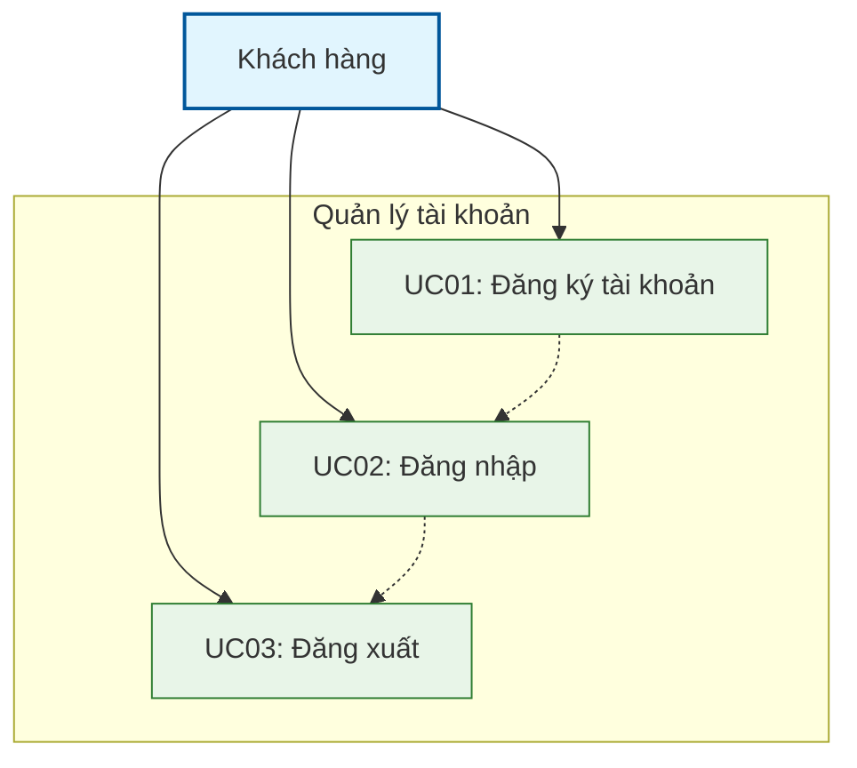

#### UC01: Đăng ký tài khoản
- **Actor**: Khách hàng mới
- **Mô tả**: Khách hàng tạo tài khoản mới trên hệ thống
- **Precondition**: Khách hàng chưa có tài khoản
- **Main Flow**:
  1. Khách hàng truy cập trang đăng ký
  2. Nhập thông tin: tên, email, mật khẩu, số điện thoại, địa chỉ
  3. Hệ thống validate thông tin
  4. Hệ thống tạo tài khoản và gán role "customer"
  5. Chuyển hướng đến trang dashboard
- **Alternative Flow**: 
  - Email đã tồn tại → Hiển thị lỗi
  - Thông tin không hợp lệ → Hiển thị thông báo lỗi
- **Controller**: `AuthController@register`

#### UC02: Đăng nhập
- **Actor**: Khách hàng đã có tài khoản
- **Mô tả**: Khách hàng đăng nhập vào hệ thống
- **Precondition**: Khách hàng đã có tài khoản
- **Main Flow**:
  1. Khách hàng truy cập trang đăng nhập
  2. Nhập email và mật khẩu
  3. Hệ thống xác thực thông tin
  4. Chuyển hướng đến trang dashboard/home
- **Alternative Flow**: 
  - Thông tin sai → Hiển thị lỗi đăng nhập
- **Controller**: `AuthController@login`

#### UC03: Đăng xuất
- **Actor**: Khách hàng đã đăng nhập
- **Mô tả**: Khách hàng đăng xuất khỏi hệ thống
- **Main Flow**:
  1. Khách hàng click nút đăng xuất
  2. Hệ thống xóa session
  3. Chuyển hướng về trang chủ
- **Controller**: `AuthController@logout`

### 2.2 Duyệt và tìm kiếm sản phẩm

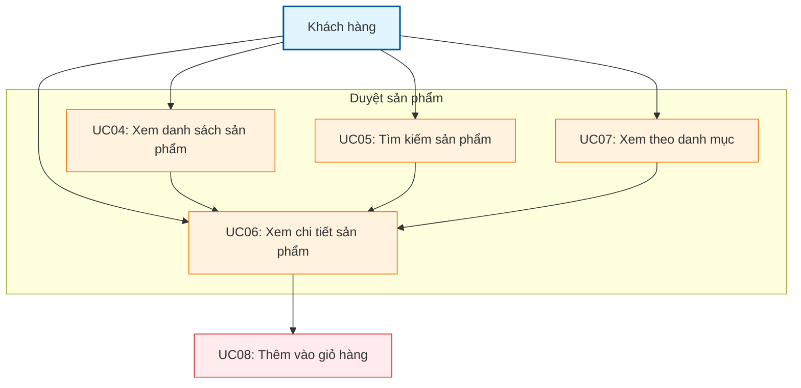

#### UC04: Xem danh sách sản phẩm
- **Actor**: Khách hàng
- **Mô tả**: Khách hàng xem tất cả sản phẩm có sẵn
- **Main Flow**:
  1. Khách hàng truy cập trang sản phẩm
  2. Hệ thống hiển thị danh sách sản phẩm (12 sản phẩm/trang)
  3. Khách hàng có thể phân trang để xem thêm
- **Controller**: `CustomerProductController@index`

#### UC05: Tìm kiếm sản phẩm
- **Actor**: Khách hàng
- **Mô tả**: Khách hàng tìm kiếm sản phẩm theo từ khóa
- **Main Flow**:
  1. Khách hàng nhập từ khóa tìm kiếm
  2. Hệ thống tìm kiếm theo tên và mô tả sản phẩm
  3. Hiển thị kết quả tìm kiếm
- **Controller**: `CustomerProductController@search`

#### UC06: Xem chi tiết sản phẩm
- **Actor**: Khách hàng
- **Mô tả**: Khách hàng xem thông tin chi tiết của một sản phẩm
- **Main Flow**:
  1. Khách hàng click vào sản phẩm
  2. Hệ thống hiển thị chi tiết sản phẩm: tên, mô tả, giá, hình ảnh, tồn kho
  3. Khách hàng có thể thêm vào giỏ hàng
- **Controller**: `CustomerProductController@show`

#### UC07: Xem sản phẩm theo danh mục
- **Actor**: Khách hàng
- **Mô tả**: Khách hàng xem sản phẩm thuộc một danh mục cụ thể
- **Main Flow**:
  1. Khách hàng chọn danh mục
  2. Hệ thống hiển thị tất cả sản phẩm trong danh mục đó
- **Controller**: `CustomerProductController@category`

### 2.3 Quản lý giỏ hàng và thanh toán

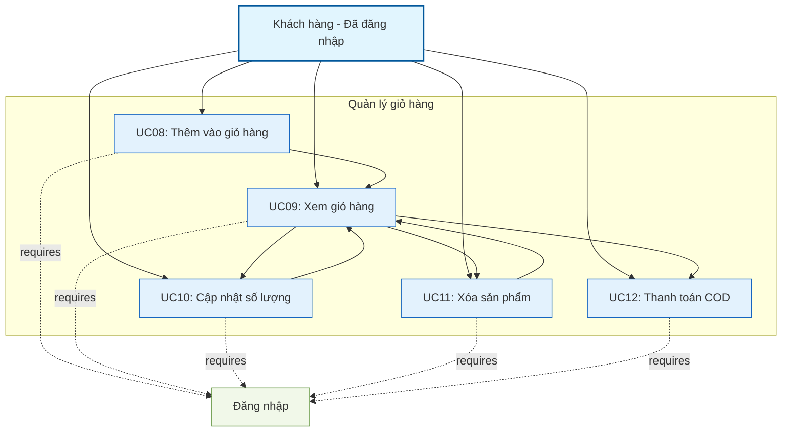

#### UC08: Thêm sản phẩm vào giỏ hàng
- **Actor**: Khách hàng đã đăng nhập
- **Mô tả**: Khách hàng thêm sản phẩm vào giỏ hàng
- **Precondition**: Khách hàng đã đăng nhập
- **Main Flow**:
  1. Khách hàng chọn sản phẩm và số lượng
  2. Click "Thêm vào giỏ hàng"
  3. Hệ thống kiểm tra tồn kho
  4. Thêm vào giỏ hàng hoặc cập nhật số lượng nếu đã có
- **Alternative Flow**: 
  - Không đủ tồn kho → Hiển thị lỗi
  - Chưa đăng nhập → Chuyển hướng đến trang đăng nhập
- **Controller**: `CustomerCartController@add`

#### UC09: Xem giỏ hàng
- **Actor**: Khách hàng đã đăng nhập
- **Mô tả**: Khách hàng xem các sản phẩm trong giỏ hàng
- **Main Flow**:
  1. Khách hàng truy cập trang giỏ hàng
  2. Hệ thống hiển thị danh sách sản phẩm với số lượng và tổng tiền
- **Controller**: `CustomerCartController@index`

#### UC10: Cập nhật số lượng sản phẩm trong giỏ hàng
- **Actor**: Khách hàng đã đăng nhập
- **Mô tả**: Khách hàng thay đổi số lượng sản phẩm trong giỏ hàng
- **Main Flow**:
  1. Khách hàng thay đổi số lượng
  2. Hệ thống kiểm tra tồn kho
  3. Cập nhật số lượng và tổng tiền
- **Alternative Flow**: 
  - Không đủ tồn kho → Giữ nguyên số lượng cũ, hiển thị lỗi
- **Controller**: `CustomerCartController@updateQuantity`

#### UC11: Xóa sản phẩm khỏi giỏ hàng
- **Actor**: Khách hàng đã đăng nhập
- **Mô tả**: Khách hàng xóa sản phẩm khỏi giỏ hàng
- **Main Flow**:
  1. Khách hàng click nút xóa
  2. Hệ thống xóa sản phẩm khỏi giỏ hàng
  3. Cập nhật tổng tiền
- **Controller**: `CustomerCartController@remove`

#### UC12: Thanh toán đơn hàng (COD)
- **Actor**: Khách hàng đã đăng nhập
- **Mô tả**: Khách hàng đặt hàng và thanh toán COD
- **Precondition**: Giỏ hàng có sản phẩm
- **Main Flow**:
  1. Khách hàng nhập thông tin giao hàng (tên, SĐT, địa chỉ, ghi chú)
  2. Khách hàng nhập mã coupon (tùy chọn)
  3. Hệ thống validate thông tin và coupon
  4. Kiểm tra tồn kho tất cả sản phẩm
  5. Tính toán tổng tiền bao gồm giảm giá
  6. Tạo đơn hàng với trạng thái "pending"
  7. Trừ tồn kho ngay (giữ hàng)
  8. Tăng used_count của coupon (nếu có)
  9. Xóa giỏ hàng
  10. Chuyển hướng đến trang chi tiết đơn hàng
- **Alternative Flow**: 
  - Mã coupon không hợp lệ → Hiển thị lỗi, không áp dụng giảm giá
  - Không đủ tồn kho → Rollback, hiển thị lỗi
  - Thông tin giao hàng không hợp lệ → Hiển thị lỗi
- **Controller**: `CustomerCartController@checkout`

#### UC13: Áp dụng mã giảm giá
- **Actor**: Khách hàng đã đăng nhập
- **Mô tả**: Khách hàng nhập và áp dụng mã coupon khi thanh toán
- **Precondition**: Khách hàng đang ở trang checkout
- **Main Flow**:
  1. Khách hàng nhập mã coupon
  2. Hệ thống validate mã coupon (còn hạn, còn lượt, đơn hàng đủ điều kiện)
  3. Tính toán số tiền giảm giá
  4. Hiển thị preview tổng tiền sau giảm giá
  5. Khách hàng xác nhận áp dụng
- **Alternative Flow**: 
  - Mã không tồn tại → "Mã giảm giá không hợp lệ"
  - Mã đã hết hạn → "Mã giảm giá đã hết hạn"
  - Mã đã hết lượt sử dụng → "Mã giảm giá đã hết lượt sử dụng"
  - Đơn hàng chưa đủ điều kiện → "Đơn hàng chưa đạt giá trị tối thiểu"
- **Controller**: `CustomerCartController@applyCoupon`

### 2.4 Đánh giá và phản hồi

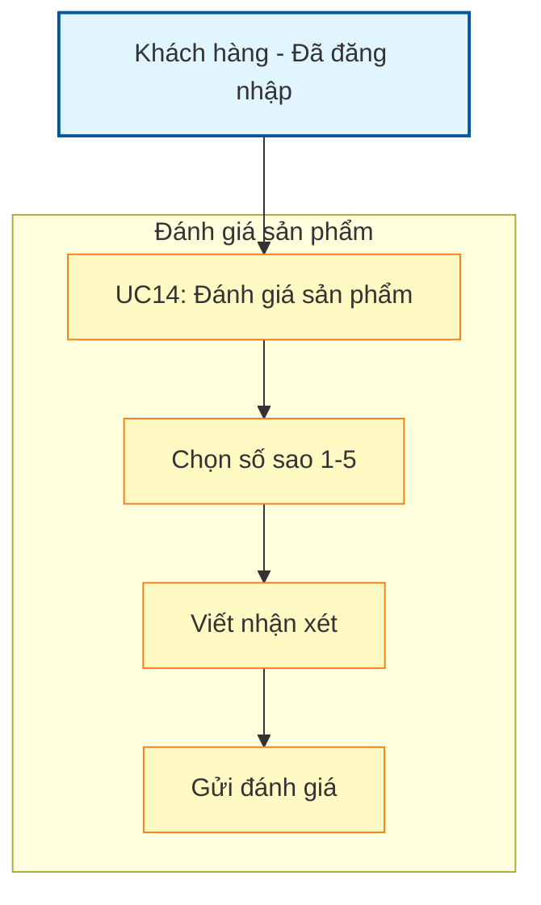

#### UC14: Đánh giá sản phẩm ⭐ *Mới*
- **Actor**: Khách hàng đã đăng nhập
- **Mô tả**: Khách hàng đánh giá và viết nhận xét về sản phẩm
- **Precondition**: Khách hàng đã đăng nhập, đang xem trang chi tiết sản phẩm
- **Main Flow**:
  1. Khách hàng truy cập trang chi tiết sản phẩm
  2. Xem các đánh giá hiện có từ khách hàng khác
  3. Chọn số sao (1-5 sao)
  4. Viết nhận xét (tùy chọn, tối đa 1000 ký tự)
  5. Click "Gửi đánh giá"
  6. Hệ thống kiểm tra khách hàng chưa đánh giá sản phẩm này trước đó
  7. Lưu đánh giá vào database
  8. Hiển thị thông báo thành công
  9. Cập nhật danh sách đánh giá trên trang sản phẩm
- **Alternative Flow**: 
  - Chưa đăng nhập → Chuyển hướng đến trang đăng nhập
  - Đã đánh giá trước đó → "Bạn đã đánh giá sản phẩm này rồi"
  - Không chọn số sao → "Bạn phải chọn số sao đánh giá"
  - Nhận xét quá dài → "Nhận xét không được quá 1000 ký tự"
- **Business Rule**: 
  - Mỗi khách hàng chỉ được đánh giá 1 lần cho mỗi sản phẩm
  - Số sao từ 1-5 (bắt buộc)
  - Nhận xét không bắt buộc nhưng không quá 1000 ký tự
  - Đánh giá hiển thị kèm tên người dùng và thời gian
- **Controller**: `CustomerProductController@addRating`

---

## 3. Use Cases cho Quản trị viên (Admin/Manager)

### 3.1 Quản lý sản phẩm và danh mục

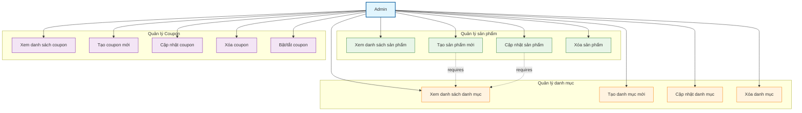

#### UC14: Quản lý sản phẩm
- **UC14A: Xem danh sách sản phẩm (Admin)**
  - **Actor**: Admin
  - **Mô tả**: Admin xem và quản lý tất cả sản phẩm
  - **Main Flow**:
    1. Admin truy cập trang quản lý sản phẩm
    2. Hệ thống hiển thị danh sách sản phẩm với phân trang (12 sản phẩm/trang)
    3. Admin có thể tìm kiếm theo tên hoặc mô tả
  - **Controller**: `ProductController@index`

- **UC13B: Tạo sản phẩm mới**
  - **Actor**: Admin
  - **Mô tả**: Admin thêm sản phẩm mới vào hệ thống
  - **Main Flow**:
    1. Admin click "Thêm sản phẩm"
    2. Nhập thông tin: tên, mô tả, giá, danh mục, hình ảnh
    3. Hệ thống validate và lưu sản phẩm
    4. Tự động tạo bản ghi inventory với stock = 0
  - **Controller**: `ProductController@store`

- **UC13C: Cập nhật thông tin sản phẩm**
  - **Actor**: Admin
  - **Mô tả**: Admin chỉnh sửa thông tin sản phẩm
  - **Main Flow**:
    1. Admin chọn sản phẩm cần sửa
    2. Cập nhật thông tin
    3. Hệ thống validate và lưu thay đổi
  - **Controller**: `ProductController@update`

- **UC13D: Xóa sản phẩm**
  - **Actor**: Admin
  - **Mô tả**: Admin xóa sản phẩm khỏi hệ thống
  - **Main Flow**:
    1. Admin chọn sản phẩm cần xóa
    2. Xác nhận xóa
    3. Hệ thống xóa sản phẩm và các dữ liệu liên quan
  - **Controller**: `ProductController@destroy`

#### UC14: Quản lý danh mục sản phẩm
- **Actor**: Admin
- **Mô tả**: Admin quản lý các danh mục sản phẩm
- **Main Flow**:
  1. Admin có thể xem/thêm/sửa/xóa danh mục
  2. Mỗi danh mục có tên và mô tả
- **Controller**: `CategoryController`

#### UC17: Quản lý Coupon
- **UC16A: Xem danh sách coupon**
  - **Actor**: Admin/Manager
  - **Mô tả**: Xem tất cả mã giảm giá trong hệ thống
  - **Main Flow**:
    1. Admin truy cập trang quản lý coupon
    2. Xem danh sách với thông tin: mã, tên, loại, giá trị, trạng thái, số lần dùng
    3. Có thể tìm kiếm và lọc theo trạng thái
  - **Controller**: `CouponController@index`

- **UC16B: Tạo coupon mới**
  - **Actor**: Admin/Manager
  - **Mô tả**: Tạo mã giảm giá mới
  - **Main Flow**:
    1. Admin nhấn "Tạo coupon mới"
    2. Nhập thông tin: mã, tên, loại (percentage/fixed), giá trị
    3. Cấu hình: đơn tối thiểu, giảm tối đa, giới hạn sử dụng, thời gian
    4. Hệ thống validate và lưu coupon
  - **Alternative Flow**: 
    - Mã đã tồn tại → Hiển thị lỗi
    - Thông tin không hợp lệ → Hiển thị lỗi validation
  - **Controller**: `CouponController@store`

- **UC16C: Cập nhật coupon**
  - **Actor**: Admin/Manager
  - **Mô tả**: Chỉnh sửa thông tin coupon
  - **Main Flow**:
    1. Admin chọn coupon cần sửa
    2. Cập nhật thông tin (không được sửa mã)
    3. Hệ thống validate và lưu thay đổi
  - **Business Rule**: Không sửa được coupon đã được sử dụng (used_count > 0)
  - **Controller**: `CouponController@update`

- **UC16D: Xóa coupon**
  - **Actor**: Admin
  - **Mô tả**: Xóa mã giảm giá khỏi hệ thống
  - **Main Flow**:
    1. Admin chọn coupon cần xóa
    2. Xác nhận xóa
    3. Hệ thống xóa coupon
  - **Business Rule**: Chỉ xóa được coupon chưa sử dụng (used_count = 0)
  - **Controller**: `CouponController@destroy`

- **UC16E: Bật/tắt coupon**
  - **Actor**: Admin/Manager
  - **Mô tả**: Kích hoạt hoặc vô hiệu hóa coupon
  - **Main Flow**:
    1. Admin click toggle trạng thái
    2. Hệ thống cập nhật is_active
  - **Controller**: `CouponController@toggleStatus`

### 3.2 Quản lý tồn kho và đơn hàng

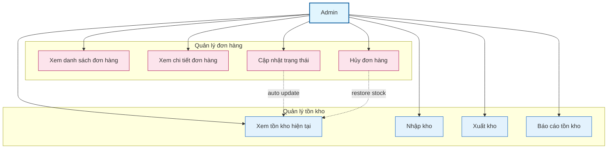

#### UC17: Quản lý tồn kho
- **UC17A: Xem tồn kho**
  - **Actor**: Admin
  - **Mô tả**: Admin xem tình trạng tồn kho của tất cả sản phẩm
  - **Main Flow**:
    1. Admin truy cập trang quản lý tồn kho
    2. Xem thông tin: sản phẩm, tồn kho hiện tại, số lượng nhập, xuất
  - **Controller**: `InventoryController@index`

- **UC15B: Cập nhật tồn kho**
  - **Actor**: Admin
  - **Mô tả**: Admin nhập/xuất kho để cập nhật tồn kho
  - **Main Flow**:
    1. Admin chọn sản phẩm cần cập nhật
    2. Nhập số lượng nhập/xuất và lý do
    3. Hệ thống cập nhật current_stock và ghi log
  - **Controller**: `InventoryController@update`

#### UC16: Quản lý đơn hàng
- **UC16A: Xem danh sách đơn hàng**
  - **Actor**: Admin
  - **Mô tả**: Admin xem và quản lý tất cả đơn hàng
  - **Main Flow**:
    1. Admin truy cập trang quản lý đơn hàng
    2. Xem danh sách với phân trang (15 đơn hàng/trang)
    3. Có thể tìm kiếm theo mã đơn hàng hoặc thông tin khách hàng
    4. Có thể lọc theo trạng thái đơn hàng
  - **Controller**: `OrderController@index`

- **UC16B: Xem chi tiết đơn hàng**
  - **Actor**: Admin
  - **Mô tả**: Admin xem thông tin chi tiết của một đơn hàng
  - **Main Flow**:
    1. Admin click vào đơn hàng
    2. Xem thông tin: khách hàng, sản phẩm, số lượng, tổng tiền, trạng thái
  - **Controller**: `OrderController@show`

- **UC16C: Cập nhật trạng thái đơn hàng**
  - **Actor**: Admin
  - **Mô tả**: Admin thay đổi trạng thái đơn hàng
  - **Main Flow**:
    1. Admin chọn trạng thái mới (pending → processing → shipped → delivered)
    2. Hệ thống cập nhật trạng thái và thời gian
  - **Alternative Flow**: 
    - Hủy đơn hàng → Hoàn trả tồn kho
  - **Controller**: `OrderController@updateStatus`

#### UC20: Quản lý người dùng
- **UC20A: Xem danh sách người dùng**
  - **Actor**: Admin
  - **Mô tả**: Admin xem và quản lý tài khoản người dùng
  - **Main Flow**:
    1. Admin xem danh sách người dùng
    2. Có thể tìm kiếm theo tên hoặc email
    3. Xem thông tin chi tiết từng người dùng
  - **Controller**: `UserManagementController@index`

- **UC20B: Cập nhật thông tin người dùng**
  - **Actor**: Admin
  - **Mô tả**: Admin chỉnh sửa thông tin người dùng và phân quyền
  - **Main Flow**:
    1. Admin chọn người dùng cần sửa
    2. Cập nhật thông tin cá nhân
    3. Gán/thu hồi role (customer, manager, admin)
  - **Controller**: `UserManagementController@update`, `assignRole`, `removeRole`

- **UC20C: Xóa người dùng**
  - **Actor**: Admin
  - **Mô tả**: Admin xóa tài khoản người dùng khỏi hệ thống
  - **Main Flow**:
    1. Admin chọn người dùng cần xóa
    2. Xác nhận xóa
    3. Hệ thống xóa người dùng và dữ liệu liên quan
  - **Controller**: `UserManagementController@destroy`

- **UC20D: Quản lý Role**
  - **Actor**: Admin
  - **Mô tả**: Admin tạo và quản lý các vai trò trong hệ thống
  - **Main Flow**:
    1. Admin xem danh sách roles
    2. Tạo role mới hoặc xóa role hiện có
    3. Xem danh sách permissions của từng role
  - **Controller**: `UserManagementController@roles`, `createRole`, `deleteRole`

### 3.3 Báo cáo và thống kê

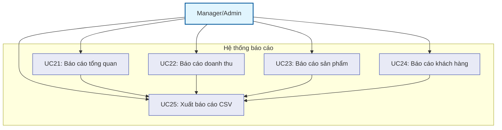

#### UC21: Báo cáo tổng quan 📊 *Mới*
- **Actor**: Manager/Admin
- **Mô tả**: Xem dashboard với các chỉ số tổng quan của hệ thống
- **Precondition**: Đã đăng nhập với role Manager hoặc Admin
- **Main Flow**:
  1. Manager truy cập trang báo cáo tổng quan
  2. Hệ thống hiển thị các chỉ số:
     - Tổng doanh thu (loại trừ đơn hủy)
     - Tổng số đơn hàng
     - Tổng số khách hàng
     - Tổng số sản phẩm
     - Doanh thu hôm nay
     - Doanh thu tháng này
  3. Hiển thị biểu đồ doanh thu theo tháng (12 tháng gần nhất)
  4. Hiển thị top 10 sản phẩm bán chạy
  5. Hiển thị phân bố đơn hàng theo trạng thái
- **Business Value**: Cung cấp cái nhìn tổng quan về tình hình kinh doanh
- **Controller**: `ReportController@index`

#### UC22: Báo cáo doanh thu 💰 *Mới*
- **Actor**: Manager/Admin
- **Mô tả**: Xem báo cáo chi tiết về doanh thu theo khoảng thời gian
- **Main Flow**:
  1. Manager chọn khoảng thời gian (start_date, end_date)
  2. Chọn cách nhóm dữ liệu (theo ngày/tuần/tháng)
  3. Hệ thống tính toán:
     - Tổng doanh thu trong khoảng thời gian
     - Số lượng đơn hàng
     - Giá trị đơn hàng trung bình
     - Biểu đồ doanh thu theo thời gian
  4. Có thể xuất báo cáo ra file CSV
- **Business Value**: Theo dõi xu hướng doanh thu, đánh giá hiệu quả kinh doanh
- **Controller**: `ReportController@revenue`

#### UC23: Báo cáo sản phẩm 📦 *Mới*
- **Actor**: Manager/Admin
- **Mô tả**: Phân tích hiệu suất bán hàng của từng sản phẩm
- **Main Flow**:
  1. Manager chọn khoảng thời gian
  2. Hệ thống hiển thị:
     - Top 20 sản phẩm bán chạy nhất
     - Số lượng đã bán
     - Doanh thu từng sản phẩm
     - Phân tích theo danh mục (quantity, revenue)
  3. Có thể sắp xếp theo số lượng hoặc doanh thu
  4. Có thể xuất báo cáo ra file CSV
- **Business Value**: Xác định sản phẩm chiến lược, tối ưu hóa kho hàng
- **Controller**: `ReportController@products`

#### UC24: Báo cáo khách hàng 👥 *Mới*
- **Actor**: Manager/Admin
- **Mô tả**: Phân tích hành vi và giá trị khách hàng
- **Main Flow**:
  1. Manager chọn khoảng thời gian
  2. Hệ thống hiển thị:
     - Top 20 khách hàng theo tổng chi tiêu
     - Số lượng khách hàng mới
     - Số lượng khách hàng có đơn hàng (active)
     - Thông tin chi tiết: tên, email, số đơn, tổng chi tiêu
  3. Có thể xuất báo cáo ra file CSV
- **Business Value**: Nhận diện khách hàng VIP, đánh giá chất lượng dịch vụ
- **Controller**: `ReportController@customers`

#### UC25: Xuất báo cáo CSV 📄 *Mới*
- **Actor**: Manager/Admin
- **Mô tả**: Xuất dữ liệu báo cáo ra file CSV để phân tích ngoại tuyến
- **Main Flow**:
  1. Manager đang xem một báo cáo (revenue/products/customers)
  2. Click nút "Xuất CSV"
  3. Chọn loại báo cáo và khoảng thời gian
  4. Hệ thống tạo file CSV với dữ liệu tương ứng
  5. Tải file về máy
- **Supported Reports**:
  - Revenue Report: Ngày, Doanh thu, Số đơn hàng
  - Products Report: Tên sản phẩm, Đã bán, Doanh thu
  - Customers Report: Tên, Email, Số đơn, Tổng chi tiêu
- **Controller**: `ReportController@export`

---

## 4. Luồng nghiệp vụ chính

### 4.1 Luồng mua hàng hoàn chỉnh

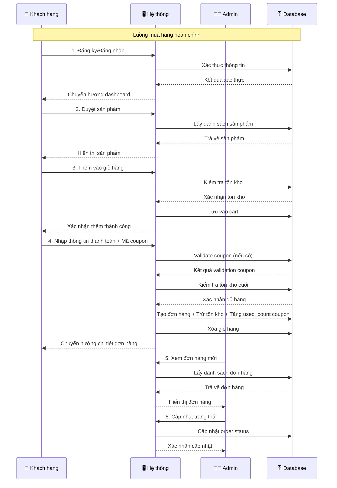

**Mô tả chi tiết luồng mua hàng:**
1. **Khách hàng đăng ký/đăng nhập** (UC01/UC02)
2. **Duyệt sản phẩm** (UC04/UC05/UC06/UC07)
3. **Thêm vào giỏ hàng** (UC08)
4. **Quản lý giỏ hàng** (UC09/UC10/UC11)
5. **Thanh toán COD** (UC12)
6. **Admin xử lý đơn hàng** (UC16A/UC16B/UC16C)

### 4.2 Luồng quản lý sản phẩm

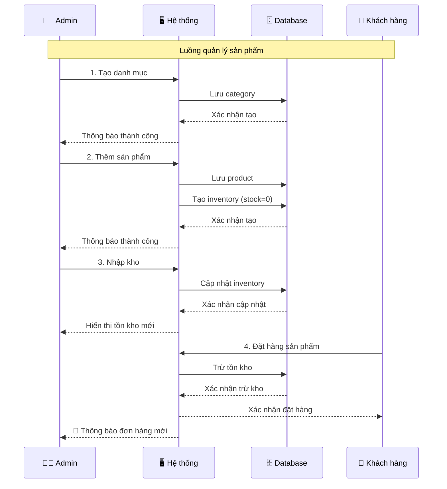

**Mô tả chi tiết luồng quản lý sản phẩm:**
1. **Admin tạo danh mục** (UC16)
2. **Admin thêm sản phẩm** (UC15)
3. **Admin cập nhật tồn kho** (UC18)
4. **Khách hàng mua sản phẩm** (UC08-UC12)
5. **Hệ thống tự động trừ tồn kho**

### 4.3 Luồng đánh giá sản phẩm

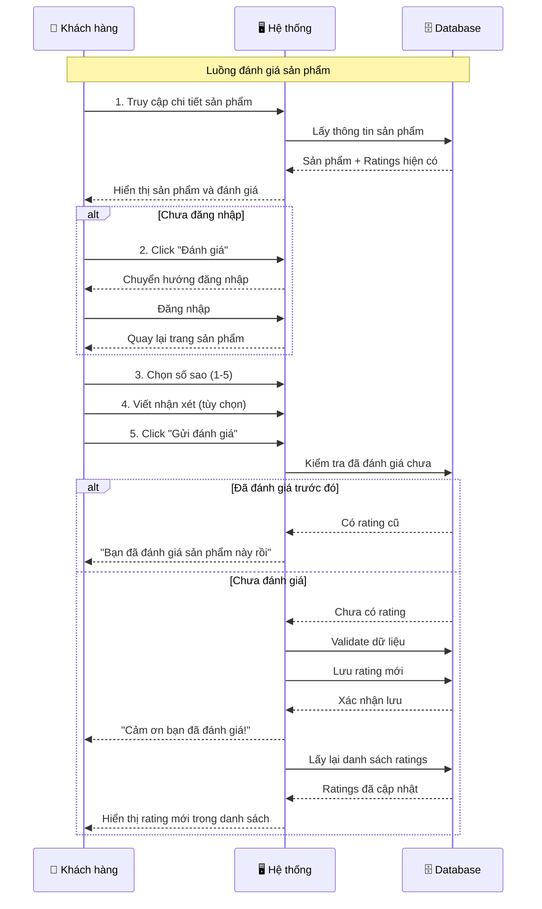

**Mô tả chi tiết luồng đánh giá sản phẩm:**
1. **Khách hàng xem chi tiết sản phẩm** (UC06)
2. **Khách hàng xem các đánh giá hiện có**
3. **Khách hàng đăng nhập** (nếu chưa) (UC02)
4. **Khách hàng chọn số sao và viết nhận xét** (UC14)
5. **Hệ thống kiểm tra chống duplicate rating**
6. **Hệ thống lưu đánh giá và cập nhật UI**

### 4.4 Luồng báo cáo và thống kê

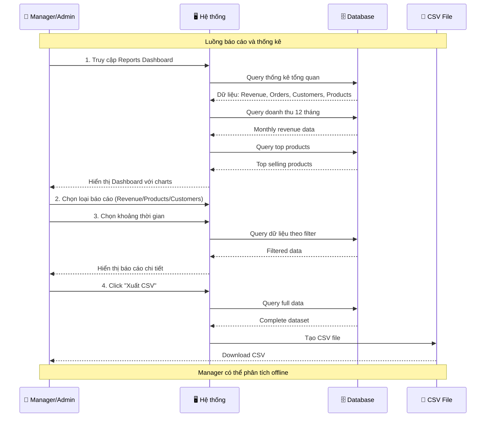

**Mô tả chi tiết luồng báo cáo:**
1. **Manager/Admin đăng nhập** (UC02)
2. **Truy cập Reports Dashboard** (UC21)
3. **Xem các chỉ số tổng quan**: Doanh thu, Đơn hàng, KH, SP
4. **Xem báo cáo chi tiết**: Revenue (UC22), Products (UC23), Customers (UC24)
5. **Lọc theo khoảng thời gian**
6. **Xuất CSV để phân tích** (UC25)

---

## 5. Quy tắc nghiệp vụ

### 5.1 Tồn kho
- Tồn kho được trừ ngay khi khách hàng đặt hàng (giữ hàng)
- Nếu hủy đơn hàng, hoàn trả tồn kho
- Không cho phép đặt hàng khi không đủ tồn kho

### 5.2 Thanh toán
- Hiện tại chỉ hỗ trợ COD (Cash on Delivery)
- Đơn hàng được tạo với trạng thái "pending"
- Khách hàng có thể áp dụng mã giảm giá trong quá trình thanh toán

### 5.3 Coupon/Mã giảm giá
- Mã coupon phải unique và được tự động chuyển thành chữ hoa
- Coupon có 2 loại: percentage (%) và fixed amount (VND)
- Coupon có thời gian hiệu lực (start_date đến end_date)
- Coupon có thể có giới hạn số lần sử dụng (usage_limit)
- Coupon có điều kiện đơn hàng tối thiểu (min_order_amount)
- Percentage coupon có thể có giới hạn số tiền giảm tối đa (max_discount_amount)
- Khi áp dụng coupon thành công, tăng used_count
- Coupon có trạng thái is_active (có thể bật/tắt)
- Chỉ Admin/Manager mới có thể quản lý coupon
- Admin có thể CRUD, Manager chỉ xem

### 5.4 Đánh giá sản phẩm (Rating)
- Khách hàng phải đăng nhập mới được đánh giá
- Mỗi khách hàng chỉ đánh giá 1 lần cho mỗi sản phẩm
- Rating bắt buộc: số sao từ 1-5
- Review (nhận xét) là tùy chọn, tối đa 1000 ký tự
- Đánh giá hiển thị công khai kèm tên người dùng và thời gian
- Không có chức năng chỉnh sửa/xóa rating (tránh abuse)

### 5.5 Trạng thái đơn hàng
- **pending**: Đơn hàng mới tạo, chờ xử lý
- **processing**: Admin đã xác nhận, đang chuẩn bị hàng
- **shipped**: Đã giao cho đơn vị vận chuyển
- **delivered**: Đã giao hàng thành công cho khách
- **cancelled**: Đơn hàng bị hủy (hoàn trả tồn kho)

**Quy tắc chuyển trạng thái:**
- pending → processing hoặc cancelled
- processing → shipped hoặc cancelled
- shipped → delivered
- delivered và cancelled là trạng thái cuối, không chuyển được nữa

### 5.6 Phân quyền (3 cấp)
- **Customer**: 
  - Xem và mua sản phẩm
  - Quản lý giỏ hàng và đơn hàng của mình
  - Đánh giá sản phẩm
  - Không truy cập dashboard admin
  
- **Manager**: 
  - Xem tất cả: sản phẩm, danh mục, đơn hàng, coupon, tồn kho
  - Cập nhật trạng thái đơn hàng và tồn kho
  - Xem tất cả báo cáo và thống kê
  - Xuất báo cáo CSV
  - KHÔNG được: tạo/sửa/xóa sản phẩm, danh mục, coupon, người dùng
  
- **Admin**: 
  - Toàn quyền trên hệ thống
  - CRUD đầy đủ: sản phẩm, danh mục, coupon, người dùng, role
  - Quản lý phân quyền
  - Xóa đơn hàng (chỉ đơn đã giao hoặc đã hủy)

### 5.7 Báo cáo và thống kê
- Manager và Admin đều có quyền xem báo cáo
- Tất cả báo cáo loại trừ đơn hàng đã hủy (status = 'cancelled')
- Báo cáo có thể lọc theo khoảng thời gian
- Hỗ trợ xuất CSV cho 3 loại: Revenue, Products, Customers
- Doanh thu tính = tổng total_amount của orders (đã trừ giảm giá)
- Top products xếp theo total_sold (số lượng đã bán)

---

## 6. Biểu đồ trạng thái và phân quyền

### 6.1 Biểu đồ trạng thái đơn hàng

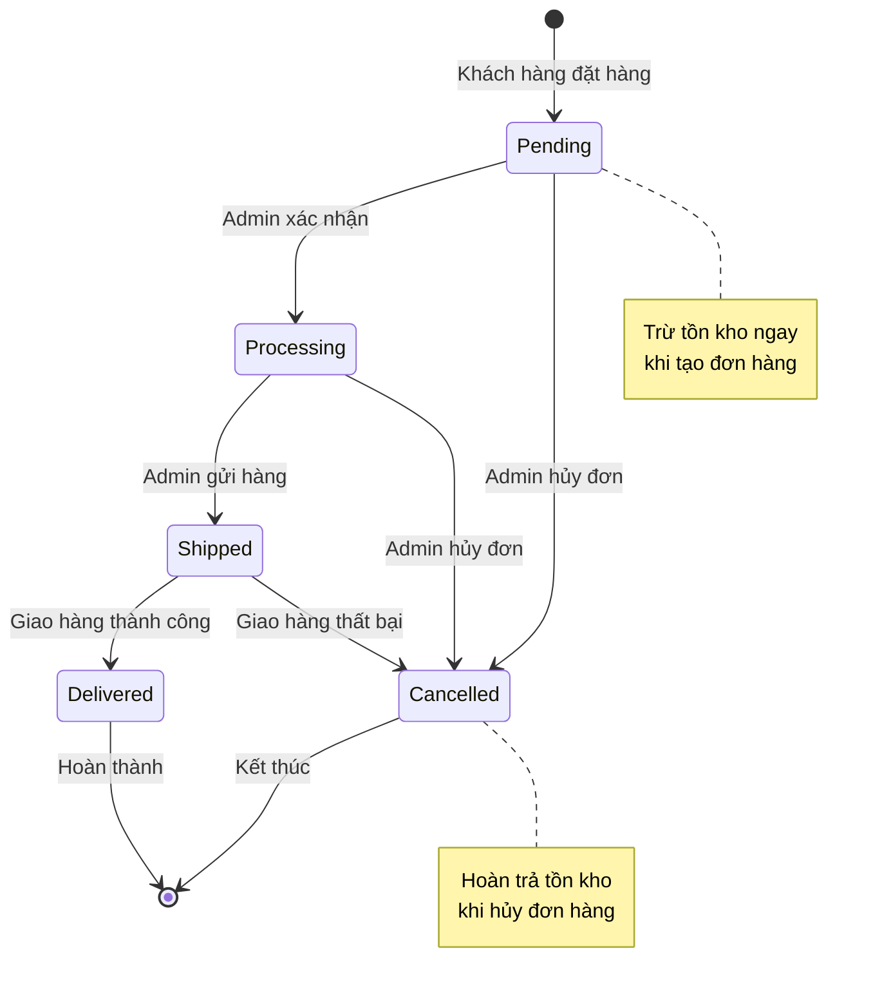

### 6.2 Biểu đồ phân quyền hệ thống

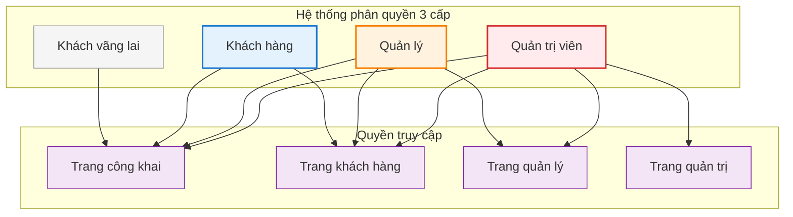

---

## 7. Mô hình dữ liệu quan hệ

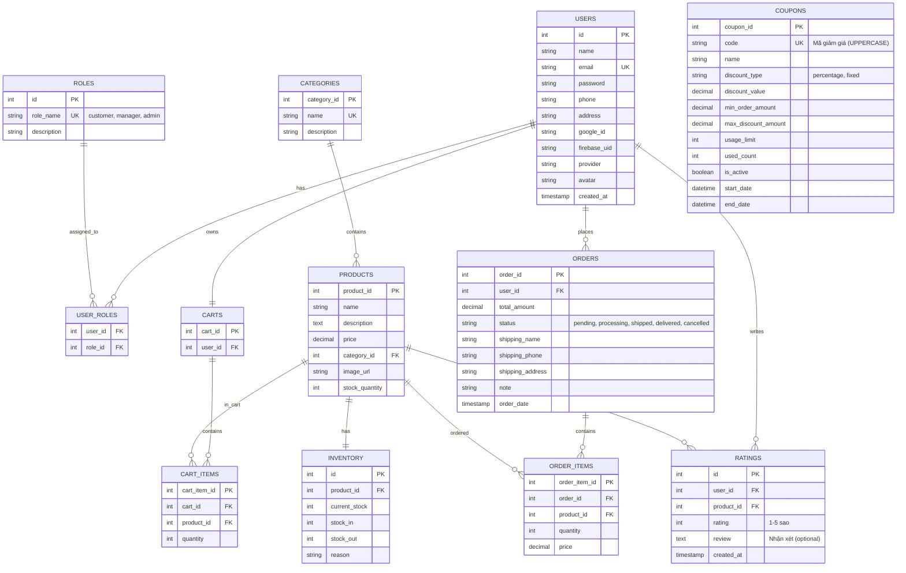

---

## 8. Ma trận phân quyền

### 8.1 Bảng phân quyền chi tiết

| Chức năng | Guest | Customer | Manager | Admin |
|-----------|-------|----------|---------|-------|
| **XÁC THỰC** | | | | |
| Đăng ký tài khoản | ✅ | ❌ | ❌ | ❌ |
| Đăng nhập | ✅ | ✅ | ✅ | ✅ |
| Đăng xuất | ❌ | ✅ | ✅ | ✅ |
| **SẢN PHẨM - KHÁCH HÀNG** | | | | |
| Xem danh sách sản phẩm | ✅ | ✅ | ✅ | ✅ |
| Tìm kiếm sản phẩm | ✅ | ✅ | ✅ | ✅ |
| Xem chi tiết sản phẩm | ✅ | ✅ | ✅ | ✅ |
| Xem theo danh mục | ✅ | ✅ | ✅ | ✅ |
| Đánh giá sản phẩm | ❌ | ✅ | ✅ | ✅ |
| **GIỎ HÀNG** | | | | |
| Xem giỏ hàng | ❌ | ✅ | ✅ | ✅ |
| Thêm vào giỏ hàng | ❌ | ✅ | ✅ | ✅ |
| Cập nhật giỏ hàng | ❌ | ✅ | ✅ | ✅ |
| Xóa khỏi giỏ hàng | ❌ | ✅ | ✅ | ✅ |
| Thanh toán COD | ❌ | ✅ | ✅ | ✅ |
| Áp dụng coupon | ❌ | ✅ | ✅ | ✅ |
| **SẢN PHẨM - QUẢN TRỊ** | | | | |
| Xem sản phẩm (Dashboard) | ❌ | ❌ | ✅ | ✅ |
| Tạo sản phẩm mới | ❌ | ❌ | ❌ | ✅ |
| Cập nhật sản phẩm | ❌ | ❌ | ❌ | ✅ |
| Xóa sản phẩm | ❌ | ❌ | ❌ | ✅ |
| **DANH MỤC** | | | | |
| Xem danh mục (Dashboard) | ❌ | ❌ | ✅ | ✅ |
| Tạo danh mục | ❌ | ❌ | ❌ | ✅ |
| Cập nhật danh mục | ❌ | ❌ | ❌ | ✅ |
| Xóa danh mục | ❌ | ❌ | ❌ | ✅ |
| **COUPON** | | | | |
| Xem coupon | ❌ | ❌ | ✅ | ✅ |
| Tạo coupon | ❌ | ❌ | ❌ | ✅ |
| Cập nhật coupon | ❌ | ❌ | ❌ | ✅ |
| Xóa coupon | ❌ | ❌ | ❌ | ✅ |
| Bật/tắt coupon | ❌ | ❌ | ❌ | ✅ |
| **TỒN KHO** | | | | |
| Xem tồn kho | ❌ | ❌ | ✅ | ✅ |
| Cập nhật tồn kho | ❌ | ❌ | ✅ | ✅ |
| Điều chỉnh tồn kho | ❌ | ❌ | ✅ | ✅ |
| **ĐƠN HÀNG** | | | | |
| Xem đơn hàng của mình | ❌ | ✅ | ❌ | ❌ |
| Xem tất cả đơn hàng | ❌ | ❌ | ✅ | ✅ |
| Cập nhật trạng thái | ❌ | ❌ | ✅ | ✅ |
| Xóa đơn hàng | ❌ | ❌ | ❌ | ✅ |
| **NGƯỜI DÙNG** | | | | |
| Xem danh sách user | ❌ | ❌ | ❌ | ✅ |
| Cập nhật thông tin user | ❌ | ❌ | ❌ | ✅ |
| Xóa user | ❌ | ❌ | ❌ | ✅ |
| Gán/thu hồi role | ❌ | ❌ | ❌ | ✅ |
| Quản lý roles | ❌ | ❌ | ❌ | ✅ |
| **BÁO CÁO & THỐNG KÊ** | | | | |
| Báo cáo tổng quan | ❌ | ❌ | ✅ | ✅ |
| Báo cáo doanh thu | ❌ | ❌ | ✅ | ✅ |
| Báo cáo sản phẩm | ❌ | ❌ | ✅ | ✅ |
| Báo cáo khách hàng | ❌ | ❌ | ✅ | ✅ |
| Xuất CSV | ❌ | ❌ | ✅ | ✅ |

### 8.2 Middleware Routes Summary

```php
// Public routes - Không cần đăng nhập
- GET  /                        // Home
- GET  /products               // Danh sách sản phẩm
- GET  /product/{id}           // Chi tiết sản phẩm
- GET  /category/{id}          // Sản phẩm theo danh mục
- GET  /login, /register       // Auth pages

// Authenticated routes - Cần đăng nhập
- GET  /cart                   // Giỏ hàng
- POST /cart/add               // Thêm vào giỏ
- POST /cart/checkout          // Thanh toán
- POST /product/{id}/rating    // Đánh giá sản phẩm

// Manager routes - middleware('role:manager')
- GET  /dashboard/products     // Xem sản phẩm
- GET  /dashboard/categories   // Xem danh mục
- GET  /dashboard/coupons      // Xem coupon
- GET  /dashboard/orders       // Xem đơn hàng
- PUT  /dashboard/orders/{id}  // Cập nhật đơn hàng
- GET  /dashboard/inventory    // Xem tồn kho
- PUT  /dashboard/inventory/{id} // Cập nhật tồn kho
- GET  /dashboard/reports/*    // Tất cả báo cáo

// Admin routes - middleware('role:admin')
- POST   /dashboard/products   // Tạo sản phẩm
- PUT    /dashboard/products/{id} // Cập nhật sản phẩm
- DELETE /dashboard/products/{id} // Xóa sản phẩm
- POST   /dashboard/categories    // Tạo danh mục
- PUT    /dashboard/categories/{id} // Cập nhật danh mục
- DELETE /dashboard/categories/{id} // Xóa danh mục
- POST   /dashboard/coupons       // Tạo coupon
- PUT    /dashboard/coupons/{id}  // Cập nhật coupon
- DELETE /dashboard/coupons/{id}  // Xóa coupon
- PATCH  /dashboard/coupons/{id}/toggle-status // Bật/tắt coupon
- DELETE /dashboard/orders/{id}   // Xóa đơn hàng
- GET    /dashboard/users         // Quản lý user
- POST   /dashboard/users/{user}/assign-role // Gán role
- DELETE /dashboard/users/{user}/remove-role/{role} // Thu hồi role
```

---

## 📋 Tóm tắt

### 📊 Thống kê Use Cases:
- **👤 Khách hàng**: 14 use cases (UC01-UC14)
  - Xác thực: 3 UCs
  - Duyệt sản phẩm: 4 UCs
  - Giỏ hàng: 5 UCs
  - Thanh toán: 1 UC
  - Đánh giá: 1 UC ⭐
  
- **👔 Quản lý (Manager)**: 11 use cases (UC15-UC25, trừ UC20)
  - Xem sản phẩm/danh mục: ✅
  - Xem coupon: ✅
  - Quản lý đơn hàng: ✅
  - Quản lý tồn kho: ✅
  - Báo cáo & thống kê: 5 UCs 📊
  
- **👨‍💼 Admin**: Tất cả 25 use cases
  - CRUD đầy đủ sản phẩm/danh mục/coupon
  - Quản lý người dùng & phân quyền: UC20
  - Tất cả quyền của Manager

- **🔄 Luồng nghiệp vụ**: 4 luồng chính
  - Mua hàng hoàn chỉnh
  - Quản lý sản phẩm
  - Đánh giá sản phẩm ⭐
  - Báo cáo & thống kê 📊

- **📋 Quy tắc**: 7 nhóm quy tắc nghiệp vụ
  - Tồn kho
  - Thanh toán
  - Coupon
  - Rating ⭐
  - Trạng thái đơn hàng
  - Phân quyền 3 cấp
  - Báo cáo & thống kê 📊

### 🎯 Chức năng cốt lõi:
1. **Xác thực và phân quyền**: Đăng ký, đăng nhập, phân quyền 3 cấp (Customer/Manager/Admin)
2. **Quản lý sản phẩm**: CRUD sản phẩm, danh mục, tồn kho
3. **Mua sắm**: Duyệt, tìm kiếm, giỏ hàng, thanh toán, đánh giá ⭐
4. **Hệ thống giảm giá**: Quản lý và áp dụng coupon (% hoặc fixed)
5. **Quản lý đơn hàng**: Theo dõi, cập nhật trạng thái với workflow rõ ràng
6. **Báo cáo & Phân tích**: Dashboard analytics, doanh thu, sản phẩm, khách hàng, export CSV 📊

### 💡 Đặc điểm nổi bật:
- ✅ **Tồn kho thời gian thực**: Trừ ngay khi đặt hàng, hoàn trả khi hủy
- ✅ **Thanh toán COD**: Đơn giản, phù hợp thị trường Việt Nam
- ✅ **Hệ thống coupon linh hoạt**: Hỗ trợ % và số tiền cố định, điều kiện đơn tối thiểu
- ✅ **Phân quyền 3 cấp rõ ràng**: Customer/Manager/Admin với middleware routes
- ✅ **Rating System**: Đánh giá 1-5 sao, review, chống duplicate ⭐
- ✅ **Business Intelligence**: Báo cáo tổng quan, phân tích xu hướng, export data 📊
- ✅ **Order State Machine**: Workflow chuyển trạng thái rõ ràng, tự động hoàn kho
- ✅ **Luồng nghiệp vụ hoàn chỉnh**: Từ đăng ký → mua hàng → đánh giá → phân tích

### 🗄️ Database Tables:
11 bảng chính:
1. **users** - Người dùng (hỗ trợ OAuth Google/Firebase)
2. **roles** - Vai trò (customer, manager, admin)
3. **user_roles** - Phân quyền nhiều-nhiều
4. **categories** - Danh mục sản phẩm
5. **products** - Sản phẩm
6. **inventory** - Quản lý tồn kho
7. **carts** + **cart_items** - Giỏ hàng
8. **orders** + **order_items** - Đơn hàng
9. **coupons** - Mã giảm giá ✨
10. **ratings** - Đánh giá sản phẩm ⭐

### 🎨 Biểu đồ đầy đủ:
- ✅ Use Case tổng quan (25 UCs)
- ✅ Use Case chi tiết từng nhóm chức năng
- ✅ Sequence diagrams (4 luồng)
- ✅ State diagram (Order status)
- ✅ Authorization diagram (3-tier)
- ✅ ERD (Entity Relationship Diagram)
- ✅ Permission Matrix

---

## 📚 Tài liệu liên quan

Tham khảo các tài liệu khác để hiểu rõ hơn:
- **PROJECT_OVERVIEW.md** - Tổng quan dự án
- **ARCHITECTURE.md** - Kiến trúc hệ thống
- **DATABASE.md** - Chi tiết database schema
- **API_REFERENCE.md** - Tài liệu API
- **AUTHENTICATION.md** - Xác thực & phân quyền
- **BUSINESS_LOGIC.md** - Logic nghiệp vụ
- **CODING_CONVENTIONS.md** - Quy ước code

---

*Tài liệu này được tạo và cập nhật dựa trên phân tích toàn diện source code của hệ thống webshop Laravel, bao gồm controllers, models, routes, và migrations. Phiên bản hiện tại phản ánh đầy đủ tất cả chức năng đã được implement trong hệ thống.*

**Ngày cập nhật**: 22/10/2025  
**Phiên bản**: 2.0 - Full Documentation  
**Trạng thái**: ✅ Complete & Up-to-date
