# BIỂU ĐỒ THÀNH PHẦN (COMPONENT DIAGRAM) - WEBSHOP PROJECT

## Mục lục
1. [Tổng quan](#tổng-quan)
2. [Kiến trúc tổng thể](#kiến-trúc-tổng-thể)
3. [Chi tiết các thành phần](#chi-tiết-các-thành-phần)
4. [Biểu đồ tương tác](#biểu-đồ-tương-tác)
5. [Deployment Architecture](#deployment-architecture)

---

## Tổng quan

Hệ thống WebShop được xây dựng theo kiến trúc **Layered Architecture** kết hợp với **Service-Oriented Architecture (SOA)**. Dưới đây là mô tả chi tiết về các thành phần và cách chúng tương tác với nhau.

### Công nghệ sử dụng:
- **Backend Framework**: Laravel 11.x (PHP 8.2+)
- **Database**: MySQL/MariaDB
- **Authentication**: Laravel Sanctum (Token-based)
- **Payment Gateway**: VNPay
- **Social Login**: Laravel Socialite (Google, Facebook, GitHub)
- **API Architecture**: RESTful API

---

## Kiến trúc tổng thể

### Biểu đồ kiến trúc cấp cao

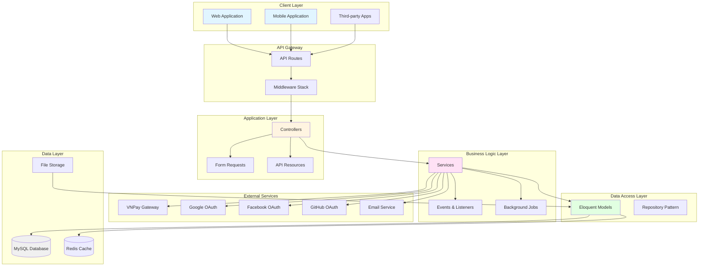

---

## Chi tiết các thành phần

### 1. Client Layer (Tầng khách hàng)

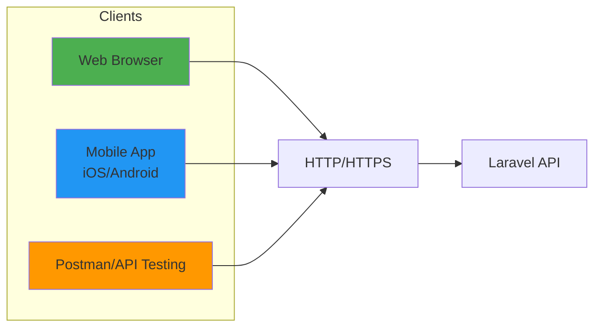

**Mô tả**:
- **Web Browser**: Ứng dụng web SPA (Single Page Application) hoặc web truyền thống
- **Mobile App**: Ứng dụng di động giao tiếp qua RESTful API
- **API Testing Tools**: Postman, Insomnia cho việc test và phát triển

**Protocol**: HTTP/HTTPS với JSON format

---

### 2. API Gateway Layer (Tầng cổng API)

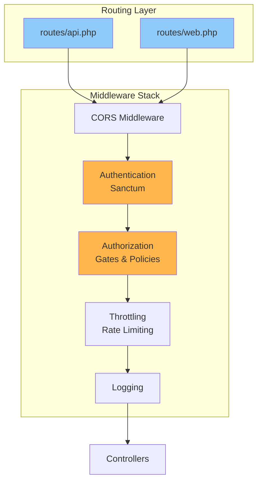

#### 2.1. Routes (Định tuyến)

**API Routes** (`routes/api.php`):
```php
// Public routes
POST   /api/auth/login
POST   /api/auth/register
GET    /api/products
GET    /api/categories

// Protected routes (require authentication)
GET    /api/auth/profile
POST   /api/auth/logout
GET    /api/cart/current
POST   /api/orders
GET    /api/orders/{id}

// Admin routes (require admin role)
POST   /api/products
PUT    /api/products/{id}
DELETE /api/products/{id}
GET    /api/admin/dashboard
```

#### 2.2. Middleware Components

| Middleware | Chức năng | Thứ tự |
|------------|-----------|--------|
| **CORS** | Xử lý Cross-Origin Resource Sharing | 1 |
| **Sanctum** | Xác thực token API | 2 |
| **CheckRole** | Kiểm tra quyền user (admin/manager/customer) | 3 |
| **Throttle** | Giới hạn số request (60 requests/minute) | 4 |
| **LogActivity** | Ghi log hoạt động | 5 |

---

### 3. Application Layer (Tầng ứng dụng)

```mermaid
graph TB
    subgraph "Controllers Package"
        Auth[AuthController]
        Product[ProductController]
        Order[OrderController]
        Cart[CartController]
        Payment[PaymentController]
        Category[CategoryController]
        Coupon[CouponController]
        Inventory[InventoryController]
        Profile[ProfileController]
        Social[SocialAuthController]
        Password[PasswordResetController]
    end
    
    subgraph "Request Validation"
        LoginReq[LoginRequest]
        RegisterReq[RegisterRequest]
        ProductReq[ProductRequest]
        OrderReq[OrderRequest]
        CartReq[CartRequest]
        CheckoutReq[CheckoutRequest]
    end
    
    subgraph "Response Formatting"
        UserRes[UserResource]
        ProductRes[ProductResource]
        OrderRes[OrderResource]
        CartRes[CartResource]
        ErrorRes[ErrorResource]
        SuccessRes[SuccessResource]
    end
    
    Auth --> LoginReq
    Auth --> RegisterReq
    Auth --> UserRes
    
    Product --> ProductReq
    Product --> ProductRes
    
    Order --> OrderReq
    Order --> OrderRes
    
    Cart --> CartReq
    Cart --> CheckoutReq
    Cart --> CartRes
    
    style Auth fill:#FFCDD2
    style Product fill:#F8BBD0
    style Order fill:#E1BEE7
    style Cart fill:#D1C4E9
```

#### 3.1. Controllers (14 controllers)

| Controller | Chức năng chính | Số lượng endpoints |
|------------|----------------|-------------------|
| **AuthController** | Đăng nhập, đăng ký, logout, profile | 6 |
| **ProductController** | CRUD sản phẩm, ratings, stats | 8 |
| **OrderController** | CRUD đơn hàng, change status, stats | 8 |
| **CartController** | Quản lý giỏ hàng, checkout | 12 |
| **PaymentController** | VNPay payment, callback, IPN | 6 |
| **CategoryController** | CRUD danh mục | 5 |
| **CouponController** | CRUD mã giảm giá, validate | 7 |
| **InventoryController** | Quản lý tồn kho, stats | 9 |
| **ProfileController** | Update profile, change password | 4 |
| **SocialAuthController** | OAuth login (Google, FB, GitHub) | 3 |
| **PasswordResetController** | Quên mật khẩu, reset password | 3 |
| **CartItemController** | CRUD cart items | 5 |
| **OrderItemController** | CRUD order items | 5 |
| **ProductDetailController** | CRUD chi tiết sản phẩm | 5 |

**Tổng cộng**: ~86 API endpoints

#### 3.2. Form Requests (Validation Layer)

```php
// Ví dụ: LoginRequest
class LoginRequest extends FormRequest
{
    public function rules()
    {
        return [
            'email' => 'required|email',
            'password' => 'required|min:6',
        ];
    }
}
```

**Danh sách Form Requests**:
- LoginRequest, RegisterRequest
- ProductRequest, ProductDetailRequest
- OrderRequest, OrderItemRequest
- CartRequest, CartItemRequest, CheckoutRequest
- CategoryRequest, CouponRequest
- InventoryRequest, InventoryAdjustmentRequest
- ProfileUpdateRequest, ChangePasswordRequest
- RatingRequest
- PasswordResetRequest, PasswordResetLinkRequest

#### 3.3. API Resources (Response Transformation)

```php
// Ví dụ: UserResource
class UserResource extends JsonResource
{
    public function toArray($request)
    {
        return [
            'id' => $this->id,
            'name' => $this->name,
            'email' => $this->email,
            'roles' => $this->roles->pluck('name'),
            'created_at' => $this->created_at,
        ];
    }
}
```

**Danh sách Resources**:
- UserResource
- ProductResource, ProductCollection
- OrderResource, OrderCollection
- CartResource, CartItemResource
- CategoryResource, CategoryCollection
- CouponResource, InventoryResource
- RatingResource, PaymentResource
- ErrorResource, SuccessResource

---

### 4. Business Logic Layer (Tầng logic nghiệp vụ)

```mermaid
graph TB
    subgraph "Services"
        AuthSvc[AuthService]
        ProductSvc[ProductService]
        OrderSvc[OrderService]
        CartSvc[CartService]
        PaymentSvc[PaymentService]
        CategorySvc[CategoryService]
        CouponSvc[CouponService]
        InventorySvc[InventoryService]
        ProfileSvc[ProfileService]
        SocialAuthSvc[SocialAuthService]
        PasswordResetSvc[PasswordResetService]
        HomeSvc[HomeService]
        ReportSvc[ReportService]
    end
    
    subgraph "Business Rules"
        OrderStatus[Order Status Transitions]
        CouponValidation[Coupon Validation]
        StockManagement[Stock Management]
        PriceCalculation[Price Calculation]
        RolePermissions[Role & Permissions]
    end
    
    OrderSvc --> OrderStatus
    CartSvc --> CouponValidation
    CartSvc --> StockManagement
    CartSvc --> PriceCalculation
    InventorySvc --> StockManagement
    AuthSvc --> RolePermissions
    
    style AuthSvc fill:#FFE082
    style OrderSvc fill:#FFCC80
    style CartSvc fill:#FFAB91
    style PaymentSvc fill:#EF9A9A
```

#### 4.1. Service Components

##### AuthService
```
Chức năng:
├── authenticate(email, password)
├── register(userData, assignRole)
├── createApiToken(user)
├── revokeCurrentToken(user)
├── canAccessDashboard(user)
├── getDashboardData()
└── isAuthenticated(user)

Dependencies:
├── User Model
├── Role Model
└── Laravel Sanctum
```

##### ProductService
```
Chức năng:
├── getProducts(filters, perPage)
├── createProductFull(data)
├── findProduct(id, withRelations)
├── updateProductFull(id, data)
├── deleteProductById(id)
├── createRating(data, productId)
└── getProductStats()

Dependencies:
├── Product Model
├── Category Model
├── ProductDetail Model
├── Inventory Model
└── Rating Model
```

##### OrderService
```
Chức năng:
├── getOrders(userId, isAdmin, filters, perPage)
├── createOrder(data)
├── findOrder(id, withRelations)
├── updateOrder(id, data)
├── deleteOrderById(id)
├── canTransitionToStatus(order, newStatus)
├── updateOrderStatus(id, status)
├── getAllStatuses()
├── getOrderStats()
└── getOrderForPayment(orderId, userId)

Dependencies:
├── Order Model
├── OrderItem Model
├── Inventory Model
└── Product Model
```

##### CartService
```
Chức năng:
├── getCarts(userId, isAdmin, filters)
├── getOrCreateCart()
├── findOrCreateCartForUser(cartId, userId)
├── addItemsToCart(cart, items)
├── updateCartItems(cart, items)
├── deleteCart(cart)
├── addToCart(productId, quantity)
├── updateCartItem(cartItemId, quantity)
├── removeFromCart(cartItemId)
├── clearCart()
├── processCheckout(data)
└── userOwnsCart(cart, userId)

Dependencies:
├── Cart Model
├── CartItem Model
├── Product Model
├── Inventory Model
├── Order Model
├── OrderItem Model
└── Coupon Model
```

##### PaymentService
```
Chức năng:
├── createVNPayPaymentUrl(orderId, ipAddress)
├── validateVNPayCallback(inputData)
├── processVNPayReturn(inputData, userId)
└── processVNPayIPN(inputData)

Dependencies:
├── Order Model
├── VNPay Configuration
└── Hash Algorithm (SHA256)

External API:
└── VNPay Payment Gateway
```

#### 4.2. Business Rules Engine

**Order Status Transition Rules**:
```
┌─────────┐
│ PENDING │
└────┬────┘
     │
     ├──→ PROCESSING ──→ SHIPPED ──→ DELIVERED
     │
     └──→ CANCELLED
          ↑
          │
     PROCESSING ──→ CANCELLED
```

**Stock Management Rules**:
```php
Rules:
1. Khi thêm vào cart: Kiểm tra stock_quantity > 0
2. Khi checkout: 
   - Lock inventory
   - Validate stock
   - Update stock_out
   - Update current_stock
3. Khi hủy order:
   - Hoàn lại stock
   - Update inventory
```

**Coupon Validation Rules**:
```php
Validation Steps:
1. Check is_active = true
2. Check current_date between start_date and end_date
3. Check used_count < usage_limit
4. Check order_amount >= min_order_amount
5. Check product_id match (nếu coupon áp dụng cho sản phẩm cụ thể)

Calculation:
- Percentage: discount = order_amount * (discount_value / 100)
- Fixed: discount = discount_value
- Apply max_discount_amount if needed
```

---

### 5. Data Access Layer (Tầng truy xuất dữ liệu)

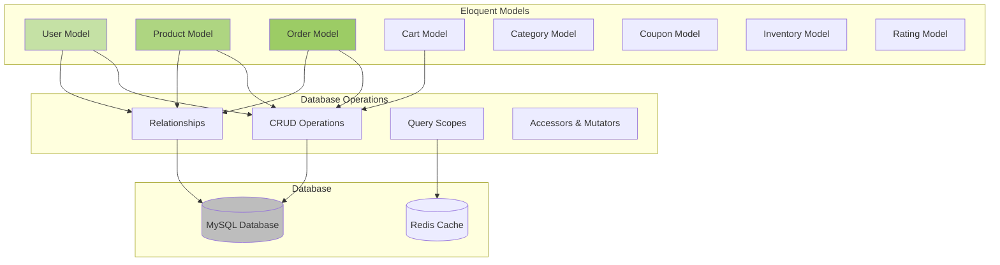

#### 5.1. Models (13 models)

| Model | Table | Primary Key | Relationships |
|-------|-------|-------------|---------------|
| **User** | users | id | roles, carts, orders, ratings |
| **Role** | roles | role_id | users |
| **UserRole** | user_roles | - | user, role |
| **Product** | products | product_id | category, details, inventory, cartItems, orderItems, ratings, coupons |
| **Category** | categories | category_id | products |
| **ProductDetail** | product_details | detail_id | product |
| **Inventory** | inventories | inventory_id | product |
| **Cart** | carts | cart_id | user, items, products |
| **CartItem** | cart_items | cart_item_id | cart, product |
| **Order** | orders | order_id | user, items |
| **OrderItem** | order_items | order_item_id | order, product |
| **Coupon** | coupons | coupon_id | product |
| **Rating** | ratings | rating_id | user, product |
| **RevenueReport** | revenue_reports | report_id | - |

#### 5.2. Database Schema Overview

```sql
-- Core Tables
users (id, name, email, password, phone, address, avatar)
roles (role_id, name, description)
user_roles (user_id, role_id)

-- Product Tables
categories (category_id, name, description)
products (product_id, name, price, category_id, stock_quantity, image_url)
product_details (detail_id, product_id, color, storage, ram, chip, os)
inventories (inventory_id, product_id, stock_in, stock_out, current_stock)

-- Shopping Tables
carts (cart_id, user_id)
cart_items (cart_item_id, cart_id, product_id, quantity, price)
orders (order_id, user_id, total_amount, status, payment_status, payment_method)
order_items (order_item_id, order_id, product_id, quantity, price, discount_amount)

-- Marketing Tables
coupons (coupon_id, code, discount_type, discount_value, start_date, end_date, is_active)
ratings (rating_id, user_id, product_id, rating, review)

-- Analytics Tables
revenue_reports (report_id, report_date, daily_revenue, monthly_revenue, yearly_revenue)
```

---

### 6. External Services Layer (Tầng dịch vụ bên ngoài)

```mermaid
graph LR
    subgraph "Laravel App"
        A[PaymentService]
        B[SocialAuthService]
        C[PasswordResetService]
    end
    
    subgraph "External APIs"
        D[VNPay Gateway]
        E[Google OAuth]
        F[Facebook OAuth]
        G[GitHub OAuth]
        H[Email Service<br/>SMTP/Gmail]
    end
    
    A -->|HTTPS| D
    B -->|OAuth 2.0| E
    B -->|OAuth 2.0| F
    B -->|OAuth 2.0| G
    C -->|SMTP| H
    
    style D fill:#FF6F00
    style E fill:#4285F4
    style F fill:#1877F2
    style G fill:#24292E
    style H fill:#EA4335
```

#### 6.1. VNPay Payment Integration

**Flow**:
```
1. User checkout → PaymentService.createVNPayPaymentUrl()
2. Generate vnp_SecureHash
3. Redirect user to VNPay
4. User pays at VNPay
5. VNPay redirect back → PaymentController.vnpayReturn()
6. Validate vnp_SecureHash
7. Update order payment_status
8. VNPay IPN callback → PaymentController.vnpayIPN()
```

**VNPay Parameters**:
```php
[
    'vnp_Version' => '2.1.0',
    'vnp_Command' => 'pay',
    'vnp_TmnCode' => env('VNPAY_TMN_CODE'),
    'vnp_Amount' => $amount * 100,
    'vnp_CurrCode' => 'VND',
    'vnp_TxnRef' => $orderId,
    'vnp_OrderInfo' => $orderInfo,
    'vnp_ReturnUrl' => route('api.payment.vnpay.return'),
    'vnp_IpnUrl' => route('api.payment.vnpay.ipn'),
]
```

#### 6.2. Social Authentication (Laravel Socialite)

**Supported Providers**:
- Google
- Facebook
- GitHub

**OAuth Flow**:
```
1. User clicks "Login with Google"
2. SocialAuthController.redirect('google')
3. Redirect to Google OAuth consent screen
4. User authorizes
5. Google redirects back with code
6. SocialAuthController.callback('google')
7. Exchange code for access_token
8. Get user info from Google
9. Find or create user in database
10. Generate Laravel Sanctum token
11. Return token to client
```

**Mobile/SPA Flow** (Token-based):
```
1. Client gets access_token from provider
2. Send to SocialAuthController.loginWithToken()
3. Validate token with provider
4. Get user info
5. Find or create user
6. Generate Sanctum token
7. Return token
```

#### 6.3. Email Service

**Use Cases**:
- Password reset email
- Order confirmation email
- Welcome email
- Promotional emails

**Configuration**:
```php
// .env
MAIL_MAILER=smtp
MAIL_HOST=smtp.gmail.com
MAIL_PORT=587
MAIL_USERNAME=your-email@gmail.com
MAIL_PASSWORD=your-app-password
MAIL_ENCRYPTION=tls
MAIL_FROM_ADDRESS=noreply@webshop.com
MAIL_FROM_NAME="WebShop"
```

---

### 7. Infrastructure Layer (Tầng hạ tầng)

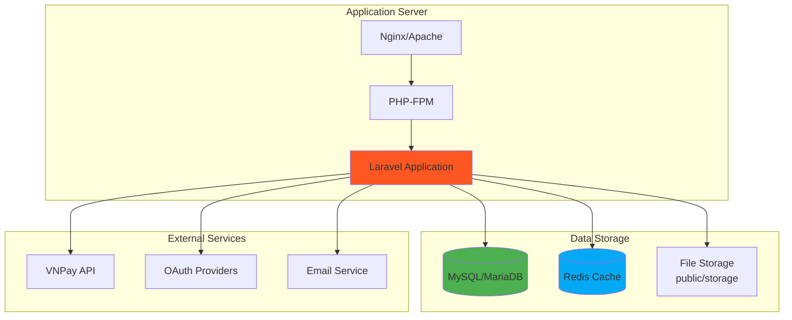

#### 7.1. Server Requirements

```
PHP >= 8.2
MySQL >= 8.0 hoặc MariaDB >= 10.3
Redis (optional, for caching)
Composer 2.x
Node.js & NPM (for asset compilation)
```

#### 7.2. Laravel Dependencies

```json
{
    "laravel/framework": "^11.0",
    "laravel/sanctum": "^4.0",
    "laravel/socialite": "^5.0",
    "laravel/tinker": "^2.9"
}
```

---

## Biểu đồ tương tác

### 1. Authentication Flow

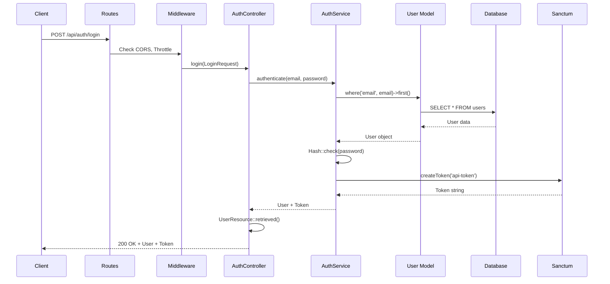

### 2. Checkout Flow

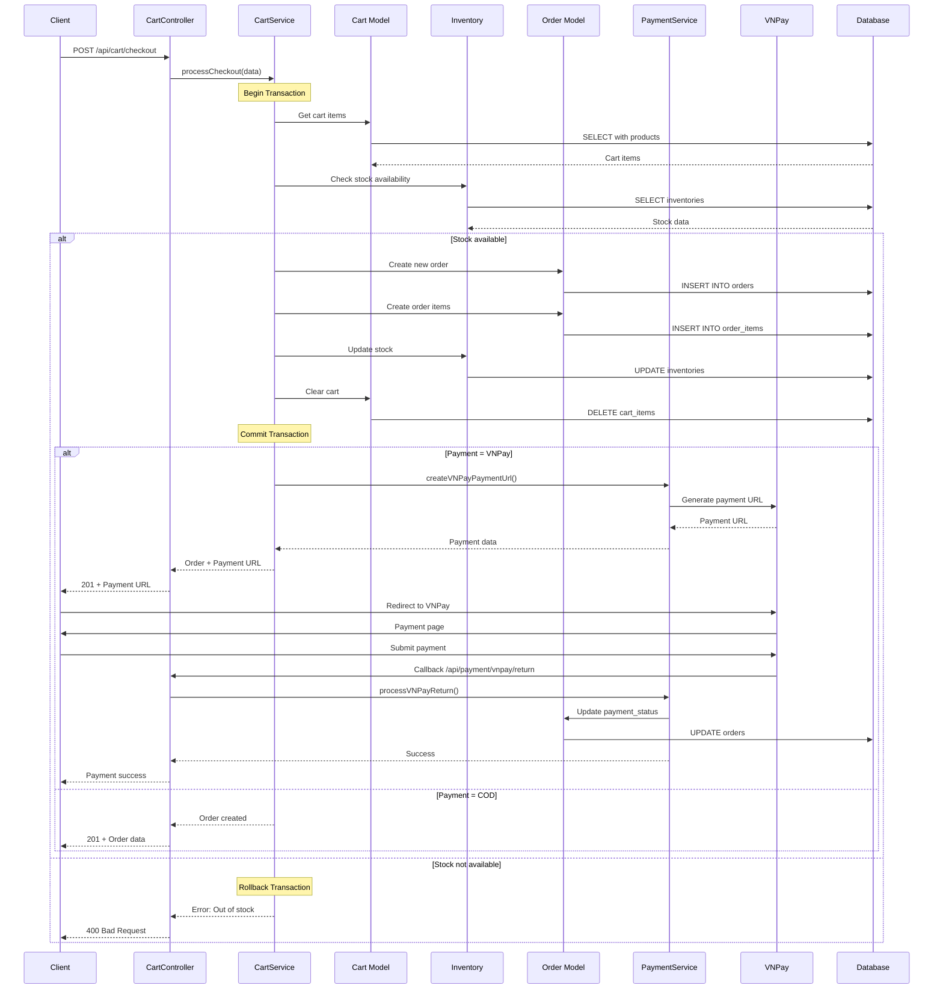

### 3. Product Browse & Search Flow

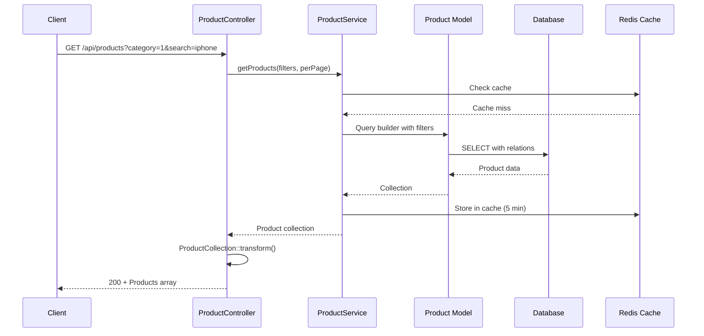

---

## Deployment Architecture

### Production Deployment

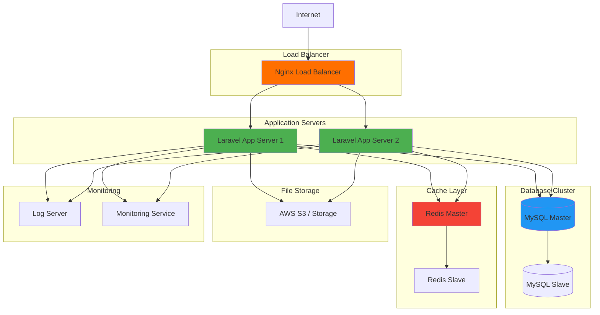

### Docker Deployment (Alternative)

```yaml
# docker-compose.yml structure
services:
  app:
    - Laravel Application
    - PHP-FPM
  
  nginx:
    - Web Server
    - Reverse Proxy
  
  mysql:
    - Database Server
    - Persistent Volume
  
  redis:
    - Cache Server
    - Session Storage
  
  queue:
    - Queue Worker
    - Background Jobs
```

---

## Component Dependencies

### Package Dependencies

```
Laravel Framework
├── laravel/sanctum (Authentication)
├── laravel/socialite (OAuth)
└── laravel/tinker (REPL)

Third-party Packages
├── guzzlehttp/guzzle (HTTP Client)
├── intervention/image (Image Processing)
└── barryvdh/laravel-cors (CORS)
```

### Internal Dependencies

```
Controllers
├── depend on → Services
└── depend on → FormRequests

Services
├── depend on → Models
├── depend on → External APIs
└── may depend on → Other Services

Models
├── depend on → Database
└── depend on → Cache (optional)
```

---

## Security Components

### 1. Authentication & Authorization

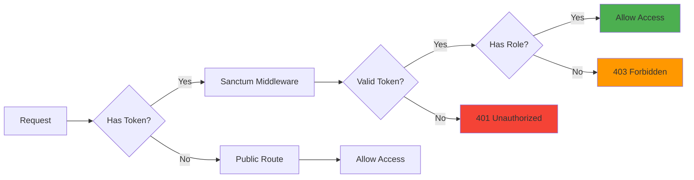

### 2. Data Validation

```
Input Validation
├── FormRequest Classes (Laravel Validation)
├── Custom Validation Rules
└── Database Constraints

Output Validation
├── API Resources (Data Transformation)
├── Type Hinting
└── Return Type Declarations
```

### 3. Security Features

- **CSRF Protection**: Laravel built-in (for web routes)
- **XSS Prevention**: Blade escaping, htmlspecialchars
- **SQL Injection**: Eloquent ORM, prepared statements
- **Rate Limiting**: Throttle middleware (60/minute)
- **Password Hashing**: bcrypt (cost factor 12)
- **Token Expiration**: Sanctum token (configurable)
- **HTTPS**: Enforced in production
- **CORS**: Configured for allowed origins

---

## Performance Optimization

### 1. Caching Strategy

```php
// Query Result Caching
Cache::remember('products.category.'.$id, 300, function() {
    return Product::where('category_id', $id)->get();
});

// Model Caching
$user = Cache::remember('user.'.$id, 600, function() use ($id) {
    return User::with('roles')->find($id);
});
```

### 2. Database Optimization

- **Eager Loading**: Reduce N+1 queries
- **Indexes**: On foreign keys, search columns
- **Query Optimization**: Select only needed columns
- **Database Pooling**: Connection reuse

### 3. API Optimization

- **Pagination**: Limit results per page (default 15)
- **Response Compression**: Gzip compression
- **Resource Transformation**: Only return needed fields
- **API Versioning**: Future-proof architecture

---

## Monitoring & Logging

### Application Logging

```
Logs Storage: storage/logs/laravel.log

Log Levels:
├── DEBUG: Development debugging
├── INFO: General information
├── WARNING: Warning messages
├── ERROR: Error messages
└── CRITICAL: Critical issues

Log Channels:
├── Single: Single file
├── Daily: Rotate daily
├── Stack: Multiple channels
└── Slack: Send to Slack (production alerts)
```

### Performance Monitoring

```
Metrics to Monitor:
├── Response Time (API endpoints)
├── Database Query Time
├── Cache Hit Rate
├── Error Rate
├── Request Rate
└── Server Resources (CPU, Memory, Disk)
```

---

## API Documentation

### API Endpoint Structure

```
Base URL: https://api.webshop.com/api

Authentication:
  Headers: Authorization: Bearer {token}

Response Format:
{
    "status": true,
    "message": "Success message",
    "data": {...},
    "meta": {
        "current_page": 1,
        "total": 100
    }
}

Error Format:
{
    "status": false,
    "message": "Error message",
    "errors": {...}
}
```

**Tổng số API endpoints**: ~86 endpoints

Chi tiết xem tại: [API_REFERENCE.md](./API_REFERENCE.md)

---

## Tổng kết

### Kiến trúc phân tầng

```
┌─────────────────────────────────────┐
│       Client Applications            │  (Web, Mobile, API Clients)
├─────────────────────────────────────┤
│       API Gateway Layer              │  (Routes, Middleware)
├─────────────────────────────────────┤
│       Application Layer              │  (Controllers, Requests, Resources)
├─────────────────────────────────────┤
│       Business Logic Layer           │  (Services, Events, Jobs)
├─────────────────────────────────────┤
│       Data Access Layer              │  (Models, Repositories)
├─────────────────────────────────────┤
│       Infrastructure Layer           │  (Database, Cache, Storage)
└─────────────────────────────────────┘
```

### Đặc điểm nổi bật

1. **Separation of Concerns**: Tách biệt rõ ràng giữa các tầng
2. **Service Layer Pattern**: Business logic tập trung
3. **RESTful API Design**: Tuân thủ chuẩn REST
4. **Dependency Injection**: Loosely coupled components
5. **Token-based Authentication**: Stateless authentication
6. **External Service Integration**: VNPay, OAuth, Email
7. **Caching Strategy**: Performance optimization
8. **Security First**: Multiple security layers
9. **Scalable Architecture**: Horizontal scaling ready
10. **Well-documented**: Comprehensive documentation

---

**Tài liệu này mô tả chi tiết các thành phần trong hệ thống WebShop và cách chúng tương tác với nhau. Để hiểu rõ hơn về từng phần cụ thể, vui lòng tham khảo các tài liệu liên quan:**

- [CLASS_DIAGRAM.md](./CLASS_DIAGRAM.md) - Biểu đồ lớp chi tiết
- [API_REFERENCE.md](./API_REFERENCE.md) - Tài liệu API đầy đủ
- [DATABASE.md](./DATABASE.md) - Schema database
- [ARCHITECTURE.md](./ARCHITECTURE.md) - Kiến trúc tổng thể
