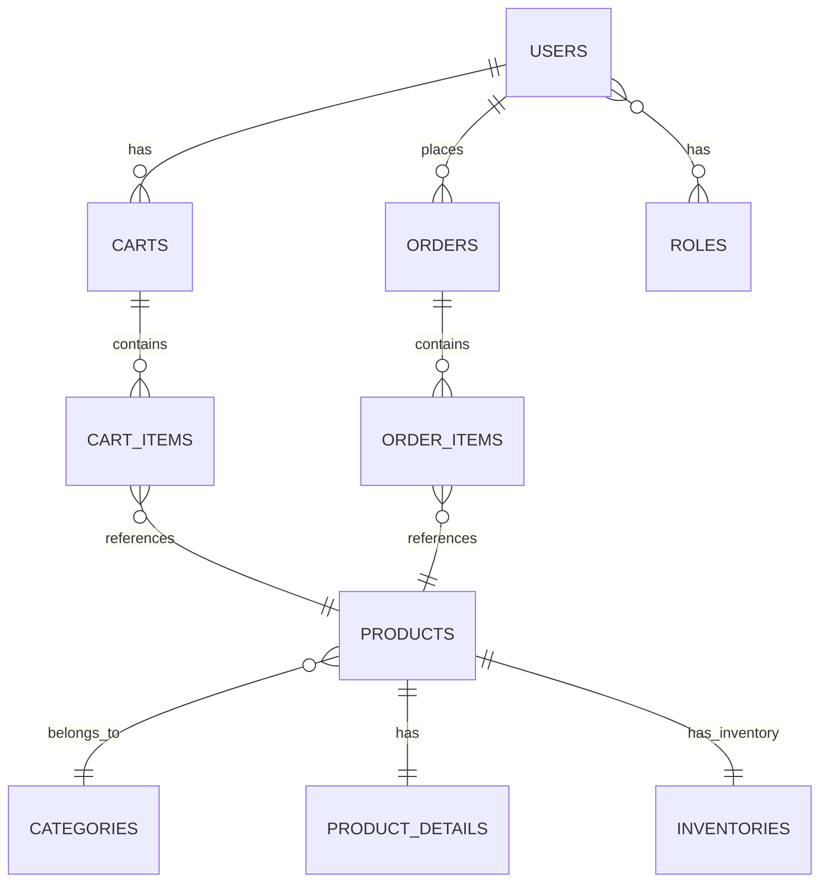

# 🌟 TỔNG QUAN DỰ ÁN WEBSHOP E-COMMERCE

> **Tài liệu tổng quan toàn diện về hệ thống WebShop E-commerce Platform**  
> Laravel 12 | PHP 8.4 | MySQL 8.0 | Redis | Tailwind CSS 4.0

---

## 📖 MỤC LỤC

1. [Giới thiệu dự án](#-giới-thiệu-dự-án)
2. [Mục tiêu và tầm nhìn](#-mục-tiêu-và-tầm-nhìn)
3. [Tính năng chính](#-tính-năng-chính)
4. [Kiến trúc hệ thống](#-kiến-trúc-hệ-thống)
5. [Công nghệ sử dụng](#-công-nghệ-sử-dụng)
6. [Cấu trúc dự án](#-cấu-trúc-dự-án)
7. [Cơ sở dữ liệu](#-cơ-sở-dữ-liệu)
8. [Phân quyền và bảo mật](#-phân-quyền-và-bảo-mật)
9. [API và tích hợp](#-api-và-tích-hợp)
10. [Quy trình phát triển](#-quy-trình-phát-triển)
11. [Hướng dẫn sử dụng](#-hướng-dẫn-sử-dụng)
12. [Khả năng mở rộng](#-khả-năng-mở-rộng)

---

## 🎯 GIỚI THIỆU DỰ ÁN

### WebShop E-commerce Platform

WebShop là một **nền tảng thương mại điện tử hoàn chỉnh** được phát triển với **Laravel 12**, nhằm cung cấp một giải pháp e-commerce toàn diện cho các doanh nghiệp vừa và nhỏ. Hệ thống được thiết kế với kiến trúc hiện đại, bảo mật cao và khả năng mở rộng linh hoạt.

### Đặc điểm nổi bật
- ✅ **Hoàn toàn mã nguồn mở** - Có thể tùy chỉnh theo nhu cầu
- ✅ **Kiến trúc hiện đại** - Sử dụng Laravel 12 và PHP 8.4
- ✅ **Bảo mật cao** - Xác thực API với Laravel Sanctum
- ✅ **Responsive Design** - Tương thích mọi thiết bị
- ✅ **Quản lý kho hàng thông minh** - Theo dõi tồn kho real-time
- ✅ **Hệ thống phân quyền linh hoạt** - RBAC với 4 cấp độ

---

## 🚀 MỤC TIÊU VÀ TẦM NHÌN

### Mục tiêu ngắn hạn
1. **Xây dựng nền tảng ổn định** - Cung cấp các chức năng cốt lõi của e-commerce
2. **Trải nghiệm người dùng tối ưu** - Giao diện thân thiện, dễ sử dụng
3. **Hiệu suất cao** - Tối ưu hóa tốc độ tải trang và xử lý
4. **Bảo mật toàn diện** - Đảm bảo an toàn thông tin khách hàng

### Tầm nhìn dài hạn
- 🎯 **Trở thành giải pháp e-commerce hàng đầu** cho SME
- 🌍 **Hỗ trợ đa ngôn ngữ và đa tiền tệ**
- 📱 **Phát triển ứng dụng mobile**
- 🤖 **Tích hợp AI/ML** cho khuyến nghị sản phẩm
- ☁️ **Cloud-native deployment** với khả năng auto-scaling

---

## ⚡ TÍNH NĂNG CHÍNH

### 🛍️ Quản lý sản phẩm
```
┌─────────────────────────────────────────────────────────┐
│  🏷️  DANH MỤC SẢN PHẨM                                  │
│  • Phân cấp danh mục đa cấp                            │
│  • Quản lý thuộc tính sản phẩm                         │
│  • Upload và quản lý hình ảnh                          │
│  • SEO-friendly URLs                                   │
└─────────────────────────────────────────────────────────┘
```

**Chi tiết tính năng:**
- ✅ CRUD sản phẩm với rich text editor
- ✅ Quản lý biến thể sản phẩm (size, màu sắc, v.v.)
- ✅ Tính năng tìm kiếm và lọc nâng cao
- ✅ Quản lý danh mục cây phân cấp
- ✅ Hệ thống đánh giá và nhận xét

### 🛒 Giỏ hàng và thanh toán
```
┌─────────────────────────────────────────────────────────┐
│  💳  QUY TRÌNH THANH TOÁN                               │
│  Duyệt SP → Thêm giỏ → Xem giỏ → Checkout → Đặt hàng   │
│     ↓         ↓         ↓         ↓          ↓        │
│   Browse    Add to    View     Payment    Order       │
│   Product    Cart     Cart     Method    Success      │
└─────────────────────────────────────────────────────────┘
```

**Tính năng:**
- ✅ Giỏ hàng persistent (lưu trong database)
- ✅ Cập nhật số lượng real-time
- ✅ Tính toán thuế và phí vận chuyển
- ✅ Thanh toán COD (Cash on Delivery)
- ✅ Xác nhận đơn hàng qua email

### 👥 Hệ thống phân quyền (RBAC)
```
┌─────────────────────────────────────────────────────────┐
│  🔐  PHÂN QUYỀN 4 CẤP ĐỘ                                │
│                                                         │
│  👤 Guest      → Xem sản phẩm, tìm kiếm                │
│  🛍️ Customer   → + Mua hàng, quản lý đơn hàng          │
│  👨‍💼 Manager    → + Quản lý sản phẩm, xem báo cáo       │
│  👑 Admin      → + Toàn quyền, quản lý người dùng      │
└─────────────────────────────────────────────────────────┘
```

### 📊 Dashboard quản trị
- 📈 **Báo cáo doanh thu** - Theo ngày, tuần, tháng
- 📦 **Quản lý đơn hàng** - Theo dõi trạng thái đơn hàng
- 📋 **Quản lý kho hàng** - Cảnh báo hết hàng, điều chỉnh tồn kho
- 👥 **Quản lý khách hàng** - Thông tin và lịch sử mua hàng

---

## 🏗️ KIẾN TRÚC HẾ THỐNG

### Kiến trúc tổng thể - MVC Pattern

```
┌───────────────────────────────────────────────────────────────┐
│                        PRESENTATION LAYER                     │
├─────────────────┬─────────────────┬─────────────────────────┤
│   Web Interface │   REST API      │   Admin Dashboard       │
│   (Blade Views) │   (JSON)        │   (Blade + JS)          │
└─────────┬───────┴─────────┬───────┴─────────┬───────────────┘
          │                 │                 │
          ▼                 ▼                 ▼
┌───────────────────────────────────────────────────────────────┐
│                      APPLICATION LAYER                        │
│  ┌─────────────────┐ ┌─────────────────┐ ┌─────────────────┐ │
│  │ Web Controllers │ │ API Controllers │ │ Admin Controllers│ │
│  │ • HomeController│ │ • AuthController│ │ • ProductCtrl   │ │
│  │ • CartController│ │ • ProductCtrl   │ │ • OrderCtrl     │ │
│  └─────────────────┘ └─────────────────┘ └─────────────────┘ │
└─────────────────────┬─────────────────────────────────────────┘
                      │
                      ▼
┌───────────────────────────────────────────────────────────────┐
│                      BUSINESS LAYER                           │
│  ┌─────────────────┐ ┌─────────────────┐ ┌─────────────────┐ │
│  │   Services      │ │   Repositories  │ │   Middleware    │ │
│  │ • AuthService   │ │ • ProductRepo   │ │ • AuthMiddleware│ │
│  │ • CartService   │ │ • OrderRepo     │ │ • AdminMware    │ │
│  └─────────────────┘ └─────────────────┘ └─────────────────┘ │
└─────────────────────┬─────────────────────────────────────────┘
                      │
                      ▼
┌───────────────────────────────────────────────────────────────┐
│                        DATA LAYER                             │
│  ┌─────────────────┐ ┌─────────────────┐ ┌─────────────────┐ │
│  │   Eloquent ORM  │ │   Cache Layer   │ │   File Storage  │ │
│  │ • Models        │ │ • Redis Cache   │ │ • Product Images│ │
│  │ • Relationships │ │ • Session Store │ │ • User Avatars  │ │
│  └─────────────────┘ └─────────────────┘ └─────────────────┘ │
└─────────────────────┬─────────────────────────────────────────┘
                      │
                      ▼
┌───────────────────────────────────────────────────────────────┐
│                     DATABASE LAYER                            │
│           MySQL 8.0 Database Server                          │
└───────────────────────────────────────────────────────────────┘
```

### Luồng xử lý request

```
🌐 Yêu cầu từ khách hàng
    ↓
🛡️ Middleware (Xác thực, CORS, Throttle)
    ↓
🎯 Định tuyến (web.php / api.php)
    ↓
🎮 Controller (Web/API Controller)
    ↓
💼 Tầng dịch vụ (Logic nghiệp vụ)
    ↓
📊 Repository Pattern (Truy cập dữ liệu)
    ↓
🗄️ Model (Eloquent ORM)
    ↓
💾 Cơ sở dữ liệu (MySQL)
    ↓
📤 Phản hồi (Blade View / JSON)
    ↓
🌐 Khách hàng nhận phản hồi
```

---

## 🛠️ CÔNG NGHỆ SỬ DỤNG

### Backend Stack
```yaml
Framework: Laravel 12 (Framework PHP hiện đại)
Language: PHP 8.4 (Ngôn ngữ lập trình chính)
Database: MySQL 8.0 (Cơ sở dữ liệu quan hệ)
Cache: Redis Alpine (Bộ nhớ đệm và session)
Queue: Redis (Hàng đợi xử lý bất đồng bộ)
Authentication: Laravel Sanctum (Xác thực API token)
Search: Database indexes + LIKE queries (Tìm kiếm cơ bản)
File Storage: Local Storage (Có thể cấu hình S3)
```

### Frontend Stack
```yaml
Template Engine: Blade Templates (Engine template của Laravel)
CSS Framework: Tailwind CSS 4.0 (Framework CSS utility-first)
Build Tool: Vite 7.0 (Công cụ build và bundling)
JavaScript: Vanilla JS + Alpine.js (Tương tác động)
Icons: Heroicons + Font Awesome (Bộ icon)
Responsive: Mobile-first approach (Thiết kế đáp ứng)
```

### Công cụ phát triển
```yaml
Containerization: Docker + Laravel Sail (Ảo hóa container)
Testing: PHPUnit 11 (Framework kiểm thử)
Code Quality: PHP CS Fixer, Larastan (Kiểm tra chất lượng code)
Documentation: Markdown-based docs (Tài liệu dạng Markdown)
Version Control: Git (Quản lý phiên bản)
Package Management: Composer, NPM (Quản lý thư viện)
```

### Môi trường production
```yaml
Web Server: Nginx (Máy chủ web)
Process Manager: Supervisor (Quản lý tiến trình)
SSL: Let's Encrypt (Chứng chỉ SSL miễn phí)
Monitoring: Laravel Telescope (Giám sát ứng dụng)
Logging: Laravel Log (Ghi log, có thể dùng ELK Stack)
Backup: Laravel Backup package (Sao lưu tự động)
```

---

## 📁 CẤU TRÚC DỰ ÁN

### Cấu trúc thư mục chính

```
webshop/
├── 📁 app/                          # Ứng dụng Laravel
│   ├── 📁 Http/
│   │   ├── 📁 Controllers/          # Controllers (Web + API)
│   │   ├── 📁 Middleware/           # Custom Middleware
│   │   ├── 📁 Requests/             # Form Request Validation
│   │   └── 📁 Resources/            # API Resources
│   ├── 📁 Models/                   # Eloquent Models
│   │   ├── 📄 User.php              # User model với roles
│   │   ├── 📄 Product.php           # Sản phẩm
│   │   ├── 📄 Category.php          # Danh mục
│   │   ├── 📄 Cart.php              # Giỏ hàng
│   │   ├── 📄 Order.php             # Đơn hàng
│   │   └── 📄 Inventory.php         # Quản lý kho
│   └── 📁 Providers/                # Service Providers
├── 📁 database/
│   ├── 📁 migrations/               # Database migrations
│   ├── 📁 seeders/                  # Data seeders
│   └── 📁 factories/                # Model factories
├── 📁 resources/
│   ├── 📁 views/                    # Blade templates
│   ├── 📁 css/                      # Styles (Tailwind)
│   └── 📁 js/                       # JavaScript files
├── 📁 routes/
│   ├── 📄 web.php                   # Web routes
│   ├── 📄 api.php                   # API routes
│   └── 📄 console.php               # Artisan commands
├── 📁 public/                       # Public assets
├── 📁 storage/                      # File storage
├── 📁 tests/                        # Test cases
├── 📁 docs/                         # Tài liệu dự án
│   ├── 📄 GETTING_STARTED.md        # Hướng dẫn bắt đầu
│   ├── 📄 ARCHITECTURE.md           # Kiến trúc hệ thống
│   ├── 📄 API_REFERENCE.md          # Tài liệu API
│   ├── 📄 BUSINESS_LOGIC.md         # Logic nghiệp vụ
│   ├── 📄 DATABASE.md               # Thiết kế database
│   └── 📄 COMPLETE_USE_CASES.md     # Use cases
├── 📄 compose.yaml                  # Docker configuration
├── 📄 package.json                  # Node.js dependencies
├── 📄 composer.json                 # PHP dependencies
└── 📄 README.md                     # Tài liệu chính
```

### Models và mối quan hệ

```php
// Các model chính và mối quan hệ
User (1) → (n) Cart → (n) CartItem → (1) Product
  (Người dùng → Giỏ hàng → Món hàng trong giỏ → Sản phẩm)

User (1) → (n) Order → (n) OrderItem → (1) Product
  (Người dùng → Đơn hàng → Món hàng trong đơn → Sản phẩm)

Product (n) → (1) Category
  (Sản phẩm thuộc về Danh mục)

Product (1) → (1) ProductDetail
  (Sản phẩm có Chi tiết sản phẩm)

Product (1) → (1) Inventory
  (Sản phẩm có Thông tin kho)

User (n) → (n) Role (Many-to-Many via UserRole)
  (Người dùng có nhiều Vai trò thông qua bảng UserRole)
```

---

## 🗄️ CƠ SỞ DỮ LIỆU

### Thiết kế database

```sql
-- CORE TABLES
users              # Người dùng (Customer, Admin, Manager)
roles              # Vai trò (Admin, Manager, Customer, Guest)
user_roles         # Bảng trung gian User-Role (M:N)

-- PRODUCT MANAGEMENT
categories         # Danh mục sản phẩm
products          # Sản phẩm chính
product_details   # Chi tiết sản phẩm (mô tả, specs)
inventories       # Quản lý tồn kho

-- SHOPPING & ORDERS
carts             # Giỏ hàng của user
cart_items        # Sản phẩm trong giỏ hàng
orders            # Đơn hàng
order_items       # Chi tiết đơn hàng

-- REPORTING
revenue_reports   # Báo cáo doanh thu (tùy chọn)
```

### Mối quan hệ chính



### Chiến lược Index và Performance

```sql
-- Indexes quan trọng
CREATE INDEX idx_products_category_id ON products(category_id);
CREATE INDEX idx_products_status ON products(status);
CREATE INDEX idx_orders_user_id ON orders(user_id);
CREATE INDEX idx_orders_status ON orders(status);
CREATE INDEX idx_cart_items_user_cart ON cart_items(cart_id, product_id);
```

---

## 🔐 PHÂN QUYỀN VÀ BẢO MẬT

### Hệ thống phân quyền RBAC (Role-Based Access Control)

```php
// 4 cấp độ người dùng với quyền hạn tăng dần
KHÁCH      → Xem sản phẩm, tìm kiếm (không cần đăng nhập)
KHÁCH HÀNG → + Mua hàng, quản lý giỏ hàng, xem đơn hàng của mình
QUẢN LÝ    → + Quản lý sản phẩm, xem tất cả đơn hàng, quản lý kho
ADMIN      → + Toàn quyền, quản lý người dùng, xóa dữ liệu

// Ví dụ middleware trong Laravel
Route::middleware(['auth:sanctum', 'role:admin'])->group(function () {
    // Chỉ Admin mới truy cập được
});
```

### Ma trận quyền hạn

| Tính năng | Guest | Customer | Manager | Admin |
|-----------|-------|----------|---------|-------|
| Xem sản phẩm | ✅ | ✅ | ✅ | ✅ |
| Tìm kiếm | ✅ | ✅ | ✅ | ✅ |
| Thêm giỏ hàng | ❌ | ✅ | ✅ | ✅ |
| Đặt hàng | ❌ | ✅ | ✅ | ✅ |
| Xem đơn hàng (own) | ❌ | ✅ | ✅ | ✅ |
| CRUD sản phẩm | ❌ | ❌ | ✅ | ✅ |
| Xem tất cả đơn hàng | ❌ | ❌ | ✅ | ✅ |
| Quản lý kho | ❌ | ❌ | ✅ | ✅ |
| Quản lý người dùng | ❌ | ❌ | ❌ | ✅ |
| Xóa dữ liệu | ❌ | ❌ | ❌ | ✅ |

### Bảo mật API

```php
// Laravel Sanctum Token Authentication
POST /api/auth/login     → Trả về access_token
Header: Authorization: Bearer {token}

// Middleware bảo vệ
'auth:sanctum'          → Yêu cầu đăng nhập
'admin'                 → Chỉ Admin
'manager'               → Manager trở lên
'customer'              → Customer trở lên
```

### Các biện pháp bảo mật khác

- 🛡️ **CSRF Protection** - Tự động bảo vệ với Laravel
- 🔒 **Password Hashing** - Bcrypt với salt
- 🚫 **SQL Injection Prevention** - Eloquent ORM tự động
- 🔐 **XSS Protection** - Blade template escaping
- ⏱️ **Rate Limiting** - Throttle middleware
- 📝 **Input Validation** - Form Request classes
- 🍪 **Secure Cookies** - HTTPOnly, Secure flags

---

## 🔌 API VÀ TÍCH HỢP

### REST API Endpoints

```yaml
Xác thực người dùng:
  POST   /api/auth/register     # Đăng ký tài khoản mới
  POST   /api/auth/login        # Đăng nhập và nhận token
  POST   /api/auth/logout       # Đăng xuất và hủy token
  GET    /api/auth/profile      # Thông tin người dùng hiện tại
  PUT    /api/auth/profile      # Cập nhật thông tin cá nhân

Quản lý sản phẩm:
  GET    /api/products          # Danh sách sản phẩm (có phân trang)
  GET    /api/products/{id}     # Chi tiết sản phẩm
  POST   /api/products          # Tạo sản phẩm mới (Quản lý+)
  PUT    /api/products/{id}     # Cập nhật sản phẩm (Quản lý+)
  DELETE /api/products/{id}     # Xóa sản phẩm (Chỉ Admin)
  GET    /api/products/search   # Tìm kiếm sản phẩm

Quản lý danh mục:
  GET    /api/categories        # Danh sách danh mục
  GET    /api/categories/{id}   # Chi tiết danh mục
  POST   /api/categories        # Tạo danh mục mới (Quản lý+)
  PUT    /api/categories/{id}   # Cập nhật danh mục (Quản lý+)
  DELETE /api/categories/{id}   # Xóa danh mục (Chỉ Admin)

Giỏ hàng:
  GET    /api/cart              # Xem giỏ hàng hiện tại
  POST   /api/cart/add          # Thêm sản phẩm vào giỏ
  PUT    /api/cart/update       # Cập nhật số lượng
  DELETE /api/cart/remove       # Xóa sản phẩm khỏi giỏ
  DELETE /api/cart/clear        # Xóa toàn bộ giỏ hàng

Đơn hàng:
  GET    /api/orders            # Danh sách đơn hàng của tôi
  POST   /api/orders/checkout   # Thanh toán giỏ hàng
  GET    /api/orders/{id}       # Chi tiết đơn hàng
  PUT    /api/orders/{id}/cancel # Hủy đơn hàng (nếu có thể)

Quản lý kho (Quản lý+):
  GET    /api/inventory         # Báo cáo tồn kho
  PUT    /api/inventory/{id}    # Điều chỉnh số lượng kho
  GET    /api/inventory/low-stock # Sản phẩm sắp hết hàng

Báo cáo (Quản lý+):
  GET    /api/reports/revenue   # Báo cáo doanh thu
  GET    /api/reports/orders    # Báo cáo đơn hàng
  GET    /api/reports/products  # Báo cáo sản phẩm bán chạy
```

### Định dạng phản hồi API

```json
// Phản hồi thành công
{
  "success": true,
  "message": "Thao tác thành công",
  "data": {
    "id": 1,
    "name": "Tên sản phẩm",
    "price": 100000
  },
  "meta": {
    "current_page": 1,
    "total_pages": 10,
    "total_items": 100,
    "per_page": 10
  }
}

// Phản hồi lỗi
{
  "success": false,
  "message": "Thông báo lỗi",
  "errors": {
    "field_name": ["Thông báo lỗi chi tiết"]
  },
  "error_code": "VALIDATION_ERROR"
}

// Phản hồi xác thực
{
  "success": true,
  "message": "Đăng nhập thành công",
  "data": {
    "user": {
      "id": 1,
      "name": "Tên người dùng",
      "email": "user@example.com",
      "roles": ["customer"]
    },
    "token": "Bearer token...",
    "expires_at": "2025-10-20T12:00:00Z"
  }
}
```

### Webhook và sự kiện hệ thống

```php
// Laravel Events được kích hoạt khi:
OrderPlaced::class           → Khi đặt hàng thành công
OrderStatusChanged::class    → Khi trạng thái đơn hàng thay đổi
OrderCancelled::class        → Khi đơn hàng bị hủy
ProductOutOfStock::class     → Khi sản phẩm hết hàng
ProductRestocked::class      → Khi sản phẩm được nhập kho
UserRegistered::class        → Khi có người dùng mới đăng ký
UserProfileUpdated::class    → Khi người dùng cập nhật thông tin
PaymentProcessed::class      → Khi thanh toán được xử lý
InventoryLow::class          → Khi kho hàng sắp hết

// Ví dụ Listener xử lý sự kiện
class SendOrderConfirmationEmail
{
    public function handle(OrderPlaced $event)
    {
        // Gửi email xác nhận đơn hàng
        Mail::to($event->order->user->email)
            ->send(new OrderConfirmationMail($event->order));
    }
}
```

---

## 🔄 QUY TRÌNH PHÁT TRIỂN

### Quy trình Git Workflow

```bash
main           # Nhánh sản xuất (production)
├── develop    # Nhánh phát triển chính
├── feature/*  # Nhánh tính năng mới
├── hotfix/*   # Nhánh sửa lỗi khẩn cấp
└── release/*  # Nhánh chuẩn bị phát hành
```

### Quy trình phát triển

1. **🎯 Lập kế hoạch** - Phân tích yêu cầu, thiết kế UI/UX
2. **🔧 Phát triển** - Code trên feature branch riêng biệt
3. **✅ Kiểm thử** - Unit tests + Feature tests + Integration tests
4. **🔍 Đánh giá code** - Pull Request review và feedback
5. **🚀 Triển khai** - Merge vào develop, sau đó lên production

### Quy tắc commit message

```bash
# Định dạng commit message
type(scope): subject

# Ví dụ:
feat(cart): thêm chức năng xóa toàn bộ giỏ hàng
fix(auth): sửa lỗi token expiration
docs(api): cập nhật tài liệu API endpoints
style(ui): cải thiện responsive design
refactor(product): tối ưu hóa query sản phẩm
test(order): thêm test case cho checkout process
```

### Chuẩn code và quy ước đặt tên

```php
// Tuân thủ PSR-12 Coding Standard và Laravel Conventions
Model:          PascalCase (User, Product, OrderItem)
Controller:     PascalCase + Controller (UserController)
Method:         camelCase (getUserOrders, addToCart)
Variable:       camelCase ($userId, $productList)
Constant:       UPPER_SNAKE_CASE (MAX_CART_ITEMS)
Migration:      snake_case (create_products_table)
Route name:     snake_case (products.show, cart.add)
View file:      kebab-case (product-detail.blade.php)
```

### Chiến lược kiểm thử (Test Pyramid)

```bash
# Tháp kiểm thử từ dưới lên trên
Unit Tests      → Logic model, Service methods (70%)
Feature Tests   → HTTP endpoints, User flows (20%)
Integration     → Database, API integration (8%)
Browser Tests   → UI/UX với Laravel Dusk (2%)

# Ví dụ test case
public function test_user_can_add_product_to_cart()
{
    $user = User::factory()->create();
    $product = Product::factory()->create(['stock_quantity' => 10]);
    
    $response = $this->actingAs($user)
        ->postJson('/api/cart/add', [
            'product_id' => $product->id,
            'quantity' => 2
        ]);
    
    $response->assertStatus(200)
        ->assertJson(['success' => true]);
}
```

---

## 📚 HƯỚNG DẪN SỬ DỤNG

### Cài đặt và khởi động

```bash
# 1. Sao chép repository về máy
git clone <repository-url> webshop
cd webshop

# 2. Cài đặt các thư viện phụ thuộc
composer install          # Cài đặt thư viện PHP
npm install              # Cài đặt thư viện JavaScript

# 3. Cấu hình môi trường
cp .env.example .env     # Sao chép file cấu hình
php artisan key:generate # Tạo khóa mã hóa ứng dụng

# 4. Thiết lập cơ sở dữ liệu
# Chỉnh sửa thông tin database trong .env
php artisan migrate --seed  # Chạy migration và seed dữ liệu mẫu

# 5. Biên dịch tài nguyên frontend
npm run build            # Cho production
# hoặc
npm run dev             # Cho development (watch mode)

# 6. Khởi động server phát triển
php artisan serve       # Server Laravel (http://localhost:8000)
npm run dev            # Server Vite (http://localhost:5173)
```

### Sử dụng Docker (Khuyến nghị)

```bash
# Khởi động với Laravel Sail (Docker wrapper)
./vendor/bin/sail up -d

# Tạo alias để sử dụng dễ dàng hơn
alias sail='./vendor/bin/sail'

# Các lệnh Docker thông dụng
sail up -d                    # Khởi động containers (chạy nền)
sail down                     # Dừng containers
sail artisan migrate --seed   # Chạy migration trong container
sail npm run dev             # Chạy Vite trong container
sail php artisan tinker      # Mở Laravel REPL
sail composer install        # Cài đặt thư viện PHP
sail test                    # Chạy test suite
```

### Truy cập ứng dụng

```yaml
Ứng dụng web:           http://localhost:8000
API Endpoints:          http://localhost:8000/api  
Trang quản trị:         http://localhost:8000/admin
Vite Development:       http://localhost:5173
Laravel Telescope:      http://localhost:8000/telescope
MailHog (email test):   http://localhost:8025
phpMyAdmin:             http://localhost:8080
```

### Tài khoản mặc định (sau khi chạy seed)

```yaml
Quản trị viên (Admin):
  Email: admin@webshop.com
  Mật khẩu: password
  Quyền: Toàn quyền hệ thống

Quản lý (Manager):
  Email: manager@webshop.com
  Mật khẩu: password
  Quyền: Quản lý sản phẩm và đơn hàng

Khách hàng (Customer):
  Email: customer@webshop.com
  Mật khẩu: password
  Quyền: Mua hàng và xem đơn hàng

Khách hàng mẫu 2:
  Email: user@webshop.com
  Mật khẩu: password
  Quyền: Khách hàng thông thường
```

### Backup và Recovery

```bash
# Backup tự động hàng ngày
php artisan backup:run
# File backup sẽ được lưu tại storage/app/backups/

# Restore từ backup
php artisan backup:restore backup-file.zip

# Cấu hình backup trong config/backup.php
- Database backup: Toàn bộ MySQL data
- Files backup: Storage files, uploads
- Retention: Giữ 7 ngày backup local, 30 ngày cloud
```

### Bảo trì và cập nhật

```bash
# Maintenance mode
php artisan down --message="Hệ thống đang bảo trì"
php artisan up

# Cập nhật hệ thống
composer update          # Cập nhật thư viện PHP
npm update              # Cập nhật thư viện JS
php artisan migrate     # Chạy migration mới
php artisan cache:clear # Xóa cache
php artisan config:clear # Xóa config cache
```

### Tối ưu hóa hiệu suất

```bash
# Caching strategies
php artisan config:cache    # Cache cấu hình
php artisan route:cache     # Cache routes
php artisan view:cache      # Cache Blade templates
php artisan event:cache     # Cache events

# Database optimization
php artisan db:optimize     # Optimize database
php artisan queue:work      # Process background jobs

# CDN và Asset optimization
npm run build              # Minify CSS/JS
php artisan storage:link   # Link storage folder
```

---

## 📊 BUSINESS INTELLIGENCE

### Dashboard Analytics

```yaml
Thống kê kinh doanh:
  - Doanh thu theo thời gian (ngày/tuần/tháng/năm)
  - Số lượng đơn hàng và tỷ lệ chuyển đổi
  - Sản phẩm bán chạy nhất
  - Khách hàng VIP và tần suất mua hàng

Thống kê sản phẩm:
  - Top sản phẩm theo doanh thu
  - Sản phẩm có lượt xem nhiều nhất
  - Tỷ lệ conversion từ view sang mua
  - Thời gian trung bình trên trang sản phẩm

Thống kê khách hàng:
  - Số lượng đăng ký mới theo thời gian
  - Customer Lifetime Value (CLV)
  - Segmentation khách hàng
  - Retention rate và churn rate
```

## �🚀 KHẢ NĂNG MỞ RỘNG

### Tính năng có thể bổ sung

#### Giai đoạn 2 - Tính năng nâng cao (3-6 tháng)
- 🔍 **Elasticsearch** - Nâng cao khả năng tìm kiếm với full-text search
- 📧 **Email Marketing** - Newsletter, email khuyến mãi tự động
- 🎁 **Hệ thống khuyến mãi** - Mã giảm giá, voucher, flash sale
- ⭐ **Đánh giá sản phẩm** - Review, rating với hình ảnh
- 📊 **Phân tích nâng cao** - Google Analytics, custom metrics
- 💳 **Cổng thanh toán** - Stripe, PayPal, VNPay, MoMo
- 📱 **Push Notifications** - Thông báo trực tiếp cho khách hàng
- 🎨 **Theme System** - Cho phép thay đổi giao diện

#### Giai đoạn 3 - Mở rộng và hiệu suất (6-12 tháng)
- 📱 **Ứng dụng di động** - React Native hoặc Flutter
- 🤖 **Gợi ý thông minh** - AI/ML cho recommend system
- 🌍 **Đa ngôn ngữ** - Hỗ trợ tiếng Việt, Anh, Trung
- 💰 **Đa tiền tệ** - VND, USD, EUR với tỷ giá real-time
- ☁️ **Cloud Storage** - AWS S3, Google Cloud, CDN
- 🔄 **API Rate Limiting** - Advanced throttling và caching
- 📈 **Real-time Analytics** - Dashboard real-time với WebSocket
- � **Marketing Automation** - Email sequence, customer journey

#### Giai đoạn 4 - Tính năng doanh nghiệp (1-2 năm)
- 🏢 **Marketplace đa nhà bán** - Platform thương mại điện tử
- 📦 **Tích hợp vận chuyển** - GHN, J&T Express, Giao Hàng Nhanh
- 📈 **Business Intelligence** - Dashboard phân tích kinh doanh
- 🔐 **Bảo mật nâng cao** - 2FA, audit logs, fraud detection
- 🎯 **Customer Segmentation** - Phân khúc khách hàng tự động
- 📱 **Progressive Web App** - PWA với offline support
- 🌐 **Multi-tenant** - Hỗ trợ nhiều cửa hàng trên 1 hệ thống
- 🤖 **Chatbot AI** - Hỗ trợ khách hàng tự động 24/7

### Kiến trúc Microservices (Tương lai)

```
┌─────────────────┐  ┌─────────────────┐  ┌─────────────────┐
│ Dịch vụ người   │  │ Dịch vụ sản     │  │ Dịch vụ đơn     │
│ dùng (Auth)     │  │ phẩm (Catalog)  │  │ hàng (Order)    │
└─────────────────┘  └─────────────────┘  └─────────────────┘
         │                     │                     │
         └─────────────────────┼─────────────────────┘
                               │
    ┌─────────────────┐       │       ┌─────────────────┐
    │ Dịch vụ thanh   │       │       │ Dịch vụ thông   │
    │ toán (Payment)  │       │       │ báo (Notify)    │
    └─────────────────┘       │       └─────────────────┘
                               │
         ┌─────────────────────▼─────────────────────┐
         │            API Gateway                    │
         │      (Định tuyến & Bảo mật)               │
         └─────────────────┬─────────────────────────┘
                          │
         ┌────────────────▼─────────────────────────┐
         │        Load Balancer (Nginx)             │
         │         (Cân bằng tải)                   │
         └─────────────────┬─────────────────────────┘
                          │
         ┌────────────────▼─────────────────────────┐
         │         Container Orchestration          │
         │            (Kubernetes)                  │
         └──────────────────────────────────────────┘

# Lợi ích của Microservices:
✅ Độc lập về deployment và scaling
✅ Công nghệ đa dạng cho từng service
✅ Fault isolation - lỗi 1 service không ảnh hưởng toàn bộ
✅ Team development độc lập
✅ Dễ dàng maintain và debug
```

---

## 📞 HỖ TRỢ VÀ LIÊN HỆ

### Tài liệu tham khảo

- 📖 **[GETTING_STARTED.md](./GETTING_STARTED.md)** - Hướng dẫn cài đặt chi tiết
- 🏗️ **[ARCHITECTURE.md](./ARCHITECTURE.md)** - Kiến trúc hệ thống
- 🔌 **[API_REFERENCE.md](./API_REFERENCE.md)** - Tài liệu API đầy đủ
- 💼 **[BUSINESS_LOGIC.md](./BUSINESS_LOGIC.md)** - Logic nghiệp vụ
- 🗄️ **[DATABASE.md](./DATABASE.md)** - Thiết kế cơ sở dữ liệu
- 📋 **[COMPLETE_USE_CASES.md](./COMPLETE_USE_CASES.md)** - Use cases và biểu đồ

### Troubleshooting phổ biến

```bash
# Vấn đề 1: Lỗi quyền truy cập file
sudo chown -R $USER:$USER storage bootstrap/cache
chmod -R 775 storage bootstrap/cache
# Đảm bảo web server có quyền ghi vào thư mục storage

# Vấn đề 2: Không kết nối được database
php artisan config:clear
php artisan cache:clear
# Kiểm tra thông tin DB trong file .env

# Vấn đề 3: Assets không load được
npm run build
php artisan view:clear
php artisan storage:link
# Kiểm tra đường dẫn Vite trong config

# Vấn đề 4: Session không hoạt động
php artisan session:table
php artisan migrate
# Đảm bảo Redis đang chạy nếu dùng Redis session

# Vấn đề 5: API trả về 500 error
php artisan optimize:clear
tail -f storage/logs/laravel.log
# Xem log chi tiết để debug

# Vấn đề 6: Queue không xử lý job
php artisan queue:restart
php artisan queue:work --daemon
# Khởi động lại queue worker
```

### FAQ - Câu hỏi thường gặp

**Q: Làm sao để thêm sản phẩm mới?**
A: Đăng nhập với tài khoản Manager/Admin → Vào trang quản lý sản phẩm → Click "Thêm sản phẩm mới"

**Q: Tại sao không thể đặt hàng?**
A: Kiểm tra:
- Đã đăng nhập chưa?
- Sản phẩm còn hàng không?
- Thông tin giao hàng đã đủ chưa?

**Q: Làm sao để cấu hình email?**
A: Chỉnh sửa file .env với thông tin SMTP:
```env
MAIL_MAILER=smtp
MAIL_HOST=smtp.gmail.com
MAIL_PORT=587
MAIL_USERNAME=your-email@gmail.com
MAIL_PASSWORD=your-app-password
```

**Q: Tại sao trang load chậm?**
A: Thực hiện các bước tối ưu:
```bash
php artisan optimize
php artisan config:cache
php artisan route:cache
php artisan view:cache
```

**Q: Làm sao để backup dữ liệu?**
A: Sử dụng Laravel Backup package:
```bash
php artisan backup:run
```

### Đóng góp cho dự án

```bash
# Các bước đóng góp code
1. Fork repository về GitHub của bạn
2. Clone về máy local: git clone <your-fork-url>
3. Tạo nhánh mới: git checkout -b feature/ten-tinh-nang-moi
4. Thực hiện thay đổi và test kỹ lưỡng
5. Commit: git commit -m 'feat: thêm tính năng ABC'
6. Push: git push origin feature/ten-tinh-nang-moi
7. Tạo Pull Request trên GitHub
8. Chờ review và merge

# Yêu cầu khi đóng góp:
✅ Code tuân thủ PSR-12 và Laravel conventions
✅ Có unit test cho tính năng mới
✅ Cập nhật documentation nếu cần
✅ Không break existing functionality
✅ Commit message rõ ràng và có ý nghĩa
```

### Liên hệ và hỗ trợ

```yaml
📧 Email hỗ trợ:      support@webshop.com
🐛 Báo lỗi:           GitHub Issues
💬 Thảo luận:         GitHub Discussions  
📖 Wiki:              GitHub Wiki
🎥 Video hướng dẫn:   YouTube Channel
📱 Telegram Group:    @webshop_support
```

---

## 📊 METRICS VÀ KPIs

### Chỉ số hiệu suất kỹ thuật
- ⚡ **Tốc độ tải trang** < 2 giây (First Contentful Paint)
- 🔄 **Thời gian phản hồi API** < 200ms (trung bình)
- 📱 **Điểm Lighthouse Mobile** > 90/100
- 🔍 **Điểm SEO** > 95/100 (Google PageSpeed)
- ♿ **Điểm khả năng tiếp cận** > 95/100
- 💾 **Database Query Time** < 50ms (95th percentile)
- 🖥️ **Server Response Time** < 100ms (TTFB)

### Chỉ số kinh doanh
- 🛒 **Tỷ lệ bỏ giỏ hàng** < 30% (Cart Abandonment Rate) 
- 💰 **Tỷ lệ chuyển đổi** > 3% (Conversion Rate)
- 👥 **Tỷ lệ khách hàng quay lại** > 70% (User Retention)
- ⭐ **Điểm hài lòng khách hàng** > 4.5/5
- 🔄 **Thời gian hoạt động hệ thống** > 99.9% (System Uptime)
- 📈 **Tăng trưởng doanh thu** > 15% MoM (Month over Month)
- 🎯 **Customer Lifetime Value** tăng 20% YoY

### Công cụ đo lường

```yaml
Performance Monitoring:
  - Google PageSpeed Insights
  - GTmetrix
  - Laravel Telescope
  - New Relic / DataDog

Business Analytics:
  - Google Analytics 4
  - Google Tag Manager  
  - Custom Laravel Events
  - Database Analytics Queries

Error Tracking:
  - Sentry.io
  - Laravel Log Viewer
  - Application Error Monitoring
```

---

**🎉 Chúc bạn thành công với dự án WebShop E-commerce Platform!**

> 📝 *Tài liệu này được cập nhật thường xuyên. Hãy kiểm tra phiên bản mới nhất trên repository.*

---

*© 2025 WebShop E-commerce Platform. All rights reserved.*